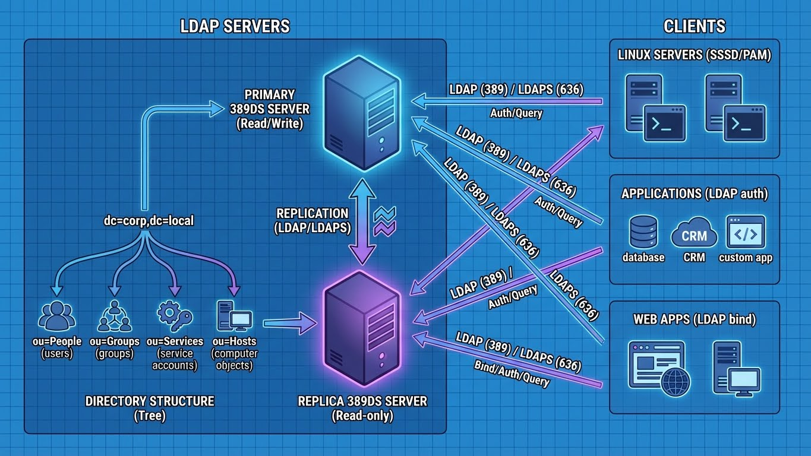
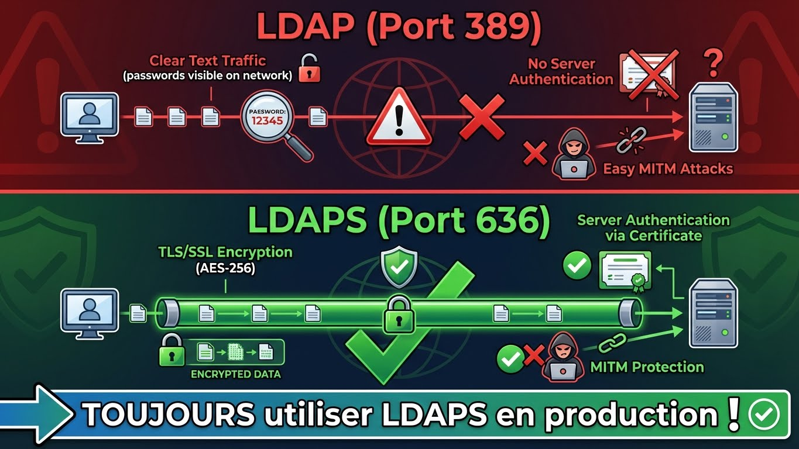
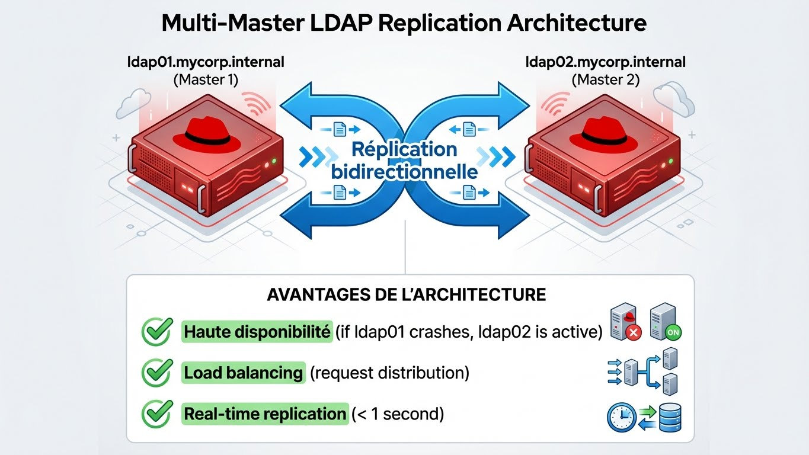

---
tags:
  - ldap
  - 389ds
  - security
  - rhel
---

# LDAP: 389 Directory Server (Red Hat DS)

Alternative Open Source robuste à Active Directory sur Linux. Annuaire LDAP haute performance pour l'authentification centralisée.




---

## Qu'est-ce que 389 Directory Server ?

**389 Directory Server = Le serveur LDAP de référence pour Red Hat/CentOS**


```
┌─────────────────────────────────────────────────────────────┐
│                  POURQUOI 389 DIRECTORY SERVER ?             │
├─────────────────────────────────────────────────────────────┤
│                                                              │
│  Active Directory (Windows)     389 DS (Linux)               │
│  ───────────────────────       ──────────────                │
│  ✓ Authentification centralisée  ✓ Authentification LDAP     │
│  ✓ GPO                            ✗ Pas de GPO (PAM/SSSD)    │
│  ✓ Interface GUI (RSAT)           ✓ Web UI (Cockpit)         │
│  ✗ Coût licensing                 ✓ Gratuit (Open Source)    │
│  ✗ Linux uniquement               ✓ Multi-platform           │
│                                                              │
│  Cas d'usage :                                               │
│  - Authentification Linux/Unix (via SSSD)                    │
│  - Annuaire d'entreprise (users, groups, hosts)             │
│  - Backend pour applications (Nextcloud, GitLab, etc.)      │
│  - Alternative libre à AD pour environnements Linux          │
│                                                              │
└─────────────────────────────────────────────────────────────┘
```

**Caractéristiques :**
- ✅ **Haute performance** : Optimisé pour des millions d'entrées
- ✅ **Réplication multi-maître** : Haute disponibilité native
- ✅ **TLS/SSL natif** : LDAPS (port 636) par défaut
- ✅ **Interface Web** : Administration via Cockpit
- ✅ **Compatibilité** : Standards LDAPv3, SASL, Kerberos
- ✅ **Red Hat supporté** : Utilisé dans RHEL Identity Management (IdM/FreeIPA)

---

## Installation (RHEL/Rocky Linux 9)

### Prérequis

```bash
# Système à jour
sudo dnf update -y

# Installer les dépendances
sudo dnf install -y \
    389-ds-base \
    389-ds-base-libs \
    cockpit-389-ds \
    openssl

# Activer et démarrer Cockpit (pour l'interface web)
sudo systemctl enable --now cockpit.socket

# Vérifier la version
dsctl --version
# Output : 389 Directory Server 2.3.x
```

**Ports requis :**

| Port | Protocole | Service | Description |
|------|-----------|---------|-------------|
| 389 | TCP | LDAP | LDAP non chiffré (à désactiver en prod) |
| 636 | TCP | LDAPS | LDAP sécurisé (TLS/SSL) |
| 9090 | TCP | Cockpit | Interface web d'administration |

```bash
# Ouvrir les ports firewall
sudo firewall-cmd --permanent --add-port=636/tcp
sudo firewall-cmd --permanent --add-port=9090/tcp
sudo firewall-cmd --reload
```

### Installation Silencieuse (Production)

**Créer un fichier d'installation :**

```bash
# /tmp/ds-setup.inf
[general]
config_version = 2

[slapd]
# Instance name (will create /etc/dirsrv/slapd-mycorp)
instance_name = mycorp

# Port configuration
port = 389
secure_port = 636

# Root DN (Directory Manager)
root_dn = cn=Directory Manager
root_password = MySecurePassword123!

# Base DN
suffix = dc=mycorp,dc=internal

# Server hostname
self_sign_cert = True
self_sign_cert_valid_months = 24

# Sample entries
sample_entries = yes
```

**Lancer l'installation :**

```bash
# Créer l'instance avec le fichier de configuration
sudo dscreate from-file /tmp/ds-setup.inf

# Output attendu :
# Starting installation...
# Completed installation for mycorp
# Instance created successfully!

# Vérifier l'instance
sudo dsctl mycorp status

# Output :
# Instance "mycorp" is running

# Supprimer le fichier de config (contient le password)
sudo rm -f /tmp/ds-setup.inf
```

### Installation Interactive (Lab)

```bash
# Lancer l'installation interactive
sudo dscreate interactive

# Questions posées :
# 1. Instance name? mycorp
# 2. Port? 389
# 3. Secure port? 636
# 4. Root DN? cn=Directory Manager
# 5. Root password? ********
# 6. Suffix? dc=mycorp,dc=internal
# 7. Create sample entries? yes
# 8. Self-sign certificate? yes

# L'installation se lance automatiquement après validation
```

### Vérification Post-Installation

```bash
# Lister les instances
sudo dsctl --list

# Output :
# mycorp

# Afficher les informations de l'instance
sudo dsctl mycorp status
sudo dsctl mycorp healthcheck

# Tester la connexion LDAP (non chiffré, dev uniquement)
ldapsearch -x -H ldap://localhost:389 \
    -D "cn=Directory Manager" \
    -w "MySecurePassword123!" \
    -b "dc=mycorp,dc=internal" \
    "(objectClass=*)"

# Output attendu : Liste des entrées créées (dc=mycorp, ou=People, ou=Groups)
```

---

## Sécurité : Configuration LDAPS (TLS Obligatoire)

### Pourquoi LDAPS ?



```
┌─────────────────────────────────────────────────────────────┐
│                  LDAP vs LDAPS                               │
├─────────────────────────────────────────────────────────────┤
│                                                              │
│  LDAP (Port 389) :                                          │
│  ✗ Trafic en clair (mots de passe visibles sur le réseau)  │
│  ✗ Pas d'authentification serveur                          │
│  ✗ MITM facile                                              │
│                                                              │
│  LDAPS (Port 636) :                                         │
│  ✓ Chiffrement TLS/SSL (AES-256)                           │
│  ✓ Authentification serveur (certificat)                   │
│  ✓ Protection MITM                                          │
│                                                              │
│  Recommandation : TOUJOURS utiliser LDAPS en production     │
│                                                              │
└─────────────────────────────────────────────────────────────┘
```

### Générer un Certificat Auto-Signé (Lab)

**Le certificat est déjà généré lors de l'installation si `self_sign_cert = True`.**

```bash
# Vérifier le certificat auto-signé
sudo certutil -L -d /etc/dirsrv/slapd-mycorp

# Output :
# Certificate Nickname                                         Trust Attributes
# Self-Signed-CA                                               CT,C,C
# Server-Cert                                                  u,u,u

# Exporter le certificat CA (pour les clients)
sudo certutil -L -d /etc/dirsrv/slapd-mycorp -n "Self-Signed-CA" -a > /tmp/mycorp-ca.crt

# Copier le certificat vers les clients
scp /tmp/mycorp-ca.crt user@client:/etc/pki/ca-trust/source/anchors/
# Sur le client : sudo update-ca-trust
```

### Importer un Certificat Let's Encrypt (Production)

**Prérequis :** Certificat Let's Encrypt déjà obtenu via `certbot`.

```bash
# Certificats Let's Encrypt
CERT_DIR="/etc/letsencrypt/live/ldap.mycorp.com"
INSTANCE="mycorp"

# Convertir le certificat au format PKCS12
sudo openssl pkcs12 -export \
    -in ${CERT_DIR}/fullchain.pem \
    -inkey ${CERT_DIR}/privkey.pem \
    -out /tmp/ldap-cert.p12 \
    -name "Server-Cert" \
    -passout pass:MyTempPassword123

# Importer dans la base NSS de 389 DS
sudo pk12util -i /tmp/ldap-cert.p12 \
    -d /etc/dirsrv/slapd-${INSTANCE} \
    -W "MyTempPassword123"

# Supprimer le fichier temporaire
sudo rm -f /tmp/ldap-cert.p12

# Redémarrer l'instance
sudo systemctl restart dirsrv@${INSTANCE}

# Vérifier le nouveau certificat
sudo certutil -L -d /etc/dirsrv/slapd-${INSTANCE}
```

### Désactiver LDAP Non Chiffré (Port 389)

**Forcer l'utilisation exclusive de LDAPS (port 636).**

```bash
# Méthode 1 : Désactiver le port 389 via configuration
sudo dsconf mycorp config replace nsslapd-port=0

# Méthode 2 : Firewall (bloquer port 389)
sudo firewall-cmd --permanent --remove-port=389/tcp
sudo firewall-cmd --reload

# Vérifier que seul le port 636 écoute
sudo ss -tlnp | grep 636

# Output attendu :
# LISTEN 0 128 *:636 *:* users:(("ns-slapd",pid=1234,fd=8))
```

### Tester LDAPS avec OpenSSL

```bash
# Test de connexion LDAPS (vérifier le certificat)
openssl s_client -connect localhost:636 -showcerts

# Output attendu :
# SSL-Session:
#     Protocol  : TLSv1.3
#     Cipher    : TLS_AES_256_GCM_SHA384
#     Session-ID: ...
#     Master-Key: ...
# Verify return code: 0 (ok)

# Test avec ldapsearch (LDAPS)
ldapsearch -x -H ldaps://localhost:636 \
    -D "cn=Directory Manager" \
    -w "MySecurePassword123!" \
    -b "dc=mycorp,dc=internal" \
    "(objectClass=*)"

# Si erreur de certificat :
# ldap_sasl_bind(SIMPLE): Can't contact LDAP server (-1)
# → Importer le CA dans /etc/pki/ca-trust/source/anchors/ et lancer update-ca-trust
```

### Script de Vérification LDAPS

```bash
#!/bin/bash
# /usr/local/bin/check-ldaps.sh
# Vérification automatique de la connexion LDAPS

LDAP_HOST="ldap.mycorp.internal"
LDAP_PORT="636"
LDAP_BASE="dc=mycorp,dc=internal"
LDAP_BIND_DN="cn=Directory Manager"
LDAP_BIND_PW="MySecurePassword123!"

echo "[+] Test de connexion LDAPS vers ${LDAP_HOST}:${LDAP_PORT}"

# Test 1 : Connexion SSL
echo "[*] Test SSL/TLS..."
timeout 5 openssl s_client -connect ${LDAP_HOST}:${LDAP_PORT} -quiet </dev/null 2>&1 | grep "Verify return code"

if [ $? -eq 0 ]; then
    echo "    [OK] Certificat SSL valide"
else
    echo "    [ERREUR] Certificat SSL invalide ou connexion impossible"
    exit 1
fi

# Test 2 : Requête LDAP
echo "[*] Test requête LDAP..."
ldapsearch -x -H ldaps://${LDAP_HOST}:${LDAP_PORT} \
    -D "${LDAP_BIND_DN}" \
    -w "${LDAP_BIND_PW}" \
    -b "${LDAP_BASE}" \
    -s base "(objectClass=*)" dn &>/dev/null

if [ $? -eq 0 ]; then
    echo "    [OK] Requête LDAP réussie"
else
    echo "    [ERREUR] Requête LDAP échouée"
    exit 1
fi

echo "[+] Tous les tests LDAPS réussis"
exit 0
```

**Ajouter le script au cron :**

```bash
# Rendre le script exécutable
sudo chmod +x /usr/local/bin/check-ldaps.sh

# Ajouter au cron (toutes les 15 minutes)
echo "*/15 * * * * root /usr/local/bin/check-ldaps.sh | logger -t ldaps-check" | sudo tee /etc/cron.d/ldaps-check

# Vérifier les logs
sudo journalctl -t ldaps-check -f
```

---

## Gestion des Utilisateurs et Groupes

### Créer un Utilisateur LDAP

```bash
# Fichier LDIF pour un utilisateur
cat > /tmp/user.ldif <<EOF
dn: uid=jdupont,ou=People,dc=mycorp,dc=internal
objectClass: top
objectClass: person
objectClass: organizationalPerson
objectClass: inetOrgPerson
uid: jdupont
cn: Jean Dupont
sn: Dupont
givenName: Jean
mail: jdupont@mycorp.com
userPassword: ChangeMe123!
EOF

# Ajouter l'utilisateur
ldapadd -x -H ldaps://localhost:636 \
    -D "cn=Directory Manager" \
    -w "MySecurePassword123!" \
    -f /tmp/user.ldif

# Vérifier l'utilisateur créé
ldapsearch -x -H ldaps://localhost:636 \
    -D "cn=Directory Manager" \
    -w "MySecurePassword123!" \
    -b "ou=People,dc=mycorp,dc=internal" \
    "(uid=jdupont)"

# Supprimer le fichier temporaire
rm -f /tmp/user.ldif
```

### Créer un Groupe LDAP

```bash
# Fichier LDIF pour un groupe
cat > /tmp/group.ldif <<EOF
dn: cn=admins,ou=Groups,dc=mycorp,dc=internal
objectClass: top
objectClass: groupOfNames
cn: admins
description: Administrators group
member: uid=jdupont,ou=People,dc=mycorp,dc=internal
EOF

# Ajouter le groupe
ldapadd -x -H ldaps://localhost:636 \
    -D "cn=Directory Manager" \
    -w "MySecurePassword123!" \
    -f /tmp/group.ldif

# Vérifier le groupe
ldapsearch -x -H ldaps://localhost:636 \
    -D "cn=Directory Manager" \
    -w "MySecurePassword123!" \
    -b "ou=Groups,dc=mycorp,dc=internal" \
    "(cn=admins)"

rm -f /tmp/group.ldif
```

### Modifier un Utilisateur

```bash
# Changer le mot de passe d'un utilisateur
ldappasswd -x -H ldaps://localhost:636 \
    -D "cn=Directory Manager" \
    -w "MySecurePassword123!" \
    -s "NewPassword456!" \
    "uid=jdupont,ou=People,dc=mycorp,dc=internal"

# Ajouter un utilisateur à un groupe
cat > /tmp/add-member.ldif <<EOF
dn: cn=admins,ou=Groups,dc=mycorp,dc=internal
changetype: modify
add: member
member: uid=jdupont,ou=People,dc=mycorp,dc=internal
EOF

ldapmodify -x -H ldaps://localhost:636 \
    -D "cn=Directory Manager" \
    -w "MySecurePassword123!" \
    -f /tmp/add-member.ldif

rm -f /tmp/add-member.ldif
```

---

## Maintenance

### Backup de l'Annuaire

**Script de backup automatique :**

```bash
#!/bin/bash
# /usr/local/bin/backup-389ds.sh
# Backup quotidien de 389 Directory Server

INSTANCE="mycorp"
BACKUP_DIR="/backup/389ds"
RETENTION_DAYS=7
DATE=$(date +%Y%m%d-%H%M%S)

echo "[+] Début du backup de l'instance ${INSTANCE}"

# Créer le répertoire de backup
mkdir -p ${BACKUP_DIR}

# Backup via dsctl (méthode recommandée)
sudo dsctl ${INSTANCE} backup create ${BACKUP_DIR}/backup-${DATE}

if [ $? -eq 0 ]; then
    echo "    [OK] Backup créé : ${BACKUP_DIR}/backup-${DATE}"

    # Compression du backup
    tar czf ${BACKUP_DIR}/backup-${DATE}.tar.gz -C ${BACKUP_DIR} backup-${DATE}
    rm -rf ${BACKUP_DIR}/backup-${DATE}

    echo "    [OK] Backup compressé : ${BACKUP_DIR}/backup-${DATE}.tar.gz"
else
    echo "    [ERREUR] Échec du backup"
    exit 1
fi

# Nettoyage des anciens backups (rotation)
echo "[*] Nettoyage des backups de plus de ${RETENTION_DAYS} jours"
find ${BACKUP_DIR} -name "backup-*.tar.gz" -mtime +${RETENTION_DAYS} -delete

# Vérifier l'espace disque restant
DISK_USAGE=$(df -h ${BACKUP_DIR} | tail -1 | awk '{print $5}' | sed 's/%//')
if [ ${DISK_USAGE} -gt 80 ]; then
    echo "    [ALERTE] Espace disque faible : ${DISK_USAGE}%"
    logger -t 389ds-backup "ALERTE: Espace disque faible ${DISK_USAGE}%"
fi

echo "[+] Backup terminé avec succès"
logger -t 389ds-backup "Backup réussi : backup-${DATE}.tar.gz"
```

**Automatiser le backup :**

```bash
# Rendre le script exécutable
sudo chmod +x /usr/local/bin/backup-389ds.sh

# Ajouter au cron (tous les jours à 02:00)
echo "0 2 * * * root /usr/local/bin/backup-389ds.sh" | sudo tee /etc/cron.d/389ds-backup
```

### Restauration depuis Backup

```bash
#!/bin/bash
# Restauration d'un backup

INSTANCE="mycorp"
BACKUP_FILE="/backup/389ds/backup-20240115-020000.tar.gz"

# Arrêter l'instance
sudo dsctl ${INSTANCE} stop

# Décompresser le backup
tar xzf ${BACKUP_FILE} -C /tmp

# Restaurer depuis le backup
sudo dsctl ${INSTANCE} backup restore /tmp/backup-20240115-020000

# Redémarrer l'instance
sudo dsctl ${INSTANCE} start

# Vérifier
sudo dsctl ${INSTANCE} status
```

### Rotation des Logs

**389 DS génère beaucoup de logs. Configuration de la rotation :**

```bash
# Vérifier la taille actuelle des logs
sudo du -sh /var/log/dirsrv/slapd-mycorp/

# Configuration de la rotation via dsconf
sudo dsconf mycorp config replace \
    nsslapd-accesslog-maxlogsperdir=10 \
    nsslapd-accesslog-logrotationtime=1 \
    nsslapd-accesslog-logrotationtimeunit=day \
    nsslapd-accesslog-maxlogsize=100

# Vérifier la configuration
sudo dsconf mycorp config get | grep accesslog

# Output attendu :
# nsslapd-accesslog-maxlogsperdir: 10
# nsslapd-accesslog-logrotationtime: 1
# nsslapd-accesslog-maxlogsize: 100
```

**Ou via logrotate :**

```bash
# /etc/logrotate.d/389ds
/var/log/dirsrv/slapd-mycorp/*.log {
    daily
    rotate 14
    compress
    delaycompress
    missingok
    notifempty
    sharedscripts
    postrotate
        /bin/systemctl reload dirsrv@mycorp > /dev/null 2>&1 || true
    endscript
}
```

---

## Réplication Multi-Maître (HA)

### Concept

**Réplication multi-maître = Plusieurs serveurs LDAP synchronisés en temps réel.**



```
┌─────────────────────────────────────────────────────────────┐
│                  ARCHITECTURE MULTI-MAÎTRE                   │
├─────────────────────────────────────────────────────────────┤
│                                                              │
│  ldap01.mycorp.internal (Master 1)                          │
│         ↕ (Réplication bidirectionnelle)                    │
│  ldap02.mycorp.internal (Master 2)                          │
│                                                              │
│  Avantages :                                                │
│  ✓ Haute disponibilité (si ldap01 crash, ldap02 actif)     │
│  ✓ Load balancing (répartition des requêtes)               │
│  ✓ Réplication en temps réel (< 1 seconde)                 │
│                                                              │
└─────────────────────────────────────────────────────────────┘
```

**Configuration rapide (sur ldap01) :**

```bash
# Créer un agreement de réplication vers ldap02
sudo dsconf mycorp replication create-manager \
    --name "Replication Manager" \
    --passwd "ReplicationPassword123!"

sudo dsconf mycorp repl-agmt create \
    --suffix "dc=mycorp,dc=internal" \
    --host "ldap02.mycorp.internal" \
    --port 636 \
    --conn-protocol LDAPS \
    --bind-dn "cn=Replication Manager,cn=config" \
    --bind-passwd "ReplicationPassword123!" \
    --bind-method SIMPLE \
    to-ldap02

# Initialiser la réplication
sudo dsconf mycorp repl-agmt init --suffix "dc=mycorp,dc=internal" to-ldap02

# Vérifier le statut
sudo dsconf mycorp repl-agmt status --suffix "dc=mycorp,dc=internal" to-ldap02
```

---

## Référence Rapide

```bash
# === INSTALLATION ===
sudo dnf install -y 389-ds-base cockpit-389-ds
sudo dscreate from-file /tmp/ds-setup.inf

# === GESTION INSTANCE ===
sudo dsctl mycorp status                    # État de l'instance
sudo dsctl mycorp start                     # Démarrer
sudo dsctl mycorp stop                      # Arrêter
sudo dsctl mycorp restart                   # Redémarrer
sudo dsctl mycorp healthcheck               # Vérification santé

# === REQUÊTES LDAP ===
# Recherche simple
ldapsearch -x -H ldaps://localhost:636 \
    -D "cn=Directory Manager" -w "password" \
    -b "dc=mycorp,dc=internal" "(uid=jdupont)"

# Lister tous les utilisateurs
ldapsearch -x -H ldaps://localhost:636 \
    -D "cn=Directory Manager" -w "password" \
    -b "ou=People,dc=mycorp,dc=internal" "(objectClass=inetOrgPerson)"

# Lister tous les groupes
ldapsearch -x -H ldaps://localhost:636 \
    -D "cn=Directory Manager" -w "password" \
    -b "ou=Groups,dc=mycorp,dc=internal" "(objectClass=groupOfNames)"

# === GESTION UTILISATEURS ===
ldapadd -x -H ldaps://localhost:636 -D "cn=Directory Manager" -w "password" -f user.ldif
ldappasswd -x -H ldaps://localhost:636 -D "cn=Directory Manager" -w "password" -s "newpass" "uid=user,..."
ldapdelete -x -H ldaps://localhost:636 -D "cn=Directory Manager" -w "password" "uid=user,ou=People,..."

# === BACKUP / RESTORE ===
sudo dsctl mycorp backup create /backup/389ds/backup-$(date +%Y%m%d)
sudo dsctl mycorp backup restore /backup/389ds/backup-20240115

# === SÉCURITÉ ===
# Tester LDAPS
openssl s_client -connect localhost:636 -showcerts

# Vérifier le certificat
sudo certutil -L -d /etc/dirsrv/slapd-mycorp

# === LOGS ===
sudo journalctl -u dirsrv@mycorp -f          # Logs en temps réel
sudo tail -f /var/log/dirsrv/slapd-mycorp/errors
sudo tail -f /var/log/dirsrv/slapd-mycorp/access

# === RÉPLICATION ===
sudo dsconf mycorp repl-agmt list --suffix "dc=mycorp,dc=internal"
sudo dsconf mycorp repl-agmt status --suffix "dc=mycorp,dc=internal" to-ldap02
```

---

## Intégration avec SSSD (Authentification Linux)

**Permettre l'authentification Linux via LDAP.**

```bash
# Sur un client Linux (Rocky Linux 9)

# Installer SSSD
sudo dnf install -y sssd sssd-ldap oddjob-mkhomedir

# Configuration SSSD
sudo cat > /etc/sssd/sssd.conf <<EOF
[sssd]
config_file_version = 2
domains = mycorp.internal
services = nss, pam

[domain/mycorp.internal]
id_provider = ldap
auth_provider = ldap
ldap_uri = ldaps://ldap01.mycorp.internal,ldaps://ldap02.mycorp.internal
ldap_search_base = dc=mycorp,dc=internal
ldap_tls_reqcert = demand
ldap_tls_cacert = /etc/pki/ca-trust/source/anchors/mycorp-ca.crt
cache_credentials = true
EOF

# Permissions strictes
sudo chmod 600 /etc/sssd/sssd.conf

# Activer la création automatique du home directory
sudo authselect select sssd with-mkhomedir --force

# Démarrer SSSD
sudo systemctl enable --now sssd

# Tester l'authentification
id jdupont

# Output attendu :
# uid=10001(jdupont) gid=10001(jdupont) groups=10001(jdupont),10002(admins)

# Se connecter en SSH avec un utilisateur LDAP
ssh jdupont@localhost
```

---

## Dépannage

### Problème : "Can't contact LDAP server (-1)"

**Causes possibles :**
1. Certificat SSL invalide
2. Port 636 bloqué par le firewall
3. Service dirsrv arrêté

**Solution :**

```bash
# 1. Vérifier le service
sudo systemctl status dirsrv@mycorp

# 2. Vérifier le port 636
sudo ss -tlnp | grep 636

# 3. Tester le certificat
openssl s_client -connect localhost:636 -showcerts

# 4. Importer le CA (si auto-signé)
sudo certutil -L -d /etc/dirsrv/slapd-mycorp -n "Self-Signed-CA" -a | \
    sudo tee /etc/pki/ca-trust/source/anchors/389ds-ca.crt
sudo update-ca-trust

# 5. Tester à nouveau
ldapsearch -x -H ldaps://localhost:636 -D "cn=Directory Manager" -w "password" -b "dc=mycorp,dc=internal"
```

### Problème : Réplication cassée

```bash
# Vérifier le statut de la réplication
sudo dsconf mycorp repl-agmt status --suffix "dc=mycorp,dc=internal" to-ldap02

# Réinitialiser la réplication
sudo dsconf mycorp repl-agmt init --suffix "dc=mycorp,dc=internal" to-ldap02

# Vérifier les logs de réplication
sudo tail -f /var/log/dirsrv/slapd-mycorp/errors | grep repl
```

### Problème : Espace disque saturé (logs)

```bash
# Vérifier l'espace utilisé
sudo du -sh /var/log/dirsrv/slapd-mycorp/

# Purger les anciens logs
sudo find /var/log/dirsrv/slapd-mycorp/ -name "*.log.*" -mtime +30 -delete

# Configurer la rotation
sudo dsconf mycorp config replace nsslapd-accesslog-maxlogsperdir=5
```
