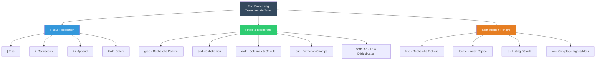
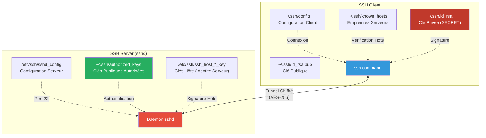
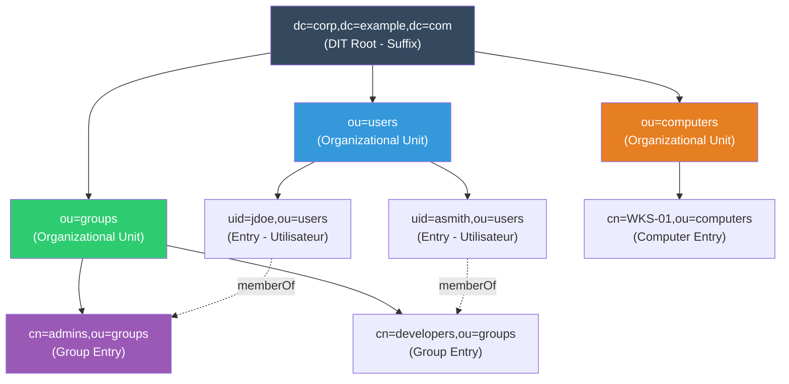

---
tags:
  - lpi
  - certification
  - linux-foundation
  - sysadmin
---

# Parcours Certification LPI (Cartes Mentales)

Cartes mentales visuelles pour réviser les concepts clés des examens LPIC-1 et LPIC-2.

---

!!! info "À Propos de cette Page"
    Cette page fournit des **cartes mentales structurées** utilisant des diagrammes Mermaid pour visualiser les concepts Linux essentiels à maîtriser pour les certifications LPI.

    **Avantage :** Contenu auto-suffisant (pas de dépendance externe), diagrammes interactifs, navigation rapide vers les guides détaillés.

---

## Section 1 : Démarrage & Système (LPIC-1)

### Boot Process - Séquence de Démarrage Linux


**Étapes Détaillées :**

1. **BIOS/UEFI** : POST (Power-On Self-Test), détection matériel
2. **GRUB2** : Menu de boot, charge le kernel avec paramètres (`/boot/grub/grub.cfg`)
3. **Kernel** : Décompression, initialisation drivers, monte système de fichiers root
4. **initramfs** : Système minimal en RAM pour démarrer les modules critiques
5. **Init (Systemd)** : Premier processus (PID 1), gestion des services
6. **Userspace** : Services réseau, ssh, bases de données, etc.
7. **Target** : État final (graphical.target, multi-user.target)

!!! tip "Guide Complet"
    → [Boot & Services : Systemd, GRUB, Targets](boot-and-services.md)

---

## Section 2 : Commandes Essentielles (LPIC-1)

### Text Processing Tools - Boîte à Outils CLI



**Exemples Typiques LPIC-1 :**

```bash
# Compter les utilisateurs shell valides
grep -v '/nologin' /etc/passwd | wc -l

# Extraire IPs uniques des logs Apache
awk '{print $1}' /var/log/apache2/access.log | sort -u

# Trouver fichiers modifiés dernières 24h
find /var/log -type f -mtime -1

# Remplacer texte dans multiple fichiers
sed -i 's/old_hostname/new_hostname/g' /etc/hosts
```

!!! tip "Guides Associés"
    → [Text Processing : grep, sed, awk, regex](text-processing.md)
    → [Bash Wizardry : Scripts & Pipelines Avancés](bash-wizardry.md)

---

## Section 3 : Sécurité & Accès (LPIC-1)

### SSH Architecture - Client/Server



**Flux d'Authentification :**

1. **Client** : `ssh user@server` → Lecture `~/.ssh/config`
2. **Handshake** : Serveur envoie clé hôte → Client vérifie dans `known_hosts`
3. **Auth** : Client signe challenge avec `id_rsa` → Serveur vérifie avec `authorized_keys`
4. **Session** : Tunnel chiffré établi, shell interactif

**Fichiers Critiques :**

| Fichier | Permissions | Rôle |
|---------|-------------|------|
| `~/.ssh/id_rsa` | `600` | Clé privée (jamais partagée) |
| `~/.ssh/id_rsa.pub` | `644` | Clé publique (à copier sur serveurs) |
| `~/.ssh/authorized_keys` | `600` | Liste clés autorisées (serveur) |
| `~/.ssh/known_hosts` | `644` | Empreintes serveurs connus |
| `/etc/ssh/sshd_config` | `644` | Config daemon SSH |

!!! tip "Guide Sécurité SSH"
    → [SSH Hardening : Clés ED25519, Bastion, MFA](ssh-hardening.md)

---

## Section 4 : Infrastructure & Réseau (LPIC-2)

### LDAP Architecture - Directory Information Tree



**Composants DN (Distinguished Name) :**

| Attribut | Signification | Exemple |
|----------|---------------|---------|
| `dc` | Domain Component | `dc=example,dc=com` |
| `ou` | Organizational Unit | `ou=users` |
| `cn` | Common Name | `cn=admins` |
| `uid` | User ID | `uid=jdoe` |

**Requête LDAP Typique :**

```bash
# Rechercher tous les utilisateurs dans ou=users
ldapsearch -x -b "ou=users,dc=corp,dc=example,dc=com" "(objectClass=posixAccount)"

# Vérifier appartenance groupe
ldapsearch -x -b "cn=admins,ou=groups,dc=corp,dc=example,dc=com" member

# Modifier mot de passe utilisateur
ldappasswd -x -D "cn=admin,dc=corp,dc=example,dc=com" -W \
  -S "uid=jdoe,ou=users,dc=corp,dc=example,dc=com"
```

**ObjectClasses Courants :**

- `posixAccount` : Compte Unix/Linux
- `posixGroup` : Groupe Unix/Linux
- `inetOrgPerson` : Utilisateur avec attributs étendus (mail, téléphone)
- `organizationalUnit` : Container logique

!!! tip "Guide LDAP Complet"
    → [389 Directory Server : Installation, Schema, Réplication](ldap-389ds.md)

---

## Stratégies de Révision

### Méthode "Carte → Pratique → Vérification"


### Ressources Complémentaires

| Domaine | Guides ShellBook |
|---------|------------------|
| **Système de Fichiers** | [Filesystem & Storage](filesystem-and-storage.md) • [LVM](lvm-raid.md) |
| **Réseau** | [Network Management](network-management.md) • [Firewall UFW](firewall-ufw.md) |
| **Services** | [Nginx](nginx-webserver.md) • [MariaDB](mariadb-mysql.md) |
| **Automatisation** | [Cron & Systemd Timers](cron-systemd-timers.md) |
| **Performance** | [Performance Analysis](performance-analysis.md) • [Debugging](debugging.md) |

---

## Référence Rapide

### Commandes LPIC-1 Critiques

```bash
# === SYSTÈME ===
systemctl status <service>           # État service
journalctl -u <service> -f           # Logs temps réel
lsblk -f                             # Partitions & filesystems
df -h                                # Utilisation disques
free -h                              # Mémoire RAM/Swap

# === RÉSEAU ===
ip addr show                         # Interfaces réseau
ss -tulpn                            # Ports en écoute
ping -c 4 <host>                     # Test connectivité
traceroute <host>                    # Route réseau

# === SÉCURITÉ ===
chmod 600 ~/.ssh/id_rsa              # Permissions clé privée
ssh-keygen -t ed25519                # Générer paire clés SSH
sudo -l                              # Privilèges sudo
last -n 10                           # Dernières connexions

# === FICHIERS ===
find / -name "*.log" -mtime -7       # Logs 7 derniers jours
grep -r "error" /var/log/            # Recherche récursive
tar -czf backup.tar.gz /data/        # Archiver & compresser
```

### Commandes LPIC-2 Avancées

```bash
# === LDAP ===
ldapsearch -x -b "dc=example,dc=com" "(uid=jdoe)"
ldapadd -x -D "cn=admin,dc=example,dc=com" -W -f user.ldif
ldapmodify -x -D "cn=admin,dc=example,dc=com" -W -f modify.ldif

# === DNS (BIND) ===
named-checkconf                      # Valider named.conf
named-checkzone example.com db.example.com
dig @localhost example.com           # Test résolution locale

# === NFS ===
exportfs -ra                         # Recharger /etc/exports
showmount -e <server>                # Lister partages NFS

# === SMTP (Postfix) ===
postconf -n                          # Config non-default
postqueue -p                         # File d'attente mails
mailq                                # Alias de postqueue -p
```

!!! success "Bonne Chance pour vos Certifications !"
    Ces cartes mentales couvrent les concepts fondamentaux. Consultez les guides détaillés liés pour approfondir chaque sujet.
