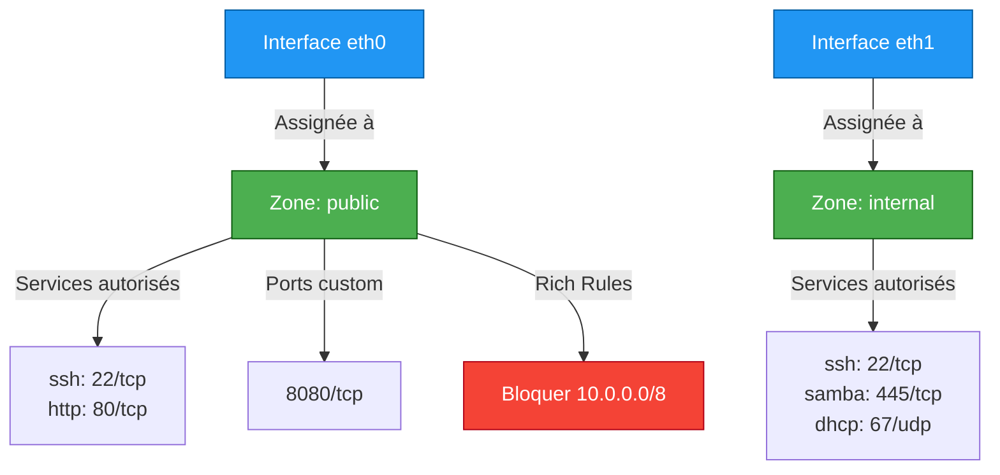

---
tags:
  - firewalld
  - nmcli
  - network
  - rhel
  - zones
---

# Firewalld & NetworkManager (nmcli)

## NetworkManager : La Couche Moderne

Sur RHEL 8+, **NetworkManager** remplace les scripts réseau legacy (`/etc/sysconfig/network-scripts/`). La commande `nmcli` est le couteau suisse du réseau.

### Gestion des Connexions

```bash
# Lister toutes les connexions
nmcli connection show
# NAME    UUID                                  TYPE      DEVICE
# ens3    abcd-1234-efgh-5678                   ethernet  ens3

# Afficher les détails d'une connexion
nmcli connection show ens3

# Lister les devices réseau
nmcli device status
# DEVICE  TYPE      STATE      CONNECTION
# ens3    ethernet  connected  ens3
# lo      loopback  unmanaged  --
```

### Créer une Connexion Statique

```bash
# Créer une connexion avec IP statique
nmcli connection add \
  con-name static-eth0 \
  ifname eth0 \
  type ethernet \
  ipv4.addresses 192.168.1.100/24 \
  ipv4.gateway 192.168.1.1 \
  ipv4.dns "8.8.8.8 1.1.1.1" \
  ipv4.method manual

# Activer la connexion
nmcli connection up static-eth0

# Désactiver/Réactiver pour test
nmcli connection down static-eth0
nmcli connection up static-eth0
```

### Modifier une Connexion Existante

```bash
# Changer l'IP d'une connexion
nmcli connection modify ens3 ipv4.addresses 192.168.1.50/24

# Ajouter un DNS secondaire
nmcli connection modify ens3 +ipv4.dns 1.0.0.1

# Supprimer un DNS
nmcli connection modify ens3 -ipv4.dns 1.0.0.1

# Passer de DHCP à statique
nmcli connection modify ens3 \
  ipv4.method manual \
  ipv4.addresses 192.168.1.100/24 \
  ipv4.gateway 192.168.1.1

# Appliquer les changements
nmcli connection up ens3
```

### Bonding Basique (High Availability)

```bash
# Créer un bond (mode active-backup)
nmcli connection add type bond \
  con-name bond0 \
  ifname bond0 \
  mode active-backup

# Ajouter les interfaces esclaves
nmcli connection add type ethernet \
  slave-type bond \
  con-name bond0-slave1 \
  ifname eth0 \
  master bond0

nmcli connection add type ethernet \
  slave-type bond \
  con-name bond0-slave2 \
  ifname eth1 \
  master bond0

# Configurer l'IP sur le bond
nmcli connection modify bond0 \
  ipv4.addresses 192.168.1.100/24 \
  ipv4.gateway 192.168.1.1 \
  ipv4.method manual

# Activer le bond
nmcli connection up bond0

# Vérifier l'état
cat /proc/net/bonding/bond0
```

### Tableau Comparatif : `ip` vs `nmcli`

| Tâche | Commande `ip` (temporaire) | Commande `nmcli` (persistant) |
|-------|----------------------------|-------------------------------|
| Afficher IP | `ip addr show eth0` | `nmcli device show eth0` |
| Ajouter IP | `ip addr add 192.168.1.100/24 dev eth0` | `nmcli con mod eth0 +ipv4.addresses 192.168.1.100/24` |
| Supprimer IP | `ip addr del 192.168.1.100/24 dev eth0` | `nmcli con mod eth0 -ipv4.addresses 192.168.1.100/24` |
| Activer interface | `ip link set eth0 up` | `nmcli connection up eth0` |
| Ajouter route | `ip route add 10.0.0.0/8 via 192.168.1.1` | `nmcli con mod eth0 +ipv4.routes "10.0.0.0/8 192.168.1.1"` |
| Afficher routes | `ip route show` | `nmcli connection show eth0 \| grep routes` |

!!! tip "Persistance avec nmcli"
    Les modifications `nmcli` sont **persistantes** (stockées dans `/etc/NetworkManager/system-connections/`). Les commandes `ip` sont **temporaires** (perdues au reboot).

## Firewalld : Le Pare-feu Dynamique

**Firewalld** utilise le concept de **zones** pour gérer le trafic réseau. Contrairement à `iptables` brut, les modifications sont dynamiques (pas de flush/reload).



### Commandes de Base

```bash
# Vérifier l'état
systemctl status firewalld
firewall-cmd --state  # running

# Lister les zones disponibles
firewall-cmd --get-zones
# block dmz drop external home internal public trusted work

# Voir la zone par défaut
firewall-cmd --get-default-zone  # public

# Lister les règles de la zone active
firewall-cmd --list-all

# Lister toutes les zones avec leurs configs
firewall-cmd --list-all-zones
```

### Gestion des Zones

#### Assigner une Interface à une Zone

```bash
# Voir quelle zone est assignée à eth0
firewall-cmd --get-zone-of-interface=eth0

# Changer d'interface de zone (runtime)
firewall-cmd --zone=internal --change-interface=eth0

# Permanent
firewall-cmd --permanent --zone=internal --change-interface=eth0
firewall-cmd --reload
```

#### Créer une Zone Custom

```bash
# Créer une zone "dmz-web"
firewall-cmd --permanent --new-zone=dmz-web

# Configurer la zone
firewall-cmd --permanent --zone=dmz-web --set-description="DMZ pour serveurs web"
firewall-cmd --permanent --zone=dmz-web --set-target=DROP  # DROP par défaut

# Autoriser uniquement HTTP/HTTPS
firewall-cmd --permanent --zone=dmz-web --add-service=http
firewall-cmd --permanent --zone=dmz-web --add-service=https

# Appliquer
firewall-cmd --reload

# Assigner une interface
firewall-cmd --permanent --zone=dmz-web --change-interface=eth1
firewall-cmd --reload
```

### Autoriser des Services/Ports

```bash
# Autoriser un service (runtime)
firewall-cmd --add-service=http
firewall-cmd --add-service=https

# Permanent
firewall-cmd --permanent --add-service=http
firewall-cmd --permanent --add-service=https
firewall-cmd --reload

# Autoriser un port custom
firewall-cmd --permanent --add-port=8080/tcp
firewall-cmd --reload

# Autoriser une plage de ports
firewall-cmd --permanent --add-port=30000-32000/tcp
firewall-cmd --reload

# Lister les services disponibles
firewall-cmd --get-services | tr ' ' '\n' | sort
```

### Rich Rules : Contrôle Granulaire

Les **rich rules** permettent des règles avancées (source IP, logging, rate limiting).

#### Bloquer un Sous-Réseau Spécifique

```bash
# Bloquer tout le trafic depuis 10.0.0.0/8
firewall-cmd --permanent --add-rich-rule='
  rule family="ipv4"
  source address="10.0.0.0/8"
  reject
'
firewall-cmd --reload
```

#### Autoriser SSH Uniquement depuis un Réseau de Gestion

```bash
# Supprimer le service SSH global
firewall-cmd --permanent --remove-service=ssh

# Autoriser SSH uniquement depuis 192.168.100.0/24
firewall-cmd --permanent --add-rich-rule='
  rule family="ipv4"
  source address="192.168.100.0/24"
  service name="ssh"
  accept
'
firewall-cmd --reload
```

#### Rate Limiting (Protection Brute-Force)

```bash
# Limiter SSH à 3 connexions par minute par IP
firewall-cmd --permanent --add-rich-rule='
  rule service name="ssh"
  accept
  limit value="3/m"
'
firewall-cmd --reload
```

#### Logger les Tentatives Bloquées

```bash
# Logger les paquets DROP avec préfixe
firewall-cmd --permanent --add-rich-rule='
  rule family="ipv4"
  source address="0.0.0.0/0"
  port port="3389" protocol="tcp"
  log prefix="RDP-BLOCK: " level="warning"
  drop
'
firewall-cmd --reload

# Voir les logs
journalctl -f | grep RDP-BLOCK
```

### Exemples SecNumCloud

#### Scénario 1 : Serveur Web Public

```bash
# Zone : public (par défaut)
firewall-cmd --permanent --add-service=http
firewall-cmd --permanent --add-service=https

# SSH restreint au réseau d'admin
firewall-cmd --permanent --remove-service=ssh
firewall-cmd --permanent --add-rich-rule='
  rule family="ipv4"
  source address="192.168.100.0/24"
  service name="ssh"
  accept
'

# Bloquer les scans de ports (log)
firewall-cmd --permanent --add-rich-rule='
  rule family="ipv4"
  port port="1-1024" protocol="tcp"
  log prefix="PORT-SCAN: " level="warning"
  limit value="10/m"
'

firewall-cmd --reload
```

#### Scénario 2 : Base de Données Interne

```bash
# Créer zone dédiée
firewall-cmd --permanent --new-zone=db-backend
firewall-cmd --permanent --zone=db-backend --set-target=DROP

# Autoriser PostgreSQL uniquement depuis app servers
firewall-cmd --permanent --zone=db-backend --add-rich-rule='
  rule family="ipv4"
  source address="10.1.1.0/24"
  port port="5432" protocol="tcp"
  accept
'

# SSH admin
firewall-cmd --permanent --zone=db-backend --add-rich-rule='
  rule family="ipv4"
  source address="192.168.100.0/24"
  service name="ssh"
  accept
'

firewall-cmd --reload
firewall-cmd --permanent --zone=db-backend --change-interface=eth1
firewall-cmd --reload
```

### Panic Mode : Couper Tout le Trafic

```bash
# Activer le mode panique (DROP tout)
firewall-cmd --panic-on

# Vérifier l'état
firewall-cmd --query-panic  # yes

# Désactiver
firewall-cmd --panic-off
```

!!! danger "Panic Mode Tue SSH"
    En mode panique, **toutes les connexions SSH actives sont coupées**, y compris la vôtre. À utiliser uniquement en console locale ou avec un accès IPMI/iLO.

### Port Forwarding (NAT)

```bash
# Activer le masquerading (NAT)
firewall-cmd --permanent --add-masquerade

# Forwarder le port 80 vers un serveur interne
firewall-cmd --permanent --add-forward-port=\
port=80:proto=tcp:toport=8080:toaddr=192.168.1.100

firewall-cmd --reload
```

### Direct Rules (iptables Brut)

```bash
# Pour des cas ultra-spécifiques, passer par iptables directement
firewall-cmd --permanent --direct --add-rule ipv4 filter INPUT 0 \
  -p tcp --dport 9999 -s 10.0.0.0/8 -j ACCEPT

firewall-cmd --reload

# Lister les direct rules
firewall-cmd --direct --get-all-rules
```

## Dépannage Réseau

### Vérifier la Connectivité

```bash
# Ping
ping -c 4 8.8.8.8

# Traceroute
traceroute 8.8.8.8

# DNS lookup
nslookup google.com
dig google.com

# Vérifier les ports ouverts localement
ss -tulnp
# -t : TCP, -u : UDP, -l : listening, -n : numeric, -p : process

# Scanner un port distant
nc -zv 192.168.1.100 22
# z : scan, v : verbose
```

### Logs Firewalld

```bash
# Logs en temps réel
journalctl -fu firewalld

# Logs avec rich rules logging
journalctl -k | grep "RDP-BLOCK"

# Logs iptables (si activé)
tail -f /var/log/messages | grep "DPT"
```

### Réinitialisation Complète

```bash
# Sauvegarder la config
cp -r /etc/firewalld /etc/firewalld.backup

# Réinitialiser toutes les zones
firewall-cmd --complete-reload

# Ou supprimer toutes les custom zones
firewall-cmd --permanent --delete-zone=dmz-web
firewall-cmd --reload
```

## Checklist Production

```bash
# 1. NetworkManager actif
systemctl is-active NetworkManager  # active

# 2. Connexions configurées et up
nmcli connection show --active

# 3. Firewalld actif
systemctl is-active firewalld  # active

# 4. Zone par défaut configurée
firewall-cmd --get-default-zone  # public ou custom

# 5. Services minimum ouverts
firewall-cmd --list-services
# Idéalement : ssh (restreint par rich rule)

# 6. Pas de masquerade si pas nécessaire
firewall-cmd --query-masquerade  # no (sauf si routeur)

# 7. Logs firewall actifs
journalctl -u firewalld --since "1 hour ago"
```

## Liens Utiles

- [Documentation Firewalld RHEL](https://access.redhat.com/documentation/en-us/red_hat_enterprise_linux/9/html/configuring_firewalls_and_packet_filters/)
- [NetworkManager Guide](https://access.redhat.com/documentation/en-us/red_hat_enterprise_linux/9/html/configuring_and_managing_networking/)
- [Rich Rules Examples](https://firewalld.org/documentation/man-pages/firewalld.richlanguage.html)
