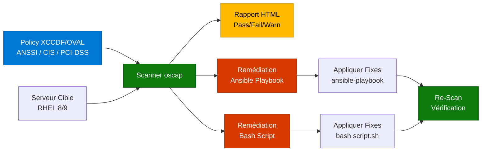

---
tags:
  - openscap
  - security
  - compliance
  - anssi
  - cis
  - audit
  - rhel
---

# OpenSCAP : Audit & Conformité Automatisée

## Qu'est-ce que SCAP ?

**SCAP** (Security Content Automation Protocol) est un ensemble de standards pour automatiser l'audit de sécurité et la vérification de conformité. **OpenSCAP** est l'implémentation open-source de référence, intégrée nativement à RHEL.

### Composants SCAP

- **XCCDF** (eXtensible Configuration Checklist Description Format) : Format de checklist de sécurité
- **OVAL** (Open Vulnerability and Assessment Language) : Langage pour décrire les tests techniques
- **CPE** (Common Platform Enumeration) : Identification des systèmes/applications
- **CVE** (Common Vulnerabilities and Exposures) : Base de données de vulnérabilités

### Workflow OpenSCAP



## Installation & Découverte

### Paquets Requis

```bash
# Installer OpenSCAP et les profils de sécurité
dnf install openscap-scanner scap-security-guide -y

# Vérifier la version
oscap --version
# OpenSCAP command line tool (oscap) 1.3.x

# Vérifier les paquets installés
rpm -qa | grep -E "openscap|scap"
# openscap-scanner-1.3.x
# scap-security-guide-0.1.x
```

### Lister les Profils Disponibles

Les profils sont stockés dans `/usr/share/xml/scap/ssg/content/`.

```bash
# Lister les fichiers de contenu
ls /usr/share/xml/scap/ssg/content/
# ssg-rhel8-ds.xml
# ssg-rhel9-ds.xml

# Afficher les profils pour RHEL 9
oscap info /usr/share/xml/scap/ssg/content/ssg-rhel9-ds.xml

# Sortie partielle :
# Profiles:
#   Title: ANSSI-BP-028 (enhanced)
#     Id: xccdf_org.ssgproject.content_profile_anssi_bp28_enhanced
#   Title: ANSSI-BP-028 (high)
#     Id: xccdf_org.ssgproject.content_profile_anssi_bp28_high
#   Title: CIS Red Hat Enterprise Linux 9 Benchmark for Level 1 - Server
#     Id: xccdf_org.ssgproject.content_profile_cis_server_l1
#   Title: PCI-DSS v4.0 Control Baseline for Red Hat Enterprise Linux 9
#     Id: xccdf_org.ssgproject.content_profile_pci-dss
```

### Profils Clés pour SecNumCloud

| Profil | ID | Description | Use Case |
|--------|-----|-------------|----------|
| **ANSSI BP-028 Enhanced** | `anssi_bp28_enhanced` | Niveau renforcé (recommandé SecNumCloud) | Production sensible |
| **ANSSI BP-028 High** | `anssi_bp28_high` | Niveau élevé (maximal) | Systèmes critiques |
| **CIS Level 1 Server** | `cis_server_l1` | Baseline CIS (compatible prod) | Serveurs génériques |
| **CIS Level 2 Server** | `cis_server_l2` | CIS avancé (peut casser apps) | Environnements sécurisés |
| **PCI-DSS v4.0** | `pci-dss` | Conformité bancaire | Traitement cartes bancaires |
| **STIG (DoD)** | `stig` | Standard US Department of Defense | Contexte militaire/gouvernemental |

## Exécuter un Audit (Scan)

### Scan Basique avec Rapport HTML

```bash
# Définir des variables pour simplifier
CONTENT="/usr/share/xml/scap/ssg/content/ssg-rhel9-ds.xml"
PROFILE="anssi_bp28_enhanced"

# Scanner le système (génère rapport HTML)
oscap xccdf eval \
  --profile $PROFILE \
  --report /tmp/report-$(date +%F).html \
  $CONTENT

# Résultat :
# Rule evaluation:
#   pass:  234
#   fail:  45
#   notapplicable: 12
#   notchecked: 3
# Score: 83.87%

# Ouvrir le rapport
firefox /tmp/report-$(date +%F).html
# Ou copier vers un serveur web
cp /tmp/report-*.html /var/www/html/security/
```

### Scan avec Résultats Détaillés (XML)

```bash
# Générer un rapport XML détaillé
oscap xccdf eval \
  --profile anssi_bp28_enhanced \
  --results /tmp/results-$(date +%F).xml \
  --report /tmp/report-$(date +%F).html \
  /usr/share/xml/scap/ssg/content/ssg-rhel9-ds.xml
```

### Scan d'un Profil CIS

```bash
# Scanner avec le profil CIS Level 1
oscap xccdf eval \
  --profile cis_server_l1 \
  --report /tmp/cis-report-$(date +%F).html \
  /usr/share/xml/scap/ssg/content/ssg-rhel9-ds.xml
```

### Interpréter les Résultats

Le rapport HTML contient :

- **Pass** (✅) : Règle conforme
- **Fail** (❌) : Non-conformité détectée
- **Not Applicable** (⚪) : Règle non applicable au système
- **Not Checked** (⚠️) : Test manuel requis
- **Score** : Pourcentage de conformité global

```bash
# Extraire seulement les règles failed
oscap xccdf eval \
  --profile anssi_bp28_enhanced \
  --results /tmp/results.xml \
  /usr/share/xml/scap/ssg/content/ssg-rhel9-ds.xml 2>&1 | grep "^fail"

# Exemple de sortie :
# fail    xccdf_org.ssgproject.content_rule_accounts_password_minlen_login_defs
# fail    xccdf_org.ssgproject.content_rule_audit_rules_privileged_commands
```

## Remédiation Automatique : La Killer Feature

OpenSCAP peut **générer automatiquement** des scripts de correction pour les règles non-conformes.

### Générer un Playbook Ansible

```bash
# Scanner ET générer un playbook Ansible de remédiation
oscap xccdf eval \
  --profile anssi_bp28_enhanced \
  --results /tmp/results.xml \
  --report /tmp/report.html \
  /usr/share/xml/scap/ssg/content/ssg-rhel9-ds.xml

# Générer le playbook depuis les résultats
oscap xccdf generate fix \
  --fix-type ansible \
  --result-id "" \
  /tmp/results.xml > /tmp/remediation.yml

# Contenu du playbook (exemple partiel) :
# - name: Ensure auditd Collects Information on the Use of Privileged Commands
#   lineinfile:
#     path: /etc/audit/rules.d/privileged.rules
#     line: '-a always,exit -F arch=b64 -S execve -C uid!=euid -F euid=0 -k setuid'
#     create: yes
```

### Appliquer la Remédiation Ansible

```bash
# Vérifier le playbook (dry-run)
ansible-playbook --check /tmp/remediation.yml

# Appliquer les corrections
ansible-playbook /tmp/remediation.yml

# Re-scanner pour vérifier
oscap xccdf eval \
  --profile anssi_bp28_enhanced \
  --report /tmp/report-after-fix-$(date +%F).html \
  /usr/share/xml/scap/ssg/content/ssg-rhel9-ds.xml
```

### Générer un Script Bash

```bash
# Générer un script bash de remédiation
oscap xccdf generate fix \
  --fix-type bash \
  --result-id "" \
  /tmp/results.xml > /tmp/remediation.sh

# Vérifier le contenu
head -n 50 /tmp/remediation.sh
# #!/bin/bash
# # Remediation script generated by OpenSCAP
#
# # Ensure auditd is enabled
# systemctl enable auditd.service
#
# # Set password minimum length
# sed -i 's/^PASS_MIN_LEN.*/PASS_MIN_LEN\t12/' /etc/login.defs

# Rendre exécutable
chmod +x /tmp/remediation.sh

# Appliquer (⚠️ ATTENTION : tester en dev d'abord !)
/tmp/remediation.sh
```

!!! danger "Remédiation Automatique : Risques"
    Les scripts de remédiation peuvent :

    - **Casser des applications** (ex: désactiver des services requis)
    - **Modifier des configs critiques** (SSH, réseau, SELinux)
    - **Redémarrer des services** (perte de connexion)

    **Workflow recommandé :**

    1. Scanner en **dev** : `oscap xccdf eval ...`
    2. Générer remédiation : `oscap xccdf generate fix ...`
    3. **Reviewer le script** ligne par ligne (ne jamais exécuter en aveugle)
    4. Tester en **dev/staging** avec snapshots
    5. Appliquer en **prod** en fenêtre de maintenance
    6. Re-scanner pour valider

### Remédiation Sélective (Cherry-Picking)

```bash
# Ne corriger QUE certaines règles (exemple : audit)
oscap xccdf eval \
  --profile anssi_bp28_enhanced \
  --rule xccdf_org.ssgproject.content_rule_audit_rules_privileged_commands \
  --remediate \
  /usr/share/xml/scap/ssg/content/ssg-rhel9-ds.xml
```

## Automatisation : Scan Hebdomadaire

### Créer un Script de Scan Automatisé

```bash
# Créer le script
cat > /usr/local/bin/openscap-weekly-scan.sh <<'EOF'
#!/bin/bash

CONTENT="/usr/share/xml/scap/ssg/content/ssg-rhel9-ds.xml"
PROFILE="anssi_bp28_enhanced"
REPORT_DIR="/var/www/html/security"
DATE=$(date +%F)

# Créer le répertoire si absent
mkdir -p $REPORT_DIR

# Scanner
oscap xccdf eval \
  --profile $PROFILE \
  --results $REPORT_DIR/results-$DATE.xml \
  --report $REPORT_DIR/report-$DATE.html \
  $CONTENT

# Créer un lien symbolique vers le dernier rapport
ln -sf $REPORT_DIR/report-$DATE.html $REPORT_DIR/latest.html

# Nettoyer les rapports de plus de 90 jours
find $REPORT_DIR -name "report-*.html" -mtime +90 -delete
find $REPORT_DIR -name "results-*.xml" -mtime +90 -delete

# Envoyer un email avec le score (optionnel)
SCORE=$(grep -oP 'Score: \K[0-9.]+' $REPORT_DIR/report-$DATE.html | head -1)
echo "OpenSCAP Compliance Scan - Score: $SCORE%" | \
  mail -s "OpenSCAP Weekly Report - $(hostname)" admin@example.com \
  -a $REPORT_DIR/report-$DATE.html
EOF

# Rendre exécutable
chmod +x /usr/local/bin/openscap-weekly-scan.sh

# Tester manuellement
/usr/local/bin/openscap-weekly-scan.sh
```

### Automatiser avec Systemd Timer

```bash
# Créer le service
cat > /etc/systemd/system/openscap-scan.service <<EOF
[Unit]
Description=OpenSCAP Compliance Scan
After=network.target

[Service]
Type=oneshot
ExecStart=/usr/local/bin/openscap-weekly-scan.sh
User=root
EOF

# Créer le timer (chaque lundi à 2h du matin)
cat > /etc/systemd/system/openscap-scan.timer <<EOF
[Unit]
Description=OpenSCAP Weekly Scan Timer

[Timer]
OnCalendar=Mon *-*-* 02:00:00
Persistent=true

[Install]
WantedBy=timers.target
EOF

# Activer et démarrer le timer
systemctl daemon-reload
systemctl enable openscap-scan.timer
systemctl start openscap-scan.timer

# Vérifier le timer
systemctl list-timers openscap-scan.timer
# NEXT                         LEFT     LAST  PASSED  UNIT                  ACTIVATES
# Mon 2025-01-20 02:00:00 CET  3d left  n/a   n/a     openscap-scan.timer   openscap-scan.service
```

### Alternative : Cron Job

```bash
# Éditer la crontab root
crontab -e

# Ajouter (chaque lundi à 2h)
0 2 * * 1 /usr/local/bin/openscap-weekly-scan.sh
```

## Scan à Distance (SSH)

OpenSCAP peut scanner des machines distantes via SSH.

```bash
# Scanner un serveur distant
oscap-ssh root@192.168.1.100 22 xccdf eval \
  --profile anssi_bp28_enhanced \
  --report /tmp/remote-report.html \
  /usr/share/xml/scap/ssg/content/ssg-rhel9-ds.xml

# Avec clé SSH
oscap-ssh --ssh-options="-i /root/.ssh/id_rsa" \
  user@server.example.com 22 xccdf eval \
  --profile cis_server_l1 \
  --report /tmp/remote-cis-report.html \
  /usr/share/xml/scap/ssg/content/ssg-rhel9-ds.xml
```

## Intégration avec Satellite/Foreman

Red Hat Satellite (ou Foreman + OpenSCAP plugin) permet de centraliser les scans.

```bash
# Installer le plugin Foreman (si Satellite/Foreman)
dnf install ruby-smart-proxy-openscap foreman_scap_client -y

# Configurer le client
foreman_scap_client 1 \
  --server https://satellite.example.com \
  --policy-id 1

# Ou via Ansible (avec Red Hat Insights)
ansible-playbook -i inventory.yml \
  /usr/share/scap-security-guide/ansible/rhel9-playbook-anssi_bp28_enhanced.yml
```

## Customiser les Profils (Tailoring)

Si un profil standard ne convient pas exactement, vous pouvez créer un **tailoring file**.

```bash
# Créer un tailoring file pour désactiver certaines règles
oscap xccdf generate guide \
  --profile anssi_bp28_enhanced \
  /usr/share/xml/scap/ssg/content/ssg-rhel9-ds.xml > /tmp/guide.html

# Éditer manuellement le fichier XCCDF (avancé)
# Ou utiliser SCAP Workbench (GUI)
dnf install scap-workbench -y
scap-workbench
```

## Comparaison des Profils : ANSSI vs CIS vs STIG

| Critère | ANSSI BP-028 | CIS Benchmark | STIG (DoD) |
|---------|--------------|---------------|------------|
| **Origine** | ANSSI (France) | Center for Internet Security (USA) | US Department of Defense |
| **Public cible** | Administration FR, SecNumCloud | Entreprises internationales | Militaire/Gouvernement US |
| **Sévérité** | Enhanced < High | Level 1 < Level 2 | Strict (compliance obligatoire) |
| **Flexibilité** | Modérée | Élevée | Faible (fixes imposés) |
| **Compatibilité** | Production générale | Production générale | Peut casser des apps legacy |
| **Audit fréquence** | Recommandée trimestrielle | Variable | Mensuelle minimum |

## Dépannage

### Erreur : "No matching profile found"

```bash
# Vérifier l'ID exact du profil
oscap info /usr/share/xml/scap/ssg/content/ssg-rhel9-ds.xml | grep "Id:"

# Utiliser l'ID complet ou le nom court
# Nom court :
oscap xccdf eval --profile anssi_bp28_enhanced ...

# ID complet :
oscap xccdf eval --profile xccdf_org.ssgproject.content_profile_anssi_bp28_enhanced ...
```

### Erreur : "File not found"

```bash
# Vérifier que scap-security-guide est installé
rpm -qa | grep scap-security-guide

# Vérifier le contenu
ls -lh /usr/share/xml/scap/ssg/content/

# Réinstaller si corrompu
dnf reinstall scap-security-guide -y
```

### Rapport HTML vide ou corrompu

```bash
# Utiliser le flag --oval-results pour plus de détails
oscap xccdf eval \
  --profile anssi_bp28_enhanced \
  --results /tmp/results.xml \
  --oval-results \
  --report /tmp/report.html \
  /usr/share/xml/scap/ssg/content/ssg-rhel9-ds.xml
```

## Checklist SecNumCloud avec OpenSCAP

```bash
# 1. OpenSCAP installé
rpm -qa | grep openscap-scanner

# 2. Profil ANSSI présent
oscap info /usr/share/xml/scap/ssg/content/ssg-rhel9-ds.xml | grep -i anssi

# 3. Scan initial effectué
ls -lh /var/www/html/security/latest.html

# 4. Score de conformité > 85%
grep "Score:" /var/www/html/security/latest.html

# 5. Automatisation configurée (systemd timer ou cron)
systemctl is-enabled openscap-scan.timer

# 6. Rapports historiques conservés (90 jours)
ls -lh /var/www/html/security/*.html | wc -l

# 7. Remédiation testée en dev
test -f /tmp/remediation.yml && echo "Playbook ready"
```

## Liens Utiles

- [OpenSCAP Documentation](https://www.open-scap.org/resources/documentation/)
- [SCAP Security Guide GitHub](https://github.com/ComplianceAsCode/content)
- [ANSSI BP-028 Référentiel](https://www.ssi.gouv.fr/administration/guide/recommandations-de-securite-relatives-a-un-systeme-gnulinux/)
- [CIS Benchmarks](https://www.cisecurity.org/cis-benchmarks/)
- [Red Hat Compliance Documentation](https://access.redhat.com/documentation/en-us/red_hat_enterprise_linux/9/html/security_hardening/scanning-the-system-for-configuration-compliance-and-vulnerabilities_security-hardening)
