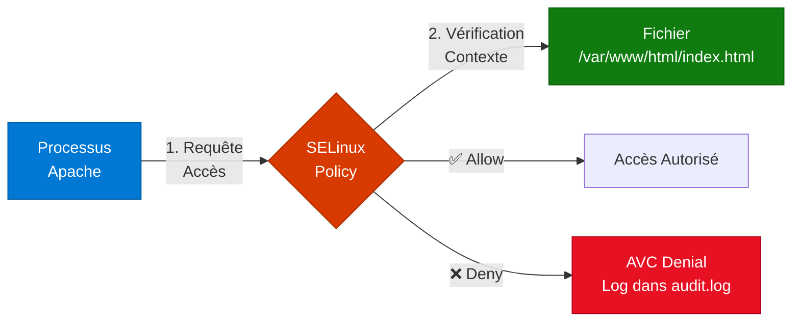

---
tags:
  - selinux
  - security
  - rhel
  - hardening
  - auditd
---

# SELinux & RHEL Hardening

## SELinux : La Forteresse Invisible

**Security-Enhanced Linux (SELinux)** est un système de contrôle d'accès obligatoire (MAC) développé par la NSA. Sur RHEL/CentOS/Rocky, il est activé par défaut et protège le système même si un processus est compromis.



## Modes SELinux

### Vérifier l'État Actuel

```bash
# Afficher le mode courant
getenforce
# Résultat : Enforcing | Permissive | Disabled

# Statut détaillé
sestatus
# Mode, Policy (targeted), Contexts

# Vérifier le contexte d'un fichier
ls -Z /var/www/html/
# system_u:object_r:httpd_sys_content_t:s0 index.html
```

### Changer de Mode (Runtime)

```bash
# Passer en mode Permissive (pour débugger)
setenforce 0  # Ou : setenforce Permissive

# Repasser en mode Enforcing
setenforce 1  # Ou : setenforce Enforcing
```

!!! warning "Mode Permissive ≠ Désactivé"
    En **Permissive**, SELinux log les violations mais ne les bloque pas. Utile pour diagnostiquer, mais **ne jamais laisser en production**.

### Configuration Persistante

```bash
# Éditer la config persistante
vim /etc/selinux/config

# Options :
SELINUX=enforcing   # Mode strict (production)
SELINUX=permissive  # Log seulement (debug)
SELINUX=disabled    # ⚠️ Désactivé (reboot requis)

SELINUXTYPE=targeted  # Policy par défaut RHEL
```

!!! danger "Réactivation après Disabled"
    Si SELinux était **disabled**, le passer à **enforcing** nécessite un **relabel complet** (long, peut échouer au boot). Procédure sécurisée :

    ```bash
    # 1. Passer en Permissive d'abord
    sed -i 's/SELINUX=disabled/SELINUX=permissive/' /etc/selinux/config
    reboot

    # 2. Après reboot, vérifier les logs
    ausearch -m AVC -ts recent

    # 3. Si stable, passer en Enforcing
    sed -i 's/SELINUX=permissive/SELINUX=enforcing/' /etc/selinux/config
    reboot
    ```

## Dépannage : Survival Kit

### 1. Lire les Logs AVC (Access Vector Cache)

```bash
# Chercher les denials récents
ausearch -m AVC -ts recent
# -ts recent = dernière 10min
# -ts today   = aujourd'hui

# Avec des détails lisibles
ausearch -m AVC -ts recent | audit2why

# Exemple de sortie :
# type=AVC msg=audit(1234567890.123:456): avc: denied { write } for \
#   pid=1234 comm="httpd" path="/var/www/html/upload.php" \
#   scontext=system_u:system_r:httpd_t:s0 \
#   tcontext=system_u:object_r:admin_home_t:s0 tclass=file permissive=0
```

### 2. Générer une Règle de Policy (Audit2allow)

```mermaid
flowchart LR
    A[🚫 Denial log dans audit.log] --> B{ausearch -m AVC<br/>audit2allow -w}
    B --> C[💡 Explication & Suggestion<br/>(Booléen ou Type)]
    C --> D{setsebool -P<br/>ou semanage fcontext}
    C --> E{audit2allow -M<br/>my_fix}
    E --> F[📦 my_fix.te + my_fix.pp]
    F --> G{semodule -i my_fix.pp}
    G --> H[✅ Accès Autorisé]
```

**Workflow de débogage des denials :**

1.  **Reproduire le problème** (lancer l'application/service qui échoue).
2.  **Lister les denials** : `ausearch -m AVC -ts recent`.
3.  **Obtenir l'explication et la suggestion** : `ausearch -m AVC -ts recent | audit2allow -w`.
    *   Si un booléen est suggéré (ex: `httpd_can_network_connect`), c'est la solution la plus propre.
    *   Si c'est un contexte de fichier, `semanage fcontext` est la solution.
    *   Si rien, ou si c'est trop complexe, `audit2allow -M` est la solution "rapide et sale" (à éviter en production si possible).
4.  **Implémenter la solution**.

```bash
# Analyser les denials et proposer des solutions
ausearch -m AVC -ts recent | audit2allow -w
# -w = why (explication)

# Exemple de sortie :
# type=AVC msg=audit(1234567890.123:456): avc: denied { write } for \
#   pid=1234 comm="httpd" path="/var/www/html/upload.php" \
#   scontext=system_u:system_r:httpd_t:s0 \
#   tcontext=system_u:object_r:admin_home_t:s0 tclass=file permissive=0

# Possible suggestion : "If you want to allow httpd to write to user home directories, use the boolean httpd_enable_homedirs"

# Générer un module de policy (solution générique si pas de booléen ou contexte)
ausearch -m AVC -ts recent | audit2allow -M my_httpd_fix
# Crée : my_httpd_fix.te (source) et my_httpd_fix.pp (compilé)

# Installer le module
semodule -i my_httpd_fix.pp

# Lister les modules chargés
semodule -l | grep my_httpd
```

!!! warning "audit2allow : Dernier Recours ou Debug Rapide"
    `audit2allow` génère des règles permissives qui peuvent réduire la sécurité. Préférez toujours **corriger le contexte** ou **activer un booléen** avant de créer un module custom. Utilisez-le pour le débogage et ensuite cherchez une solution plus propre.

### 3. Gestion des Contextes SELinux

```bash
# Afficher le contexte d'un fichier
ls -Z /var/www/html/index.html
# system_u:object_r:httpd_sys_content_t:s0 index.html

# Afficher le contexte d'un processus
ps auxZ | grep httpd
# system_u:system_r:httpd_t:s0 apache 1234 ...

# Changer TEMPORAIREMENT le contexte (jusqu'au relabel)
chcon -t httpd_sys_content_t /var/www/html/newfile.html

# Restaurer le contexte par défaut (selon la policy)
restorecon -v /var/www/html/newfile.html
# Restaurer récursivement
restorecon -Rv /var/www/

# Définir un contexte PERSISTANT (survit au relabel)
semanage fcontext -a -t httpd_sys_content_t "/srv/website(/.*)?"
restorecon -Rv /srv/website/
```

### 4. Gestion des Ports

```bash
# Lister les ports autorisés pour un service
semanage port -l | grep http
# http_port_t: tcp 80, 443, 488, 8008, 8009, 8443

# Autoriser un port custom
semanage port -a -t http_port_t -p tcp 8080

# Supprimer une autorisation
semanage port -d -t http_port_t -p tcp 8080
```

## Auditd : Surveillance SecNumCloud

**Auditd** est le démon de logging de sécurité de Linux (requis par les normes PCI-DSS, SecNumCloud).

### Installation & Activation

```bash
# Installer auditd (déjà présent sur RHEL minimal)
dnf install audit -y

# Activer au boot
systemctl enable --now auditd

# ⚠️ Auditd ne se gère PAS avec systemctl stop !
# Utiliser :
service auditd stop
service auditd start
```

### Configuration de Base pour SecNumCloud

```bash
# Éditer les règles d'audit
vim /etc/audit/rules.d/audit.rules

# === Surveillance des fichiers critiques ===
-w /etc/passwd -p wa -k passwd_changes
-w /etc/shadow -p wa -k shadow_changes
-w /etc/sudoers -p wa -k sudoers_changes
-w /etc/ssh/sshd_config -p wa -k sshd_config_changes

# === Surveillance des commandes root ===
-a always,exit -F arch=b64 -F uid=0 -S execve -k root_commands

# === Surveillance des modifications de users/groups ===
-w /usr/sbin/useradd -p x -k user_modification
-w /usr/sbin/userdel -p x -k user_modification
-w /usr/sbin/usermod -p x -k user_modification
-w /usr/sbin/groupadd -p x -k group_modification

# === Surveillance des tentatives de changement d'heure ===
-a always,exit -F arch=b64 -S adjtimex -S settimeofday -k time_change
-a always,exit -F arch=b64 -S clock_settime -k time_change

# === Surveillance des modifications de SELinux ===
-w /etc/selinux/ -p wa -k selinux_changes

# Charger les règles
augenrules --load

# Vérifier les règles actives
auditctl -l
```

### Recherche dans les Logs

```bash
# Chercher les modifications de /etc/passwd
ausearch -k passwd_changes

# Chercher les commandes root d'un utilisateur spécifique
ausearch -k root_commands -ui 0 -ts today

# Chercher les échecs d'authentification
ausearch -m USER_LOGIN -sv no -ts today

# Rapport formaté
aureport --summary
aureport --failed --summary
```

## Aide-Mémoire : Booléens SELinux Courants

Les **booléens** sont des interrupteurs pour activer/désactiver des fonctionnalités sans recompiler la policy.

```bash
# Lister TOUS les booléens
getsebool -a

# Chercher un booléen spécifique
getsebool -a | grep httpd

# Activer un booléen (runtime)
setsebool httpd_can_network_connect on

# Activer de façon PERSISTANTE
setsebool -P httpd_can_network_connect on
```

### Tableau des Booléens Essentiels

| Booléen | Description | Use Case |
|---------|-------------|----------|
| `httpd_can_network_connect` | Apache peut se connecter à des sockets réseau | Reverse proxy vers backend |
| `httpd_can_network_connect_db` | Apache peut se connecter à MySQL/PostgreSQL | App web avec BDD externe |
| `httpd_enable_homedirs` | Apache peut servir `~/public_html` | Hébergement users |
| `httpd_execmem` | Apache peut utiliser mémoire exécutable | Modules comme mod_security |
| `httpd_unified` | Apache peut lire/écrire dans tous ses répertoires | Simplification (⚠️ moins sécurisé) |
| `ssh_sysadm_login` | SSH peut se connecter en tant que sysadm_r | Accès root SSH |
| `allow_ftpd_full_access` | FTP peut accéder à tout le filesystem | ⚠️ Dangereux |
| `named_write_master_zones` | Bind peut écrire dans zones DNS | DNSSEC, dynamic updates |

### Exemple Concret : Nginx Reverse Proxy

```bash
# Problème : Nginx ne peut pas se connecter au backend
curl http://localhost
# 502 Bad Gateway

# Vérifier les logs SELinux
ausearch -m AVC -ts recent | grep nginx
# avc: denied { name_connect } for comm="nginx" dest=8080 \
#   scontext=system_u:system_r:httpd_t:s0 tclass=tcp_socket

# Solution : Activer le booléen
setsebool -P httpd_can_network_connect on

# Vérifier
curl http://localhost
# 200 OK
```

## Hardening RHEL : Checklist Production

```bash
# 1. SELinux en mode Enforcing
getenforce  # Doit retourner : Enforcing

# 2. Auditd activé et configuré
systemctl is-active auditd  # active
auditctl -l | wc -l  # > 10 règles

# 3. Désactiver les services inutiles
systemctl list-unit-files --state=enabled | grep -v '@'

# 4. Firewalld actif (voir guide rhel-networking.md)
systemctl is-active firewalld

# 5. Mises à jour automatiques de sécurité (RHEL 8+)
dnf install dnf-automatic -y
vim /etc/dnf/automatic.conf
# apply_updates = yes  # Pour auto-install
# download_updates = yes  # Pour télécharger seulement
systemctl enable --now dnf-automatic.timer

# 6. Désactiver les comptes système
passwd -l bin  # Verrouiller les comptes bin, daemon, etc.

# 7. Vérifier les permissions critiques
stat -c "%a %n" /etc/passwd  # Doit être 644
stat -c "%a %n" /etc/shadow  # Doit être 000 ou 400

# 8. Fail2Ban ou firewalld rich rules contre brute-force SSH
dnf install fail2ban -y
# Ou firewalld rich rules (voir rhel-networking.md)
```

## Liens Utiles

- [Documentation SELinux Red Hat](https://access.redhat.com/documentation/en-us/red_hat_enterprise_linux/9/html/using_selinux/)
- [Auditd Man Pages](https://man7.org/linux/man-pages/man8/auditd.8.html)
- [SELinux Policy Guide](https://selinuxproject.org/page/Guide)
- [SecNumCloud Référentiel](https://www.ssi.gouv.fr/entreprise/qualifications/prestataires-de-services-de-confiance-qualifies/prestataires-de-service-dinformatique-en-nuage-secnumcloud/)
