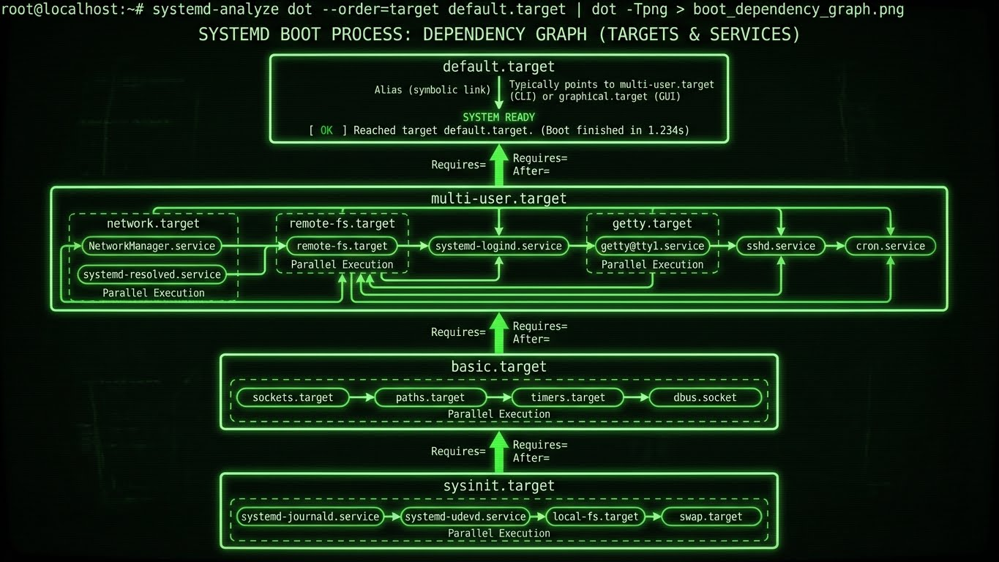

---
tags:
  - linux
  - systemd
  - services
  - timers
  - sockets
---

# Systemd Avancé

Fonctionnalités avancées de systemd : timers, sockets, targets, hardening, et orchestration de services.




## Architecture Systemd

```
HIÉRARCHIE DES UNITS SYSTEMD
══════════════════════════════════════════════════════════════════════

                         ┌─────────────────┐
                         │  systemd (PID 1)│
                         └────────┬────────┘
                                  │
        ┌─────────────┬───────────┼───────────┬─────────────┐
        ▼             ▼           ▼           ▼             ▼
   ┌─────────┐  ┌─────────┐  ┌─────────┐  ┌─────────┐  ┌─────────┐
   │ .service│  │ .timer  │  │ .socket │  │ .target │  │ .mount  │
   └─────────┘  └─────────┘  └─────────┘  └─────────┘  └─────────┘
        │             │           │           │             │
   Services      Planification  Activation  Groupement   Montages
   classiques    temporelle     à la        de units     de FS
                               demande

Types de Units:
├── .service   → Processus/démons
├── .socket    → Sockets IPC/réseau (activation à la demande)
├── .timer     → Planification (remplace cron)
├── .target    → Groupement logique de units
├── .mount     → Points de montage
├── .automount → Montage automatique
├── .path      → Surveillance de fichiers/répertoires
├── .slice     → Hiérarchie de cgroups
├── .scope     → Processus externes (non démarrés par systemd)
└── .swap      → Espaces d'échange
```

---

## Systemd Timers

### Remplacer Cron

```ini
# /etc/systemd/system/backup.service
[Unit]
Description=Daily Backup Service
After=network-online.target
Wants=network-online.target

[Service]
Type=oneshot
ExecStart=/opt/scripts/backup.sh
StandardOutput=journal
StandardError=journal

# Le service n'a pas de [Install] car il est déclenché par le timer
```

```ini
# /etc/systemd/system/backup.timer
[Unit]
Description=Run backup daily at 2:00 AM

[Timer]
# Heure absolue
OnCalendar=*-*-* 02:00:00

# Ou syntaxe relative
# OnCalendar=daily
# OnCalendar=weekly
# OnCalendar=Mon,Fri 10:00

# Délai aléatoire pour éviter les pics de charge
RandomizedDelaySec=30min

# Exécuter immédiatement si le dernier run a été manqué
Persistent=true

# Précision (défaut 1min)
AccuracySec=1s

[Install]
WantedBy=timers.target
```

```bash
# Activer le timer
sudo systemctl enable --now backup.timer

# Lister les timers
systemctl list-timers --all

# Voir le prochain déclenchement
systemctl status backup.timer

# Déclencher manuellement le service
sudo systemctl start backup.service
```

### Syntaxe OnCalendar

```bash
# Format: DayOfWeek Year-Month-Day Hour:Minute:Second

# Exemples courants
OnCalendar=hourly                    # Chaque heure
OnCalendar=daily                     # Chaque jour à minuit
OnCalendar=weekly                    # Chaque lundi à minuit
OnCalendar=monthly                   # Premier jour du mois
OnCalendar=yearly                    # 1er janvier

# Syntaxe détaillée
OnCalendar=*-*-* 04:00:00           # Tous les jours à 4h
OnCalendar=Mon-Fri *-*-* 09:00:00   # Lun-Ven à 9h
OnCalendar=*-*-01 00:00:00          # Premier jour du mois
OnCalendar=*-01,07-01 00:00:00      # 1er janvier et 1er juillet
OnCalendar=Sat *-*-* 10:00:00       # Samedi à 10h

# Intervalles
OnCalendar=*:0/15                   # Toutes les 15 minutes
OnCalendar=*-*-* *:00:00            # Toutes les heures pile
OnCalendar=*-*-* 00/6:00:00         # Toutes les 6 heures

# Vérifier la syntaxe
systemd-analyze calendar "Mon-Fri *-*-* 09:00:00"
systemd-analyze calendar --iterations=5 "daily"
```

### Timers Monotones

```ini
# Timer basé sur des durées plutôt que des dates
[Timer]
# Après le boot
OnBootSec=5min

# Après l'activation du timer
OnActiveSec=30s

# Après la dernière exécution du service
OnUnitActiveSec=1h

# Après la dernière désactivation du service
OnUnitInactiveSec=30min

# Combinaison : 5min après boot, puis toutes les heures
OnBootSec=5min
OnUnitActiveSec=1h
```

---

## Socket Activation

### Principe

```
SOCKET ACTIVATION
══════════════════════════════════════════════════════════════════════

Avantages:
├── Démarrage plus rapide (services à la demande)
├── Moins de ressources (services non utilisés = non démarrés)
├── Parallélisation du boot (pas besoin d'attendre les dépendances)
└── Redémarrage sans perte de connexion

Flux:
1. systemd écoute sur le socket
2. Connexion entrante → systemd démarre le service
3. Service reçoit le socket déjà ouvert (fd 3+)
4. Service traite les connexions
```

### Créer un Socket TCP

```ini
# /etc/systemd/system/myapp.socket
[Unit]
Description=MyApp Socket

[Socket]
# Socket TCP
ListenStream=8080

# Ou socket Unix
# ListenStream=/run/myapp.sock

# Permissions socket Unix
# SocketMode=0660
# SocketUser=myapp
# SocketGroup=myapp

# Backlog de connexions
Backlog=128

# Activer keep-alive
KeepAlive=true

# Accepter les connexions (true = une instance par connexion)
Accept=false

[Install]
WantedBy=sockets.target
```

```ini
# /etc/systemd/system/myapp.service
[Unit]
Description=MyApp Service
Requires=myapp.socket

[Service]
Type=simple
ExecStart=/usr/local/bin/myapp
StandardInput=socket
StandardOutput=journal

# Variables d'environnement pour récupérer le socket
# LISTEN_FDS=1, LISTEN_PID=<pid>
```

```bash
# Activer le socket (pas le service!)
sudo systemctl enable --now myapp.socket

# Vérifier
systemctl status myapp.socket
ss -tlnp | grep 8080

# Le service démarre automatiquement à la première connexion
curl http://localhost:8080
systemctl status myapp.service
```

### Socket avec Accept=true

```ini
# /etc/systemd/system/echo@.socket
[Unit]
Description=Echo Service Socket

[Socket]
ListenStream=7777
Accept=true

[Install]
WantedBy=sockets.target
```

```ini
# /etc/systemd/system/echo@.service
# Le @ signifie une instance par connexion
[Unit]
Description=Echo instance %i

[Service]
Type=simple
ExecStart=/bin/cat
StandardInput=socket
StandardOutput=socket

# Chaque connexion = nouvelle instance
# %i contient l'identifiant de connexion
```

---

## Targets Personnalisées

### Créer une Target

```ini
# /etc/systemd/system/app-stack.target
[Unit]
Description=Application Stack Target
Requires=postgresql.service redis.service
After=postgresql.service redis.service
AllowIsolate=yes

[Install]
WantedBy=multi-user.target
```

```bash
# Activer la target
sudo systemctl enable app-stack.target

# Démarrer tous les services de la target
sudo systemctl start app-stack.target

# Voir les dépendances
systemctl list-dependencies app-stack.target
```

### Targets Standards

```bash
# Targets principales
poweroff.target     # Arrêt
rescue.target       # Mode rescue (single-user)
multi-user.target   # Multi-utilisateur sans GUI
graphical.target    # Avec GUI
reboot.target       # Redémarrage

# Changer de target
sudo systemctl isolate rescue.target
sudo systemctl isolate multi-user.target

# Définir la target par défaut
sudo systemctl set-default multi-user.target
systemctl get-default
```

---

## Hardening de Services

### Isolation et Sécurité

```ini
# /etc/systemd/system/secure-app.service
[Unit]
Description=Secure Application
After=network.target

[Service]
Type=simple
ExecStart=/opt/app/bin/server
User=appuser
Group=appgroup

# === ISOLATION SYSTÈME DE FICHIERS ===

# Système de fichiers en lecture seule
ProtectSystem=strict
# strict = /usr, /boot, /efi en lecture seule
# full   = + /etc en lecture seule
# true   = /usr, /boot en lecture seule

# Répertoire home inaccessible
ProtectHome=true
# true     = /home, /root, /run/user inaccessibles
# read-only = lecture seule
# tmpfs    = remplacés par tmpfs vide

# Répertoires accessibles en écriture
ReadWritePaths=/var/lib/app /var/log/app

# Répertoires inaccessibles
InaccessiblePaths=/mnt /media

# Répertoire temporaire privé
PrivateTmp=true

# === ISOLATION RÉSEAU ===

# Réseau privé (pas d'accès réseau)
# PrivateNetwork=true

# Restreindre les familles d'adresses
RestrictAddressFamilies=AF_INET AF_INET6 AF_UNIX

# === ISOLATION KERNEL ===

# Pas d'accès aux modules kernel
ProtectKernelModules=true

# Pas de modification des paramètres kernel
ProtectKernelTunables=true

# Pas d'accès aux logs kernel
ProtectKernelLogs=true

# Pas d'accès à /proc/sys, /sys
ProtectControlGroups=true

# Horloge système en lecture seule
ProtectClock=true

# Hostname en lecture seule
ProtectHostname=true

# === CAPABILITIES ===

# Supprimer toutes les capabilities
CapabilityBoundingSet=
# Ou garder seulement celles nécessaires
# CapabilityBoundingSet=CAP_NET_BIND_SERVICE

# Capabilities ambiantes (héritées par les enfants)
AmbientCapabilities=

# === RESTRICTIONS SYSTÈME ===

# Interdire l'acquisition de nouveaux privilèges
NoNewPrivileges=true

# Restreindre les appels système
SystemCallFilter=@system-service
SystemCallFilter=~@privileged @resources
SystemCallErrorNumber=EPERM

# Architectures autorisées
SystemCallArchitectures=native

# Désactiver le changement de personnalité
LockPersonality=true

# Limiter les namespaces
RestrictNamespaces=true

# Restreindre les opérations temps réel
RestrictRealtime=true

# Restreindre SUID/SGID
RestrictSUIDSGID=true

# === ENVIRONNEMENT ===

# Réinitialiser l'environnement
Environment=
# Variables spécifiques
Environment=APP_ENV=production

# Masquer certaines variables
UnsetEnvironment=LD_PRELOAD

# === LIMITES RESSOURCES ===

# Limite mémoire
MemoryMax=512M
MemoryHigh=400M

# Limite CPU
CPUQuota=50%

# Limite fichiers ouverts
LimitNOFILE=65535

# Limite processus
LimitNPROC=64

[Install]
WantedBy=multi-user.target
```

### Vérifier le Niveau de Sécurité

```bash
# Analyser la sécurité d'un service
systemd-analyze security myapp.service

# Score de 0 (parfait) à 10 (dangereux)
# Affiche les recommandations

# Analyser tous les services
systemd-analyze security

# Sortie JSON pour parsing
systemd-analyze security --json=short myapp.service
```

### Template de Service Sécurisé

```ini
# /etc/systemd/system/template-secure@.service
[Unit]
Description=Secure Service Template - %i
After=network.target

[Service]
Type=simple
ExecStart=/opt/services/%i/bin/start

# Utilisateur dynamique (créé à la volée)
DynamicUser=true

# Répertoires avec permissions automatiques
StateDirectory=%i
LogsDirectory=%i
ConfigurationDirectory=%i

# Sécurité maximale
ProtectSystem=strict
ProtectHome=true
PrivateTmp=true
PrivateDevices=true
ProtectKernelModules=true
ProtectKernelTunables=true
ProtectControlGroups=true
NoNewPrivileges=true
CapabilityBoundingSet=
SystemCallFilter=@system-service
SystemCallArchitectures=native
RestrictNamespaces=true
RestrictRealtime=true
RestrictSUIDSGID=true
LockPersonality=true
MemoryDenyWriteExecute=true

[Install]
WantedBy=multi-user.target
```

---

## Path Units - Surveillance de Fichiers

### Déclencher sur Modification

```ini
# /etc/systemd/system/config-reload.path
[Unit]
Description=Watch config file for changes

[Path]
# Surveiller un fichier
PathModified=/etc/myapp/config.yaml

# Ou un répertoire
PathChanged=/etc/myapp/conf.d/

# Déclencher si le fichier existe
PathExists=/tmp/trigger-reload

# Déclencher si le répertoire n'est pas vide
DirectoryNotEmpty=/var/spool/myapp/

[Install]
WantedBy=multi-user.target
```

```ini
# /etc/systemd/system/config-reload.service
[Unit]
Description=Reload config on change

[Service]
Type=oneshot
ExecStart=/usr/bin/systemctl reload myapp.service
```

```bash
sudo systemctl enable --now config-reload.path
systemctl status config-reload.path
```

---

## Slices et Cgroups

### Hiérarchie des Slices

```
HIÉRARCHIE CGROUPS
══════════════════════════════════════════════════════════════════════

-.slice (root)
├── user.slice
│   ├── user-1000.slice
│   │   └── user@1000.service
│   └── user-1001.slice
├── system.slice (services système)
│   ├── sshd.service
│   ├── nginx.service
│   └── postgresql.service
└── machine.slice (conteneurs/VMs)
    └── docker-xxx.scope
```

### Créer une Slice Personnalisée

```ini
# /etc/systemd/system/apps.slice
[Unit]
Description=Application Services Slice

[Slice]
# Limite mémoire pour toute la slice
MemoryMax=4G
MemoryHigh=3G

# Limite CPU
CPUQuota=200%  # 2 cores max

# Poids CPU (relatif, défaut 100)
CPUWeight=50

# Limite I/O
IOWeight=50
```

```ini
# Assigner un service à la slice
# /etc/systemd/system/myapp.service
[Service]
Slice=apps.slice
...
```

```bash
# Voir la hiérarchie des cgroups
systemd-cgls

# Statistiques cgroups
systemd-cgtop

# Voir les limites d'un slice
systemctl show apps.slice | grep -E "Memory|CPU"
```

---

## Journald Avancé

### Configuration

```ini
# /etc/systemd/journald.conf
[Journal]
# Stockage : volatile (RAM), persistent (/var/log/journal), auto
Storage=persistent

# Compression
Compress=yes

# Taille maximale
SystemMaxUse=2G
SystemKeepFree=1G
SystemMaxFileSize=100M

# Rétention
MaxRetentionSec=1month

# Rate limiting
RateLimitIntervalSec=30s
RateLimitBurst=10000

# Forward vers syslog
ForwardToSyslog=no

# Forward vers console
ForwardToConsole=no
```

### Requêtes Avancées

```bash
# Par unité
journalctl -u nginx.service

# Par priorité
journalctl -p err       # Erreurs et plus
journalctl -p warning   # Warnings et plus

# Par intervalle de temps
journalctl --since "2024-01-01" --until "2024-01-02"
journalctl --since "1 hour ago"
journalctl --since "09:00" --until "10:00"

# Par boot
journalctl -b           # Boot actuel
journalctl -b -1        # Boot précédent
journalctl --list-boots # Lister les boots

# Par PID
journalctl _PID=1234

# Par exécutable
journalctl /usr/sbin/nginx

# Combiner les filtres
journalctl -u nginx -p err --since "1 hour ago"

# Format de sortie
journalctl -o json        # JSON
journalctl -o json-pretty # JSON formaté
journalctl -o short-iso   # Avec timestamp ISO

# Suivre en temps réel
journalctl -f -u myapp.service

# Export pour analyse
journalctl -u nginx --since "1 day ago" -o json > nginx-logs.json
```

### Champs de Journal Personnalisés

```bash
# Dans un script ou application
systemd-cat -t myapp -p info echo "Message with custom identifier"

# En Python avec systemd.journal
# pip install systemd
from systemd import journal
journal.send('Hello from Python',
             PRIORITY=journal.Priority.INFO,
             SYSLOG_IDENTIFIER='myapp',
             MY_FIELD='custom_value')
```

---

## Dépendances et Ordonnancement

### Types de Dépendances

```ini
[Unit]
Description=My Service

# === DÉPENDANCES FORTES ===

# Requiert ces units (échec si non démarrées)
Requires=postgresql.service redis.service

# Associe au cycle de vie (arrêt propagé)
BindsTo=docker.service

# Fait partie de (arrêt avec la target)
PartOf=app-stack.target

# === DÉPENDANCES FAIBLES ===

# Souhaite ces units (pas d'échec si absentes)
Wants=monitoring.service

# === ORDONNANCEMENT ===

# Démarrer après ces units
After=network-online.target postgresql.service

# Démarrer avant ces units
Before=nginx.service

# === CONFLITS ===

# Ne peut pas tourner en même temps
Conflicts=iptables.service
```

### Visualiser les Dépendances

```bash
# Arbre des dépendances
systemctl list-dependencies nginx.service

# Dépendances inverses
systemctl list-dependencies --reverse nginx.service

# Dépendances d'une target
systemctl list-dependencies multi-user.target

# Graphe DOT (pour visualisation)
systemd-analyze dot nginx.service | dot -Tpng -o deps.png
```

---

## Instanciation de Services

### Services Template

```ini
# /etc/systemd/system/worker@.service
# Le @ indique un template
[Unit]
Description=Worker instance %i
After=network.target

[Service]
Type=simple
ExecStart=/opt/app/worker --id=%i
User=worker

# %i = nom de l'instance (échappé)
# %I = nom de l'instance (non échappé)
# %n = nom complet de l'unit
# %N = nom complet (non échappé)

[Install]
WantedBy=multi-user.target
```

```bash
# Démarrer des instances
sudo systemctl start worker@1.service
sudo systemctl start worker@2.service
sudo systemctl start worker@production.service

# Activer au boot
sudo systemctl enable worker@1.service worker@2.service

# Voir toutes les instances
systemctl list-units 'worker@*.service'
```

### Instances avec Configuration Séparée

```ini
# /etc/systemd/system/app@.service
[Unit]
Description=App %i
After=network.target

[Service]
Type=simple
ExecStart=/opt/app/server
EnvironmentFile=/etc/app/%i.conf
User=%i
WorkingDirectory=/home/%i/app

[Install]
WantedBy=multi-user.target
```

```bash
# /etc/app/prod.conf
PORT=8080
LOG_LEVEL=info

# /etc/app/staging.conf
PORT=8081
LOG_LEVEL=debug
```

---

## Commandes Avancées

### Analyse et Diagnostic

```bash
# Temps de boot
systemd-analyze
systemd-analyze blame
systemd-analyze critical-chain

# Graphe SVG du boot
systemd-analyze plot > boot.svg

# Vérifier la syntaxe d'une unit
systemd-analyze verify /etc/systemd/system/myapp.service

# Dumper la configuration effective
systemctl show nginx.service

# Voir les propriétés modifiées
systemctl show nginx.service --property=MemoryMax,CPUQuota

# Modifier temporairement (jusqu'au redémarrage)
sudo systemctl set-property nginx.service MemoryMax=512M

# Environnement du service
systemctl show-environment
```

### Gestion des Units

```bash
# Recharger la configuration systemd
sudo systemctl daemon-reload

# Recharger un service (HUP signal)
sudo systemctl reload nginx.service

# Redémarrer si en cours d'exécution
sudo systemctl try-restart nginx.service

# Réinitialiser l'état "failed"
sudo systemctl reset-failed nginx.service

# Masquer un service (empêche le démarrage)
sudo systemctl mask nginx.service
sudo systemctl unmask nginx.service

# Éditer une unit (crée un override)
sudo systemctl edit nginx.service
# Crée /etc/systemd/system/nginx.service.d/override.conf

# Voir les overrides
systemctl cat nginx.service
```

### Runlevel Compatibility

```bash
# Équivalences SysV
telinit 3          # systemctl isolate multi-user.target
telinit 5          # systemctl isolate graphical.target
init 0             # systemctl poweroff
init 6             # systemctl reboot

# Voir le "runlevel" actuel
systemctl get-default
runlevel
```

---

## Exemples Pratiques

### Service avec Healthcheck

```ini
# /etc/systemd/system/webapp.service
[Unit]
Description=Web Application with Healthcheck
After=network-online.target
Wants=network-online.target

[Service]
Type=simple
ExecStart=/opt/webapp/bin/server
ExecStartPost=/opt/webapp/bin/wait-healthy.sh

# Watchdog : le service doit notifier périodiquement
WatchdogSec=30s
# En cas de timeout watchdog
WatchdogSignal=SIGABRT

# Redémarrage automatique
Restart=always
RestartSec=5s

# Notification de démarrage
Type=notify
NotifyAccess=main

[Install]
WantedBy=multi-user.target
```

```bash
# Script wait-healthy.sh
#!/bin/bash
for i in {1..30}; do
    if curl -sf http://localhost:8080/health > /dev/null; then
        exit 0
    fi
    sleep 1
done
exit 1
```

### Service avec Graceful Shutdown

```ini
[Service]
Type=simple
ExecStart=/opt/app/server
ExecStop=/opt/app/graceful-stop.sh

# Signal d'arrêt (défaut SIGTERM)
KillSignal=SIGTERM

# Mode d'arrêt : control-group, process, mixed, none
KillMode=mixed

# Timeout avant SIGKILL
TimeoutStopSec=60s

# Commande finale après arrêt
ExecStopPost=/opt/app/cleanup.sh
```

### Service avec Pré-conditions

```ini
[Unit]
Description=Application requiring conditions
# Condition : le fichier doit exister
ConditionPathExists=/etc/myapp/config.yaml
# Condition : le répertoire doit exister
ConditionPathIsDirectory=/var/lib/myapp
# Condition : le service tourne sur ce host
ConditionHost=production-server
# Condition : architecture
ConditionArchitecture=x86-64
# Condition : virtualisation
ConditionVirtualization=!container

# Assert = comme Condition mais loggue un échec
AssertPathExists=/etc/myapp/license.key

[Service]
Type=simple
ExecStartPre=/opt/myapp/bin/check-requirements.sh
ExecStart=/opt/myapp/bin/server
```

---

## Bonnes Pratiques

```yaml
Checklist Systemd:
  Configuration:
    - [ ] Utiliser Type=notify quand possible (meilleur tracking)
    - [ ] Configurer Restart=on-failure minimum
    - [ ] Définir TimeoutStartSec/TimeoutStopSec appropriés
    - [ ] Utiliser des utilisateurs dédiés (pas root)

  Sécurité:
    - [ ] Activer ProtectSystem et ProtectHome
    - [ ] Limiter les capabilities
    - [ ] Utiliser SystemCallFilter
    - [ ] Activer NoNewPrivileges
    - [ ] Vérifier avec systemd-analyze security

  Ressources:
    - [ ] Définir MemoryMax et CPUQuota
    - [ ] Utiliser des slices pour grouper
    - [ ] Monitorer avec systemd-cgtop

  Logging:
    - [ ] Configurer la rétention journald
    - [ ] Utiliser StandardOutput=journal
    - [ ] Ajouter des identifiants personnalisés

  Maintenance:
    - [ ] Tester les services après modification
    - [ ] Documenter les dépendances
    - [ ] Utiliser systemctl edit pour les overrides
```

---

**Voir aussi :**

- [Boot & Services](boot-and-services.md) - Bases systemd
- [Performance Analysis](performance-analysis.md) - Gestion des processus
- [Automation Cron](automation-cron.md) - Alternative aux timers
