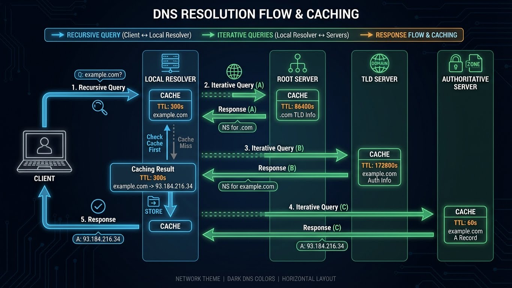
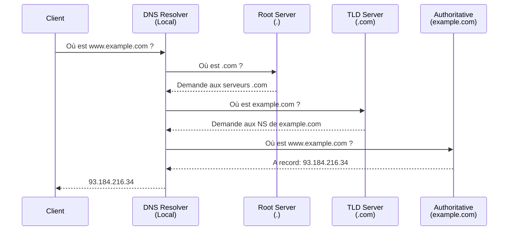

---
tags:
  - dns
  - networking
  - resolution
  - bind
---

# DNS Fundamentals



Le DNS (Domain Name System) traduit les noms de domaine en adresses IP.

---

## Concepts de Base

### Hiérarchie DNS

```
                    ┌─────────────┐
                    │   . (root)  │
                    └──────┬──────┘
           ┌───────────────┼───────────────┐
           ▼               ▼               ▼
      ┌────────┐      ┌────────┐      ┌────────┐
      │  .com  │      │  .org  │      │  .fr   │
      └───┬────┘      └────────┘      └────────┘
          │
    ┌─────┴─────┐
    ▼           ▼
┌─────────┐ ┌─────────┐
│ example │ │ google  │
└────┬────┘ └─────────┘
     │
┌────┴────┐
│  www    │
└─────────┘
```

### Types d'Enregistrements

| Type | Description | Exemple |
|------|-------------|---------|
| **A** | IPv4 address | `www.example.com → 93.184.216.34` |
| **AAAA** | IPv6 address | `www.example.com → 2606:2800:220:1:248:1893:25c8:1946` |
| **CNAME** | Alias (canonical name) | `blog.example.com → www.example.com` |
| **MX** | Mail exchange | `example.com → mail.example.com (priority 10)` |
| **NS** | Nameserver | `example.com → ns1.example.com` |
| **TXT** | Text record | `example.com → "v=spf1 include:_spf.google.com ~all"` |
| **PTR** | Reverse DNS | `34.216.184.93.in-addr.arpa → www.example.com` |
| **SOA** | Start of Authority | Zone parameters (serial, refresh, retry) |
| **SRV** | Service location | `_ldap._tcp.example.com → ldap.example.com:389` |

---

## Processus de Résolution



### Types de Serveurs DNS

| Type | Rôle | Exemples |
|------|------|----------|
| **Recursive Resolver** | Cache + résolution pour clients | ISP DNS, 8.8.8.8, 1.1.1.1 |
| **Root Servers** | Première étape (.) | a.root-servers.net - m.root-servers.net |
| **TLD Servers** | Domaines de premier niveau | .com, .org, .fr |
| **Authoritative** | Réponses définitives pour une zone | ns1.example.com |

---

## Outils de Diagnostic

### dig (Domain Information Groper)

```bash
# Résolution basique
dig example.com

# Type d'enregistrement spécifique
dig example.com A
dig example.com AAAA
dig example.com MX
dig example.com TXT
dig example.com NS

# Utiliser un serveur DNS spécifique
dig @8.8.8.8 example.com

# Résolution inverse (PTR)
dig -x 93.184.216.34

# Trace complète (suivre la délégation)
dig +trace example.com

# Format court
dig +short example.com

# Afficher le TTL
dig +ttlunits example.com

# Vérifier les enregistrements SOA
dig example.com SOA

# Transfert de zone (si autorisé)
dig @ns1.example.com example.com AXFR
```

### nslookup

```bash
# Résolution simple
nslookup example.com

# Type spécifique
nslookup -type=MX example.com

# Serveur spécifique
nslookup example.com 8.8.8.8

# Mode interactif
nslookup
> server 8.8.8.8
> set type=A
> example.com
```

### host

```bash
# Résolution rapide
host example.com
host -t MX example.com
host -t TXT example.com

# Verbose
host -v example.com
```

---

## Configuration Client

### Linux (/etc/resolv.conf)

```bash
# Configuration basique
nameserver 8.8.8.8
nameserver 8.8.4.4
search example.com corp.internal
options timeout:2 attempts:3

# Avec systemd-resolved
cat /etc/systemd/resolved.conf
```

```ini
# /etc/systemd/resolved.conf
[Resolve]
DNS=8.8.8.8 8.8.4.4
FallbackDNS=1.1.1.1 9.9.9.9
Domains=~example.com
DNSSEC=allow-downgrade
DNSOverTLS=opportunistic
```

### Windows (PowerShell)

```powershell
# Voir la configuration DNS
Get-DnsClientServerAddress

# Définir les serveurs DNS
Set-DnsClientServerAddress -InterfaceIndex 12 -ServerAddresses ("8.8.8.8","8.8.4.4")

# Vider le cache DNS
Clear-DnsClientCache

# Voir le cache
Get-DnsClientCache | Select-Object Entry, Data

# Résolution
Resolve-DnsName example.com
Resolve-DnsName -Name example.com -Type MX
```

---

## DNS Sécurisé

### DNS over HTTPS (DoH)

```bash
# Test avec curl
curl -s -H 'accept: application/dns-json' \
  'https://cloudflare-dns.com/dns-query?name=example.com&type=A'

# Serveurs DoH populaires
# Cloudflare: https://cloudflare-dns.com/dns-query
# Google:     https://dns.google/dns-query
# Quad9:      https://dns.quad9.net/dns-query
```

### DNS over TLS (DoT)

```bash
# Test avec kdig (knot-dnsutils)
kdig +tls @1.1.1.1 example.com

# Configuration systemd-resolved
# /etc/systemd/resolved.conf
[Resolve]
DNS=1.1.1.1#cloudflare-dns.com
DNSOverTLS=yes
```

### DNSSEC

```bash
# Vérifier si DNSSEC est activé
dig +dnssec example.com

# Valider la chaîne de confiance
dig +sigchase +trusted-key=/etc/trusted-key.key example.com

# Voir les enregistrements DNSSEC
dig example.com DNSKEY
dig example.com DS
dig example.com RRSIG
```

---

## Serveurs DNS Publics

| Fournisseur | IPv4 | IPv6 | Caractéristiques |
|-------------|------|------|------------------|
| **Cloudflare** | 1.1.1.1 / 1.0.0.1 | 2606:4700:4700::1111 | Rapide, DoH/DoT |
| **Google** | 8.8.8.8 / 8.8.4.4 | 2001:4860:4860::8888 | Fiable, DoH/DoT |
| **Quad9** | 9.9.9.9 | 2620:fe::fe | Sécurité, blocage malware |
| **OpenDNS** | 208.67.222.222 | 2620:119:35::35 | Filtrage familial dispo |
| **FDN** | 80.67.169.12 | 2001:910:800::12 | Français, vie privée |

---

## Dépannage

### Problèmes Courants

!!! warning "Le DNS ne résout pas"
    ```bash
    # 1. Vérifier la connectivité au serveur DNS
    ping 8.8.8.8

    # 2. Tester avec un autre serveur
    dig @1.1.1.1 example.com

    # 3. Vérifier resolv.conf
    cat /etc/resolv.conf

    # 4. Vider le cache
    sudo systemd-resolve --flush-caches   # systemd
    sudo killall -HUP dnsmasq              # dnsmasq
    ```

!!! warning "Résolution lente"
    ```bash
    # Mesurer le temps de résolution
    time dig example.com

    # Vérifier le TTL (si trop bas = requêtes fréquentes)
    dig +short +ttlunits example.com

    # Utiliser un serveur plus rapide
    dig @1.1.1.1 example.com
    ```

!!! warning "Réponses incohérentes (DNS poisoning ?)"
    ```bash
    # Comparer plusieurs serveurs
    dig @8.8.8.8 +short example.com
    dig @1.1.1.1 +short example.com
    dig @9.9.9.9 +short example.com

    # Vérifier DNSSEC
    dig +dnssec example.com | grep -i "ad"
    ```

---

## Référence Rapide

```bash
# === RÉSOLUTION ===
dig example.com                      # Résolution A
dig +short example.com               # IP seulement
dig @8.8.8.8 example.com            # Serveur spécifique
dig +trace example.com               # Trace complète

# === TYPES D'ENREGISTREMENTS ===
dig example.com MX                   # Mail
dig example.com TXT                  # Texte (SPF, DKIM)
dig example.com NS                   # Nameservers
dig -x 8.8.8.8                       # Reverse DNS

# === CACHE ===
sudo systemd-resolve --flush-caches  # Linux (systemd)
ipconfig /flushdns                   # Windows
```

---

!!! info "À lire aussi"
    - [Network Fundamentals](fundamentals.md) - CIDR, Load Balancing, DMZ
    - [Linux Network Management](../linux/network-management.md) - Configuration réseau
