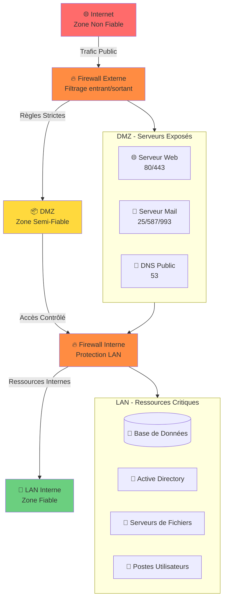

# Kit de Survie Réseau

`#cidr` `#tcp-ip` `#load-balancing`

Concepts réseau essentiels que tout DevOps et SysAdmin doit connaître.

---

## Aide-mémoire CIDR

| CIDR | Subnet Mask | Total IPs | IPs Utilisables | Cas d'Usage |
|------|-------------|-----------|------------|----------|
| `/32` | 255.255.255.255 | 1 | 1 | Hôte unique (règles firewall) |
| `/31` | 255.255.255.254 | 2 | 2 | Liens point-à-point |
| `/30` | 255.255.255.252 | 4 | 2 | Interconnexions de routeurs |
| `/29` | 255.255.255.248 | 8 | 6 | Petit bureau |
| `/28` | 255.255.255.240 | 16 | 14 | Petit réseau |
| `/27` | 255.255.255.224 | 32 | 30 | Réseau moyen |
| `/26` | 255.255.255.192 | 64 | 62 | Grand sous-réseau |
| `/25` | 255.255.255.128 | 128 | 126 | Moitié d'un /24 |
| `/24` | 255.255.255.0 | 256 | 254 | LAN standard |
| `/16` | 255.255.0.0 | 65,536 | 65,534 | Grand VPC/Entreprise |
| `/8` | 255.0.0.0 | 16,777,216 | 16,777,214 | Réseaux massifs |

!!! tip "Calcul Rapide"
    IPs utilisables = 2^(32-CIDR) - 2 (adresses réseau + broadcast)

    ```bash
    # Calculer les infos de sous-réseau
    ipcalc 192.168.1.0/24
    ```

---

## Les IPs "Bizarres"

!!! info "127.0.0.1 - Localhost"
    L'adresse de bouclage. Le trafic ne quitte jamais votre machine.

    - `127.0.0.1` - Bouclage IPv4
    - `::1` - Bouclage IPv6
    - La plage entière `127.0.0.0/8` est réservée pour le bouclage

!!! danger "169.254.x.x - APIPA (Votre DHCP est Mort)"
    **Automatic Private IP Addressing** (Link-Local)

    Si vous voyez cette IP, votre appareil **n'a pas réussi à obtenir une adresse depuis le DHCP**.

    ```bash
    $ ip addr
    inet 169.254.47.123/16  # ← Le serveur DHCP est injoignable !
    ```

    **Étapes de débogage :**
    ```bash
    # Vérifier le service DHCP
    systemctl status dhcpd

    # Demander un nouveau bail
    sudo dhclient -v eth0

    # Vérifier le câble réseau/connectivité
    ethtool eth0
    ```

!!! warning "100.64.0.0/10 - CGNAT (Carrier-Grade NAT)"
    Espace d'adressage partagé utilisé par les FAI (RFC 6598).

    Courant sur :

    - Réseaux mobiles (4G/5G)
    - Certains FAI résidentiels
    - Fournisseurs cloud (interne)

    **Implication :** Vous êtes derrière un double NAT. Le port forwarding ne fonctionnera pas.

### Plages IP Privées (RFC 1918)

| Plage | CIDR | Usage Typique |
|-------|------|-------------|
| 10.0.0.0 - 10.255.255.255 | 10.0.0.0/8 | Grandes entreprises, VPCs AWS |
| 172.16.0.0 - 172.31.255.255 | 172.16.0.0/12 | Réseaux moyens, Docker par défaut |
| 192.168.0.0 - 192.168.255.255 | 192.168.0.0/16 | LANs domestiques/petits bureaux |

---

## Load Balancing : L4 vs L7

| Fonctionnalité | Layer 4 (Transport) | Layer 7 (Application) |
|---------|---------------------|------------------------|
| **Couche OSI** | TCP/UDP | HTTP/HTTPS |
| **Vitesse** | Très rapide | Plus lent (inspecte le contenu) |
| **Intelligence** | Basique (IP + Port seulement) | Intelligent (URL, headers, cookies) |
| **SSL/TLS** | Passthrough (chiffré) | Termination (déchiffré) |
| **Décisions de routage** | IP source, Port destination | Chemin URL, Header Host, Cookies |
| **Cas d'usage** | Database, services TCP | Applications web, API gateways |
| **Exemples** | HAProxy (mode TCP), NLB | Nginx, HAProxy (HTTP), ALB |

### Load Balancer L4

```
Client → [L4 LB] → Serveur
         ↓
    Route par IP:Port
    Ne peut pas voir le contenu HTTP
    SSL passthrough
```

### Load Balancer L7

```
Client → [L7 LB] → Serveur
         ↓
    SSL Termination
    Inspecte les headers HTTP
    Route par URL : /api → backend-api
                    /web → backend-web
```

!!! example "Quand utiliser lequel ?"
    - **L4 :** MySQL, Redis, TCP brut, quand vous avez besoin de SSL passthrough
    - **L7 :** Applications web, APIs REST, quand vous avez besoin de routage basé sur URL

---

## La Pyramide de Débogage

Déboguer les problèmes réseau couche par couche, de bas en haut.

=== "Layer 3 - ICMP (L'hôte est-il vivant ?)"

    ```bash
    # Test de connectivité basique
    ping -c 4 google.com

    # Avec timeout
    ping -c 1 -W 2 192.168.1.1

    # Tracer la route
    traceroute google.com
    mtr google.com  # Meilleure version interactive
    ```

    **Si ping échoue :**

    - L'hôte est éteint
    - Firewall bloquant ICMP
    - Problème de routage

=== "Layer 4 - TCP (Le port est-il ouvert ?)"

    ```bash
    # Tester un port TCP avec nc (netcat)
    nc -zv google.com 443
    nc -zv 192.168.1.1 22

    # Utiliser telnet
    telnet google.com 80

    # Tester plusieurs ports
    nc -zv google.com 80 443 8080

    # Avec timeout
    nc -zv -w 3 google.com 443
    ```

    **Si le port est fermé :**

    - Service non démarré
    - Firewall bloquant le port
    - Service lié à la mauvaise interface

=== "Layer 7 - HTTP (L'application répond-elle ?)"

    ```bash
    # Vérifier les headers de réponse HTTP
    curl -I https://google.com

    # Réponse complète avec timing
    curl -w "@curl-format.txt" -o /dev/null -s https://google.com

    # Vérifier un endpoint spécifique
    curl -I https://api.example.com/health

    # Avec infos SSL verbose
    curl -vI https://example.com
    ```

    **Codes de réponse :**

    - `2xx` - Succès
    - `3xx` - Redirection
    - `4xx` - Erreur client (vérifier votre requête)
    - `5xx` - Erreur serveur (vérifier les logs backend)

### Flux de Débogage Rapide

```
ping échoue ?     → Vérifier routage, firewall, état de l'hôte
  ↓ fonctionne
nc port échoue ?  → Vérifier service, règles firewall, binding
  ↓ fonctionne
curl échoue ?     → Vérifier logs app, config, certificats SSL
  ↓ fonctionne
Le problème est ailleurs (DNS, côté client, etc.)
```

---

## Architecture de Sécurité : La DMZ

### Qu'est-ce qu'une DMZ ?

**DMZ = Demilitarized Zone (Zone Démilitarisée)**

**Analogie militaire :**
- Entre deux pays en conflit, une zone tampon neutre sépare les frontières
- Ni un pays ni l'autre n'a le contrôle total
- C'est une zone de transition sécurisée

**En réseau :**
- Zone réseau intermédiaire entre Internet (non fiable) et le LAN interne (fiable)
- Contient les serveurs publics (Web, Mail, DNS)
- Isole le LAN des attaques directes depuis Internet

### Schéma Conceptuel



### Pourquoi Une DMZ ?

**Problème sans DMZ :**

```
┌─────────────────────────────────────────────────────────────┐
│              ARCHITECTURE SANS DMZ (DANGEREUX)               │
├─────────────────────────────────────────────────────────────┤
│                                                              │
│  Internet → [Firewall] → LAN                                │
│                           ├─ Serveur Web (accessible)        │
│                           ├─ Base de données (exposée !)     │
│                           ├─ Active Directory (vulnérable)   │
│                           └─ Postes utilisateurs             │
│                                                              │
│  ❌ Problème : Si le serveur Web est compromis,             │
│     l'attaquant a un accès direct au LAN interne !          │
│                                                              │
└─────────────────────────────────────────────────────────────┘
```

**Solution avec DMZ :**

```
┌─────────────────────────────────────────────────────────────┐
│                ARCHITECTURE AVEC DMZ (SÉCURISÉE)             │
├─────────────────────────────────────────────────────────────┤
│                                                              │
│  Internet → [FW Externe] → DMZ → [FW Interne] → LAN         │
│                             ├─ Web                           │
│                             └─ Mail                          │
│                                                              │
│  ✓ Serveur Web compromis = Isolé dans la DMZ                │
│  ✓ Attaquant ne peut PAS atteindre le LAN directement       │
│  ✓ Second firewall protège les ressources critiques         │
│                                                              │
└─────────────────────────────────────────────────────────────┘
```

### Règles de Firewall Typiques

#### Firewall Externe (Internet → DMZ)

| Source | Destination | Port | Action | Justification |
|--------|-------------|------|--------|---------------|
| Internet | Serveur Web DMZ | 80, 443 | **ALLOW** | Accès public au site web |
| Internet | Serveur Mail DMZ | 25, 587 | **ALLOW** | Réception d'emails |
| Internet | DNS Public DMZ | 53 | **ALLOW** | Résolution DNS |
| Internet | LAN Interne | ANY | **DENY** | Bloquer accès direct au LAN |
| Internet | DMZ | Autres ports | **DENY** | Principe du moindre privilège |

#### Firewall Interne (DMZ → LAN)

| Source | Destination | Port | Action | Justification |
|--------|-------------|------|--------|---------------|
| Serveur Web DMZ | DB Serveur LAN | 3306, 5432 | **ALLOW** | Requêtes SQL (lecture seule si possible) |
| Serveur Mail DMZ | AD Serveur LAN | 389, 636 | **ALLOW** | Vérification d'identité LDAP |
| DMZ | Serveurs Fichiers LAN | 445 | **DENY** | Pas de partage SMB depuis DMZ |
| DMZ | Postes Utilisateurs LAN | ANY | **DENY** | Isolation complète |
| LAN | DMZ | 22, 3389 | **ALLOW** | Administration depuis le LAN |

#### Firewall Interne (LAN → Internet)

| Source | Destination | Port | Action | Justification |
|--------|-------------|------|--------|---------------|
| LAN | Internet | 80, 443 | **ALLOW** | Naviguation web, mises à jour |
| LAN | Internet | 53 | **ALLOW** | Requêtes DNS |
| Postes Utilisateurs | Internet | 22, 3389 | **DENY** | Bloquer SSH/RDP sortants (malware) |

### Types de DMZ

#### 1. DMZ Simple (3-Legs Firewall)

**Un seul firewall avec 3 interfaces réseau.**

```
           ┌─────────────────┐
Internet ──┤ eth0 (WAN)      │
           │                 │
           │   FIREWALL      │
           │                 │
DMZ ───────┤ eth1 (DMZ)      │
           │                 │
LAN ───────┤ eth2 (LAN)      │
           └─────────────────┘
```

**Avantages :**
- ✅ Moins coûteux (1 seul firewall)
- ✅ Configuration centralisée

**Inconvénients :**
- ❌ Point de défaillance unique
- ❌ Si le firewall est compromis, tout est exposé

#### 2. DMZ Double Firewall (Dual Firewall)

**Deux firewalls séparés.**

```
Internet → [Firewall Externe] → DMZ → [Firewall Interne] → LAN
```

**Avantages :**
- ✅ Défense en profondeur (2 couches)
- ✅ Si FW Externe compromis, FW Interne protège toujours le LAN
- ✅ Conforme SecNumCloud (multi-layer security)

**Inconvénients :**
- ❌ Plus coûteux (2 firewalls)
- ❌ Plus complexe à gérer

### Serveurs Typiques en DMZ

| Service | Port | Pourquoi en DMZ |
|---------|------|-----------------|
| **Serveur Web (Nginx/Apache)** | 80, 443 | Accessible publiquement, cible d'attaque fréquente |
| **Serveur Mail (Postfix/Exchange)** | 25, 587, 993 | Reçoit des emails d'Internet (spam, malwares) |
| **DNS Public (BIND)** | 53 | Répond aux requêtes DNS publiques |
| **Reverse Proxy (Traefik/HAProxy)** | 80, 443 | Point d'entrée pour les APIs/Apps |
| **Bastion/Jump Host** | 22, 3389 | Accès admin sécurisé (SSH/RDP) |
| **VPN Gateway (OpenVPN/IPSec)** | 1194, 500 | Accès distant sécurisé |

### Erreurs Classiques à Éviter

!!! danger "❌ NE JAMAIS Exposer Directement le LAN"
    **Erreur :** Ouvrir des ports depuis Internet directement vers le LAN (sans DMZ).

    ```
    # ❌ MAUVAIS (règle firewall dangereuse)
    Source: Internet (0.0.0.0/0)
    Destination: 192.168.1.50 (Serveur SQL LAN)
    Port: 3306
    Action: ALLOW

    → Un attaquant peut scanner et exploiter le serveur SQL !
    ```

    **✓ Correct :** Le serveur Web en DMZ accède au SQL en LAN, pas Internet.

!!! danger "❌ NE JAMAIS Permettre DMZ → LAN (Except Services Spécifiques)"
    **Erreur :** Autoriser la DMZ à se connecter librement au LAN.

    ```
    # ❌ MAUVAIS
    Source: DMZ (toute la zone)
    Destination: LAN (toute la zone)
    Port: ANY
    Action: ALLOW

    → Si un serveur DMZ est compromis, tout le LAN est accessible
    ```

    **✓ Correct :** Autoriser uniquement des flux spécifiques (Web → DB sur port 3306 uniquement).

!!! warning "⚠️ Surveiller les Logs de Firewall"
    **Les tentatives d'intrusion sont courantes :**

    - Scanner de ports automatisés
    - Brute force SSH
    - Exploits de vulnérabilités connues

    **Solution :** Centraliser les logs (Syslog, ELK, Splunk) et configurer des alertes.

### Exemple Concret : Héberger un Site Web

**Architecture complète :**

```
┌─────────────────────────────────────────────────────────────┐
│                   SITE WEB SÉCURISÉ                          │
├─────────────────────────────────────────────────────────────┤
│                                                              │
│  Internet                                                    │
│     ↓                                                        │
│  [Firewall Externe]                                          │
│     ↓ (Ports 80/443 autorisés vers DMZ)                     │
│  DMZ                                                         │
│     ├─ Nginx (Reverse Proxy)                                │
│     └─ Serveur Web (Apache/Node.js)                         │
│     ↓ (Port 3306 autorisé vers LAN)                         │
│  [Firewall Interne]                                          │
│     ↓                                                        │
│  LAN                                                         │
│     └─ MySQL Database (192.168.1.10)                        │
│                                                              │
│  Flux de données :                                          │
│  User → HTTPS (443) → Nginx (DMZ) → App (DMZ)               │
│                                    → MySQL (LAN)             │
│                                                              │
└─────────────────────────────────────────────────────────────┘
```

**Règles Firewall :**

```bash
# Firewall Externe (pfSense/iptables)
# Autoriser HTTPS depuis Internet vers Nginx (DMZ)
iptables -A FORWARD -i eth0 -o eth1 -p tcp --dport 443 -d 10.0.1.10 -j ACCEPT

# Firewall Interne
# Autoriser MySQL depuis Nginx (DMZ) vers DB (LAN)
iptables -A FORWARD -i eth1 -o eth2 -p tcp --dport 3306 -s 10.0.1.10 -d 192.168.1.10 -j ACCEPT

# Bloquer tout le reste par défaut
iptables -P FORWARD DROP
```

### Conformité SecNumCloud

**Exigences SecNumCloud pour la DMZ :**

| Exigence | Implémentation DMZ |
|----------|-------------------|
| **Segmentation Réseau** | DMZ sépare Internet du LAN (ISO 27001) |
| **Défense en Profondeur** | Dual Firewall (externe + interne) |
| **Moindre Privilège** | Règles firewall strictes (deny by default) |
| **Audit & Logging** | Logs centralisés de tous les firewalls |
| **Chiffrement** | TLS obligatoire (HTTPS, SMTPS, LDAPS) |

!!! tip "Astuce : Tester Votre DMZ"
    **Depuis Internet, essayez d'accéder directement au LAN :**

    ```bash
    # Depuis une IP publique (ou VPS test)
    nmap -p 1-65535 <VOTRE_IP_PUBLIQUE>

    # Vérifier que SEULS les ports DMZ sont ouverts
    # Ports attendus : 80, 443, 25 (DMZ)
    # Ports interdits : 445 (SMB LAN), 3389 (RDP LAN)
    ```

    Si vous voyez des ports LAN ouverts depuis Internet, **votre DMZ est mal configurée**.

---
