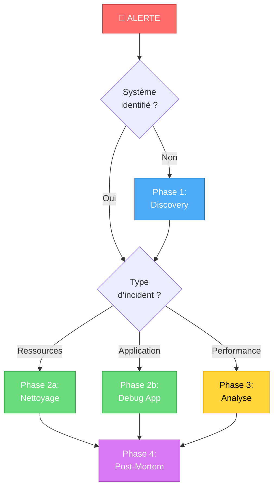
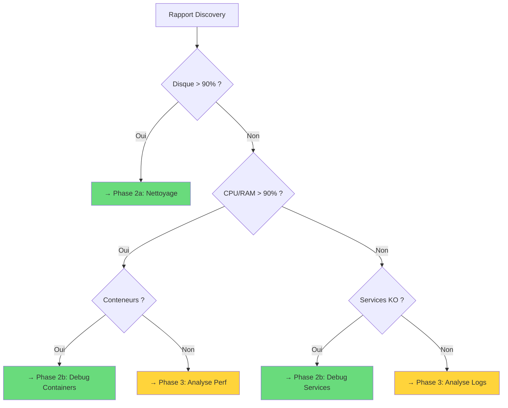
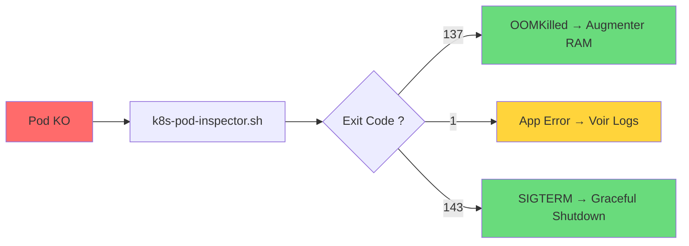
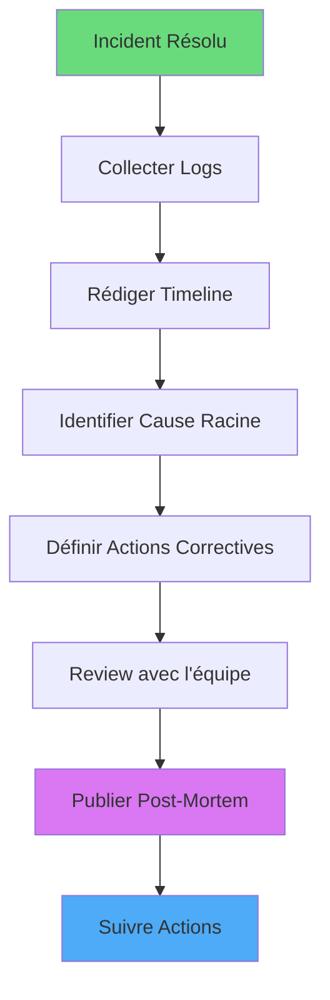

---
tags:
  - playbook
  - incident
  - troubleshooting
  - urgence
---

# Playbook Réponse Incident

Guide opérationnel : **"Quand tout est rouge, que faire ?"**

Ce playbook structure la réponse aux incidents en 4 phases, avec des liens directs vers les outils ShellBook.

---

## Vue d'Ensemble



---

## Phase 1 : Identification (Discovery)

!!! warning "Première Étape Obligatoire"
    **Ne jamais agir sans comprendre.** Un diagnostic initial évite d'aggraver la situation.

### Objectif

Obtenir une vue complète et rapide de l'état du système avant toute intervention.

### Actions

=== "Linux"

    ```bash
    # Télécharger et exécuter le script de découverte
    curl -sSL https://raw.githubusercontent.com/VBlackJack/ShellBook/main/scripts/bash/server-discovery.sh -o /tmp/discovery.sh
    chmod +x /tmp/discovery.sh
    sudo /tmp/discovery.sh -o /tmp/audit_$(hostname)_$(date +%Y%m%d).md
    ```

    **Script recommandé :** [:octicons-terminal-24: server-discovery.sh](../scripts/bash/server-discovery-audit.md)

    Le rapport généré contient :

    - Rôle détecté du serveur (Web, DB, K8s, etc.)
    - État des ressources (CPU, RAM, Disque)
    - Services actifs et ports ouverts
    - Baseline de sécurité

=== "Windows"

    ```powershell
    # Exécuter l'audit complet
    Set-ExecutionPolicy -Scope Process -ExecutionPolicy Bypass
    .\Invoke-ServerAudit.ps1 -OutputPath "C:\Audit\rapport_$(hostname)_$(Get-Date -Format 'yyyyMMdd').md"
    ```

    **Script recommandé :** [:octicons-terminal-24: Invoke-ServerAudit.ps1](../scripts/powershell/Invoke-ServerAudit.md)

    Le rapport généré contient :

    - Rôles Windows détectés (DC, IIS, SQL, Hyper-V)
    - État Defender et Firewall
    - Ports ouverts avec processus associés
    - Membres du groupe Administrators

### Arbre de Décision Post-Discovery



---

## Phase 2 : Quick Fixes

### 2a. Nettoyage Système

!!! danger "Attention"
    Ces scripts libèrent de l'espace. Exécuter en **dry-run** d'abord si disponible.

#### Nettoyage Linux

| Problème | Script | Commande |
|----------|--------|----------|
| **Disque plein** | [cleanup-system.sh](../scripts/bash/cleanup-system.md) | `sudo ./cleanup-system.sh` |
| **Logs volumineux** | [logs-extractor.sh](../scripts/bash/logs-extractor.md) | `./logs-extractor.sh --since "1 hour ago"` |
| **Fichiers temporaires** | Commande directe | `find /tmp -type f -mtime +7 -delete` |

```bash
# Nettoyage système complet (safe)
sudo ./cleanup-system.sh

# Identifier les fichiers volumineux
du -sh /* 2>/dev/null | sort -rh | head -20
```

**Script recommandé :** [:octicons-terminal-24: cleanup-system.sh](../scripts/bash/cleanup-system.md)

#### Nettoyage Docker / Conteneurs

| Problème | Script | Commande |
|----------|--------|----------|
| **Images orphelines** | [docker_cleaner_pro.py](../scripts/python/docker_cleaner_pro.md) | `python3 docker_cleaner_pro.py --dry-run` |
| **Volumes inutilisés** | [docker_cleaner_pro.py](../scripts/python/docker_cleaner_pro.md) | `python3 docker_cleaner_pro.py --include-volumes` |
| **Logs conteneurs** | Commande directe | `truncate -s 0 /var/lib/docker/containers/*/*-json.log` |

```bash
# Dry-run d'abord (voir ce qui sera supprimé)
python3 docker_cleaner_pro.py --dry-run

# Nettoyage effectif avec volumes
python3 docker_cleaner_pro.py --include-volumes --force
```

**Script recommandé :** [:octicons-terminal-24: docker_cleaner_pro.py](../scripts/python/docker_cleaner_pro.md)

---

### 2b. Debug Applications & Services

#### Pods Kubernetes en CrashLoopBackOff



```bash
# Inspection détaillée d'un pod
./k8s-pod-inspector.sh -n production my-failing-pod

# Accès rapide aux logs
kubectl logs -n production my-failing-pod --previous --tail=100
```

**Script recommandé :** [:octicons-terminal-24: k8s-pod-inspector.sh](../scripts/bash/k8s-pod-inspector.md)

#### Problèmes Réseau Conteneurs

```bash
# Debug réseau avec netshoot sidecar
./container-net-debug.sh my-container

# Tests inclus : ping, DNS, curl, ports
```

**Script recommandé :** [:octicons-terminal-24: container-net-debug.sh](../scripts/bash/container-net-debug.md)

---

## Phase 3 : Analyse Approfondie

!!! info "Quand utiliser cette phase ?"
    Les quick fixes n'ont pas résolu le problème, ou vous avez besoin de comprendre la cause racine.

### Analyse Base de Données

#### PostgreSQL - Bloat et Performance

```bash
# Vérifier le bloat (fragmentation)
./pg-bloat-check.sh -d production_db -t 30

# Résultat : pourcentage de bloat par table
# Si > 30%, planifier un VACUUM FULL
```

**Script recommandé :** [:octicons-terminal-24: pg-bloat-check.sh](../scripts/bash/pg-bloat-check.md)

#### MySQL/MariaDB - Audit Sécurité

```bash
# Audit de sécurité complet
./mysql-security-audit.sh -u root -H localhost

# Vérifie : utilisateurs sans mot de passe, root@%, etc.
```

**Script recommandé :** [:octicons-terminal-24: mysql-security-audit.sh](../scripts/bash/mysql-security-audit.md)

#### Redis - Audit des Clés

```bash
# Scanner les clés volumineuses (non bloquant)
python3 redis_key_auditor.py --host redis.local --top 50

# Identifie les clés consommant le plus de mémoire
```

**Script recommandé :** [:octicons-terminal-24: redis_key_auditor.py](../scripts/python/redis_key_auditor.md)

### Analyse des Logs

```bash
# Extraire les erreurs des dernières 2 heures
./logs-extractor.sh --since "2 hours ago" --level error --output /tmp/errors.log

# Analyse avec patterns connus
grep -E "(OOM|killed|timeout|refused|denied)" /tmp/errors.log
```

**Script recommandé :** [:octicons-terminal-24: logs-extractor.sh](../scripts/bash/logs-extractor.md)

### Matrice de Diagnostic

| Symptôme | Outil | Métrique Clé |
|----------|-------|--------------|
| **Latence DB** | [pg-bloat-check.sh](../scripts/bash/pg-bloat-check.md) | Bloat > 30% |
| **Mémoire Redis** | [redis_key_auditor.py](../scripts/python/redis_key_auditor.md) | Top 10 keys size |
| **Pods instables** | [k8s-pod-inspector.sh](../scripts/bash/k8s-pod-inspector.md) | Restart count, exit codes |
| **Réseau conteneur** | [container-net-debug.sh](../scripts/bash/container-net-debug.md) | DNS resolution, connectivity |

---

## Phase 4 : Post-Mortem

!!! success "Documentation Obligatoire"
    Tout incident résolu doit être documenté pour éviter sa répétition.

### Collecte des Preuves

```bash
# Extraire tous les logs pertinents
./logs-extractor.sh \
    --since "$(cat /tmp/incident_start_time)" \
    --until "$(date -Iseconds)" \
    --services "nginx,postgresql,docker" \
    --output /tmp/incident_$(date +%Y%m%d)_logs.tar.gz
```

**Script recommandé :** [:octicons-terminal-24: logs-extractor.sh](../scripts/bash/logs-extractor.md)

### Template Post-Mortem

```markdown
# Post-Mortem Incident [DATE]

## Résumé
- **Détecté :** HH:MM
- **Résolu :** HH:MM
- **Durée :** X heures
- **Impact :** [Description impact utilisateurs]

## Timeline
| Heure | Événement |
|-------|-----------|
| HH:MM | Alerte reçue |
| HH:MM | Discovery script exécuté |
| HH:MM | Cause identifiée |
| HH:MM | Fix appliqué |
| HH:MM | Service restauré |

## Cause Racine
[Description technique de la cause]

## Actions Correctives
- [ ] Action 1 (responsable, deadline)
- [ ] Action 2 (responsable, deadline)

## Prévention
[Mesures pour éviter que cela se reproduise]
```

### Flowchart Post-Mortem



---

## Quick Reference

### Commandes d'Urgence Linux

```bash
# État système rapide
uptime && free -h && df -h

# Top processus CPU
ps aux --sort=-%cpu | head -10

# Top processus RAM
ps aux --sort=-%mem | head -10

# Connexions réseau
ss -tunapl | head -20

# Derniers messages kernel
dmesg --human --reltime | tail -30
```

### Commandes d'Urgence Windows

```powershell
# État système
Get-ComputerInfo | Select-Object CsName, OsUptime, CsProcessors, CsTotalPhysicalMemory

# Top processus CPU
Get-Process | Sort-Object CPU -Descending | Select-Object -First 10

# Top processus RAM
Get-Process | Sort-Object WorkingSet64 -Descending | Select-Object -First 10

# Services en échec
Get-Service | Where-Object { $_.Status -eq 'Stopped' -and $_.StartType -eq 'Automatic' }
```

---

## Voir Aussi

- [:octicons-home-24: Dashboard Principal](../index.md)
- [:octicons-terminal-24: Tous les Scripts Bash](../scripts/bash/index.md)
- [:octicons-terminal-24: Tous les Scripts PowerShell](../scripts/powershell/index.md)
- [:octicons-shield-check-24: Sécurité & Compliance](../security/index.md)
