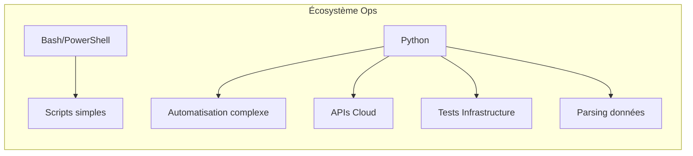

# Python for SysOps

Python : la "colle" du DevOps moderne. Scripting, automatisation et intégration cloud.

## Sections

| Section | Description |
|---------|-------------|
| 🚀 **Fondamentaux** | Syntaxe, structures, fichiers, modules |
| 📁 **Fichiers & Données** | JSON, YAML, CSV, manipulation de fichiers |
| 🌐 **API & Réseau** | Requests, APIs REST, SSH avec Paramiko |
| ☁️ **Cloud & AWS** | Boto3, automatisation AWS |
| 🔧 **Outils Système** | Subprocess, OS, gestion de processus |
| 🧪 **Tests & Qualité** | Pytest, tests d'infrastructure |

## Pourquoi Python pour les Ops ?



| Langage | Quand l'utiliser |
|---------|------------------|
| **Bash** | Scripts Linux simples, one-liners, pipelines |
| **PowerShell** | Administration Windows, AD, Exchange |
| **Python** | Logique complexe, APIs, multi-cloud, tests |

## Quick Start

```bash
# Vérifier la version
python3 --version

# Créer un environnement virtuel
python3 -m venv venv
source venv/bin/activate  # Linux
.\venv\Scripts\activate   # Windows

# Installer les outils Ops essentiels
pip install requests boto3 paramiko pyyaml pytest
```

## Articles

- [Fondamentaux Python](fundamentals.md) - Syntaxe, types, structures de contrôle
- [Fichiers & Données](files-data.md) - JSON, YAML, CSV, manipulation de fichiers
- [API & Réseau](api-network.md) - Requests, APIs REST, SSH avec Paramiko
- [Cloud & AWS](cloud-aws.md) - Boto3, automatisation AWS
- [Tests & Qualité](testing.md) - Pytest, tests d'infrastructure
