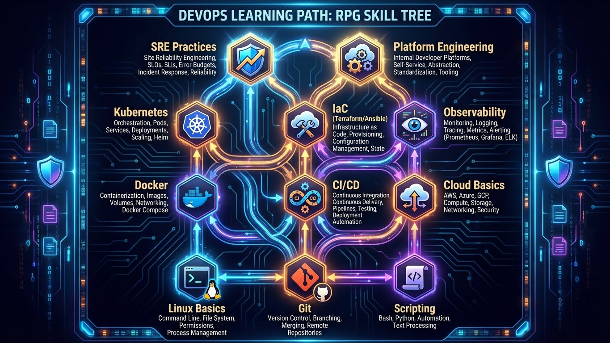
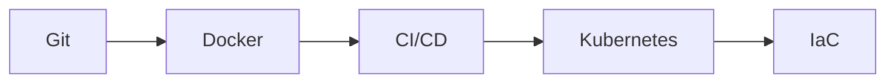
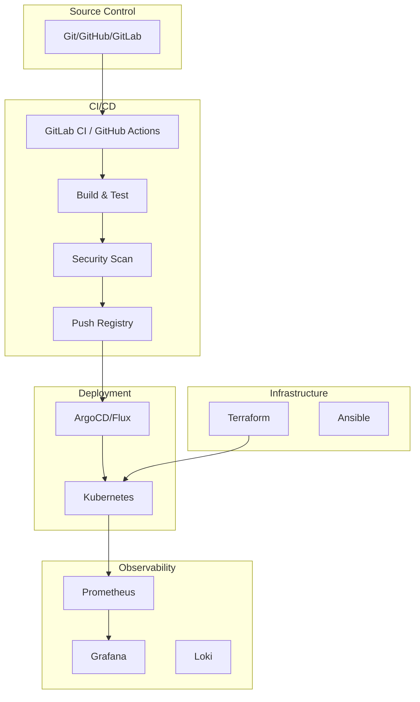

---
tags:
  - quick-start
  - devops
  - cloud
  - parcours
---

# Parcours DevOps Engineer

Guide de démarrage rapide pour les ingénieurs DevOps et Cloud.



## Votre Boîte à Outils Essentielle

### Cheatsheets Indispensables

| Cheatsheet | Usage |
|------------|-------|
| [Git Visual](../devops/git-cheatsheet-visual.md) | Commandes Git illustrées |
| [Ansible](../devops/ansible/cheatsheet-ansible.md) | Playbooks, modules |
| [GitOps ArgoCD](../devops/gitops-argocd.md) | GitOps et ArgoCD |

### Scripts Prêts à l'Emploi

```bash
# Déploiement Ansible
ansible-playbook -i inventory deploy.yml --check

# Build et push Docker
docker build -t app:latest . && docker push registry/app:latest

# Apply Terraform
terraform plan -out=tfplan && terraform apply tfplan

# Kubectl diagnostics
kubectl get pods -A | grep -v Running
```

---

## Parcours d'Apprentissage Recommandé

### Niveau 1 : Fondamentaux



1. **Git Mastery**
   - [Git Cheatsheet](../devops/git-cheatsheet-visual.md)
   - Branches, merge, rebase, workflows

2. **Docker**
   - [Docker Mastery](../formations/docker-mastery/index.md)
   - Images, containers, volumes, networks

3. **Podman**
   - [Podman Mastery](../formations/podman-mastery/index.md)
   - Alternative rootless

### Niveau 2 : Orchestration

4. **Kubernetes**
   - [Kubernetes Mastery](../formations/kubernetes-mastery/index.md)
   - Pods, Services, Deployments

5. **Observability**
   - [Observability](../formations/observability/index.md)
   - Monitoring, logging, tracing

### Niveau 3 : Infrastructure as Code

6. **Ansible**
   - [Ansible Mastery](../formations/ansible-mastery/index.md)
   - Playbooks, roles, Galaxy

7. **Terraform**
   - [Terraform ACI](../formations/terraform-aci/index.md)
   - Providers, state, modules

8. **GitOps**
   - [GitOps & ArgoCD](../devops/gitops-argocd.md)
   - Flux, ArgoCD, reconciliation

---

## Formation Structurée

Pour un apprentissage progressif et complet :

| Formation | Modules | Niveau |
|-----------|---------|--------|
| [Docker Mastery](../formations/docker-mastery/index.md) | 10 modules | Débutant |
| [Kubernetes Mastery](../formations/kubernetes-mastery/index.md) | 15 modules | Intermédiaire |
| [Ansible Mastery](../formations/ansible-mastery/index.md) | 12 modules | Intermédiaire |
| [Terraform ACI](../formations/terraform-aci/index.md) | 10 modules | Intermédiaire |
| [Observability](../formations/observability/index.md) | 8 modules | Avancé |

---

## Stack DevOps Moderne



---

## Tâches Quotidiennes

### Docker

```bash
# Nettoyage
docker system prune -af --volumes

# Logs container
docker logs -f --tail 100 container_name

# Shell interactif
docker exec -it container_name /bin/bash

# Stats ressources
docker stats --format "table {{.Name}}\t{{.CPUPerc}}\t{{.MemUsage}}"
```

### Kubernetes

```bash
# Pods en erreur
kubectl get pods -A | grep -Ev 'Running|Completed'

# Logs pod
kubectl logs -f pod_name --tail=100

# Describe ressource
kubectl describe pod pod_name

# Port-forward
kubectl port-forward svc/service_name 8080:80

# Scale deployment
kubectl scale deployment app --replicas=3
```

### Terraform

```bash
# Initialisation
terraform init -upgrade

# Plan avec output
terraform plan -out=tfplan

# Apply avec auto-approve (CI/CD)
terraform apply -auto-approve tfplan

# State list
terraform state list

# Import ressource existante
terraform import aws_instance.example i-1234567890abcdef0
```

---

## Concepts Clés

| Concept | Description | Ressource |
|---------|-------------|-----------|
| **GitOps** | Git comme source de vérité | [GitOps & ArgoCD](../devops/gitops-argocd.md) |
| **IaC** | Infrastructure as Code | [Terraform ACI](../formations/terraform-aci/index.md) |
| **SRE** | Site Reliability Engineering | [SRE Concepts](../devops/sre-concepts.md) |
| **Platform Engineering** | Plateformes internes | [Platform Engineering](../devops/platform-engineering.md) |
| **FinOps** | Optimisation coûts cloud | [FinOps Basics](../devops/finops-basics.md) |
| **Observability** | Monitoring, tracing, logging | [Observability](../formations/observability/index.md) |

---

## Ressources Complémentaires

- [DevOps Reference](../devops/index.md) - Référence complète
- [DevOps Foundation](../formations/devops-foundation/index.md) - Formation de base
- [Cloud Fundamentals](../formations/cloud-fundamentals/index.md) - Bases cloud

---

| [← Windows Admin](windows-admin.md) | [Security Analyst →](security-analyst.md) |
|:------------------------------------|------------------------------------------:|

