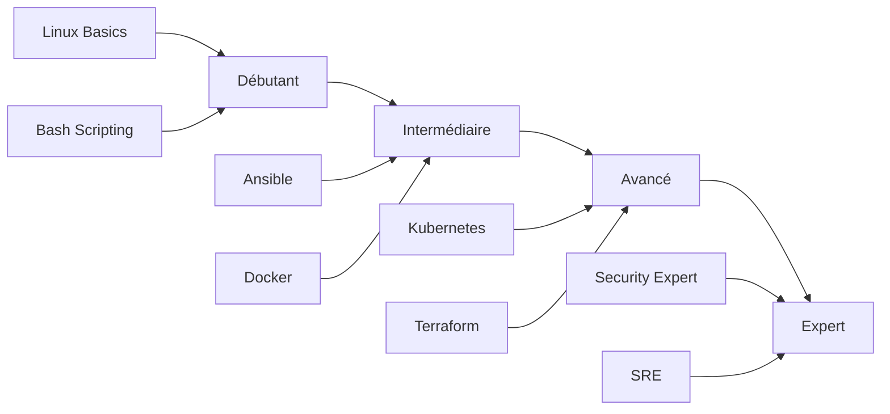

---
tags:
  - quick-start
  - navigation
  - onboarding
---

# Quick Start

Bienvenue sur ShellBook ! Ce guide vous oriente vers les ressources les plus pertinentes selon votre profil et vos besoins.

## Choisissez Votre Parcours

### Par Rôle Professionnel

| Rôle | Description | Lien |
|------|-------------|------|
| **Linux SysAdmin** | Administration système Linux, scripts Bash, monitoring | [Commencer →](linux-sysadmin.md) |
| **Windows Admin** | PowerShell, Active Directory, GPO, administration Windows | [Commencer →](windows-admin.md) |
| **DevOps Engineer** | CI/CD, conteneurs, IaC, Kubernetes, automatisation | [Commencer →](devops-engineer.md) |
| **Security Analyst** | Pentesting, hardening, forensics, compliance | [Commencer →](security-analyst.md) |

---

## Accès Rapide par Besoin

### Je veux une référence rapide

Les **cheatsheets** condensent les commandes essentielles sur une page :

- [SSH Cheatsheet](../linux/cheatsheet-ssh.md) - Tunnels, clés, configurations
- [Systemd Cheatsheet](../linux/cheatsheet-systemd.md) - Services, journald, timers
- [Ansible Cheatsheet](../devops/ansible/cheatsheet-ansible.md) - Playbooks, modules, patterns
- [Git Cheatsheet](../devops/git-cheatsheet-visual.md) - Commandes visuelles

### Je dois résoudre un problème urgent

Les **playbooks** fournissent des procédures étape par étape :

- [System Recovery](../linux/boot-and-services.md) - Récupération système
- [Network Troubleshooting](../linux/rhel-ops-audit.md) - Diagnostic réseau
- [Security Audit](../scripts/bash/security-audit.md) - Audit de sécurité

### Je veux automatiser une tâche

Les **scripts prêts à l'emploi** par catégorie :

| Catégorie | Scripts |
|-----------|---------|
| **Audit** | [Server Audit](../scripts/bash/server-discovery-audit.md), [Compliance Check](../scripts/bash/compliance-checker.md) |
| **Backup** | [Backup Validator](../scripts/python/backup_validator.md), [Backup Directory](../scripts/bash/backup-directory.md) |
| **Monitoring** | [Log Analyzer](../scripts/bash/log-analyzer.md), [Health Check](../scripts/bash/health-check.md) |
| **Security** | [Security Audit](../scripts/bash/security-audit.md), [Secret Scanner](../scripts/bash/secret-scanner.md) |

### Je veux me former

Les **formations structurées** par niveau :

Voir les [parcours de formation complets](../formations/index.md).

---

## Navigation Rapide

| Section | Contenu |
|---------|---------|
| [🛠️ Ops Center](../scripts/index.md) | Scripts, outils, automatisation |
| [🐧 Linux](../linux/index.md) | Administration système Linux |
| [🪟 Windows](../windows/index.md) | PowerShell, AD, administration Windows |
| [☁️ DevOps & Cloud](../devops/index.md) | CI/CD, conteneurs, cloud |
| [🗄️ Data & Infra](../databases/index.md) | Bases de données, réseau |
| [🔒 Sécurité](../security/index.md) | Pentesting, hardening, forensics |
| [🎓 Formations](../formations/index.md) | Parcours d'apprentissage |
| [📚 Concepts](../concepts/index.md) | Théorie et architecture |

---

## Besoin d'Aide ?

- **Recherche** : Utilisez `Ctrl+K` pour rechercher dans toute la documentation
- **Tags** : Chaque page est taguée pour faciliter la découverte
- **Navigation** : Les liens "Module Précédent/Suivant" dans les formations

