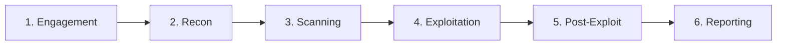

---
tags:
  - quick-start
  - security
  - pentesting
  - parcours
---

# Parcours Security Analyst

Guide de démarrage rapide pour les analystes sécurité, pentesters et SOC analysts.

## Votre Boîte à Outils Essentielle

### Cheatsheets Indispensables

| Cheatsheet | Usage |
|------------|-------|
| [Red Team Cheatsheet](../security/red-team-cheatsheet.md) | Pentesting, exploitation |
| [OSINT](../security/osint.md) | Open Source Intelligence |
| [WiFi Hacking](../security/wifi-hacking.md) | Audit wireless |
| [Steganography](../security/steganography.md) | Données cachées |

### Scripts Prêts à l'Emploi

```bash
# Audit de sécurité système
./security-audit.sh

# Scan de secrets
./secret-scanner.sh /path/to/repo

# Vérification conformité
./compliance-checker.sh
```

- [Security Audit](../scripts/bash/security-audit.md) - Audit de sécurité
- [Secret Scanner](../scripts/bash/secret-scanner.md) - Détection de secrets
- [Compliance Checker](../scripts/bash/compliance-checker.md) - Audit conformité

---

## Parcours d'Apprentissage Recommandé

### Niveau 1 : Fondamentaux Sécurité


1. **Bases Réseau**
   - Protocoles TCP/IP, DNS, HTTP
   - Analyse de trafic Wireshark

2. **SELinux**
   - [SELinux](../linux/rhel-security-selinux.md)
   - Contextes, policies

3. **Linux Hardening**
   - [Linux Hardening](../formations/linux-hardening/index.md)
   - Sécurisation systèmes

### Niveau 2 : Offensive Security

4. **Reconnaissance**
   - [OSINT](../security/osint.md)
   - Footprinting, enumeration

5. **Exploitation**
   - [Buffer Overflow](../security/buffer-overflow.md)
   - [Red Team Techniques](../security/red-team-cheatsheet.md)

6. **WiFi Hacking**
   - [WiFi Hacking](../security/wifi-hacking.md)
   - Audit wireless

### Niveau 3 : Blue Team & Forensics

7. **Digital Forensics**
   - [Digital Forensics](../security/digital-forensics.md)
   - Memory analysis, disk forensics

8. **GitOps Secrets**
   - [GitOps Secrets](../security/gitops-secrets.md)
   - Gestion des secrets

9. **Risk Management**
   - [Risk Management](../security/risk-management.md)
   - Gestion des risques

---

## Formation Structurée

Pour un apprentissage progressif et complet :

| Formation | Modules | Niveau |
|-----------|---------|--------|
| [Hacking Mastery](../formations/hacking-mastery/index.md) | 15+ modules | Tous niveaux |
| [Linux Hardening](../formations/linux-hardening/index.md) | 10 modules | Intermédiaire |
| [Windows Hardening](../formations/windows-hardening/index.md) | 8 modules | Intermédiaire |
| [PKI Certificates](../formations/pki-certificates/index.md) | 8 modules | Avancé |

---

## Méthodologies

### Pentesting (PTES)



### Incident Response (NIST)


---

## Commandes Essentielles

### Reconnaissance

```bash
# DNS enumeration
dig axfr @dns-server domain.com
dnsrecon -d domain.com -t std

# Subdomain discovery
subfinder -d domain.com -o subdomains.txt

# Port scanning
nmap -sC -sV -oA scan 192.168.1.0/24

# Web enumeration
gobuster dir -u http://target -w /usr/share/wordlists/dirb/common.txt
```

### Exploitation

```bash
# Metasploit
msfconsole
use exploit/multi/handler
set payload windows/meterpreter/reverse_tcp

# SQLMap
sqlmap -u "http://target/page?id=1" --dbs

# Hydra brute force
hydra -l admin -P passwords.txt ssh://target
```

### Forensics

```bash
# Memory dump analysis (Volatility)
volatility -f memory.dmp --profile=Win10x64 pslist
volatility -f memory.dmp --profile=Win10x64 netscan

# Disk forensics
autopsy /path/to/image.dd

# Log analysis
grep -r "Failed password" /var/log/auth.log
```

---

## Outils par Catégorie

| Catégorie | Outils |
|-----------|--------|
| **Recon** | Nmap, Masscan, Recon-ng, theHarvester |
| **Web** | Burp Suite, OWASP ZAP, Nikto, SQLMap |
| **Exploit** | Metasploit, ExploitDB, Cobalt Strike |
| **Password** | Hashcat, John, Hydra, CeWL |
| **Wireless** | Aircrack-ng, Wifite, Kismet |
| **Forensics** | Volatility, Autopsy, FTK, Sleuth Kit |
| **SIEM** | Splunk, ELK Stack, Wazuh |

---

## Compliance & Frameworks

| Framework | Usage | Ressource |
|-----------|-------|-----------|
| **CIS Benchmarks** | Hardening | [Compliance Checker](../scripts/bash/compliance-checker.md) |
| **NIST CSF** | Risk Management | [Risk Management](../security/risk-management.md) |
| **MITRE ATT&CK** | Threat Intel | [Red Team](../security/red-team-cheatsheet.md) |
| **Linux Hardening** | Sécurisation | [Linux Hardening](../formations/linux-hardening/index.md) |

---

## Techniques Spéciales

| Technique | Description | Ressource |
|-----------|-------------|-----------|
| **Stéganographie** | Données cachées | [Steganography](../security/steganography.md) |
| **Buffer Overflow** | Exploitation mémoire | [Buffer Overflow](../security/buffer-overflow.md) |
| **GitOps Secrets** | Sécurité des secrets | [GitOps Secrets](../security/gitops-secrets.md) |

---

## Ressources Complémentaires

- [Security Reference](../security/index.md) - Référence complète
- [SELinux](../linux/rhel-security-selinux.md) - Hardening Linux
- [Windows Hardening](../formations/windows-hardening/index.md) - Sécurisation Windows

---

| [← DevOps Engineer](devops-engineer.md) | [Quick Start →](index.md) |
|:----------------------------------------|---------------------------|

