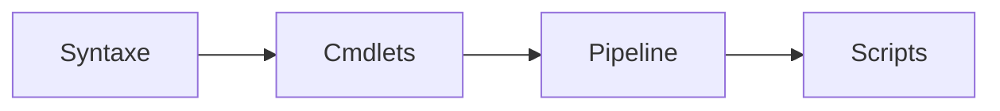

---
tags:
  - quick-start
  - windows
  - powershell
  - parcours
---

# Parcours Windows Admin

Guide de démarrage rapide pour les administrateurs Windows et PowerShell.

## Votre Boîte à Outils Essentielle

### Cheatsheets Indispensables

| Cheatsheet | Usage |
|------------|-------|
| [PowerShell Workshop](../windows/powershell-workshop.md) | Atelier pratique complet |
| [PowerShell Foundations](../windows/powershell-foundations.md) | Bases PowerShell |

### Scripts Prêts à l'Emploi

```powershell
# Test santé Active Directory
.\Test-ADHealth.ps1

# Audit administrateurs locaux
.\Audit-LocalAdmins.ps1

# Vérification mise à jour
.\Get-WindowsUpdateStatus.ps1
```

- [AD Health Check](../scripts/powershell/Test-ADHealth.md) - Santé Active Directory
- [Local Admins Audit](../scripts/powershell/Audit-LocalAdmins.md) - Audit administrateurs
- [Server Audit](../scripts/powershell/Invoke-ServerAudit.md) - Audit serveur

---

## Parcours d'Apprentissage Recommandé

### Niveau 1 : PowerShell Fondamentaux



1. **PowerShell Foundations**
   - [PowerShell Foundations](../windows/powershell-foundations.md)
   - Variables, types, opérateurs

2. **Workshop Pratique**
   - [PowerShell Workshop](../windows/powershell-workshop.md)
   - Exercices progressifs

3. **Productivité**
   - [Productivité Windows](../windows/productivity.md)
   - Raccourcis, outils

### Niveau 2 : Administration Enterprise

4. **Windows Server**
   - [Windows Server Formation](../formations/windows-server/index.md)
   - Rôles, services, administration

5. **Windows Patching**
   - [Windows Patching](../formations/windows-patching/index.md)
   - WSUS, mise à jour

### Niveau 3 : Automatisation Avancée

6. **WSL2**
   - [WSL2](../windows/wsl2.md)
   - Linux sous Windows

7. **Windows Hardening**
   - [Windows Hardening](../formations/windows-hardening/index.md)
   - Sécurisation Windows

---

## Formation Structurée

Pour un apprentissage progressif et complet :

| Formation | Modules | Niveau |
|-----------|---------|--------|
| [Windows Mastery](../formations/windows-mastery/index.md) | 10 modules | Débutant → Avancé |
| [Windows Server](../formations/windows-server/index.md) | 12 modules | Intermédiaire |
| [Windows Hardening](../formations/windows-hardening/index.md) | 8 modules | Avancé |

---

## Tâches Quotidiennes

### Diagnostic Rapide

```powershell
# Services en échec
Get-Service | Where-Object {$_.Status -eq 'Stopped' -and $_.StartType -eq 'Automatic'}

# Espace disque
Get-WmiObject Win32_LogicalDisk | Select DeviceID, @{n='Free(GB)';e={[math]::Round($_.FreeSpace/1GB,2)}}

# Événements erreur récents
Get-EventLog -LogName System -EntryType Error -Newest 20

# Connexions réseau
Get-NetTCPConnection -State Established | Group RemoteAddress

# Dernières connexions AD
Get-ADUser -Filter * -Properties LastLogonDate | Sort LastLogonDate -Descending | Select -First 20
```

### Maintenance AD

```powershell
# Utilisateurs inactifs (90 jours)
$threshold = (Get-Date).AddDays(-90)
Get-ADUser -Filter {LastLogonDate -lt $threshold} -Properties LastLogonDate

# Ordinateurs obsolètes
Get-ADComputer -Filter {LastLogonDate -lt $threshold} -Properties LastLogonDate

# Groupes vides
Get-ADGroup -Filter * | Where {!(Get-ADGroupMember $_)}

# Réplication AD
Get-ADReplicationPartnerMetadata -Target * -Scope Server
```

---

## One-Liners Utiles

```powershell
# Exporter tous les utilisateurs AD
Get-ADUser -Filter * -Properties * | Export-CSV users.csv -NoTypeInformation

# Trouver les comptes verrouillés
Search-ADAccount -LockedOut | Select Name, LockedOut, LastLogonDate

# Lister les GPO non liées
Get-GPO -All | Where {($_ | Get-GPOReport -ReportType XML | Select-String '<LinksTo>').Count -eq 0}

# Tester la connectivité vers tous les DC
Get-ADDomainController -Filter * | ForEach {Test-Connection $_.HostName -Count 1}

# Rapport NTFS permissions
Get-ChildItem -Directory | Get-Acl | Select Path, Owner, AccessToString
```

---

## Ressources Complémentaires

- [Windows Reference](../windows/index.md) - Référence complète
- [Scripts PowerShell](../scripts/powershell/index.md) - Bibliothèque de scripts
- [Windows Hardening](../formations/windows-hardening/index.md) - Sécurisation

---

| [← Linux SysAdmin](linux-sysadmin.md) | [DevOps Engineer →](devops-engineer.md) |
|:--------------------------------------|----------------------------------------:|

