# Network Topology Mapper

Script Python de découverte et cartographie automatique de topologie réseau.

## Description

- **Découverte automatique** : Scan de réseaux et identification des hôtes
- **Identification services** : Détection des ports ouverts et services
- **Traceroute mapping** : Cartographie des chemins réseau
- **Export graphique** : Génération de diagrammes (Mermaid, GraphViz, JSON)
- **SNMP Discovery** : Collecte d'informations via SNMP (optionnel)
- **Inventaire** : Export CSV/JSON de l'inventaire réseau

## Prérequis

```bash
pip install rich scapy pyyaml
# Optionnel pour graphiques avancés
pip install networkx matplotlib
```

## Utilisation

```bash
# Découverte d'un réseau
python network_topology_mapper.py --network 192.168.1.0/24

# Découverte avec scan de ports
python network_topology_mapper.py --network 192.168.1.0/24 --ports

# Export en diagramme Mermaid
python network_topology_mapper.py --network 192.168.1.0/24 --output topology.md --format mermaid

# Export JSON pour intégration
python network_topology_mapper.py --network 192.168.1.0/24 --output topology.json --format json

# Traceroute vers plusieurs destinations
python network_topology_mapper.py --traceroute 8.8.8.8,1.1.1.1

# Mode inventaire complet
python network_topology_mapper.py --network 192.168.1.0/24 --inventory --output inventory.csv
```

## Configuration

Fichier `topology_config.yaml` :

```yaml
networks:
  - 192.168.1.0/24
  - 10.0.0.0/24

scan:
  timeout: 2
  ports: [22, 80, 443, 3389, 5432, 3306]
  threads: 50

snmp:
  enabled: false
  community: public
  version: 2c

output:
  format: mermaid
  include_mac: true
  include_hostname: true
```

## Code Source

```python
#!/usr/bin/env python3
"""
Network Topology Mapper - Automatic network discovery and mapping.

Features:
- Network scanning and host discovery
- Port and service detection
- Traceroute mapping
- Mermaid/GraphViz/JSON export
- CSV inventory export
"""

import socket
import subprocess
import sys
import re
import ipaddress
import concurrent.futures
from dataclasses import dataclass, field
from datetime import datetime
from typing import Optional
from pathlib import Path

try:
    from rich.console import Console
    from rich.table import Table
    from rich.panel import Panel
    from rich.progress import Progress, SpinnerColumn, TextColumn, BarColumn
    import yaml
except ImportError:
    print("Missing dependencies. Install with: pip install rich pyyaml")
    sys.exit(1)

console = Console()

# =============================================================================
# Data Models
# =============================================================================

@dataclass
class NetworkHost:
    """Represents a discovered network host."""
    ip: str
    hostname: str = ""
    mac: str = ""
    vendor: str = ""
    open_ports: list = field(default_factory=list)
    services: dict = field(default_factory=dict)
    os_guess: str = ""
    response_time_ms: float = 0.0
    last_seen: datetime = field(default_factory=datetime.now)

    def to_dict(self) -> dict:
        return {
            "ip": self.ip,
            "hostname": self.hostname,
            "mac": self.mac,
            "vendor": self.vendor,
            "open_ports": self.open_ports,
            "services": self.services,
            "os_guess": self.os_guess,
            "response_time_ms": round(self.response_time_ms, 2),
            "last_seen": self.last_seen.isoformat()
        }


@dataclass
class TracerouteHop:
    """Represents a traceroute hop."""
    hop_number: int
    ip: str
    hostname: str = ""
    rtt_ms: float = 0.0

    def to_dict(self) -> dict:
        return {
            "hop": self.hop_number,
            "ip": self.ip,
            "hostname": self.hostname,
            "rtt_ms": round(self.rtt_ms, 2)
        }


@dataclass
class NetworkTopology:
    """Complete network topology."""
    scan_time: datetime
    networks_scanned: list
    hosts: list = field(default_factory=list)
    routes: dict = field(default_factory=dict)  # destination -> list of hops
    gateway: str = ""

    def to_dict(self) -> dict:
        return {
            "scan_time": self.scan_time.isoformat(),
            "networks_scanned": self.networks_scanned,
            "gateway": self.gateway,
            "host_count": len(self.hosts),
            "hosts": [h.to_dict() for h in self.hosts],
            "routes": {k: [hop.to_dict() for hop in v] for k, v in self.routes.items()}
        }


# =============================================================================
# Network Scanner
# =============================================================================

class NetworkScanner:
    """Network discovery and scanning."""

    # Common service ports
    COMMON_PORTS = {
        21: "ftp", 22: "ssh", 23: "telnet", 25: "smtp", 53: "dns",
        80: "http", 110: "pop3", 143: "imap", 443: "https", 445: "smb",
        993: "imaps", 995: "pop3s", 1433: "mssql", 1521: "oracle",
        3306: "mysql", 3389: "rdp", 5432: "postgresql", 5900: "vnc",
        6379: "redis", 8080: "http-alt", 8443: "https-alt", 27017: "mongodb"
    }

    def __init__(self, config: dict = None):
        self.config = config or {}
        self.timeout = self.config.get("scan", {}).get("timeout", 2)
        self.threads = self.config.get("scan", {}).get("threads", 50)
        self.scan_ports = self.config.get("scan", {}).get("ports", list(self.COMMON_PORTS.keys()))

    def ping_host(self, ip: str) -> Optional[float]:
        """Ping a host and return response time in ms."""
        try:
            # Use platform-appropriate ping
            param = "-n" if sys.platform == "win32" else "-c"
            timeout_param = "-w" if sys.platform == "win32" else "-W"

            result = subprocess.run(
                ["ping", param, "1", timeout_param, str(self.timeout), ip],
                capture_output=True,
                text=True,
                timeout=self.timeout + 1
            )

            if result.returncode == 0:
                # Extract response time
                if sys.platform == "win32":
                    match = re.search(r"time[=<](\d+)ms", result.stdout)
                else:
                    match = re.search(r"time=(\d+\.?\d*)\s*ms", result.stdout)

                if match:
                    return float(match.group(1))
                return 1.0  # Host is up but couldn't parse time

        except (subprocess.TimeoutExpired, Exception):
            pass

        return None

    def resolve_hostname(self, ip: str) -> str:
        """Resolve IP to hostname."""
        try:
            hostname = socket.gethostbyaddr(ip)[0]
            return hostname
        except (socket.herror, socket.gaierror):
            return ""

    def scan_port(self, ip: str, port: int) -> bool:
        """Check if a port is open."""
        try:
            sock = socket.socket(socket.AF_INET, socket.SOCK_STREAM)
            sock.settimeout(self.timeout)
            result = sock.connect_ex((ip, port))
            sock.close()
            return result == 0
        except Exception:
            return False

    def scan_host_ports(self, ip: str, ports: list = None) -> list:
        """Scan multiple ports on a host."""
        ports = ports or self.scan_ports
        open_ports = []

        for port in ports:
            if self.scan_port(ip, port):
                open_ports.append(port)

        return open_ports

    def get_service_name(self, port: int) -> str:
        """Get service name for a port."""
        return self.COMMON_PORTS.get(port, f"unknown-{port}")

    def discover_network(self, network: str, scan_ports: bool = False) -> list:
        """Discover all hosts in a network."""
        hosts = []

        try:
            net = ipaddress.ip_network(network, strict=False)
        except ValueError as e:
            console.print(f"[red]Invalid network: {e}[/red]")
            return hosts

        # Get list of IPs to scan
        ip_list = [str(ip) for ip in net.hosts()]
        total_ips = len(ip_list)

        console.print(f"[blue]Scanning {total_ips} addresses in {network}...[/blue]")

        # Parallel ping scan
        alive_hosts = []

        with Progress(
            SpinnerColumn(),
            TextColumn("[progress.description]{task.description}"),
            BarColumn(),
            TextColumn("[progress.percentage]{task.percentage:>3.0f}%"),
            console=console
        ) as progress:
            task = progress.add_task("Discovering hosts...", total=total_ips)

            with concurrent.futures.ThreadPoolExecutor(max_workers=self.threads) as executor:
                future_to_ip = {executor.submit(self.ping_host, ip): ip for ip in ip_list}

                for future in concurrent.futures.as_completed(future_to_ip):
                    ip = future_to_ip[future]
                    progress.advance(task)

                    try:
                        rtt = future.result()
                        if rtt is not None:
                            alive_hosts.append((ip, rtt))
                    except Exception:
                        pass

        console.print(f"[green]Found {len(alive_hosts)} alive hosts[/green]")

        # Process alive hosts
        with Progress(
            SpinnerColumn(),
            TextColumn("[progress.description]{task.description}"),
            console=console
        ) as progress:
            task = progress.add_task("Gathering host information...", total=len(alive_hosts))

            for ip, rtt in alive_hosts:
                progress.advance(task)

                host = NetworkHost(
                    ip=ip,
                    hostname=self.resolve_hostname(ip),
                    response_time_ms=rtt
                )

                # Port scanning if requested
                if scan_ports:
                    host.open_ports = self.scan_host_ports(ip)
                    host.services = {
                        port: self.get_service_name(port)
                        for port in host.open_ports
                    }

                    # Simple OS guessing based on open ports
                    if 3389 in host.open_ports or 445 in host.open_ports:
                        host.os_guess = "Windows"
                    elif 22 in host.open_ports:
                        host.os_guess = "Linux/Unix"

                hosts.append(host)

        return sorted(hosts, key=lambda h: ipaddress.ip_address(h.ip))

    def get_default_gateway(self) -> str:
        """Get default gateway IP."""
        try:
            if sys.platform == "win32":
                result = subprocess.run(
                    ["route", "print", "0.0.0.0"],
                    capture_output=True,
                    text=True
                )
                # Parse Windows route output
                for line in result.stdout.split("\n"):
                    if "0.0.0.0" in line and "0.0.0.0" != line.split()[0]:
                        parts = line.split()
                        for part in parts:
                            try:
                                ipaddress.ip_address(part)
                                if not part.startswith("0."):
                                    return part
                            except ValueError:
                                continue
            else:
                result = subprocess.run(
                    ["ip", "route", "show", "default"],
                    capture_output=True,
                    text=True
                )
                match = re.search(r"default via (\d+\.\d+\.\d+\.\d+)", result.stdout)
                if match:
                    return match.group(1)
        except Exception:
            pass

        return ""


# =============================================================================
# Traceroute
# =============================================================================

class TracerouteMapper:
    """Traceroute-based path mapping."""

    def __init__(self, max_hops: int = 30, timeout: int = 2):
        self.max_hops = max_hops
        self.timeout = timeout

    def trace(self, destination: str) -> list:
        """Perform traceroute to destination."""
        hops = []

        try:
            if sys.platform == "win32":
                cmd = ["tracert", "-d", "-h", str(self.max_hops), "-w", str(self.timeout * 1000), destination]
            else:
                cmd = ["traceroute", "-n", "-m", str(self.max_hops), "-w", str(self.timeout), destination]

            result = subprocess.run(
                cmd,
                capture_output=True,
                text=True,
                timeout=self.max_hops * self.timeout + 10
            )

            # Parse output
            hop_num = 0
            for line in result.stdout.split("\n"):
                # Match hop lines
                if sys.platform == "win32":
                    match = re.match(r"\s*(\d+)\s+(\d+)\s*ms\s+\d+\s*ms\s+\d+\s*ms\s+(\d+\.\d+\.\d+\.\d+)", line)
                    if not match:
                        match = re.match(r"\s*(\d+)\s+(\*|\d+\s*ms).*?(\d+\.\d+\.\d+\.\d+)", line)
                else:
                    match = re.match(r"\s*(\d+)\s+(\d+\.\d+\.\d+\.\d+)\s+(\d+\.?\d*)\s*ms", line)

                if match:
                    hop_num += 1
                    if sys.platform == "win32":
                        ip = match.group(3)
                        rtt = float(match.group(2).replace(" ms", "").replace("*", "0")) if match.group(2) != "*" else 0
                    else:
                        ip = match.group(2)
                        rtt = float(match.group(3))

                    # Resolve hostname
                    try:
                        hostname = socket.gethostbyaddr(ip)[0]
                    except Exception:
                        hostname = ""

                    hops.append(TracerouteHop(
                        hop_number=hop_num,
                        ip=ip,
                        hostname=hostname,
                        rtt_ms=rtt
                    ))

        except subprocess.TimeoutExpired:
            console.print(f"[yellow]Traceroute to {destination} timed out[/yellow]")
        except Exception as e:
            console.print(f"[red]Traceroute error: {e}[/red]")

        return hops


# =============================================================================
# Export Generators
# =============================================================================

class TopologyExporter:
    """Export topology in various formats."""

    def __init__(self, topology: NetworkTopology):
        self.topology = topology

    def to_mermaid(self) -> str:
        """Generate Mermaid diagram."""
        lines = ["```mermaid", "graph TD"]

        # Add gateway if known
        if self.topology.gateway:
            lines.append(f"    GW[\"🌐 Gateway<br/>{self.topology.gateway}\"]")
            lines.append("    INET((Internet)) --> GW")

        # Group hosts by subnet
        subnets = {}
        for host in self.topology.hosts:
            subnet = ".".join(host.ip.split(".")[:3]) + ".0/24"
            if subnet not in subnets:
                subnets[subnet] = []
            subnets[subnet].append(host)

        # Generate nodes
        for subnet, hosts in subnets.items():
            subnet_id = subnet.replace(".", "_").replace("/", "_")
            lines.append(f"    subgraph {subnet_id}[\"{subnet}\"]")

            for host in hosts:
                node_id = host.ip.replace(".", "_")
                label = host.hostname or host.ip

                # Choose icon based on services/OS
                if host.os_guess == "Windows":
                    icon = "🪟"
                elif 80 in host.open_ports or 443 in host.open_ports:
                    icon = "🌐"
                elif 3306 in host.open_ports or 5432 in host.open_ports:
                    icon = "🗄️"
                elif 22 in host.open_ports:
                    icon = "🐧"
                else:
                    icon = "💻"

                services_str = ", ".join(host.services.values()) if host.services else ""
                lines.append(f"        {node_id}[\"{icon} {label}<br/>{host.ip}<br/>{services_str}\"]")

            lines.append("    end")

            # Connect to gateway
            if self.topology.gateway:
                lines.append(f"    GW --> {subnet_id}")

        # Add routes if available
        for dest, hops in self.topology.routes.items():
            if hops:
                dest_id = dest.replace(".", "_")
                lines.append(f"    DEST_{dest_id}((({dest})))")
                prev_id = "GW" if self.topology.gateway else hops[0].ip.replace(".", "_")

                for hop in hops:
                    hop_id = hop.ip.replace(".", "_")
                    lines.append(f"    {prev_id} -->|{hop.rtt_ms}ms| HOP_{hop_id}[{hop.ip}]")
                    prev_id = f"HOP_{hop_id}"

                lines.append(f"    {prev_id} --> DEST_{dest_id}")

        lines.append("```")
        return "\n".join(lines)

    def to_json(self) -> str:
        """Generate JSON output."""
        import json
        return json.dumps(self.topology.to_dict(), indent=2)

    def to_csv(self) -> str:
        """Generate CSV inventory."""
        lines = ["IP,Hostname,MAC,OS,Open Ports,Services,Response Time (ms),Last Seen"]

        for host in self.topology.hosts:
            ports = ";".join(map(str, host.open_ports))
            services = ";".join(host.services.values())
            lines.append(
                f"{host.ip},{host.hostname},{host.mac},{host.os_guess},"
                f"\"{ports}\",\"{services}\",{host.response_time_ms},{host.last_seen.isoformat()}"
            )

        return "\n".join(lines)

    def to_graphviz(self) -> str:
        """Generate GraphViz DOT format."""
        lines = [
            "digraph NetworkTopology {",
            "    rankdir=TB;",
            "    node [shape=box, style=filled];",
            ""
        ]

        # Add gateway
        if self.topology.gateway:
            lines.append(f'    gateway [label="Gateway\\n{self.topology.gateway}", fillcolor=lightblue];')
            lines.append('    internet [label="Internet", shape=cloud, fillcolor=lightgray];')
            lines.append("    internet -> gateway;")

        # Add hosts
        for host in self.topology.hosts:
            node_id = host.ip.replace(".", "_")
            label = f"{host.hostname or host.ip}\\n{host.ip}"
            if host.services:
                label += f"\\n{', '.join(host.services.values())}"

            color = "lightgreen" if host.os_guess == "Linux/Unix" else "lightyellow" if host.os_guess == "Windows" else "white"
            lines.append(f'    {node_id} [label="{label}", fillcolor={color}];')

            if self.topology.gateway:
                lines.append(f"    gateway -> {node_id};")

        lines.append("}")
        return "\n".join(lines)


# =============================================================================
# Display Functions
# =============================================================================

def display_hosts(hosts: list):
    """Display discovered hosts in a table."""
    table = Table(title="🔍 Discovered Hosts")
    table.add_column("IP Address", style="cyan")
    table.add_column("Hostname", style="green")
    table.add_column("OS", style="yellow")
    table.add_column("Open Ports", style="blue")
    table.add_column("Services")
    table.add_column("RTT", justify="right")

    for host in hosts:
        ports = ", ".join(map(str, host.open_ports[:5]))
        if len(host.open_ports) > 5:
            ports += f" (+{len(host.open_ports) - 5})"

        services = ", ".join(list(host.services.values())[:3])
        if len(host.services) > 3:
            services += "..."

        table.add_row(
            host.ip,
            host.hostname or "-",
            host.os_guess or "-",
            ports or "-",
            services or "-",
            f"{host.response_time_ms:.1f}ms"
        )

    console.print(table)


def display_traceroute(destination: str, hops: list):
    """Display traceroute results."""
    table = Table(title=f"🛤️ Route to {destination}")
    table.add_column("Hop", justify="right", style="dim")
    table.add_column("IP Address", style="cyan")
    table.add_column("Hostname", style="green")
    table.add_column("RTT", justify="right")

    for hop in hops:
        table.add_row(
            str(hop.hop_number),
            hop.ip,
            hop.hostname or "-",
            f"{hop.rtt_ms:.2f}ms"
        )

    console.print(table)


# =============================================================================
# CLI Entry Point
# =============================================================================

def main():
    """Main entry point."""
    import argparse

    parser = argparse.ArgumentParser(
        description="Network Topology Mapper - Automatic network discovery",
        formatter_class=argparse.RawDescriptionHelpFormatter
    )
    parser.add_argument("-n", "--network", help="Network to scan (CIDR notation)")
    parser.add_argument("-c", "--config", help="Configuration file (YAML)")
    parser.add_argument("-p", "--ports", action="store_true",
                        help="Scan for open ports")
    parser.add_argument("-t", "--traceroute", help="Comma-separated destinations for traceroute")
    parser.add_argument("-i", "--inventory", action="store_true",
                        help="Generate inventory mode (CSV)")
    parser.add_argument("-o", "--output", help="Output file path")
    parser.add_argument("-f", "--format",
                        choices=["json", "mermaid", "csv", "graphviz"],
                        default="mermaid",
                        help="Output format (default: mermaid)")
    parser.add_argument("--threads", type=int, default=50,
                        help="Number of scanning threads")
    parser.add_argument("-q", "--quiet", action="store_true",
                        help="Suppress terminal output")
    parser.add_argument("-v", "--version", action="version",
                        version="network-topology-mapper 1.0.0")

    args = parser.parse_args()

    # Load config
    config = {}
    if args.config:
        with open(args.config) as f:
            config = yaml.safe_load(f)

    if args.threads:
        if "scan" not in config:
            config["scan"] = {}
        config["scan"]["threads"] = args.threads

    console.print("[bold blue]🗺️ Network Topology Mapper[/bold blue]\n")

    # Initialize scanner
    scanner = NetworkScanner(config)
    topology = NetworkTopology(
        scan_time=datetime.now(),
        networks_scanned=[],
        gateway=scanner.get_default_gateway()
    )

    if topology.gateway:
        console.print(f"[dim]Default gateway: {topology.gateway}[/dim]\n")

    # Network discovery
    if args.network:
        topology.networks_scanned.append(args.network)
        hosts = scanner.discover_network(args.network, scan_ports=args.ports)
        topology.hosts.extend(hosts)

        if not args.quiet:
            display_hosts(hosts)

    # Traceroute
    if args.traceroute:
        tracer = TracerouteMapper()
        destinations = [d.strip() for d in args.traceroute.split(",")]

        for dest in destinations:
            console.print(f"\n[blue]Tracing route to {dest}...[/blue]")
            hops = tracer.trace(dest)
            topology.routes[dest] = hops

            if not args.quiet:
                display_traceroute(dest, hops)

    # Export
    if args.output or args.inventory:
        exporter = TopologyExporter(topology)

        fmt = "csv" if args.inventory else args.format
        output_path = args.output or f"topology.{fmt}"

        if fmt == "json":
            content = exporter.to_json()
        elif fmt == "mermaid":
            content = exporter.to_mermaid()
        elif fmt == "csv":
            content = exporter.to_csv()
        elif fmt == "graphviz":
            content = exporter.to_graphviz()
        else:
            content = exporter.to_json()

        with open(output_path, "w") as f:
            f.write(content)

        console.print(f"\n[green]Output saved to:[/green] {output_path}")

    # Summary
    if not args.quiet:
        console.print(Panel(
            f"Networks scanned: {len(topology.networks_scanned)}\n"
            f"Hosts discovered: {len(topology.hosts)}\n"
            f"Routes traced: {len(topology.routes)}",
            title="Summary",
            border_style="green"
        ))


if __name__ == "__main__":
    main()
```

## Exemple de Sortie Mermaid

```mermaid
graph TD
    GW["🌐 Gateway<br/>192.168.1.1"]
    INET((Internet)) --> GW

    subgraph 192_168_1_0_24["192.168.1.0/24"]
        192_168_1_10["🐧 srv-web<br/>192.168.1.10<br/>ssh, http, https"]
        192_168_1_20["🗄️ srv-db<br/>192.168.1.20<br/>ssh, postgresql"]
        192_168_1_30["🪟 pc-admin<br/>192.168.1.30<br/>rdp, smb"]
    end

    GW --> 192_168_1_0_24
```



## Cas d'Usage

1. **Audit Infrastructure** : Cartographier un réseau inconnu
2. **Documentation** : Générer des diagrammes automatiques
3. **Inventaire** : Maintenir un inventaire réseau à jour
4. **Troubleshooting** : Analyser les chemins réseau

## Voir Aussi

- [api_health_monitor.py](./api_health_monitor.md) - Monitoring multi-endpoints API
- [system_info.py](./system_info.md) - Informations système complètes
- [cert_checker.py](./cert_checker.md) - Vérification certificats SSL/TLS
