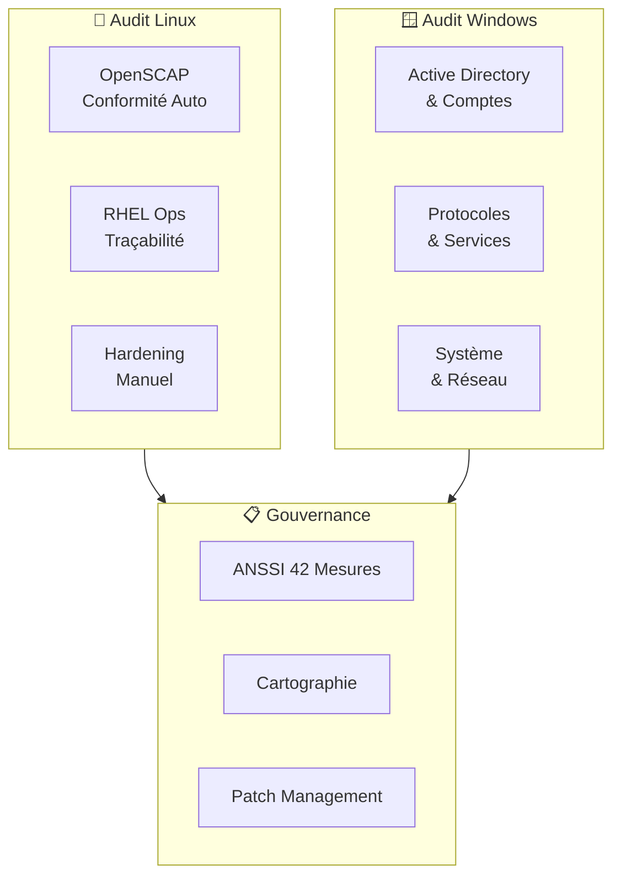

---
tags:
  - security
  - audit
  - compliance
  - openscap
  - anssi
  - hardening
---

# Checklist d'Audit Sécurité

Guide complet pour auditer la conformité et le durcissement des infrastructures Linux et Windows.

---

## Vue d'Ensemble



---

## 1. Audit de Conformité Automatisée (Linux)

L'outil central est **OpenSCAP**, qui vérifie la conformité par rapport aux référentiels ANSSI ou CIS.

### Vérification des Profils Disponibles

```bash
# Lister les profils disponibles
oscap info /usr/share/xml/scap/ssg/content/ssg-rhel9-ds.xml

# Profils principaux :
# - anssi_bp28_minimal    : ANSSI BP-028 Minimal
# - anssi_bp28_intermediary : ANSSI BP-028 Intermédiaire
# - anssi_bp28_enhanced   : ANSSI BP-028 Renforcé (SecNumCloud)
# - cis                   : CIS Benchmark
# - stig                  : DISA STIG
```

!!! tip "Choix du Profil"
    Pour un environnement critique ou SecNumCloud, ciblez le profil **ANSSI BP-028 Enhanced**.

### Lancement du Scan

```bash
# Scan complet avec rapport HTML
oscap xccdf eval \
    --profile anssi_bp28_enhanced \
    --report /tmp/audit-report.html \
    --results /tmp/audit-results.xml \
    /usr/share/xml/scap/ssg/content/ssg-rhel9-ds.xml

# Pour RHEL 8
oscap xccdf eval \
    --profile anssi_bp28_enhanced \
    --report /tmp/audit-report.html \
    /usr/share/xml/scap/ssg/content/ssg-rhel8-ds.xml
```

### Analyse des Résultats

| Statut | Signification | Action |
|--------|---------------|--------|
| ✅ **Pass** | Conforme | Aucune action |
| ❌ **Fail** | Non-conforme | Correction prioritaire |
| ⚠️ **Not Checked** | Vérification manuelle requise | Audit humain |
| ℹ️ **Not Applicable** | Non applicable au contexte | Documenter la justification |

### Génération des Remédiations

```bash
# Générer un playbook Ansible de remédiation
oscap xccdf generate fix \
    --fix-type ansible \
    --profile anssi_bp28_enhanced \
    --output /tmp/remediation-playbook.yml \
    /tmp/audit-results.xml

# Générer un script Bash de remédiation
oscap xccdf generate fix \
    --fix-type bash \
    --profile anssi_bp28_enhanced \
    --output /tmp/remediation.sh \
    /tmp/audit-results.xml
```

!!! warning "Revue Obligatoire"
    **Ne jamais appliquer les remédiations automatiques sans revue !**
    Certaines corrections peuvent casser la production (services désactivés, permissions modifiées, etc.).

---

## 2. Audit Opérationnel et Traçabilité (RHEL)

Vérifie la visibilité sur l'activité des administrateurs et l'état du système.

### Enregistrement des Sessions (tlog)

```bash
# Vérifier l'installation
rpm -q tlog

# Vérifier la configuration SSSD
grep -A5 "\[session_recording\]" /etc/sssd/sssd.conf

# Configuration attendue :
# [session_recording]
# scope = some
# groups = wheel, admins
```

| Outil | Ce qu'il capture | Usage |
|-------|------------------|-------|
| **auditd** | Appels système (syscalls) | Forensics, détection d'intrusion |
| **tlog** | Entrées/sorties terminal | Conformité SecNumCloud/PCI-DSS |

```bash
# Vérifier que les sessions sont enregistrées
journalctl -t tlog-rec-session --since today

# Rejouer une session
tlog-play -r journal -M TLOG_REC=<session_id>

# Lister les sessions enregistrées
journalctl -t tlog-rec-session -o json | jq -r '.TLOG_REC' | sort -u
```

!!! info "Centralisation"
    Assurez-vous que les sessions sont centralisées vers un serveur syslog ou journald distant pour répondre aux exigences d'audit.

### Profil de Performance (tuned)

```bash
# Vérifier le profil actif
tuned-adm active

# Lister les profils disponibles
tuned-adm list

# Recommandations par rôle :
# - VM générique      : virtual-guest
# - Base de données   : throughput-performance
# - Latence critique  : latency-performance
# - Équilibré         : balanced
```

### État de Santé (sosreport)

```bash
# Générer un rapport complet
sosreport --all-logs

# Rapport ciblé sécurité
sosreport --only-plugins=auditd,firewalld,selinux,ssh,systemd

# Contenu du sosreport :
# - Logs système (/var/log/*)
# - Configuration (/etc/*)
# - État réseau (ip, ss, iptables)
# - Paquets installés (rpm -qa)
```

---

## 3. Audit de Durcissement Manuel (Linux)

Checklist des points non couverts par les scanners automatiques.

### Partitionnement

```bash
# Vérifier les partitions séparées
df -h /tmp /var /var/log /home

# Vérifier les options de montage
mount | grep -E "(/tmp|/var|/home)"

# Options attendues :
# /tmp     : nodev,nosuid,noexec
# /var     : nodev,nosuid
# /var/log : nodev,nosuid,noexec
# /home    : nodev,nosuid
```

| Partition | Options Requises | Justification |
|-----------|------------------|---------------|
| `/tmp` | `nodev,nosuid,noexec` | Empêche l'exécution de binaires |
| `/var` | `nodev,nosuid` | Protection des données variables |
| `/var/log` | `nodev,nosuid,noexec` | Intégrité des logs |
| `/home` | `nodev,nosuid` | Isolation utilisateurs |

### SSH & Accès

```bash
# Audit de la configuration SSH
sshd -T | grep -E "(passwordauthentication|permitrootlogin|pubkeyauthentication|ciphers|macs|kexalgorithms)"
```

| Paramètre | Valeur Attendue | Criticité |
|-----------|-----------------|-----------|
| `PasswordAuthentication` | `no` | 🔴 Critique |
| `PermitRootLogin` | `no` | 🔴 Critique |
| `PubkeyAuthentication` | `yes` | 🟡 Important |
| `X11Forwarding` | `no` | 🟡 Important |
| `PermitEmptyPasswords` | `no` | 🔴 Critique |

```bash
# Algorithmes recommandés (ANSSI)
# KexAlgorithms : curve25519-sha256@libssh.org,diffie-hellman-group16-sha512
# Ciphers : chacha20-poly1305@openssh.com,aes256-gcm@openssh.com
# MACs : hmac-sha2-512-etm@openssh.com,hmac-sha2-256-etm@openssh.com
```

### Réseau & Kernel (sysctl)

```bash
# Script d'audit sysctl
cat << 'EOF' | while read param expected; do
    current=$(sysctl -n $param 2>/dev/null)
    if [ "$current" = "$expected" ]; then
        echo "✅ $param = $current"
    else
        echo "❌ $param = $current (attendu: $expected)"
    fi
done
net.ipv4.ip_forward 0
net.ipv4.conf.all.send_redirects 0
net.ipv4.conf.all.accept_redirects 0
net.ipv4.conf.all.accept_source_route 0
net.ipv4.conf.all.rp_filter 1
net.ipv4.icmp_echo_ignore_broadcasts 1
net.ipv6.conf.all.disable_ipv6 1
kernel.randomize_va_space 2
EOF
```

### Services Inutiles

```bash
# Vérifier les services à désactiver
for svc in cups avahi-daemon bluetooth rpcbind nfs-server vsftpd telnet.socket; do
    status=$(systemctl is-enabled $svc 2>/dev/null || echo "not-found")
    if [ "$status" = "enabled" ]; then
        echo "❌ $svc est activé (devrait être désactivé)"
    elif [ "$status" = "disabled" ]; then
        echo "✅ $svc est désactivé"
    fi
done
```

### Fichiers Critiques

```bash
# Permissions fichiers sensibles
echo "=== Fichiers Sensibles ==="
stat -c "%a %U:%G %n" /etc/shadow /etc/gshadow /etc/passwd /etc/group

# Attendu :
# /etc/shadow  : 000 ou 600, root:root
# /etc/gshadow : 000 ou 600, root:root
# /etc/passwd  : 644, root:root
# /etc/group   : 644, root:root

# Recherche SUID/SGID non justifiés
echo -e "\n=== Fichiers SUID ==="
find / -perm /4000 -type f 2>/dev/null | head -20

echo -e "\n=== Fichiers SGID ==="
find / -perm /2000 -type f 2>/dev/null | head -20

# Fichiers world-writable
echo -e "\n=== World-Writable ==="
find / -perm -002 -type f ! -path "/proc/*" ! -path "/sys/*" 2>/dev/null | head -20
```

---

## 4. Audit de Sécurité Windows Server

### Active Directory & Comptes

#### Tiering Model

```powershell
# Vérifier la structure des OUs d'administration
Get-ADOrganizationalUnit -Filter 'Name -like "*Admin*" -or Name -like "*Tier*"' |
    Select-Object Name, DistinguishedName

# Comptes T0 (Domain/Enterprise Admins) ne doivent JAMAIS se connecter aux serveurs T1/T2
```

| Tier | Périmètre | Exemples |
|------|-----------|----------|
| **T0** | Contrôleurs de domaine | Domain Admins, Enterprise Admins |
| **T1** | Serveurs membres | Server Admins, SQL Admins |
| **T2** | Postes de travail | Helpdesk, Desktop Admins |

#### LAPS (Local Administrator Password Solution)

```powershell
# Vérifier si LAPS est déployé
Get-ADComputer -Filter * -Properties ms-Mcs-AdmPwd |
    Where-Object { $_.'ms-Mcs-AdmPwd' -ne $null } |
    Measure-Object

# Vérifier l'expiration des mots de passe LAPS
Get-ADComputer -Filter * -Properties ms-Mcs-AdmPwdExpirationTime |
    Select-Object Name, @{N='Expiration';E={[DateTime]::FromFileTime($_.'ms-Mcs-AdmPwdExpirationTime')}}
```

#### Groupes Privilégiés

```powershell
# Audit des groupes critiques
$criticalGroups = @(
    "Domain Admins",
    "Enterprise Admins",
    "Schema Admins",
    "Administrators",
    "Account Operators",
    "Backup Operators"
)

foreach ($group in $criticalGroups) {
    $members = Get-ADGroupMember -Identity $group -ErrorAction SilentlyContinue
    Write-Host "`n=== $group ===" -ForegroundColor Yellow
    $members | Select-Object Name, objectClass, SamAccountName
}
```

### Protocoles & Services

#### SMB

```powershell
# Vérifier SMBv1 (doit être désactivé)
Get-WindowsOptionalFeature -Online -FeatureName SMB1Protocol

# Vérifier la signature SMB
Get-SmbServerConfiguration | Select-Object EnableSecuritySignature, RequireSecuritySignature

# Vérifier le chiffrement SMB
Get-SmbServerConfiguration | Select-Object EncryptData, RejectUnencryptedAccess
```

| Paramètre | Valeur Attendue | Criticité |
|-----------|-----------------|-----------|
| SMB1Protocol | `Disabled` | 🔴 Critique |
| RequireSecuritySignature | `True` | 🔴 Critique |
| EncryptData | `True` | 🟡 Important |

#### Protocoles Legacy

```powershell
# LLMNR (doit être désactivé via GPO)
# Chemin GPO : Computer > Admin Templates > Network > DNS Client > Turn off multicast name resolution

# NetBIOS over TCP/IP (désactiver par interface)
Get-NetAdapter | ForEach-Object {
    $config = Get-WmiObject Win32_NetworkAdapterConfiguration -Filter "Index=$($_.ifIndex)"
    [PSCustomObject]@{
        Adapter = $_.Name
        NetBIOSEnabled = $config.TcpipNetbiosOptions -ne 2
    }
}

# TLS 1.0/1.1 (vérifier dans le registre)
Get-ItemProperty -Path 'HKLM:\SYSTEM\CurrentControlSet\Control\SecurityProviders\SCHANNEL\Protocols\TLS 1.0\Server' -ErrorAction SilentlyContinue
Get-ItemProperty -Path 'HKLM:\SYSTEM\CurrentControlSet\Control\SecurityProviders\SCHANNEL\Protocols\TLS 1.1\Server' -ErrorAction SilentlyContinue
```

### Script d'Audit Rapide Windows

```powershell
# check-hardening.ps1
# Script d'audit de durcissement Windows

Write-Host "=== AUDIT DURCISSEMENT WINDOWS ===" -ForegroundColor Cyan
Write-Host ""

# 1. SMB
Write-Host "[SMB]" -ForegroundColor Yellow
$smb1 = Get-WindowsOptionalFeature -Online -FeatureName SMB1Protocol -ErrorAction SilentlyContinue
if ($smb1.State -eq "Disabled") {
    Write-Host "  ✅ SMBv1 désactivé" -ForegroundColor Green
} else {
    Write-Host "  ❌ SMBv1 activé (CRITIQUE)" -ForegroundColor Red
}

$smbConfig = Get-SmbServerConfiguration
if ($smbConfig.RequireSecuritySignature) {
    Write-Host "  ✅ Signature SMB requise" -ForegroundColor Green
} else {
    Write-Host "  ❌ Signature SMB non requise" -ForegroundColor Red
}

# 2. Firewall
Write-Host "`n[FIREWALL]" -ForegroundColor Yellow
$profiles = Get-NetFirewallProfile
foreach ($profile in $profiles) {
    if ($profile.Enabled) {
        Write-Host "  ✅ Profil $($profile.Name) activé" -ForegroundColor Green
    } else {
        Write-Host "  ❌ Profil $($profile.Name) désactivé" -ForegroundColor Red
    }
}

# 3. RDP NLA
Write-Host "`n[RDP]" -ForegroundColor Yellow
$rdp = Get-ItemProperty -Path 'HKLM:\SYSTEM\CurrentControlSet\Control\Terminal Server\WinStations\RDP-Tcp' -Name UserAuthentication -ErrorAction SilentlyContinue
if ($rdp.UserAuthentication -eq 1) {
    Write-Host "  ✅ NLA (Network Level Authentication) activé" -ForegroundColor Green
} else {
    Write-Host "  ❌ NLA désactivé" -ForegroundColor Red
}

# 4. Windows Defender
Write-Host "`n[DEFENDER]" -ForegroundColor Yellow
$defender = Get-MpComputerStatus -ErrorAction SilentlyContinue
if ($defender) {
    if ($defender.RealTimeProtectionEnabled) {
        Write-Host "  ✅ Protection temps réel activée" -ForegroundColor Green
    } else {
        Write-Host "  ❌ Protection temps réel désactivée" -ForegroundColor Red
    }
    if ($defender.AntivirusEnabled) {
        Write-Host "  ✅ Antivirus activé" -ForegroundColor Green
    } else {
        Write-Host "  ❌ Antivirus désactivé" -ForegroundColor Red
    }
} else {
    Write-Host "  ⚠️ Impossible de récupérer l'état de Defender" -ForegroundColor Yellow
}

# 5. Services critiques
Write-Host "`n[SERVICES A DESACTIVER]" -ForegroundColor Yellow
$badServices = @("SNMP", "Telnet", "RemoteRegistry")
foreach ($svc in $badServices) {
    $service = Get-Service -Name $svc -ErrorAction SilentlyContinue
    if ($service -and $service.Status -eq "Running") {
        Write-Host "  ❌ $svc en cours d'exécution" -ForegroundColor Red
    } else {
        Write-Host "  ✅ $svc arrêté/inexistant" -ForegroundColor Green
    }
}

Write-Host "`n=== FIN AUDIT ===" -ForegroundColor Cyan
```

---

## 5. Gouvernance et Hygiène (ANSSI)

Audit par rapport aux **42 mesures d'hygiène** de l'ANSSI.

### Cartographie

| Question | Oui/Non | Preuves |
|----------|---------|---------|
| Inventaire exhaustif des actifs ? | | |
| Cartographie des flux réseau ? | | |
| Matrice des flux autorisés ? | | |
| Identification des données sensibles ? | | |

### Cloisonnement

| Question | Oui/Non | Preuves |
|----------|---------|---------|
| Réseau d'administration dédié ? | | |
| VLANs par zone de confiance ? | | |
| Filtrage inter-zones ? | | |
| Bastion/Jump server pour l'accès admin ? | | |

### Mise à Jour (Patch Management)

| Question | Oui/Non | Preuves |
|----------|---------|---------|
| Procédure de patch documentée ? | | |
| Délai max d'application des patchs critiques ? | | |
| Environnement de test avant prod ? | | |
| Rollback possible ? | | |

### Niveaux de Recommandations ANSSI

| Niveau | Description | Obligation |
|--------|-------------|------------|
| **R** | Recommandation standard | Obligatoire |
| **R+** | Recommandation renforcée | Pour environnements sensibles |
| **R-** | Mesure compensatoire | Si R impossible, documenter |

---

## Checklist Récapitulative

### Linux

- [ ] Scan OpenSCAP avec profil ANSSI BP-028
- [ ] Analyse des résultats (Fail, Not Checked)
- [ ] tlog configuré et sessions centralisées
- [ ] Profil tuned adapté au rôle
- [ ] sosreport généré et archivé
- [ ] Partitions séparées avec options de montage
- [ ] SSH durci (clés, no root, algos forts)
- [ ] sysctl sécurisé (rp_filter, no redirects)
- [ ] Services inutiles désactivés
- [ ] Permissions fichiers sensibles vérifiées
- [ ] SUID/SGID audités

### Windows

- [ ] Tiering Model implémenté
- [ ] LAPS déployé
- [ ] Groupes privilégiés audités
- [ ] SMBv1 désactivé
- [ ] Signature/Chiffrement SMB activés
- [ ] LLMNR/NetBIOS désactivés
- [ ] TLS 1.0/1.1 désactivés
- [ ] Firewall actif tous profils
- [ ] NLA activé pour RDP
- [ ] Defender actif avec protection temps réel

### Gouvernance

- [ ] Inventaire des actifs à jour
- [ ] Cartographie des flux documentée
- [ ] Réseau d'administration cloisonné
- [ ] Procédure de patch management
- [ ] Conformité ANSSI 42 mesures évaluée

---

## Voir Aussi

- [OpenSCAP Compliance](../linux/rhel-openscap-compliance.md) - Guide OpenSCAP détaillé
- [RHEL Ops Audit](../linux/rhel-ops-audit.md) - Audit opérationnel RHEL
- [SSH Hardening](../linux/ssh-hardening.md) - Durcissement SSH
- [SecNumCloud](secnumcloud.md) - Référentiel SecNumCloud
- [Guides ANSSI](anssi-guides.md) - Recommandations ANSSI
