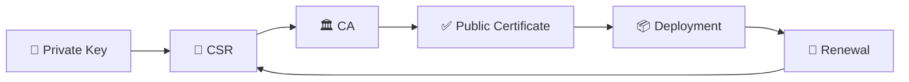
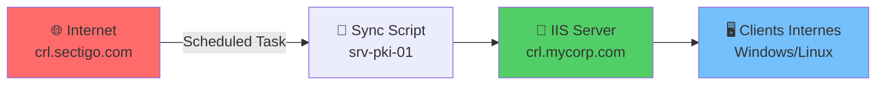

# OpenSSL & Gestion du Cycle de Vie des Certificats

`#openssl` `#pki` `#anssi` `#secnumcloud`

Une référence complète pour gérer les certificats X.509 dans les environnements SecNumCloud.

---

## Vue d'ensemble du Cycle de Vie des Certificats



---

!!! danger "Sécurité Critique"
    La **Private Key** ne doit **JAMAIS** quitter le serveur sécurisé où elle a été générée.
    Ne transmettez jamais les clés privées par email, chat, ou canaux non chiffrés.
    Stockez les clés avec des permissions restrictives : `chmod 600`.

!!! info "Standards ANSSI"
    Selon les recommandations ANSSI pour SecNumCloud :

    - **RSA** : Minimum **3072 bits** (4096 recommandé)
    - **ECDSA** : Minimum courbe **P-256** (P-384 recommandé)
    - **Hash** : SHA-256 minimum (SHA-384/512 pour long terme)
    - **Validité** : Maximum 1 an pour les certificats publics

---

## Générer une Private Key

=== "Bash (Linux)"

    ```bash
    # RSA 4096 bits
    openssl genrsa -aes256 -out private.key 4096

    # ECDSA P-384 (recommandé)
    openssl ecparam -genkey -name secp384r1 | openssl ec -aes256 -out private-ec.key
    ```

=== "PowerShell (Windows)"

    ```powershell
    # Utiliser OpenSSL sur Windows
    openssl genrsa -aes256 -out private.key 4096

    # Utiliser certreq natif (générer avec fichier INF)
    certreq -new request.inf private.key
    ```

---

## Générer un CSR (Certificate Signing Request)

=== "Bash (Linux)"

    ```bash
    openssl req -new -key private.key -out request.csr \
        -subj "/C=FR/ST=IDF/L=Paris/O=MyCompany/OU=IT/CN=server.example.com"
    ```

=== "PowerShell (Windows)"

    ```powershell
    # Utiliser OpenSSL
    openssl req -new -key private.key -out request.csr `
        -subj "/C=FR/ST=IDF/L=Paris/O=MyCompany/OU=IT/CN=server.example.com"

    # Utiliser certreq avec template INF
    certreq -new csr_template.inf request.csr
    ```

??? note "Template CSR pour Windows (csr_template.inf)"
    ```ini
    [Version]
    Signature="$Windows NT$"

    [NewRequest]
    Subject = "CN=server.example.com,O=MyCompany,L=Paris,C=FR"
    KeySpec = 1
    KeyLength = 4096
    HashAlgorithm = SHA256
    MachineKeySet = TRUE
    Exportable = FALSE
    ```

---

## Aide-mémoire OpenSSL

| Tâche | Commande |
|------|---------|
| Vérifier l'expiration du certificat | `openssl x509 -enddate -noout -in cert.pem` |
| Voir les détails du certificat | `openssl x509 -text -noout -in cert.pem` |
| Vérifier le contenu du CSR | `openssl req -text -noout -in request.csr` |
| Vérifier que la clé correspond au certificat | `openssl x509 -modulus -noout -in cert.pem \| md5sum` |
| Convertir PEM vers PFX/PKCS12 | `openssl pkcs12 -export -out cert.pfx -inkey key.pem -in cert.pem` |
| Convertir PFX vers PEM | `openssl pkcs12 -in cert.pfx -out cert.pem -nodes` |
| Vérifier le certificat distant | `openssl s_client -connect host:443 -servername host` |
| Vérifier la chaîne de certificats | `openssl verify -CAfile ca-bundle.crt cert.pem` |

---

## Script de Vérification Rapide

=== "Bash (Linux)"

    ```bash
    #!/bin/bash
    # Vérifier l'expiration du certificat
    CERT="$1"
    EXPIRY=$(openssl x509 -enddate -noout -in "$CERT" | cut -d= -f2)
    EXPIRY_EPOCH=$(date -d "$EXPIRY" +%s)
    NOW_EPOCH=$(date +%s)
    DAYS_LEFT=$(( (EXPIRY_EPOCH - NOW_EPOCH) / 86400 ))

    echo "Le certificat expire dans $DAYS_LEFT jours"
    [[ $DAYS_LEFT -lt 30 ]] && echo "⚠️  ATTENTION : Renouvellement requis bientôt !"
    ```

=== "PowerShell (Windows)"

    ```powershell
    # Vérifier l'expiration du certificat
    param([string]$CertPath)
    $cert = New-Object System.Security.Cryptography.X509Certificates.X509Certificate2($CertPath)
    $daysLeft = ($cert.NotAfter - (Get-Date)).Days

    Write-Host "Le certificat expire dans $daysLeft jours"
    if ($daysLeft -lt 30) { Write-Warning "Renouvellement requis bientôt !" }
    ```

---

## Gestion des CRL (Certificate Revocation Lists)

### Pourquoi un Miroir CRL Interne ?

Dans les infrastructures sécurisées (SecNumCloud, réseaux isolés), les serveurs **ne doivent pas** accéder directement à Internet.

**Problème :** Les certificats émis par des CA publiques (Sectigo, DigiCert, GlobalSign) contiennent des **CDP (CRL Distribution Points)** pointant vers Internet :

```text
X509v3 CRL Distribution Points:
    Full Name:
      URI:http://crl.sectigo.com/SectigoRSADomainValidationCA.crl
```

**Solution :** Héberger un **miroir CRL interne** synchronisé automatiquement.



!!! tip "Cas d'Usage"
    - **SecNumCloud** : Isolation réseau obligatoire
    - **DMZ** : Serveurs sans accès Internet direct
    - **Air-Gapped** : Réseaux complètement déconnectés
    - **Performance** : Éviter la latence vers des CDN externes

---

### Architecture du Miroir CRL

**Composants nécessaires :**

| Composant | Rôle |
|-----------|------|
| **srv-pki-01** | Serveur Windows avec IIS pour héberger les CRL |
| **Scheduled Task** | Tâche planifiée pour télécharger les CRL externes (toutes les 6h) |
| **Script PowerShell** | `Sync-ExternalCRL.ps1` pour automatiser la synchronisation |
| **DNS Interne** | Enregistrement `crl.mycorp.com` pointant vers `srv-pki-01` |
| **GPO** | Redirection des CDP via `certutil -setreg` |

---

### Script d'Automatisation : Sync-ExternalCRL.ps1

=== "PowerShell"

    ```powershell
    <#
    .SYNOPSIS
        Synchronise les CRL externes (Sectigo, DigiCert, etc.) vers IIS interne.

    .DESCRIPTION
        Script exécuté toutes les 6h via Scheduled Task.
        Télécharge les CRL depuis Internet et les publie sur crl.mycorp.com.

    .NOTES
        Auteur : PKI Team MyCorp
        Prérequis : IIS installé avec Virtual Directory "/crl"
    #>

    # Configuration
    $CRLSources = @(
        @{
            Name = "Sectigo RSA DV CA"
            URL  = "http://crl.sectigo.com/SectigoRSADomainValidationCA.crl"
            File = "SectigoRSADomainValidationCA.crl"
        },
        @{
            Name = "DigiCert Global Root G2"
            URL  = "http://crl3.digicert.com/DigiCertGlobalRootG2.crl"
            File = "DigiCertGlobalRootG2.crl"
        },
        @{
            Name = "GlobalSign RSA OV SSL CA 2018"
            URL  = "http://crl.globalsign.com/gsrsaovsslca2018.crl"
            File = "gsrsaovsslca2018.crl"
        }
    )

    $CRLDestination = "C:\inetpub\wwwroot\crl"
    $LogFile = "C:\Logs\CRL-Sync.log"

    # Fonction de logging
    function Write-Log {
        param([string]$Message)
        $timestamp = Get-Date -Format "yyyy-MM-dd HH:mm:ss"
        Add-Content -Path $LogFile -Value "[$timestamp] $Message"
        Write-Host "[$timestamp] $Message"
    }

    # Créer le répertoire de destination si inexistant
    if (-not (Test-Path $CRLDestination)) {
        New-Item -ItemType Directory -Path $CRLDestination -Force | Out-Null
        Write-Log "Création du répertoire : $CRLDestination"
    }

    # Boucle de téléchargement
    foreach ($CRL in $CRLSources) {
        try {
            Write-Log "Téléchargement de $($CRL.Name) depuis $($CRL.URL)..."

            $DestPath = Join-Path $CRLDestination $CRL.File
            $TempPath = Join-Path $env:TEMP $CRL.File

            # Télécharger dans TEMP d'abord
            Invoke-WebRequest -Uri $CRL.URL -OutFile $TempPath -UseBasicParsing -TimeoutSec 30

            # Vérifier la validité du fichier CRL
            $ValidateOutput = certutil -dump $TempPath 2>&1
            if ($LASTEXITCODE -eq 0) {
                # CRL valide, copier vers IIS
                Copy-Item -Path $TempPath -Destination $DestPath -Force

                # Extraire la date de prochaine publication
                $NextUpdate = ($ValidateOutput | Select-String "NextUpdate:").ToString().Split(":")[1].Trim()
                Write-Log "✅ $($CRL.Name) synchronisé avec succès (Next Update: $NextUpdate)"
            } else {
                Write-Log "❌ ERREUR : CRL invalide pour $($CRL.Name)"
            }

            # Nettoyage
            Remove-Item -Path $TempPath -Force -ErrorAction SilentlyContinue

        } catch {
            Write-Log "❌ ERREUR lors du téléchargement de $($CRL.Name) : $($_.Exception.Message)"
        }
    }

    Write-Log "Synchronisation CRL terminée."
    ```

=== "Scheduled Task (création)"

    ```powershell
    # Créer la Scheduled Task pour exécuter le script toutes les 6h
    $Action = New-ScheduledTaskAction -Execute "powershell.exe" `
        -Argument "-NoProfile -ExecutionPolicy Bypass -File C:\Scripts\Sync-ExternalCRL.ps1"

    $Trigger = New-ScheduledTaskTrigger -Once -At (Get-Date) -RepetitionInterval (New-TimeSpan -Hours 6)

    $Principal = New-ScheduledTaskPrincipal -UserId "SYSTEM" -LogonType ServiceAccount -RunLevel Highest

    $Settings = New-ScheduledTaskSettingsSet -ExecutionTimeLimit (New-TimeSpan -Minutes 15) `
        -RestartCount 3 -RestartInterval (New-TimeSpan -Minutes 5)

    Register-ScheduledTask -TaskName "CRL-Sync" `
        -Action $Action `
        -Trigger $Trigger `
        -Principal $Principal `
        -Settings $Settings `
        -Description "Synchronise les CRL externes vers le miroir interne IIS"
    ```

---

### Configuration IIS

**Étapes pour publier les CRL sur IIS :**

```powershell
# 1. Installer IIS (si non présent)
Install-WindowsFeature -Name Web-Server -IncludeManagementTools

# 2. Créer le Virtual Directory "/crl"
Import-Module WebAdministration
New-WebVirtualDirectory -Site "Default Web Site" -Name "crl" -PhysicalPath "C:\inetpub\wwwroot\crl"

# 3. Configurer MIME Types pour .crl
Add-WebConfigurationProperty -PSPath "IIS:\Sites\Default Web Site\crl" `
    -Filter "system.webServer/staticContent" `
    -Name "." `
    -Value @{fileExtension='.crl'; mimeType='application/pkix-crl'}

# 4. Autoriser la lecture anonyme
Set-WebConfigurationProperty -PSPath "IIS:\Sites\Default Web Site\crl" `
    -Filter "system.webServer/security/authentication/anonymousAuthentication" `
    -Name "enabled" `
    -Value $true

# 5. Désactiver le cache HTTP (toujours servir la CRL fraîche)
Set-WebConfigurationProperty -PSPath "IIS:\Sites\Default Web Site\crl" `
    -Filter "system.webServer/staticContent" `
    -Name "clientCache.cacheControlMode" `
    -Value "DisableCache"
```

**Test de l'accès :**

```powershell
# Depuis srv-pki-01
Invoke-WebRequest -Uri "http://crl.mycorp.com/crl/SectigoRSADomainValidationCA.crl" -UseBasicParsing

# Depuis un client
curl http://crl.mycorp.com/crl/SectigoRSADomainValidationCA.crl --output test.crl
certutil -dump test.crl
```

---

### Vérification et Validation des CRL

=== "certutil (Windows)"

    ```powershell
    # Vérifier la validité d'un fichier CRL
    certutil -dump SectigoRSADomainValidationCA.crl

    # Sortie attendue :
    # CRL:
    #   Version: 2
    #   Signature Algorithm:
    #       Algorithm ObjectId: 1.2.840.113549.1.1.12 sha384RSA
    #   Issuer:
    #       CN=Sectigo RSA Domain Validation CA
    #       O=Sectigo Limited
    #       C=GB
    #   ThisUpdate: 22/11/2025 08:00:00
    #   NextUpdate: 29/11/2025 07:59:59
    #   CRL Entries: 3421

    # Vérifier qu'un certificat n'est PAS révoqué
    certutil -verify -urlfetch certificate.cer

    # Afficher uniquement les certificats révoqués
    certutil -dump -v SectigoRSADomainValidationCA.crl | Select-String "Serial Number"
    ```

=== "openssl (Linux)"

    ```bash
    # Convertir CRL DER vers PEM (si nécessaire)
    openssl crl -inform DER -in SectigoRSADomainValidationCA.crl -out crl.pem

    # Afficher le contenu de la CRL
    openssl crl -in crl.pem -text -noout

    # Vérifier qu'un certificat est révoqué
    openssl verify -crl_check -CRLfile crl.pem -CAfile ca.crt certificate.crt

    # Extraire la date de validité
    openssl crl -in crl.pem -nextupdate -noout
    # Output: nextUpdate=Nov 29 07:59:59 2025 GMT
    ```

**Commandes de diagnostic utiles :**

| Objectif | Commande |
|----------|----------|
| Taille de la CRL | `certutil -dump crl.crl \| Select-String "CRL Entries"` |
| Vérifier la signature | `certutil -verify crl.crl` |
| Lister les certificats révoqués | `certutil -dump crl.crl \| Select-String -Pattern "Serial Number" -Context 0,2` |
| Forcer le téléchargement CRL | `certutil -urlcache * delete` puis `certutil -verify -urlfetch cert.cer` |

---

### Redirection des CDP via GPO

**Objectif :** Faire pointer les clients Windows vers `crl.mycorp.com` au lieu des CDP externes.

!!! warning "Limitation"
    Cette approche **ne modifie PAS** les CDP déjà écrits dans les certificats.
    Elle force Windows à vérifier d'abord le miroir interne avant Internet.

**Méthode recommandée : Configuration via Registry (GPO)**

```powershell
# Sur srv-dc-01 (contrôleur de domaine)
# Créer une GPO "CRL Mirror Internal"
New-GPO -Name "CRL-Mirror-Internal" -Comment "Redirige les CRL vers crl.mycorp.com"

# Configurer le Registry pour ajouter le miroir comme source prioritaire
Set-GPRegistryValue -Name "CRL-Mirror-Internal" `
    -Key "HKLM\SOFTWARE\Policies\Microsoft\SystemCertificates\ChainEngine\Config" `
    -ValueName "ChainCacheResyncFiletime" `
    -Type DWord `
    -Value 0

# Lier la GPO à l'OU "Servers"
New-GPLink -Name "CRL-Mirror-Internal" -Target "OU=Servers,DC=mycorp,DC=internal"

# Forcer l'application
Invoke-GPUpdate -Computer "srv-web-01" -Force
```

**Alternative : Éditer les certificats lors de l'émission (CA interne)**

Si vous utilisez une **CA Microsoft interne**, modifiez le CDP lors de la configuration :

```powershell
# Sur srv-ca-01 (Certificate Authority)
certutil -setreg CA\CRLPublicationURLs "1:C:\Windows\System32\CertSrv\CertEnroll\%3%8.crl\n2:http://crl.mycorp.com/crl/%3%8.crl"

# Redémarrer les services CA
Restart-Service CertSvc
```

---

### Monitoring et Alerte

**Script de surveillance :** Vérifier que les CRL ne sont pas expirées.

```powershell
# Check-CRL-Freshness.ps1
$CRLFiles = Get-ChildItem "C:\inetpub\wwwroot\crl\*.crl"
$AlertThreshold = 2  # Alerter si expiration dans moins de 2 jours

foreach ($CRLFile in $CRLFiles) {
    $CRLInfo = certutil -dump $CRLFile.FullName 2>&1 | Out-String

    if ($CRLInfo -match "NextUpdate:\s+(.+)") {
        $NextUpdate = [DateTime]::Parse($matches[1])
        $DaysLeft = ($NextUpdate - (Get-Date)).Days

        if ($DaysLeft -lt $AlertThreshold) {
            Write-Warning "⚠️  CRL $($CRLFile.Name) expire dans $DaysLeft jours (Next Update: $NextUpdate)"

            # Envoyer une alerte (exemple avec Event Log)
            Write-EventLog -LogName Application -Source "CRL-Monitor" `
                -EventId 1001 -EntryType Warning `
                -Message "CRL $($CRLFile.Name) expire bientôt : $DaysLeft jours restants"
        } else {
            Write-Host "✅ CRL $($CRLFile.Name) valide encore $DaysLeft jours"
        }
    }
}
```

**Créer la Scheduled Task de monitoring (exécution quotidienne) :**

```powershell
$Action = New-ScheduledTaskAction -Execute "powershell.exe" `
    -Argument "-NoProfile -ExecutionPolicy Bypass -File C:\Scripts\Check-CRL-Freshness.ps1"

$Trigger = New-ScheduledTaskTrigger -Daily -At "09:00"

Register-ScheduledTask -TaskName "CRL-Monitoring" `
    -Action $Action `
    -Trigger $Trigger `
    -User "SYSTEM" `
    -RunLevel Highest
```

---

### Troubleshooting

**Problème 1 : Clients n'utilisent pas le miroir CRL**

```powershell
# Vérifier la résolution DNS
nslookup crl.mycorp.com

# Tester l'accès HTTP
Invoke-WebRequest -Uri "http://crl.mycorp.com/crl/SectigoRSADomainValidationCA.crl"

# Vider le cache CRL local
certutil -urlcache * delete

# Forcer la re-vérification
certutil -verify -urlfetch certificate.cer
```

**Problème 2 : CRL trop volumineuse (> 10 MB)**

Certaines CA publiques (ex: DigiCert) publient des CRL massives.

**Solution :** Utiliser **Delta CRL** (mises à jour incrémentielles).

```powershell
# Télécharger aussi les Delta CRL
$DeltaCRLURL = "http://crl.sectigo.com/SectigoRSADomainValidationCA-delta.crl"
Invoke-WebRequest -Uri $DeltaCRLURL -OutFile "C:\inetpub\wwwroot\crl\SectigoRSADomainValidationCA-delta.crl"
```

**Problème 3 : Erreur "The revocation function was unable to check revocation"**

```powershell
# Désactiver TEMPORAIREMENT la vérification CRL (debugging uniquement)
Set-ItemProperty -Path "HKLM:\SOFTWARE\Microsoft\Cryptography\OID\EncodingType 0\CertDllCreateCertificateChainEngine\Config" `
    -Name "MaxCachedCrlEntrySize" -Value 0xFFFFFFFF

# NE PAS utiliser en production - corrigez le miroir CRL à la place
```

**Logs utiles :**

| Source | Emplacement |
|--------|-------------|
| Logs IIS | `C:\inetpub\logs\LogFiles\W3SVC1\` |
| Logs Scheduled Task | Event Viewer > Task Scheduler > History |
| Logs certificat Windows | Event Viewer > Applications and Services > Microsoft > Windows > CAPI2 |

---

### Checklist de Déploiement

- [ ] **srv-pki-01** installé avec IIS et Virtual Directory `/crl` configuré
- [ ] Script `Sync-ExternalCRL.ps1` déployé dans `C:\Scripts\`
- [ ] Scheduled Task "CRL-Sync" créée (exécution toutes les 6h)
- [ ] DNS interne : enregistrement A `crl.mycorp.com` → IP de srv-pki-01
- [ ] Firewall : autoriser TCP/80 depuis le LAN vers srv-pki-01
- [ ] Test de téléchargement : `curl http://crl.mycorp.com/crl/SectigoRSADomainValidationCA.crl`
- [ ] Vérification avec `certutil -dump` : CRL valide et Next Update correct
- [ ] Script de monitoring `Check-CRL-Freshness.ps1` déployé et testé
- [ ] GPO configurée pour forcer l'utilisation du miroir (si nécessaire)
- [ ] Documentation interne mise à jour avec les URLs du miroir

!!! success "Production Ready"
    Après validation, tous les certificats de l'infrastructure peuvent être vérifiés **sans accès Internet**.
    Le miroir CRL assure la conformité SecNumCloud et réduit la dépendance aux CA externes.
