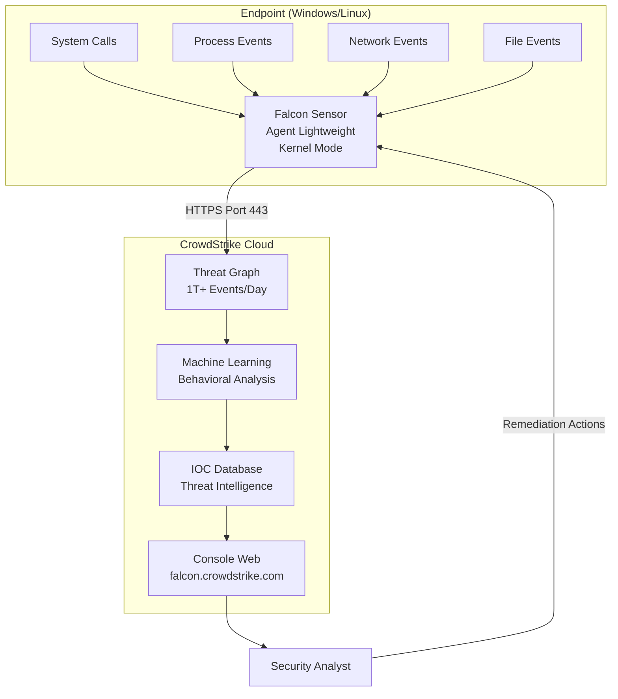

---
tags:
  - edr
  - crowdstrike
  - security
  - endpoint
  - linux
  - windows
---

# CrowdStrike Falcon : Guide EDR & Troubleshooting

**Guide de déploiement et troubleshooting pour SysAdmins & Blue Teams**

---

## 🎯 Introduction : EDR vs Antivirus Traditionnel

### Qu'est-ce qu'un EDR ?

**EDR (Endpoint Detection and Response)** est une évolution majeure par rapport aux antivirus traditionnels :

| Caractéristique | Antivirus Traditionnel | EDR (CrowdStrike Falcon) |
|-----------------|------------------------|--------------------------|
| **Détection** | Signatures de malware | Analyse comportementale + ML |
| **Réponse** | Bloquer/Quarantaine | Investigation + Remédiation |
| **Visibilité** | Fichiers malveillants | Processus, Réseau, Registry, Mémoire |
| **Intelligence** | Base locale | Cloud-native (Threat Graph) |
| **Réaction** | Réactive | Proactive + Prédictive |
| **Forensics** | Limité | Timeline complète des événements |

### Pourquoi CrowdStrike Falcon ?

**CrowdStrike** est le leader du marché EDR selon Gartner (Magic Quadrant) pour plusieurs raisons :

✅ **Cloud-Native** : Pas de serveur on-premise, scalabilité illimitée
✅ **Léger** : Agent <100 MB, impact CPU <1%
✅ **Threat Graph** : 1+ trillion d'événements analysés par jour (IA collective)
✅ **Rapidité** : Détection moyenne en <60 secondes
✅ **Coverage** : Windows, Linux, macOS, Cloud Workloads

**Cas d'usage typiques :**

- 🛡️ Protection endpoint moderne (remplace antivirus legacy)
- 🔍 Investigation post-incident (forensics)
- 🚨 Détection APT (Advanced Persistent Threats)
- 🏢 Conformité SOC2, ISO27001, SecNumCloud

---

## 🏗️ Architecture : Comment Fonctionne Falcon

### Vue d'Ensemble



### Composants Clés

#### 1. **Le Sensor (Agent)**

**Caractéristiques :**

- **Mode Kernel** : Intercepte les syscalls au niveau du noyau (Windows Driver, Linux Kernel Module)
- **Taille** : ~70-100 MB installé
- **Impact Performance** : <1% CPU, <100 MB RAM
- **Persistance** : Service système (démarre avant le logon utilisateur)

**Ce qu'il capture :**

| Type d'Événement | Exemples |
|------------------|----------|
| **Process** | Création/Injection/Termination de processus |
| **Network** | Connexions sortantes, DNS queries, IP/Port |
| **File** | Création, Modification, Suppression (binaires, scripts) |
| **Registry** | Modification de clés (Windows) |
| **Memory** | Injection de code, DLL loading |

#### 2. **Le Cloud (Threat Graph)**

**Falcon est 100% Cloud-Native** : Tout le traitement se passe dans le cloud AWS de CrowdStrike.

**Avantages :**

- Pas de serveur on-premise à maintenir
- Mises à jour instantanées des règles de détection
- Analyse cross-tenant (intelligence collective)
- Scalabilité illimitée

**Threat Graph :**

- **1+ trillion d'événements** analysés par jour
- **Corrélation globale** : Une attaque détectée chez un client A protège automatiquement les clients B, C, D...
- **ML/IA** : Détection de patterns anormaux sans signature

#### 3. **Le CID (Customer ID)**

**Le CID est LA clé critique** pour l'installation du sensor.

| Attribut | Description |
|----------|-------------|
| **Format** | Chaîne alphanumérique 32 caractères (ex: `1234567890ABCDEF1234567890ABCDEF-12`) |
| **Rôle** | Lie l'agent au tenant CrowdStrike du client |
| **Sécurité** | Traité comme un secret (ne jamais publier sur Git/Wiki) |
| **Récupération** | Console Falcon → **Support → Sensor Downloads** |

!!! danger "CID = Secret Critique"
    **Ne JAMAIS hardcoder le CID dans un script public (GitHub, GitLab).**

    ✅ Bonnes pratiques :

    - Stocker dans un vault (HashiCorp Vault, Azure Key Vault)
    - Utiliser une variable d'environnement lors du déploiement
    - Référencer via configuration management (Ansible vault, SCCM variables)

---

## 🐧 Installation Linux (RHEL/Rocky/CentOS/Ubuntu)

### Prérequis

**Système :**

- RHEL/Rocky 8/9, Ubuntu 20.04/22.04
- Kernel supporté par CrowdStrike (vérifier la matrice de compatibilité)
- Accès Internet HTTPS (port 443) vers `*.crowdstrike.com`

**Droits :**

- `root` ou `sudo`

**Fichiers :**

- Package Falcon Sensor (`.rpm` pour RHEL, `.deb` pour Ubuntu)
- **CID** du tenant

### Étape 1 : Télécharger le Package

**Via la Console Falcon :**

1. Se connecter à **https://falcon.crowdstrike.com**
2. **Support** → **Sensor Downloads**
3. Sélectionner **Linux** → Choisir la version (RHEL 8, Ubuntu 22.04, etc.)
4. **Télécharger** le package (exemple : `falcon-sensor-7.14.0-16303.el8.x86_64.rpm`)

**Via API (automatisation) :**

```bash
# Utiliser l'API CrowdStrike avec un API Key
curl -X GET "https://api.crowdstrike.com/sensors/combined/installers/v1" \
  -H "Authorization: Bearer $FALCON_API_TOKEN" \
  -o falcon-sensor.rpm
```

### Étape 2 : Installer le Package

**RHEL/Rocky/CentOS (DNF/YUM) :**

```bash
# Installer le package
sudo dnf install ./falcon-sensor-7.14.0-16303.el8.x86_64.rpm -y

# Ou avec yum (RHEL 7)
sudo yum install ./falcon-sensor-7.14.0-16303.el8.x86_64.rpm -y
```

**Ubuntu (APT) :**

```bash
# Installer le package
sudo apt install ./falcon-sensor_7.14.0-16303_amd64.deb -y
```

**Vérification :**

```bash
# Vérifier que le package est installé
rpm -qa | grep falcon-sensor    # RHEL
dpkg -l | grep falcon-sensor     # Ubuntu

# Vérifier les binaires
ls -lh /opt/CrowdStrike/
# Doit contenir: falconctl, falcond
```

### Étape 3 : Enregistrer le Sensor (CID)

**Commande :**

```bash
# Remplacer <VOTRE_CID> par le CID réel (32 caractères)
sudo /opt/CrowdStrike/falconctl -s --cid=1234567890ABCDEF1234567890ABCDEF-12
```

**Exemple avec variable d'environnement (recommandé) :**

```bash
# Stocker le CID dans une variable
export FALCON_CID="1234567890ABCDEF1234567890ABCDEF-12"

# Enregistrer
sudo /opt/CrowdStrike/falconctl -s --cid=$FALCON_CID
```

**Vérification :**

```bash
# Vérifier que le CID est bien configuré
sudo /opt/CrowdStrike/falconctl -g --cid

# Output attendu:
# cid="1234567890ABCDEF1234567890ABCDEF-12"
```

!!! tip "Automatisation Ansible"
    ```yaml
    - name: Register Falcon Sensor
      command: /opt/CrowdStrike/falconctl -s --cid={{ falcon_cid }}
      vars:
        falcon_cid: "{{ lookup('env', 'FALCON_CID') }}"
    ```

### Étape 4 : Démarrer le Service

**Démarrage manuel :**

```bash
# Démarrer le service
sudo systemctl start falcon-sensor

# Vérifier le statut
sudo systemctl status falcon-sensor
```

**Output attendu :**

```text
● falcon-sensor.service - CrowdStrike Falcon Sensor
   Loaded: loaded (/usr/lib/systemd/system/falcon-sensor.service; enabled; vendor preset: disabled)
   Active: active (running) since Mon 2024-11-25 10:30:00 CET; 5s ago
  Process: 12345 ExecStart=/opt/CrowdStrike/falcond (code=exited, status=0/SUCCESS)
 Main PID: 12346 (falcond)
    Tasks: 10
   Memory: 85.2M
   CGroup: /system.slice/falcon-sensor.service
           └─12346 /opt/CrowdStrike/falcond
```

**Activer au démarrage :**

```bash
# Activer le service au boot
sudo systemctl enable falcon-sensor

# Vérifier que c'est enabled
sudo systemctl is-enabled falcon-sensor
# Output: enabled
```

### Étape 5 : Vérifier la Connexion au Cloud

**Check 1 : RFM State (Reduced Functionality Mode)**

```bash
# Vérifier l'état RFM (doit être "false")
sudo /opt/CrowdStrike/falconctl -g --rfm-state

# Output attendu:
# rfm-state=false
```

!!! warning "RFM State = true ?"
    **Reduced Functionality Mode (RFM)** signifie que le sensor fonctionne en mode dégradé.

    **Causes fréquentes :**

    - **Kernel non supporté** : CrowdStrike n'a pas encore publié un driver pour cette version de kernel
    - **Mise à jour kernel récente** : Le sensor doit être mis à jour
    - **Problème de connexion cloud** : Le sensor ne peut pas télécharger le module kernel

    **Solution :**

    1. Vérifier la version du kernel : `uname -r`
    2. Consulter la matrice de compatibilité CrowdStrike
    3. Mettre à jour le sensor vers la dernière version
    4. Si problème persiste : Contacter le support CrowdStrike

**Check 2 : Agent Info**

```bash
# Afficher les informations du sensor
sudo /opt/CrowdStrike/falconctl -g --aid

# Output attendu:
# aid=1234567890abcdef1234567890abcdef  # Agent ID unique
```

**Check 3 : Connexions Réseau**

```bash
# Vérifier les connexions HTTPS vers CrowdStrike
sudo netstat -tulnp | grep falcon

# Ou avec ss (plus moderne)
sudo ss -tulnp | grep falcon

# Output attendu: connexions TCP vers *.crowdstrike.com:443
```

**Check 4 : Logs**

```bash
# Vérifier les logs du sensor
sudo journalctl -u falcon-sensor -f

# Ou logs système
sudo tail -f /var/log/messages | grep falcon
```

**Événements attendus :**

```text
Nov 25 10:30:05 hostname falcond: Sensor started successfully
Nov 25 10:30:07 hostname falcond: Connected to CrowdStrike Cloud
Nov 25 10:30:10 hostname falcond: Registration successful (AID: 1234567890abcdef...)
```

### Étape 6 : Vérifier dans la Console Falcon

**Dashboard Web :**

1. Se connecter à **https://falcon.crowdstrike.com**
2. **Host Management** → **Hosts**
3. Rechercher le hostname du serveur
4. **État attendu** :
   - **Status** : Online (vert)
   - **Last Seen** : <5 minutes
   - **Sensor Version** : 7.14.0
   - **Platform** : RHEL 8.x

!!! success "Installation Réussie"
    Si l'hôte apparaît dans la console avec le statut **Online**, l'installation est réussie !

---

## 🪟 Installation Windows (Workstation/Server)

### Prérequis

**Système :**

- Windows 10/11 (Pro, Enterprise)
- Windows Server 2016/2019/2022
- Administrateur local

**Réseau :**

- Accès Internet HTTPS (port 443) vers `*.crowdstrike.com`

**Fichiers :**

- `WindowsSensor.exe` (téléchargé depuis la console Falcon)
- **CID** du tenant

### Étape 1 : Télécharger le Sensor

**Via Console Falcon :**

1. **Support** → **Sensor Downloads**
2. **Windows** → Version (exemple : Windows Sensor 7.14.0)
3. Télécharger `WindowsSensor.exe` (~70 MB)

### Étape 2 : Installation Silencieuse (CLI)

**Commande complète :**

```powershell
# Exécuter en tant qu'Administrateur
.\WindowsSensor.exe /install /quiet /norestart CID=1234567890ABCDEF1234567890ABCDEF-12
```

**Paramètres :**

| Paramètre | Description |
|-----------|-------------|
| `/install` | Mode installation |
| `/quiet` | Silent mode (pas de popup UI) |
| `/norestart` | Ne pas redémarrer après installation |
| `CID=<valeur>` | Customer ID (obligatoire) |

**Exemple avec variable d'environnement :**

```powershell
# Définir la variable
$env:FALCON_CID = "1234567890ABCDEF1234567890ABCDEF-12"

# Installer
.\WindowsSensor.exe /install /quiet /norestart CID=$env:FALCON_CID
```

**Déploiement via GPO (MSI) :**

Si vous avez accès au MSI (via support CrowdStrike) :

```batch
REM Installation via msiexec
msiexec.exe /i WindowsSensor.msi /qn CID=1234567890ABCDEF1234567890ABCDEF-12
```

!!! tip "Déploiement SCCM/Intune"
    CrowdStrike fournit des packages pré-configurés pour :

    - **SCCM** : Application + Detection Method
    - **Intune** : Win32 App (.intunewin)
    - **GPO** : MSI + Transform (.mst)

### Étape 3 : Vérifier l'Installation

**Check 1 : Service Windows**

```powershell
# Vérifier le service CSFalconService
Get-Service -Name CSFalconService

# Output attendu:
# Status   Name               DisplayName
# ------   ----               -----------
# Running  CSFalconService    CrowdStrike Falcon Sensor Service
```

**Check 2 : Registry**

```powershell
# Vérifier la clé Registry contenant le CID
Get-ItemProperty -Path "HKLM:\SYSTEM\CrowdStrike\{9b03c1d9-3138-44ed-9fae-d9f4c034b88d}\{16e0423f-7058-48c9-a204-725362b67639}\Default" -Name CU

# Output attendu:
# CU : 1234567890ABCDEF1234567890ABCDEF-12
```

**Check 3 : Agent ID (AID)**

```powershell
# Via Registry
Get-ItemProperty -Path "HKLM:\SYSTEM\CrowdStrike\{9b03c1d9-3138-44ed-9fae-d9f4c034b88d}\{16e0423f-7058-48c9-a204-725362b67639}\Default" -Name AG

# Output: Agent ID unique (32 caractères hex)
```

**Check 4 : Connexions Réseau**

```powershell
# Vérifier les connexions sortantes
Get-NetTCPConnection -OwningProcess (Get-Process -Name CSFalconService).Id | Where-Object {$_.State -eq "Established"}

# Output attendu: connexions vers *.crowdstrike.com:443
```

### Étape 4 : Troubleshooting Windows

#### Problème 1 : Service ne démarre pas

**Symptôme :**

```powershell
Get-Service -Name CSFalconService
# Status: Stopped
```

**Causes possibles :**

1. **Antivirus tiers** bloque l'installation (Symantec, McAfee)
2. **GPO restrictive** empêche l'installation de drivers
3. **CID invalide**

**Solution 1 : Vérifier les logs**

```powershell
# Logs d'installation dans Event Viewer
Get-EventLog -LogName Application -Source "CrowdStrike" -Newest 20

# Ou via fichier
Get-Content "C:\Windows\Temp\CrowdStrike_Install.log"
```

**Solution 2 : Vérifier les GPO**

```batch
REM Lancer l'outil de résultat des stratégies de groupe
rsop.msc
```

Vérifier les sections :

- **Computer Configuration → Policies → Windows Settings → Security Settings → System Services**
  - `CSFalconService` doit être autorisé
- **Software Installation**
  - Pas de blocage sur les installations

**Solution 3 : Réinstaller avec logs verbose**

```powershell
# Désinstaller proprement
.\WindowsSensor.exe /uninstall /quiet

# Réinstaller avec logs
.\WindowsSensor.exe /install /quiet /norestart CID=<CID> /log C:\Temp\falcon-install.log
```

#### Problème 2 : Host n'apparaît pas dans la console

**Causes possibles :**

1. **Firewall** bloque HTTPS sortant vers `*.crowdstrike.com`
2. **Proxy** non configuré
3. **CID incorrect**

**Solution : Vérifier la connectivité**

```powershell
# Tester la résolution DNS
nslookup ts01-b.cloudsink.net

# Tester la connectivité HTTPS
Test-NetConnection -ComputerName ts01-b.cloudsink.net -Port 443

# Output attendu:
# TcpTestSucceeded : True
```

**Si proxy requis :**

```powershell
# Configurer le proxy via Registry
$ProxyServer = "http://proxy.entreprise.com:8080"

Set-ItemProperty -Path "HKLM:\SOFTWARE\CrowdStrike\{9b03c1d9-3138-44ed-9fae-d9f4c034b88d}\{16e0423f-7058-48c9-a204-725362b67639}\Default" -Name ProxyHost -Value $ProxyServer

# Redémarrer le service
Restart-Service -Name CSFalconService
```

#### Problème 3 : Sensor en "Containment Mode"

**Symptôme :**

L'hôte est visible dans la console mais marqué **"Contained"** (isolé du réseau).

**Cause :**

Un analyste a activé le **Network Containment** (isolation réseau) lors d'une investigation.

**Solution :**

1. Se connecter à la console Falcon
2. **Host Management** → Rechercher l'hôte
3. **Actions** → **Lift Containment**

!!! danger "Containment = Isolation Réseau"
    Quand un hôte est en containment :

    - ❌ Pas d'accès réseau (sauf connexion au cloud CrowdStrike)
    - ❌ Pas de partage fichiers, imprimantes
    - ✅ Connexion au cloud Falcon maintenue (pour remédiation)

---

## 🔍 Troubleshooting Général (Linux & Windows)

### Vérification : Connexion au Cloud

**Objectif :** Confirmer que le sensor communique avec le cloud CrowdStrike.

#### Méthode 1 : Netstat/SS (Linux)

```bash
# Vérifier les connexions établies
sudo netstat -tupn | grep falcon

# Output attendu:
# tcp   0   0 10.0.0.50:45678   52.84.123.45:443   ESTABLISHED   12345/falcond
```

**Domaines CrowdStrike (à whitelister dans le firewall) :**

- `ts01-b.cloudsink.net` (Sensor → Cloud)
- `*.crowdstrike.com` (Console Web)
- `*.laggar.gcw.crowdstrike.com` (Threat Graph)

#### Méthode 2 : Test-NetConnection (Windows)

```powershell
# Tester la connectivité vers le cloud
Test-NetConnection -ComputerName ts01-b.cloudsink.net -Port 443

# Output attendu:
# ComputerName     : ts01-b.cloudsink.net
# RemoteAddress    : 52.84.123.45
# TcpTestSucceeded : True
```

#### Méthode 3 : Logs du Sensor

**Linux :**

```bash
# Logs systemd
sudo journalctl -u falcon-sensor --since "10 minutes ago"

# Rechercher des erreurs
sudo journalctl -u falcon-sensor | grep -i error
```

**Événements positifs :**

```sql
Connected to CrowdStrike Cloud
Registration successful
Sensor update downloaded
```

**Événements négatifs :**

```bash
Failed to connect to cloud (timeout)
Connection refused (port 443 blocked?)
Invalid CID error
```

**Windows :**

```powershell
# Event Viewer - Logs CrowdStrike
Get-WinEvent -LogName "Application" -ProviderName "CrowdStrike" -MaxEvents 50

# Filtrer les erreurs
Get-WinEvent -FilterHashtable @{LogName='Application'; ProviderName='CrowdStrike'; Level=2}
```

### Network Requirements (Firewall Rules)

**Flux sortants à autoriser :**

| Protocole | Port | Destination | Usage |
|-----------|------|-------------|-------|
| HTTPS | 443 | `ts01-b.cloudsink.net` | Sensor → Cloud (telemetry) |
| HTTPS | 443 | `*.laggar.gcw.crowdstrike.com` | Threat Graph queries |
| HTTPS | 443 | `*.crowdstrike.com` | Console web, API |

**Exemple règle UFW (Linux) :**

```bash
# Autoriser HTTPS sortant vers CrowdStrike
sudo ufw allow out to any port 443 comment "CrowdStrike Cloud"
```

**Exemple règle Windows Firewall :**

```powershell
# Créer une règle sortante pour CSFalconService
New-NetFirewallRule -DisplayName "CrowdStrike Falcon - Outbound HTTPS" `
  -Direction Outbound `
  -Program "C:\Program Files\CrowdStrike\CSFalconService.exe" `
  -Protocol TCP `
  -LocalPort Any `
  -RemotePort 443 `
  -Action Allow
```

### Problème : RFM State = true (Linux)

**RFM (Reduced Functionality Mode)** indique que le sensor fonctionne en mode dégradé.

**Vérification :**

```bash
sudo /opt/CrowdStrike/falconctl -g --rfm-state
# Output: rfm-state=true  ← PROBLÈME
```

**Causes :**

1. **Kernel non supporté** : Version du kernel trop récente ou custom
2. **Module kernel manquant** : Le sensor n'a pas pu charger le driver

**Solution :**

```bash
# 1. Vérifier la version du kernel
uname -r
# Exemple: 5.14.0-284.30.1.el9_2.x86_64

# 2. Vérifier si le module est chargé
lsmod | grep falcon

# Output attendu:
# falconmod   123456  0

# 3. Si le module est absent, vérifier les logs
sudo dmesg | grep falcon

# 4. Mettre à jour le sensor vers la dernière version
sudo dnf update falcon-sensor -y

# 5. Redémarrer le service
sudo systemctl restart falcon-sensor

# 6. Re-vérifier RFM
sudo /opt/CrowdStrike/falconctl -g --rfm-state
# Output attendu: rfm-state=false
```

**Si le problème persiste :**

- Consulter la **matrice de compatibilité kernel** sur le portail CrowdStrike
- Contacter le support CrowdStrike (fournir : version kernel, version sensor, logs dmesg)

---

## 📖 Quick Reference : Commandes Falconctl

### Linux (`/opt/CrowdStrike/falconctl`)

```bash
# ====================
# Configuration
# ====================

# Définir le CID (Customer ID)
sudo /opt/CrowdStrike/falconctl -s --cid=<CID>

# Récupérer le CID configuré
sudo /opt/CrowdStrike/falconctl -g --cid

# Définir un tag (pour grouper les hôtes dans la console)
sudo /opt/CrowdStrike/falconctl -s --tags="Production,WebServer,RHEL9"

# Récupérer les tags
sudo /opt/CrowdStrike/falconctl -g --tags

# ====================
# État & Diagnostic
# ====================

# Récupérer l'Agent ID (AID)
sudo /opt/CrowdStrike/falconctl -g --aid

# Vérifier l'état RFM (Reduced Functionality Mode)
sudo /opt/CrowdStrike/falconctl -g --rfm-state

# Vérifier la version du sensor
sudo /opt/CrowdStrike/falconctl -g --version

# Afficher toutes les options configurées
sudo /opt/CrowdStrike/falconctl -g --all

# ====================
# Maintenance
# ====================

# Désinstaller le sensor (désactive d'abord la protection via Maintenance Token)
sudo /opt/CrowdStrike/falconctl -d
sudo dnf remove falcon-sensor -y

# Générer un bundle de diagnostic (pour le support)
sudo /opt/CrowdStrike/falconctl -g --trace > falcon-trace.txt
```

### Windows (PowerShell)

```powershell
# ====================
# Vérifications
# ====================

# Vérifier le service
Get-Service -Name CSFalconService

# Récupérer le CID configuré
Get-ItemProperty -Path "HKLM:\SYSTEM\CrowdStrike\{9b03c1d9-3138-44ed-9fae-d9f4c034b88d}\{16e0423f-7058-48c9-a204-725362b67639}\Default" -Name CU

# Récupérer l'Agent ID (AID)
Get-ItemProperty -Path "HKLM:\SYSTEM\CrowdStrike\{9b03c1d9-3138-44ed-9fae-d9f4c034b88d}\{16e0423f-7058-48c9-a204-725362b67639}\Default" -Name AG

# Vérifier les logs
Get-EventLog -LogName Application -Source "CrowdStrike" -Newest 20

# ====================
# Maintenance
# ====================

# Redémarrer le service
Restart-Service -Name CSFalconService

# Désinstaller le sensor
.\WindowsSensor.exe /uninstall /quiet

# ====================
# Diagnostic Réseau
# ====================

# Vérifier les connexions actives du sensor
Get-NetTCPConnection -OwningProcess (Get-Process -Name CSFalconService).Id

# Tester la connectivité cloud
Test-NetConnection -ComputerName ts01-b.cloudsink.net -Port 443
```

---

## 🎯 Cas d'Usage : Déploiement Massif (Ansible)

### Playbook Ansible pour Linux

```yaml
---
- name: Deploy CrowdStrike Falcon Sensor on Linux Fleet
  hosts: all_linux_servers
  become: yes
  vars:
    falcon_cid: "{{ lookup('env', 'FALCON_CID') }}"  # CID depuis variable d'environnement
    falcon_package_url: "https://repo.entreprise.local/falcon-sensor-7.14.0.el8.x86_64.rpm"

  tasks:
    - name: Download Falcon Sensor package
      get_url:
        url: "{{ falcon_package_url }}"
        dest: /tmp/falcon-sensor.rpm
        mode: '0644'

    - name: Install Falcon Sensor (RHEL/Rocky)
      yum:
        name: /tmp/falcon-sensor.rpm
        state: present
      when: ansible_os_family == "RedHat"

    - name: Register Falcon Sensor with CID
      command: /opt/CrowdStrike/falconctl -s --cid={{ falcon_cid }}
      register: register_result
      changed_when: register_result.rc == 0

    - name: Set Falcon tags
      command: /opt/CrowdStrike/falconctl -s --tags="Ansible-Deployed,{{ inventory_hostname_short }},{{ ansible_distribution }}"

    - name: Start and enable Falcon Sensor service
      systemd:
        name: falcon-sensor
        state: started
        enabled: yes

    - name: Verify RFM state (should be false)
      command: /opt/CrowdStrike/falconctl -g --rfm-state
      register: rfm_check
      failed_when: "'rfm-state=true' in rfm_check.stdout"

    - name: Display Agent ID
      command: /opt/CrowdStrike/falconctl -g --aid
      register: aid_result

    - name: Show deployment result
      debug:
        msg: "Falcon Sensor deployed successfully. AID: {{ aid_result.stdout }}"
```

**Exécution :**

```bash
# Définir le CID
export FALCON_CID="1234567890ABCDEF1234567890ABCDEF-12"

# Lancer le playbook
ansible-playbook -i inventory deploy-falcon.yml
```

---

## 🛡️ Bonnes Pratiques Sécurité

### 1. Protection du CID

!!! danger "CID = Secret Critique"
    **Ne JAMAIS :**

    - Hardcoder le CID dans un script versionné (Git)
    - Envoyer le CID par email non chiffré
    - Stocker le CID en clair dans un wiki

    **À FAIRE :**

    - Stocker dans HashiCorp Vault, Azure Key Vault, AWS Secrets Manager
    - Utiliser des variables d'environnement lors du déploiement
    - Restreindre l'accès au CID (RBAC dans Vault)

### 2. Maintenance Token (Désinstallation)

**Problème :** Par défaut, CrowdStrike empêche la désinstallation non autorisée du sensor.

**Solution :** Utiliser un **Maintenance Token** généré depuis la console.

**Étapes :**

1. Console Falcon → **Host Management** → **Sensor Downloads**
2. **Maintenance Token** → Générer un token (validité 30 jours)
3. Utiliser le token lors de la désinstallation :

**Linux :**

```bash
sudo /opt/CrowdStrike/falconctl -d --maintenance-token=<TOKEN>
sudo dnf remove falcon-sensor -y
```

**Windows :**

```powershell
.\WindowsSensor.exe /uninstall MAINTENANCE_TOKEN=<TOKEN>
```

### 3. Network Segmentation

**Objectif :** Permettre uniquement le trafic nécessaire.

**Règles Firewall strictes :**

- ✅ **Autoriser** : HTTPS sortant (443) vers `*.crowdstrike.com`
- ❌ **Bloquer** : Tout autre trafic sortant depuis le sensor
- ❌ **Bloquer** : Trafic entrant sur le port du sensor (pas de port d'écoute)

### 4. Monitoring du Sensor

**Créer des alertes si :**

- Le sensor passe en RFM (Linux)
- Le service `CSFalconService` est arrêté (Windows)
- L'hôte n'a pas communiqué avec le cloud depuis >24h (console Falcon)

**Exemple : Check Prometheus Exporter**

```yaml
# Prometheus alert rule
- alert: FalconSensorDown
  expr: up{job="crowdstrike-exporter"} == 0
  for: 5m
  labels:
    severity: critical
  annotations:
    summary: "CrowdStrike Falcon Sensor down on {{ $labels.instance }}"
```

---

## 📚 Ressources Complémentaires

### Documentation Officielle

- **CrowdStrike Tech Center** : https://supportportal.crowdstrike.com/
- **Sensor Installation Guides** : https://falcon.crowdstrike.com/documentation/
- **API Documentation** : https://falcon.crowdstrike.com/api-docs/

### Matrice de Compatibilité

- **Linux Kernel Compatibility** : https://falcon.crowdstrike.com/support/documentation/20/falcon-sensor-for-linux
- **Windows OS Support** : Windows 10+ (toutes versions), Windows Server 2016+

### Formation & Certification

- **CrowdStrike University** : Cours gratuits pour partenaires (Falcon Fundamentals, Investigation Techniques)
- **Adversary Tactics Training** : Analyse de campagnes APT

---

## 🎓 Checklist de Déploiement

!!! check "Checklist Post-Installation"

    **Linux :**

    - [ ] Package installé : `rpm -qa | grep falcon-sensor`
    - [ ] CID configuré : `sudo /opt/CrowdStrike/falconctl -g --cid`
    - [ ] Service actif : `systemctl is-active falcon-sensor`
    - [ ] RFM désactivé : `sudo /opt/CrowdStrike/falconctl -g --rfm-state` → `false`
    - [ ] AID récupéré : `sudo /opt/CrowdStrike/falconctl -g --aid`
    - [ ] Connexion cloud : `sudo netstat -tupn | grep falcon`
    - [ ] Hôte visible dans console Falcon (statut Online)

    **Windows :**

    - [ ] Service actif : `Get-Service CSFalconService` → `Running`
    - [ ] CID configuré : Vérifier Registry `HKLM:\SYSTEM\CrowdStrike\...\CU`
    - [ ] AID récupéré : Vérifier Registry `HKLM:\SYSTEM\CrowdStrike\...\AG`
    - [ ] Connexion cloud : `Test-NetConnection ts01-b.cloudsink.net -Port 443`
    - [ ] Pas d'erreur dans Event Viewer (Application → CrowdStrike)
    - [ ] Hôte visible dans console Falcon (statut Online)

---

## 🚨 Troubleshooting : Scénarios Fréquents

### Scénario 1 : Host "Offline" dans la console (mais service actif)

**Diagnostic :**

1. Vérifier la connectivité HTTPS :
   ```bash
   curl -I https://ts01-b.cloudsink.net  # Linux
   ```
   ```powershell
   Test-NetConnection ts01-b.cloudsink.net -Port 443  # Windows
   ```

2. Vérifier les logs pour des erreurs de connexion :
   ```bash
   sudo journalctl -u falcon-sensor | grep "connection"
   ```

**Causes fréquentes :**

- Firewall bloque HTTPS sortant
- Proxy non configuré
- DNS ne résout pas `*.crowdstrike.com`

**Solution :**

```bash
# Linux : Tester la résolution DNS
nslookup ts01-b.cloudsink.net

# Si proxy requis (Linux)
export https_proxy=http://proxy.entreprise.com:8080
sudo systemctl restart falcon-sensor
```

### Scénario 2 : Installation échoue avec "CID invalide"

**Symptôme :**

```text
Error: Invalid CID format
Installation failed
```

**Cause :**

Le CID fourni est incorrect (mauvaise longueur, caractères invalides).

**Solution :**

1. Vérifier le CID depuis la console Falcon :
   - **Support** → **Sensor Downloads** → Copier le CID exact
2. Le CID doit contenir le suffix `-12` (ou autre chiffre) à la fin :
   ```text
   Format correct: 1234567890ABCDEF1234567890ABCDEF-12
   Format incorrect: 1234567890ABCDEF1234567890ABCDEF  ← Manque le suffix
   ```

### Scénario 3 : Sensor consomme trop de CPU/RAM

**Symptôme :**

```bash
top
# Output: falcond utilise 50% CPU
```

**Causes possibles :**

1. **Analyse en cours** : Détection d'une menace active
2. **Mise à jour du sensor** en cours
3. **Bug connu** : Version du sensor obsolète

**Solution :**

1. Vérifier dans la console Falcon si une détection est en cours
2. Mettre à jour le sensor vers la dernière version
3. Si problème persiste : Ouvrir un ticket support avec les logs (`falconctl -g --trace`)

---

**🎯 Vous maîtrisez maintenant le déploiement et le troubleshooting de CrowdStrike Falcon EDR !**
