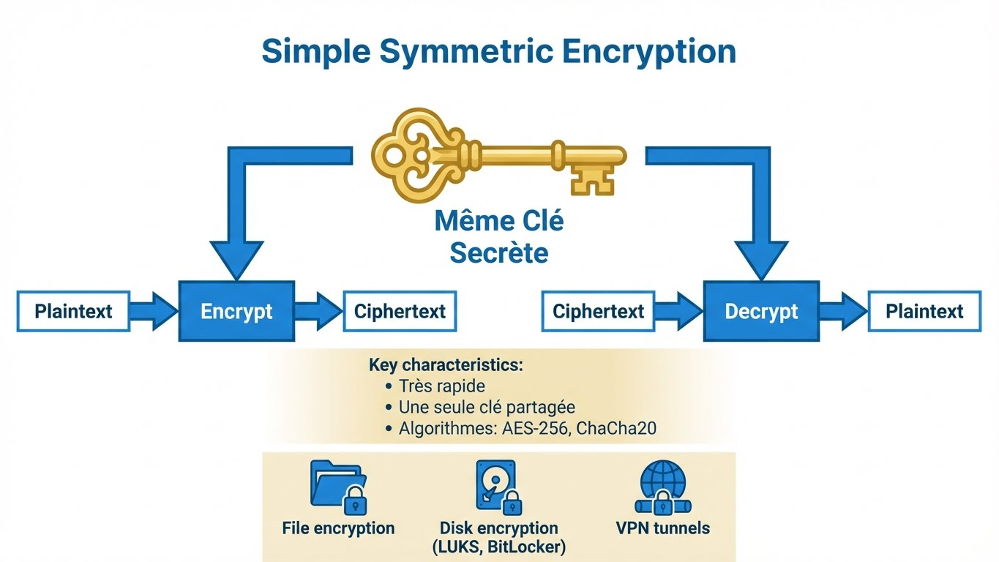
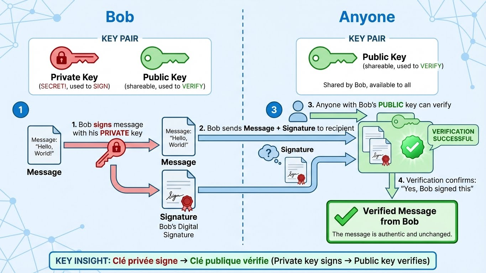
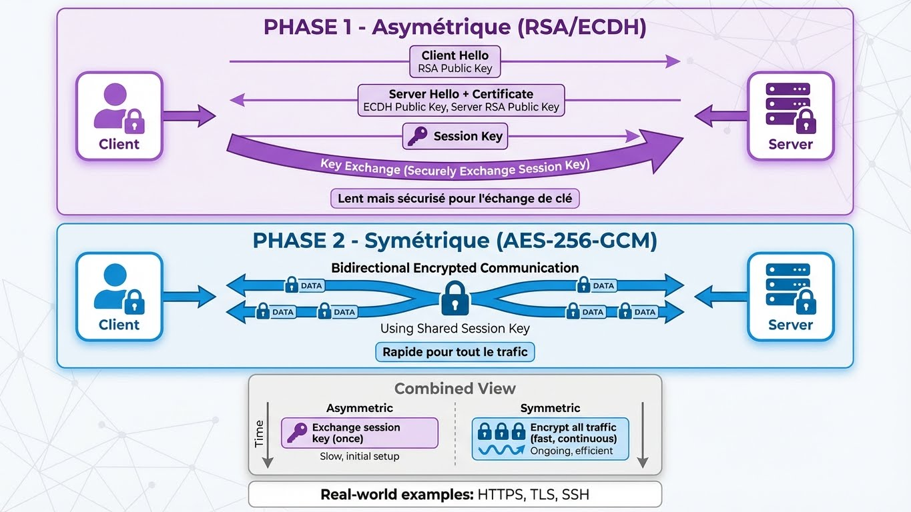

---
tags:
  - crypto
  - security
  - theory
---

# Fondamentaux de la Cryptographie & Vocabulaire

Maîtriser les concepts avant les commandes.


---

!!! important "Le Vocabulaire (Terminologie Française)"
    En français technique, les termes ont des sens précis :

    | Terme | Définition | Usage |
    |-------|------------|-------|
    | **Chiffrer** | Transformer des données avec une clé | ✅ Correct |
    | **Déchiffrer** | Inverser le chiffrement *avec* la clé | ✅ Légitime |
    | **Décrypter** | Inverser *sans* la clé (attaque) | ⚠️ Contexte sécurité |
    | **Crypter** | ❌ N'existe pas en français | ⛔ À éviter |
    | **Encrypter** | ❌ Anglicisme | ⛔ À éviter |

    **Correct :** "Je vais **chiffrer** ce fichier avec AES."

    **Incorrect :** "Je vais ~~crypter~~ ce fichier."

---

## Les 3 Piliers

| Concept | Réversible | Utilise Clés | Objectif | Exemples |
|---------|------------|-----------|------|----------|
| **Encryption** | ✅ Oui | ✅ Oui | Confidentialité | AES, RSA, ChaCha20 |
| **Hashing** | ❌ Non | ❌ Non | Intégrité, Auth | SHA256, bcrypt, MD5 |
| **Encoding** | ✅ Oui | ❌ Non | Transport, Format | Base64, Hex, URL |

### Encryption (Chiffrement)

Transformer les données pour que seules les parties autorisées puissent les lire.

```
Plaintext + Clé → [Encryption] → Ciphertext
Ciphertext + Clé → [Decryption] → Plaintext
```

**Cas d'usage :**

- Protection de fichiers
- Trafic réseau (TLS/HTTPS)
- Chiffrement de disque
- Messagerie (E2E)

---

### Hashing (Hachage)

Transformation unidirectionnelle produisant une "empreinte" de taille fixe.

```
Données → [Fonction Hash] → Digest de taille fixe

"Hello" → SHA256 → 2cf24dba5fb0a30e26e83b2ac5b9e29e...
"Hello!" → SHA256 → 33d7c290db4c... (complètement différent !)
```

**Propriétés :**

- **Déterministe :** Même entrée = même sortie
- **Sens unique :** Impossible d'inverser le hash pour obtenir l'original
- **Effet avalanche :** Petit changement = hash complètement différent
- **Résistance aux collisions :** Difficile de trouver deux entrées avec le même hash

**Cas d'usage :**

- Stockage de mots de passe (avec salt !)
- Vérification d'intégrité de fichiers
- Signatures numériques
- Blockchain

---

### Encoding (Encodage)

Transformation de format pour le transport ou la compatibilité. **PAS de sécurité !**

```
Binaire → [Base64] → Texte ASCII
ASCII → [Hex] → Chaîne hexadécimale
```

!!! warning "Encoding ≠ Sécurité"
    Base64 n'est **pas du chiffrement**. C'est juste un changement de format.
    N'importe qui peut le décoder instantanément.

    ```bash
    # "Secret" en Base64
    echo "U2VjcmV0" | base64 -d
    # Sortie: Secret
    ```

**Cas d'usage :**

- Pièces jointes email (MIME)
- URLs (URL encoding)
- JSON avec données binaires
- Certificats (format PEM)

---

## Symétrique vs Asymétrique

### Encryption Symétrique (Chiffrement Symétrique)

**Une clé secrète partagée** pour le chiffrement et le déchiffrement.



| Avantages | Inconvénients |
|------|------|
| Très rapide | Problème de distribution de clé |
| Efficace pour grandes données | Si clé fuitée, tout compromis |
| Implémentation simple | Besoin d'un canal sécurisé pour partager la clé |

**Algorithmes :** AES-256, ChaCha20, 3DES (déprécié)

**Cas d'usage :**

- Chiffrement de fichiers
- Chiffrement de disque (LUKS, BitLocker)
- Tunnels VPN (après échange de clé)

---

### Encryption Asymétrique (Chiffrement Asymétrique)

**Paire de clés :** Clé publique + Clé privée

#### Pour Encryption (Confidentialité)

**Clé publique chiffre → Clé privée déchiffre**


#### Pour Signatures (Authentification)

**Clé privée signe → Clé publique vérifie**



| Avantages | Inconvénients |
|------|------|
| Pas de problème de distribution de clé | Beaucoup plus lent que symétrique |
| Signatures numériques | Taille de données limitée |
| Non-répudiation | Mathématiques complexes |

**Algorithmes :** RSA, ECDSA, Ed25519

---

## Encryption Hybride (Monde Réel)

Les systèmes modernes combinent les deux : **asymétrique pour l'échange de clé, symétrique pour les données.**



---

## Référence Rapide

| Question | Réponse |
|----------|--------|
| Besoin de confidentialité ? | Encryption |
| Besoin de vérifier l'intégrité ? | Hashing |
| Besoin de prouver l'identité ? | Digital Signature |
| Besoin de chiffrement en masse rapide ? | Symétrique (AES) |
| Besoin d'échange de clé ? | Asymétrique (RSA/ECDH) |
| Besoin de stockage de mot de passe ? | Hashing + Salt (bcrypt) |
| Besoin de transporter du binaire ? | Encoding (Base64) |
