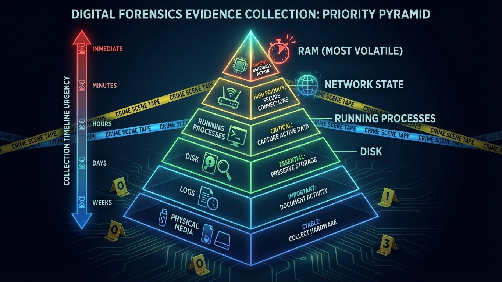

---
tags:
  - security
  - forensics
  - incident-response
  - blue-team
---

# Digital Forensics & Incident Response (DFIR)

Vous pensez avoir été piraté. Que faire ? La panique est votre pire ennemie.
Voici la méthodologie pour sécuriser les preuves et analyser l'intrusion.



## 1. Les 4 Phases de la Réponse (NIST)

1.  **Identification** : Détecter l'incident (Logs, Alerte SIEM, Appel utilisateur).
2.  **Containment (Endiguement)** : Stopper l'hémorragie.
    *   *Débrancher le câble réseau* (Isolement).
    *   *Ne pas éteindre le serveur !* (La RAM contient les clés de chiffrement et les processus malveillants).
3.  **Eradication** : Supprimer la menace (Rootkit, Malware). Souvent : réinstaller l'OS.
4.  **Recovery** : Restauration des données (depuis un backup sain) et remise en service.

## 2. Acquisition de Preuves (Live Forensics)

L'ordre de volatilité est crucial. Récupérez d'abord ce qui disparaît vite.

### Ordre de Collecte
1.  **Mémoire Vive (RAM)** : Contient mots de passe, connexions réseau, processus cachés.
2.  **État Réseau** : Connexions actives (`ss`, `netstat`).
3.  **Processus** : Liste des tâches (`ps`).
4.  **Disque Dur** : Image complète du disque.

### Outils de Collecte

**Dumper la RAM (LiME ou /dev/mem) :**
```bash
# Avec LiME (Linux Memory Extractor)
insmod lime.ko "path=/tmp/ram_dump.bin format=lime"
```

**Collecte Rapide (Script de survie) :**
Ne stockez rien sur le disque compromis ! Utilisez une clé USB ou du netcat.
```bash
# Sur votre machine d'analyse (écoute)
nc -l -p 4444 > evidence.tar.gz

# Sur la machine compromise
tar -czf - /var/log /etc/passwd /etc/shadow /home/user/.bash_history | nc <IP_ANALYSE> 4444
```

## 3. Analyse Post-Mortem

### Analyser la RAM avec Volatility
**Volatility** est le standard pour fouiller dans un dump mémoire.

```bash
# Identifier le profil de l'OS
volatility -f ram_dump.bin imageinfo

# Lister les processus (même cachés par un rootkit)
volatility -f ram_dump.bin --profile=LinuxDebian... linux_pslist

# Voir l'historique Bash en RAM
volatility -f ram_dump.bin --profile=... linux_bash
```

### Analyser le Disque (Timeline)
Les pirates modifient les dates des fichiers (Timestomping). Il faut reconstruire la chronologie réelle.

**Outil : The Sleuth Kit (TSK)**
```bash
# Créer une timeline de tous les événements fichiers
fls -r -m / /dev/sda1 > bodyfile.txt
mactime -b bodyfile.txt > timeline.csv
```

## 4. Les Artefacts à Vérifier

Où se cachent les preuves ?

*   **Persistance** :
    *   Cronjobs (`/var/spool/cron`, `/etc/cron*`)
    *   Systemd Services (`/etc/systemd/system`)
    *   `.bashrc` et `.profile` des utilisateurs
    *   Clés SSH (`authorized_keys`)
*   **Exécution** :
    *   `.bash_history` (souvent effacé, mais vérifiez `.bash_history.swp` ou en RAM)
    *   `/var/log/auth.log` (ou `secure`) : Connexions SSH, sudo.
    *   `/var/log/syslog`
*   **Fichiers Suspects** :
    *   Dans `/tmp` et `/dev/shm` (droits d'écriture pour tous).
    *   Fichiers cachés (`.rootkit`).

## 5. Règle d'Or : Chain of Custody
Si l'affaire doit aller en justice, vous devez prouver que les preuves n'ont pas été altérées.
*   Calculez toujours le **Hash (SHA256)** de vos dumps (RAM, Disque) dès l'acquisition.
*   Notez chaque action effectuée sur la machine.
