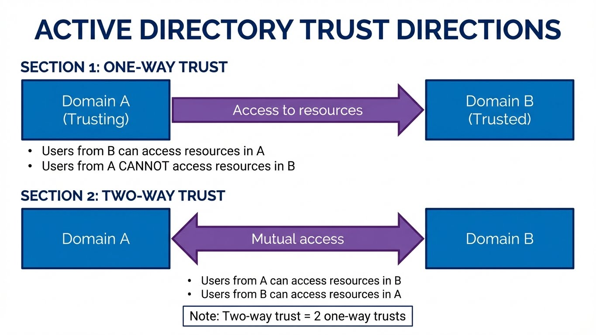
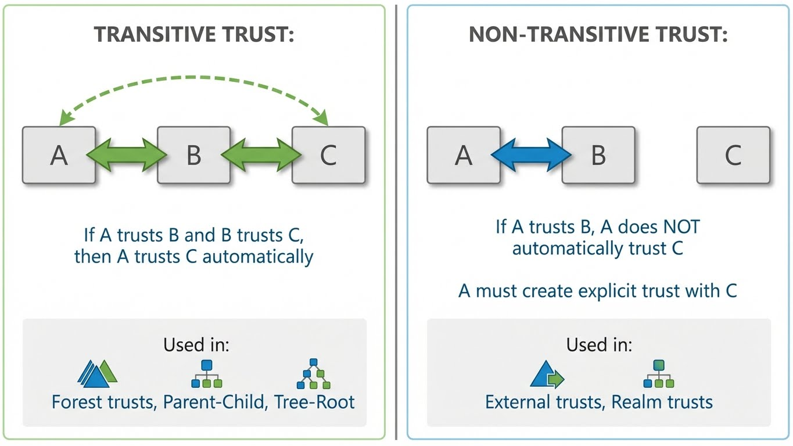
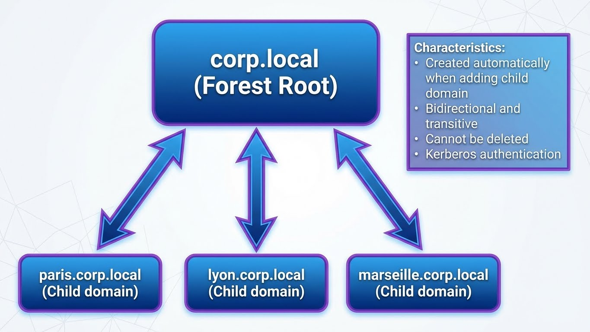

---
tags:
  - windows
  - active-directory
  - trusts
  - security
  - multi-domain
---

# Active Directory : Relations d'Approbation (Trusts)

Les relations d'approbation (trusts) permettent aux utilisateurs d'un domaine d'accéder aux ressources d'un autre domaine. Composant essentiel des architectures multi-domaines et multi-forêts.

## Concepts Fondamentaux

### Terminologie

```text
VOCABULAIRE DES TRUSTS
══════════════════════════════════════════════════════════

Trusting Domain (Domaine de confiance)
──────────────────────────────────────
Le domaine qui ACCORDE l'accès à ses ressources.
"Je fais confiance à l'autre domaine"

Trusted Domain (Domaine approuvé)
─────────────────────────────────
Le domaine dont les utilisateurs REÇOIVENT l'accès.
"L'autre domaine me fait confiance"

Exemple :
─────────
PARIS.CORP ──trust──► LYON.CORP

PARIS = Trusting (accorde l'accès à ses ressources)
LYON  = Trusted (ses utilisateurs peuvent accéder à PARIS)

Les utilisateurs de LYON peuvent accéder aux ressources de PARIS.
Les utilisateurs de PARIS ne peuvent PAS accéder à LYON.
```

### Direction des Trusts



```text
DIRECTION DES TRUSTS
══════════════════════════════════════════════════════════

UNIDIRECTIONNEL (One-Way)
─────────────────────────
     Accès aux ressources
A ◄─────────────────────── B

A = Trusting (ressources accessibles)
B = Trusted (utilisateurs autorisés)

Les utilisateurs de B accèdent aux ressources de A.
Les utilisateurs de A n'accèdent PAS aux ressources de B.


BIDIRECTIONNEL (Two-Way)
────────────────────────
     Accès aux ressources
A ◄───────────────────────► B

Les utilisateurs de A accèdent aux ressources de B.
Les utilisateurs de B accèdent aux ressources de A.

Note : Un trust bidirectionnel = 2 trusts unidirectionnels
```

### Transitivité



```text
TRANSITIVITÉ DES TRUSTS
══════════════════════════════════════════════════════════

TRANSITIF
─────────
A ◄──► B ◄──► C

Si A trust B et B trust C, alors A trust C automatiquement.
Utilisé dans : Forest trusts, Parent-Child, Tree-Root

NON-TRANSITIF
─────────────
A ◄──► B      C

Si A trust B, A ne trust PAS automatiquement C.
Même si B trust C, A doit créer un trust explicite avec C.
Utilisé dans : External trusts, Realm trusts
```

---

## Types de Trusts

### Vue d'Ensemble

| Type | Direction | Transitif | Cas d'usage |
|------|-----------|-----------|-------------|
| **Parent-Child** | Bidirectionnel | Oui | Automatique dans une forêt |
| **Tree-Root** | Bidirectionnel | Oui | Nouveau tree dans la forêt |
| **Forest** | Bi ou Uni | Oui | Entre deux forêts |
| **External** | Bi ou Uni | Non | Vers domaine hors forêt |
| **Shortcut** | Bi ou Uni | Oui | Optimisation intra-forêt |
| **Realm** | Bi ou Uni | Bi ou Non | Vers Kerberos non-Windows |

### Parent-Child Trust



```text
PARENT-CHILD TRUST (Automatique)
══════════════════════════════════════════════════════════

                    corp.local (Forest Root)
                          │
            ┌─────────────┼─────────────┐
            │             │             │
            ▼             ▼             ▼
      paris.corp    lyon.corp     marseille.corp
      .local        .local        .local

Caractéristiques :
• Créé automatiquement lors de l'ajout d'un domaine enfant
• Bidirectionnel et transitif
• Ne peut pas être supprimé
• Authentification Kerberos
```

### Tree-Root Trust


```text
TREE-ROOT TRUST
══════════════════════════════════════════════════════════

    corp.local                    partner.local
        │                              │
   ┌────┴────┐                    ┌────┴────┐
   │         │                    │         │
paris    lyon                  berlin    munich
.corp    .corp                .partner  .partner
.local   .local               .local    .local

        └──────────── Tree-Root Trust ────────────┘
                    (automatique dans la forêt)

Caractéristiques :
• Créé automatiquement lors de l'ajout d'un nouveau tree
• Bidirectionnel et transitif
• Relie les racines des trees au Forest Root
```

### Forest Trust

```text
FOREST TRUST
══════════════════════════════════════════════════════════

     FORÊT A                              FORÊT B
  ┌───────────┐                       ┌───────────┐
  │ corp.local│◄─── Forest Trust ────►│partner.com│
  │   (Root)  │                       │   (Root)  │
  └─────┬─────┘                       └─────┬─────┘
        │                                   │
   ┌────┴────┐                         ┌────┴────┐
   │         │                         │         │
 paris    lyon                      berlin   munich
 .corp    .corp                    .partner .partner
 .local   .local                   .com     .com

Caractéristiques :
• Entre deux forêts distinctes (niveau fonctionnel 2003+)
• Bidirectionnel ou unidirectionnel
• Transitif au sein de chaque forêt
• Requiert : DNS conditionnel, ports firewall
• Supporte Selective Authentication et SID Filtering
```

### External Trust

```text
EXTERNAL TRUST
══════════════════════════════════════════════════════════

     FORÊT A                         DOMAINE EXTERNE
  ┌───────────┐                      ┌───────────┐
  │ corp.local│                      │legacy.old │
  │   (Root)  │                      │(NT4/2000) │
  └─────┬─────┘                      └───────────┘
        │                                  ▲
   ┌────┴────┐                             │
   │         │                             │
 paris    lyon ◄──── External Trust ───────┘
 .corp    .corp
 .local   .local

Caractéristiques :
• Vers un domaine spécifique (pas toute la forêt)
• Non-transitif
• Utile pour domaines legacy (NT4, domaines isolés)
• Ne traverse pas la hiérarchie de la forêt
```

### Shortcut Trust

```text
SHORTCUT TRUST
══════════════════════════════════════════════════════════

                    corp.local
                        │
          ┌─────────────┼─────────────┐
          │             │             │
       europe        americas       asia
       .corp         .corp          .corp
       .local        .local         .local
          │             │             │
     ┌────┴────┐   ┌────┴────┐   ┌────┴────┐
     │         │   │         │   │         │
   paris    london  ny    la   tokyo   beijing

   paris ◄─────── Shortcut Trust ──────► tokyo

Sans shortcut : paris → europe → corp → asia → tokyo (4 hops)
Avec shortcut : paris → tokyo (1 hop)

Caractéristiques :
• Optimise l'authentification entre domaines distants
• Réduit la latence Kerberos
• Transitif
• Optionnel (pour performance uniquement)
```

### Realm Trust

```text
REALM TRUST
══════════════════════════════════════════════════════════

     FORÊT AD                        REALM KERBEROS
  ┌───────────┐                    ┌───────────────┐
  │ corp.local│◄── Realm Trust ───►│UNIX.EXAMPLE.ORG│
  │  (AD DS)  │                    │   (MIT KDC)   │
  └───────────┘                    └───────────────┘

Caractéristiques :
• Vers un realm Kerberos non-Windows (MIT, Heimdal)
• Transitif ou non-transitif (configurable)
• Interopérabilité Linux/UNIX
• Authentification Kerberos uniquement (pas NTLM)
```

---

## Création et Gestion

### Prérequis

```powershell
# Vérifier le niveau fonctionnel (Forest Trust requiert 2003+)
Get-ADForest | Select-Object ForestMode
Get-ADDomain | Select-Object DomainMode

# Vérifier la résolution DNS entre forêts
nslookup partner.com
nslookup _ldap._tcp.dc._msdcs.partner.com

# Configurer le forwarder conditionnel DNS
Add-DnsServerConditionalForwarderZone `
    -Name "partner.com" `
    -MasterServers 10.20.1.10,10.20.1.11 `
    -ReplicationScope "Forest"
```

### Ports Firewall Requis

| Port | Protocole | Service | Direction |
|------|-----------|---------|-----------|
| 53 | TCP/UDP | DNS | Bidirectionnel |
| 88 | TCP/UDP | Kerberos | Bidirectionnel |
| 135 | TCP | RPC Endpoint Mapper | Bidirectionnel |
| 389 | TCP/UDP | LDAP | Bidirectionnel |
| 445 | TCP | SMB | Bidirectionnel |
| 636 | TCP | LDAPS | Bidirectionnel |
| 3268 | TCP | Global Catalog | Bidirectionnel |
| 3269 | TCP | Global Catalog SSL | Bidirectionnel |
| 49152-65535 | TCP | RPC Dynamic | Bidirectionnel |

### Créer un Forest Trust (GUI)

```text
1. Active Directory Domains and Trusts (domain.msc)
2. Clic droit sur le domaine racine → Properties
3. Onglet "Trusts" → "New Trust..."
4. Trust Name : partner.com
5. Trust Type : Forest trust
6. Direction : Two-way (ou One-way selon besoin)
7. Sides of Trust : Both this domain and the specified domain
8. Outgoing Trust Authentication Level : Forest-wide authentication
9. Trust Password : (mot de passe partagé)
10. Confirmer et valider le trust
```

### Créer un Forest Trust (PowerShell)

```powershell
# Sur le premier domaine (corp.local)
$trustPassword = Read-Host -AsSecureString "Enter trust password"

New-ADTrust `
    -Name "partner.com" `
    -Type Forest `
    -Direction Bidirectional `
    -RemoteDomainName "partner.com" `
    -TrustPassword $trustPassword

# Sur le second domaine (partner.com) - même commande inversée
New-ADTrust `
    -Name "corp.local" `
    -Type Forest `
    -Direction Bidirectional `
    -RemoteDomainName "corp.local" `
    -TrustPassword $trustPassword
```

### Créer un External Trust

```powershell
# Trust unidirectionnel vers un domaine externe
New-ADTrust `
    -Name "legacy.external" `
    -Type External `
    -Direction Outbound `
    -RemoteDomainName "legacy.external" `
    -TrustPassword (ConvertTo-SecureString "P@ssw0rd!" -AsPlainText -Force)
```

### Créer un Shortcut Trust

```powershell
# Entre deux domaines de la même forêt pour optimiser
New-ADTrust `
    -Name "tokyo.asia.corp.local" `
    -Type Shortcut `
    -Direction Bidirectional `
    -RemoteDomainName "tokyo.asia.corp.local" `
    -TrustPassword $trustPassword
```

---

## Sécurité des Trusts

### SID Filtering

Le SID Filtering protège contre les attaques d'élévation de privilèges via injection de SIDs.

```text
SID FILTERING
══════════════════════════════════════════════════════════

Sans SID Filtering (dangereux) :
────────────────────────────────
Attaquant dans PARTNER.COM crée un utilisateur avec :
- SID propre : S-1-5-21-PARTNER-1234
- SID History : S-1-5-21-CORP-512 (Domain Admins de CORP!)

→ L'utilisateur obtient les droits Domain Admin sur CORP.LOCAL!

Avec SID Filtering (par défaut) :
─────────────────────────────────
Le DC de CORP.LOCAL filtre tous les SIDs qui ne proviennent
pas de PARTNER.COM lors de l'authentification.

→ Seul le SID S-1-5-21-PARTNER-1234 est accepté.
→ Le SID History est ignoré.
```

```powershell
# Vérifier le statut du SID Filtering
Get-ADTrust -Identity "partner.com" | Select-Object Name, SIDFilteringQuarantined

# Activer SID Filtering (recommandé, activé par défaut sur Forest trusts)
Set-ADTrust -Identity "partner.com" -SIDFilteringQuarantined $true

# Désactiver SID Filtering (DANGEREUX - migration uniquement)
Set-ADTrust -Identity "partner.com" -SIDFilteringQuarantined $false

# Alternative netdom
netdom trust corp.local /domain:partner.com /quarantine:yes
```

!!! danger "SID Filtering"
    Ne désactivez **JAMAIS** le SID Filtering en production sauf migration temporaire. Réactivez-le immédiatement après.

### Selective Authentication

Permet de contrôler finement quels utilisateurs de la forêt approuvée peuvent s'authentifier.

```text
SELECTIVE AUTHENTICATION
══════════════════════════════════════════════════════════

Forest-wide Authentication (défaut) :
─────────────────────────────────────
Tous les utilisateurs de PARTNER.COM peuvent s'authentifier
sur TOUS les serveurs de CORP.LOCAL.

Selective Authentication :
──────────────────────────
Seuls les utilisateurs de PARTNER.COM avec le droit
"Allowed to Authenticate" peuvent s'authentifier,
et uniquement sur les serveurs où ce droit est accordé.
```

```powershell
# Activer Selective Authentication sur un trust existant
Set-ADTrust -Identity "partner.com" -SelectiveAuthentication $true

# Accorder le droit "Allowed to Authenticate" sur un serveur
# Sur SRV-FILE-01, dans les propriétés de sécurité de l'objet ordinateur :
# Ajouter le groupe PARTNER\FileAccessGroup avec le droit "Allowed to Authenticate"

# Via PowerShell (sur l'objet ordinateur)
$computer = Get-ADComputer "SRV-FILE-01"
$sid = (Get-ADGroup -Server "partner.com" -Identity "FileAccessGroup").SID
$ace = New-Object System.DirectoryServices.ActiveDirectoryAccessRule(
    $sid,
    "ExtendedRight",
    "Allow",
    [Guid]"68b1d179-0d15-4d4f-ab71-46152e79a7bc"  # Allowed-To-Authenticate
)
$acl = Get-Acl "AD:\$($computer.DistinguishedName)"
$acl.AddAccessRule($ace)
Set-Acl -Path "AD:\$($computer.DistinguishedName)" -AclObject $acl
```

### Trust Authentication Niveau

```powershell
# Vérifier le niveau d'authentification
Get-ADTrust -Identity "partner.com" | Select-Object Name, TrustAttributes

# TrustAttributes values :
# 0x00000001 - Non-Transitive
# 0x00000002 - Uplevel only (Windows 2000+)
# 0x00000004 - SID Filtering enabled (Quarantined)
# 0x00000008 - Forest Trust
# 0x00000010 - Cross-Organization (Selective Auth)
# 0x00000020 - Within Forest
# 0x00000040 - Treat as External
# 0x00000080 - Uses RC4 Encryption
```

---

## Validation et Troubleshooting

### Vérifier un Trust

```powershell
# Lister tous les trusts
Get-ADTrust -Filter * | Format-Table Name, Direction, TrustType, DisallowTransivity

# Détails d'un trust spécifique
Get-ADTrust -Identity "partner.com" | Format-List *

# Valider le trust (teste la connectivité)
Test-ADTrust -Identity "partner.com"

# Vérification complète
$trust = Get-ADTrust -Identity "partner.com"
Write-Host "Trust Name: $($trust.Name)"
Write-Host "Direction: $($trust.Direction)"
Write-Host "Trust Type: $($trust.TrustType)"
Write-Host "SID Filtering: $($trust.SIDFilteringQuarantined)"
Write-Host "Selective Auth: $($trust.SelectiveAuthentication)"
```

### Netdom pour Validation

```cmd
REM Vérifier le trust
netdom trust corp.local /domain:partner.com /verify

REM Réinitialiser le mot de passe du trust
netdom trust corp.local /domain:partner.com /reset /passwordt:NewP@ssw0rd!

REM Afficher les informations du trust
netdom trust corp.local /domain:partner.com /query
```

### Diagnostics Kerberos

```powershell
# Tester l'authentification Kerberos cross-domain
klist purge
runas /user:PARTNER\testuser cmd.exe

# Vérifier les tickets Kerberos
klist tickets

# Tracer Kerberos
nltest /dsgetdc:partner.com
nltest /sc_query:partner.com

# Vérifier le canal sécurisé
Test-ComputerSecureChannel -Server "dc.partner.com"
```

### Problèmes Courants

```text
TROUBLESHOOTING TRUSTS
══════════════════════════════════════════════════════════

Erreur : "The trust relationship failed"
────────────────────────────────────────
Causes :
• Mot de passe du trust désynchronisé
• Problème de résolution DNS
• Ports firewall bloqués

Solutions :
netdom trust corp.local /domain:partner.com /reset
Vérifier DNS : nslookup partner.com
Vérifier ports : Test-NetConnection dc.partner.com -Port 389


Erreur : "Access Denied" cross-domain
─────────────────────────────────────
Causes :
• Selective Authentication activée sans droits
• SID Filtering bloque le SID History
• Permissions insuffisantes sur la ressource

Solutions :
Vérifier Selective Auth : Get-ADTrust | Select SelectiveAuthentication
Accorder "Allowed to Authenticate" sur le serveur cible


Erreur : "The specified domain does not exist"
──────────────────────────────────────────────
Causes :
• DNS conditionnel non configuré
• Forwarder DNS incorrect

Solutions :
Add-DnsServerConditionalForwarderZone -Name "partner.com" -MasterServers IP
nslookup _ldap._tcp.dc._msdcs.partner.com


Erreur : "Clock skew too great"
───────────────────────────────
Causes :
• Décalage horaire > 5 minutes entre DCs

Solutions :
w32tm /resync /force
Configurer NTP identique sur les deux forêts
```

### Event Logs à Surveiller

```powershell
# Events liés aux trusts
Get-WinEvent -FilterHashtable @{
    LogName = 'Security'
    Id = 4768, 4769, 4770, 4771, 4776  # Kerberos
} -MaxEvents 50 | Where-Object { $_.Message -like "*partner*" }

# Events Netlogon
Get-WinEvent -FilterHashtable @{
    LogName = 'System'
    ProviderName = 'NETLOGON'
} -MaxEvents 50

# Events Directory Service
Get-WinEvent -FilterHashtable @{
    LogName = 'Directory Service'
    Level = 2, 3  # Error, Warning
} -MaxEvents 50
```

---

## Architectures Multi-Forêts

### Modèle Resource Forest


```text
RESOURCE FOREST MODEL
══════════════════════════════════════════════════════════

    ACCOUNT FOREST                    RESOURCE FOREST
  ┌───────────────┐                 ┌───────────────┐
  │  corp.local   │                 │  res.local    │
  │               │◄── One-Way ────│               │
  │  Utilisateurs │    Trust       │  Serveurs     │
  │  Groupes      │                │  Applications │
  │  Workstations │                │  Données      │
  └───────────────┘                └───────────────┘

Flux : Les utilisateurs de CORP accèdent aux ressources de RES.
       RES fait confiance à CORP (trusting).
       CORP est approuvé par RES (trusted).

Avantages :
• Isolation des ressources sensibles
• Délégation administrative séparée
• Conformité (ressources régulées isolées)
```

### Modèle Hub-Spoke

```text
HUB-SPOKE MODEL
══════════════════════════════════════════════════════════

                    ┌─────────────┐
                    │  HUB FOREST │
                    │  corp.local │
                    └──────┬──────┘
                           │
         ┌─────────────────┼─────────────────┐
         │                 │                 │
         ▼                 ▼                 ▼
   ┌───────────┐    ┌───────────┐    ┌───────────┐
   │  SPOKE 1  │    │  SPOKE 2  │    │  SPOKE 3  │
   │ europe.com│    │ americas  │    │ asia.net  │
   │           │    │ .net      │    │           │
   └───────────┘    └───────────┘    └───────────┘

Tous les spokes ont un Forest Trust avec le Hub.
Les spokes n'ont PAS de trust entre eux.

Avantages :
• Contrôle centralisé
• Isolation entre business units
• Administration déléguée par région
```

### Mesh Model

```text
MESH MODEL
══════════════════════════════════════════════════════════

   ┌───────────┐         ┌───────────┐
   │  FOREST A │◄───────►│  FOREST B │
   │           │         │           │
   └─────┬─────┘         └─────┬─────┘
         │                     │
         │    ┌───────────┐    │
         └───►│  FOREST C │◄───┘
              │           │
              └───────────┘

Tous les forests ont des trusts bidirectionnels entre eux.

Avantages :
• Accès direct entre toutes les forêts
• Pas de point central de défaillance

Inconvénients :
• Complexité (n*(n-1)/2 trusts)
• Surface d'attaque étendue
• Administration complexe
```

---

## Bonnes Pratiques

### Conception

```yaml
Checklist Conception Trusts:
  Avant création:
    - [ ] Définir le besoin métier précis
    - [ ] Choisir le type de trust approprié
    - [ ] Documenter la direction et transitivité
    - [ ] Planifier les flux firewall
    - [ ] Configurer DNS conditionnel

  Sécurité:
    - [ ] Activer SID Filtering (défaut)
    - [ ] Considérer Selective Authentication
    - [ ] Limiter les trusts au minimum nécessaire
    - [ ] Auditer régulièrement les trusts existants
    - [ ] Documenter les trusts et leur justification

  Opérations:
    - [ ] Tester le trust après création
    - [ ] Monitorer les événements Kerberos
    - [ ] Planifier la rotation du mot de passe trust
    - [ ] Procédure de suppression documentée
```

### Sécurité

```powershell
# Audit des trusts existants
Get-ADTrust -Filter * | ForEach-Object {
    [PSCustomObject]@{
        Name = $_.Name
        Direction = $_.Direction
        TrustType = $_.TrustType
        Transitive = -not $_.DisallowTransivity
        SIDFiltering = $_.SIDFilteringQuarantined
        SelectiveAuth = $_.SelectiveAuthentication
        Created = $_.Created
    }
} | Format-Table -AutoSize

# Vérifier les trusts sans SID Filtering (RISQUE!)
Get-ADTrust -Filter * | Where-Object {
    $_.SIDFilteringQuarantined -eq $false
} | Select-Object Name, TrustType
```

---

## Références

- [Microsoft Docs - Trust Technologies](https://docs.microsoft.com/en-us/windows-server/identity/ad-ds/plan/security-best-practices/implementing-secure-administrative-hosts)
- [Microsoft Docs - How Domain and Forest Trusts Work](https://docs.microsoft.com/en-us/previous-versions/windows/it-pro/windows-server-2003/cc773178(v=ws.10))
- [AD Security - Trust Attacks](https://adsecurity.org/?tag=trusts)

---

**Voir aussi :**

- [Active Directory](active-directory.md) - Fondamentaux AD
- [Windows Security](windows-security.md) - Sécurité Windows
- [Formation Windows Mastery - Module 11](../formations/windows-mastery/11-active-directory-core.md) - AD en formation
