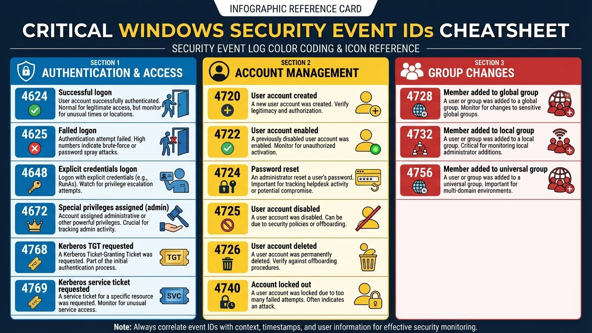

---
tags:
  - windows
  - logging
  - siem
  - security
  - secnumcloud
  - hardening
---

# NXLog - Collecte de Logs Windows

NXLog Community Edition permet de collecter et transférer les Event Logs Windows vers un concentrateur de logs centralisé (syslog, Graylog, ELK, SIEM).

## Architecture


```
CENTRALISATION DES LOGS - SECNUMCLOUD
══════════════════════════════════════════════════════════════════════

┌─────────────────────┐     ┌─────────────────────┐
│   SERVEURS WINDOWS  │     │   SERVEURS LINUX    │
│  ┌───────────────┐  │     │  ┌───────────────┐  │
│  │    NXLog CE   │  │     │  │    rsyslog    │  │
│  │  (port 514)   │  │     │  │  (port 514)   │  │
│  └───────┬───────┘  │     │  └───────┬───────┘  │
└──────────┼──────────┘     └──────────┼──────────┘
           │ Syslog/TCP/TLS            │ Syslog
           │                           │
           └─────────────┬─────────────┘
                         ▼
              ┌─────────────────────┐
              │   CONCENTRATEUR     │
              │  (Syslog/Graylog/   │
              │   ELK/SIEM)         │
              └─────────────────────┘
                         │
                         ▼
              ┌─────────────────────┐
              │   STOCKAGE & SIEM   │
              │  Analyse, Alerting  │
              │  Conformité, Audit  │
              └─────────────────────┘

Exigences SecNumCloud:
├── Centralisation obligatoire des logs de sécurité
├── Intégrité des logs (TLS recommandé)
├── Rétention minimum (6 mois en ligne, 1 an archive)
├── Horodatage fiable (NTP synchronisé)
└── Traçabilité des accès et actions privilégiées
```

---

## Installation NXLog Community Edition

### Téléchargement et Installation

```powershell
# Télécharger NXLog CE depuis le site officiel
# https://nxlog.co/products/nxlog-community-edition/download

# Installation silencieuse
msiexec /i nxlog-ce-x.x.xxxx.msi /qn

# Répertoires par défaut
# Config  : C:\Program Files\nxlog\conf\nxlog.conf
# Logs    : C:\Program Files\nxlog\data\nxlog.log
# Binaire : C:\Program Files\nxlog\nxlog.exe

# Vérifier le service
Get-Service nxlog
```

### Via Chocolatey

```powershell
# Installation
choco install nxlog -y

# Le package configure automatiquement le service
Get-Service nxlog
```

### Structure des Répertoires

```
C:\Program Files\nxlog\
├── conf\
│   └── nxlog.conf          # Configuration principale
├── data\
│   ├── nxlog.log           # Logs de NXLog lui-même
│   └── configcache.dat     # Cache de position
├── cert\                   # Certificats TLS (si utilisés)
└── modules\                # Modules d'entrée/sortie
```

---

## Event Logs Requis - Conformité SecNumCloud

### Matrice des Events Critiques



```
EVENTS LOGS OBLIGATOIRES - HARDENING SECNUMCLOUD
══════════════════════════════════════════════════════════════════════

┌─────────────────────────────────────────────────────────────────────┐
│ AUTHENTIFICATION & ACCÈS                                            │
├─────────────────────────────────────────────────────────────────────┤
│ Security 4624  │ Connexion réussie                                  │
│ Security 4625  │ Échec de connexion                                 │
│ Security 4648  │ Connexion avec credentials explicites              │
│ Security 4634  │ Déconnexion                                        │
│ Security 4647  │ Déconnexion initiée par l'utilisateur             │
│ Security 4672  │ Privilèges spéciaux assignés (admin logon)        │
│ Security 4776  │ Validation credentials (NTLM)                      │
│ Security 4768  │ Ticket Kerberos TGT demandé                        │
│ Security 4769  │ Ticket Kerberos service demandé                    │
│ Security 4771  │ Échec pré-authentification Kerberos               │
└─────────────────────────────────────────────────────────────────────┘

┌─────────────────────────────────────────────────────────────────────┐
│ GESTION DES COMPTES                                                 │
├─────────────────────────────────────────────────────────────────────┤
│ Security 4720  │ Compte utilisateur créé                            │
│ Security 4722  │ Compte utilisateur activé                          │
│ Security 4723  │ Tentative changement mot de passe                  │
│ Security 4724  │ Réinitialisation mot de passe                      │
│ Security 4725  │ Compte utilisateur désactivé                       │
│ Security 4726  │ Compte utilisateur supprimé                        │
│ Security 4738  │ Compte utilisateur modifié                         │
│ Security 4740  │ Compte verrouillé                                  │
│ Security 4767  │ Compte déverrouillé                                │
└─────────────────────────────────────────────────────────────────────┘

┌─────────────────────────────────────────────────────────────────────┐
│ GROUPES & PRIVILÈGES                                                │
├─────────────────────────────────────────────────────────────────────┤
│ Security 4727  │ Groupe global créé                                 │
│ Security 4728  │ Membre ajouté à groupe global                      │
│ Security 4729  │ Membre retiré de groupe global                     │
│ Security 4731  │ Groupe local créé                                  │
│ Security 4732  │ Membre ajouté à groupe local                       │
│ Security 4733  │ Membre retiré de groupe local                      │
│ Security 4735  │ Groupe local modifié                               │
│ Security 4737  │ Groupe global modifié                              │
│ Security 4755  │ Groupe universel modifié                           │
│ Security 4756  │ Membre ajouté à groupe universel                   │
│ Security 4757  │ Membre retiré de groupe universel                  │
└─────────────────────────────────────────────────────────────────────┘

┌─────────────────────────────────────────────────────────────────────┐
│ POLITIQUES & AUDIT                                                  │
├─────────────────────────────────────────────────────────────────────┤
│ Security 4719  │ Politique d'audit modifiée                         │
│ Security 4907  │ Paramètres d'audit modifiés                        │
│ Security 4706  │ Trust créé vers un domaine                         │
│ Security 4707  │ Trust supprimé                                     │
│ Security 4713  │ Politique Kerberos modifiée                        │
│ Security 4739  │ Politique de domaine modifiée                      │
└─────────────────────────────────────────────────────────────────────┘

┌─────────────────────────────────────────────────────────────────────┐
│ PROCESSUS & SERVICES                                                │
├─────────────────────────────────────────────────────────────────────┤
│ Security 4688  │ Nouveau processus créé                             │
│ Security 4689  │ Processus terminé                                  │
│ Security 7045  │ Service installé (System log)                      │
│ Security 4697  │ Service installé (Security log)                    │
│ Security 4698  │ Tâche planifiée créée                              │
│ Security 4699  │ Tâche planifiée supprimée                          │
│ Security 4700  │ Tâche planifiée activée                            │
│ Security 4701  │ Tâche planifiée désactivée                         │
│ Security 4702  │ Tâche planifiée modifiée                           │
└─────────────────────────────────────────────────────────────────────┘

┌─────────────────────────────────────────────────────────────────────┐
│ ACCÈS AUX OBJETS & FICHIERS                                         │
├─────────────────────────────────────────────────────────────────────┤
│ Security 4663  │ Accès à un objet                                   │
│ Security 4656  │ Handle vers objet demandé                          │
│ Security 4658  │ Handle fermé                                       │
│ Security 4660  │ Objet supprimé                                     │
│ Security 4670  │ Permissions modifiées                              │
│ Security 5140  │ Partage réseau accédé                              │
│ Security 5145  │ Accès fichier/dossier partagé                      │
└─────────────────────────────────────────────────────────────────────┘

┌─────────────────────────────────────────────────────────────────────┐
│ SYSTÈME & SÉCURITÉ                                                  │
├─────────────────────────────────────────────────────────────────────┤
│ Security 1102  │ Journal d'audit effacé                             │
│ Security 4616  │ Heure système modifiée                             │
│ Security 4657  │ Valeur registre modifiée                           │
│ Security 4946  │ Règle firewall ajoutée                             │
│ Security 4947  │ Règle firewall modifiée                            │
│ Security 4948  │ Règle firewall supprimée                           │
│ Security 4950  │ Paramètre firewall modifié                         │
│ System   104   │ Journal effacé                                     │
│ System   6005  │ Service Event Log démarré (boot)                   │
│ System   6006  │ Service Event Log arrêté (shutdown)                │
│ System   6008  │ Arrêt inattendu (crash)                            │
│ System   7040  │ Type de démarrage service modifié                  │
└─────────────────────────────────────────────────────────────────────┘

┌─────────────────────────────────────────────────────────────────────┐
│ POWERSHELL & SCRIPTS (si activé)                                    │
├─────────────────────────────────────────────────────────────────────┤
│ Microsoft-Windows-PowerShell/Operational                            │
│   4103  │ Module logging                                            │
│   4104  │ Script block logging                                      │
│   4105  │ Début commande                                            │
│   4106  │ Fin commande                                              │
└─────────────────────────────────────────────────────────────────────┘
```

---

## Configuration NXLog

### Configuration Complète SecNumCloud

```apache
# C:\Program Files\nxlog\conf\nxlog.conf
# Configuration NXLog CE - Conformité SecNumCloud

########################################
# DÉFINITIONS GLOBALES
########################################

define ROOT C:\Program Files\nxlog
define CERTDIR %ROOT%\cert
define CONFDIR %ROOT%\conf
define LOGDIR %ROOT%\data
define LOGFILE %LOGDIR%\nxlog.log

# Concentrateur de logs (adapter selon environnement)
define SYSLOG_SERVER syslog.corp.local
define SYSLOG_PORT 514

Moduledir %ROOT%\modules
CacheDir %ROOT%\data
Pidfile %ROOT%\data\nxlog.pid
SpoolDir %ROOT%\data
LogFile %LOGFILE%
LogLevel INFO

########################################
# EXTENSIONS
########################################

# Format Syslog RFC 5424
<Extension _syslog>
    Module      xm_syslog
</Extension>

# Format JSON (pour Graylog/ELK)
<Extension _json>
    Module      xm_json
</Extension>

# Parsing des Event Logs Windows
<Extension _eventlog>
    Module      xm_xml
</Extension>

########################################
# INPUTS - EVENT LOGS SÉCURITÉ
########################################

# Security Log - Authentification & Accès
<Input eventlog_security>
    Module      im_msvistalog
    Channel     Security

    # Filtrer les Event IDs critiques
    <QueryXML>
        <QueryList>
            <Query Id="0" Path="Security">
                <!-- Authentification -->
                <Select Path="Security">
                    *[System[(EventID=4624 or EventID=4625 or EventID=4648 or
                              EventID=4634 or EventID=4647 or EventID=4672 or
                              EventID=4776 or EventID=4768 or EventID=4769 or
                              EventID=4771)]]
                </Select>
                <!-- Gestion des comptes -->
                <Select Path="Security">
                    *[System[(EventID=4720 or EventID=4722 or EventID=4723 or
                              EventID=4724 or EventID=4725 or EventID=4726 or
                              EventID=4738 or EventID=4740 or EventID=4767)]]
                </Select>
                <!-- Groupes -->
                <Select Path="Security">
                    *[System[(EventID=4727 or EventID=4728 or EventID=4729 or
                              EventID=4731 or EventID=4732 or EventID=4733 or
                              EventID=4735 or EventID=4737 or EventID=4755 or
                              EventID=4756 or EventID=4757)]]
                </Select>
                <!-- Politiques -->
                <Select Path="Security">
                    *[System[(EventID=4719 or EventID=4907 or EventID=4706 or
                              EventID=4707 or EventID=4713 or EventID=4739)]]
                </Select>
                <!-- Processus & Services -->
                <Select Path="Security">
                    *[System[(EventID=4688 or EventID=4689 or EventID=4697 or
                              EventID=4698 or EventID=4699 or EventID=4700 or
                              EventID=4701 or EventID=4702)]]
                </Select>
                <!-- Accès objets -->
                <Select Path="Security">
                    *[System[(EventID=4663 or EventID=4656 or EventID=4658 or
                              EventID=4660 or EventID=4670 or EventID=5140 or
                              EventID=5145)]]
                </Select>
                <!-- Système & Sécurité -->
                <Select Path="Security">
                    *[System[(EventID=1102 or EventID=4616 or EventID=4657 or
                              EventID=4946 or EventID=4947 or EventID=4948 or
                              EventID=4950)]]
                </Select>
            </Query>
        </QueryList>
    </QueryXML>

    # Enrichir avec le hostname
    Exec $Hostname = hostname();
</Input>

# System Log - Events système critiques
<Input eventlog_system>
    Module      im_msvistalog
    Channel     System

    <QueryXML>
        <QueryList>
            <Query Id="0" Path="System">
                <!-- Journaux effacés, boot, shutdown, crash -->
                <Select Path="System">
                    *[System[(EventID=104 or EventID=6005 or EventID=6006 or
                              EventID=6008 or EventID=7040 or EventID=7045)]]
                </Select>
            </Query>
        </QueryList>
    </QueryXML>

    Exec $Hostname = hostname();
</Input>

# PowerShell Operational - Script logging
<Input eventlog_powershell>
    Module      im_msvistalog
    Channel     Microsoft-Windows-PowerShell/Operational

    <QueryXML>
        <QueryList>
            <Query Id="0" Path="Microsoft-Windows-PowerShell/Operational">
                <Select Path="Microsoft-Windows-PowerShell/Operational">
                    *[System[(EventID=4103 or EventID=4104 or EventID=4105 or EventID=4106)]]
                </Select>
            </Query>
        </QueryList>
    </QueryXML>

    Exec $Hostname = hostname();
</Input>

# Windows Defender (si activé)
<Input eventlog_defender>
    Module      im_msvistalog
    Channel     Microsoft-Windows-Windows Defender/Operational

    Exec $Hostname = hostname();
</Input>

# Firewall avec filtrage avancé (si activé)
<Input eventlog_firewall>
    Module      im_msvistalog
    Channel     Microsoft-Windows-Windows Firewall With Advanced Security/Firewall

    Exec $Hostname = hostname();
</Input>

########################################
# PROCESSING - TRANSFORMATION
########################################

# Convertir en format Syslog
<Processor transform_syslog>
    Module      pm_transformer

    Exec $SyslogFacility = 'LOCAL0';
    Exec $SyslogSeverity = 'INFO';

    # Ajuster la sévérité selon l'EventID
    Exec if ($EventID == 4625 or $EventID == 4771 or $EventID == 4740) $SyslogSeverity = 'WARNING';
    Exec if ($EventID == 1102 or $EventID == 4719 or $EventID == 4726) $SyslogSeverity = 'ALERT';
    Exec if ($EventID == 6008) $SyslogSeverity = 'ERROR';
</Processor>

########################################
# OUTPUTS - DESTINATIONS
########################################

# Sortie Syslog TCP (recommandé pour fiabilité)
<Output out_syslog_tcp>
    Module      om_tcp
    Host        %SYSLOG_SERVER%
    Port        %SYSLOG_PORT%

    # Format Syslog RFC 5424
    Exec        to_syslog_ietf();
</Output>

# Sortie Syslog UDP (alternative)
<Output out_syslog_udp>
    Module      om_udp
    Host        %SYSLOG_SERVER%
    Port        %SYSLOG_PORT%

    Exec        to_syslog_bsd();
</Output>

# Sortie JSON (pour Graylog GELF ou ELK)
<Output out_json>
    Module      om_tcp
    Host        %SYSLOG_SERVER%
    Port        12201

    Exec        to_json();
</Output>

# Buffer local en cas de perte de connexion
<Output out_buffer>
    Module      om_file
    File        "%LOGDIR%\\buffer.log"

    Exec        to_json();

    # Rotation
    <Schedule>
        Every       1 hour
        Exec        if (file_size("%LOGDIR%\\buffer.log") > 100M) file_cycle("%LOGDIR%\\buffer.log", 5);
    </Schedule>
</Output>

########################################
# ROUTES - FLUX DE DONNÉES
########################################

# Route principale vers syslog TCP
<Route security_to_syslog>
    Path        eventlog_security, eventlog_system, eventlog_powershell => out_syslog_tcp
</Route>

# Route optionnelle pour Defender et Firewall
<Route defender_to_syslog>
    Path        eventlog_defender, eventlog_firewall => out_syslog_tcp
</Route>

# Route de backup local
<Route backup_local>
    Path        eventlog_security => out_buffer
</Route>
```

### Configuration Minimale

```apache
# Configuration minimale - Security logs uniquement
# C:\Program Files\nxlog\conf\nxlog.conf

define ROOT C:\Program Files\nxlog
define SYSLOG_SERVER 10.0.0.50
define SYSLOG_PORT 514

Moduledir %ROOT%\modules
CacheDir %ROOT%\data
Pidfile %ROOT%\data\nxlog.pid
SpoolDir %ROOT%\data
LogFile %ROOT%\data\nxlog.log
LogLevel INFO

<Extension _syslog>
    Module xm_syslog
</Extension>

<Input eventlog_security>
    Module im_msvistalog
    Channel Security
</Input>

<Input eventlog_system>
    Module im_msvistalog
    Channel System
</Input>

<Output out_syslog>
    Module om_tcp
    Host %SYSLOG_SERVER%
    Port %SYSLOG_PORT%
    Exec to_syslog_ietf();
</Output>

<Route main>
    Path eventlog_security, eventlog_system => out_syslog
</Route>
```

---

## Configuration TLS (Recommandé)

### Avec Certificats

```apache
# Sortie Syslog TLS
<Output out_syslog_tls>
    Module      om_ssl
    Host        %SYSLOG_SERVER%
    Port        6514

    # Certificats
    CAFile      %CERTDIR%\ca.pem
    CertFile    %CERTDIR%\client-cert.pem
    CertKeyFile %CERTDIR%\client-key.pem

    # Vérification du serveur
    AllowUntrusted FALSE

    Exec        to_syslog_ietf();
</Output>
```

### Génération des Certificats

```powershell
# Sur le serveur de logs (CA)
openssl genrsa -out ca-key.pem 4096
openssl req -new -x509 -days 3650 -key ca-key.pem -out ca.pem -subj "/CN=Syslog-CA"

# Pour chaque client Windows
openssl genrsa -out client-key.pem 2048
openssl req -new -key client-key.pem -out client.csr -subj "/CN=HOSTNAME"
openssl x509 -req -in client.csr -CA ca.pem -CAkey ca-key.pem -CAcreateserial -out client-cert.pem -days 365

# Copier sur le client Windows
# ca.pem, client-cert.pem, client-key.pem → C:\Program Files\nxlog\cert\
```

---

## Activation des Audits Windows

### GPO - Politique d'Audit Avancée

```powershell
# Vérifier la configuration actuelle
auditpol /get /category:*

# Configuration recommandée SecNumCloud
# Via GPO : Computer Configuration > Policies > Windows Settings >
#           Security Settings > Advanced Audit Policy Configuration

# Ou via ligne de commande (temporaire, pour test)
auditpol /set /subcategory:"Logon" /success:enable /failure:enable
auditpol /set /subcategory:"Logoff" /success:enable
auditpol /set /subcategory:"Account Lockout" /success:enable /failure:enable
auditpol /set /subcategory:"Special Logon" /success:enable
auditpol /set /subcategory:"Other Logon/Logoff Events" /success:enable /failure:enable

auditpol /set /subcategory:"User Account Management" /success:enable /failure:enable
auditpol /set /subcategory:"Security Group Management" /success:enable /failure:enable
auditpol /set /subcategory:"Computer Account Management" /success:enable /failure:enable

auditpol /set /subcategory:"Process Creation" /success:enable
auditpol /set /subcategory:"Process Termination" /success:enable

auditpol /set /subcategory:"Audit Policy Change" /success:enable /failure:enable
auditpol /set /subcategory:"Authentication Policy Change" /success:enable /failure:enable

auditpol /set /subcategory:"Security State Change" /success:enable /failure:enable
auditpol /set /subcategory:"Security System Extension" /success:enable /failure:enable

auditpol /set /subcategory:"File Share" /success:enable /failure:enable
auditpol /set /subcategory:"Detailed File Share" /success:enable /failure:enable
```

### Activer le Logging PowerShell

```powershell
# Via GPO ou registre
# Computer Configuration > Administrative Templates > Windows Components >
# Windows PowerShell

# Module Logging
Set-ItemProperty -Path "HKLM:\SOFTWARE\Policies\Microsoft\Windows\PowerShell\ModuleLogging" `
    -Name "EnableModuleLogging" -Value 1 -Type DWord -Force
New-Item -Path "HKLM:\SOFTWARE\Policies\Microsoft\Windows\PowerShell\ModuleLogging\ModuleNames" -Force
Set-ItemProperty -Path "HKLM:\SOFTWARE\Policies\Microsoft\Windows\PowerShell\ModuleLogging\ModuleNames" `
    -Name "*" -Value "*" -Force

# Script Block Logging
Set-ItemProperty -Path "HKLM:\SOFTWARE\Policies\Microsoft\Windows\PowerShell\ScriptBlockLogging" `
    -Name "EnableScriptBlockLogging" -Value 1 -Type DWord -Force

# Transcription (optionnel - très verbeux)
# Set-ItemProperty -Path "HKLM:\SOFTWARE\Policies\Microsoft\Windows\PowerShell\Transcription" `
#     -Name "EnableTranscripting" -Value 1 -Type DWord -Force
# Set-ItemProperty -Path "HKLM:\SOFTWARE\Policies\Microsoft\Windows\PowerShell\Transcription" `
#     -Name "OutputDirectory" -Value "C:\PSLogs" -Force
```

### Activer Command Line dans Event 4688

```powershell
# Très important pour la détection de menaces
# Inclut la ligne de commande complète dans les events Process Creation

# Via GPO :
# Computer Configuration > Administrative Templates > System > Audit Process Creation
# → "Include command line in process creation events" = Enabled

# Ou via registre
Set-ItemProperty -Path "HKLM:\SOFTWARE\Microsoft\Windows\CurrentVersion\Policies\System\Audit" `
    -Name "ProcessCreationIncludeCmdLine_Enabled" -Value 1 -Type DWord -Force
```

---

## Déploiement Entreprise

### Script d'Installation

```powershell
# deploy-nxlog.ps1
# Déploiement NXLog CE avec configuration SecNumCloud

param(
    [Parameter(Mandatory=$true)]
    [string]$SyslogServer,

    [int]$SyslogPort = 514,

    [string]$InstallerPath = "\\fileserver\Software\nxlog-ce.msi"
)

$ErrorActionPreference = "Stop"
$nxlogPath = "C:\Program Files\nxlog"

# Installation
Write-Host "Installation de NXLog CE..."
Start-Process msiexec.exe -ArgumentList "/i `"$InstallerPath`" /qn" -Wait

# Attendre le service
Start-Sleep -Seconds 5

# Stopper le service pour configurer
Stop-Service nxlog -ErrorAction SilentlyContinue

# Configuration
$config = @"
define ROOT C:\Program Files\nxlog
define SYSLOG_SERVER $SyslogServer
define SYSLOG_PORT $SyslogPort

Moduledir %ROOT%\modules
CacheDir %ROOT%\data
Pidfile %ROOT%\data\nxlog.pid
SpoolDir %ROOT%\data
LogFile %ROOT%\data\nxlog.log
LogLevel INFO

<Extension _syslog>
    Module xm_syslog
</Extension>

<Input eventlog_security>
    Module im_msvistalog
    Channel Security
    <QueryXML>
        <QueryList>
            <Query Id="0" Path="Security">
                <Select Path="Security">
                    *[System[(EventID=4624 or EventID=4625 or EventID=4648 or
                              EventID=4634 or EventID=4672 or EventID=4720 or
                              EventID=4722 or EventID=4723 or EventID=4724 or
                              EventID=4725 or EventID=4726 or EventID=4738 or
                              EventID=4740 or EventID=4728 or EventID=4732 or
                              EventID=4756 or EventID=4719 or EventID=4688 or
                              EventID=4697 or EventID=4698 or EventID=1102 or
                              EventID=4616 or EventID=4657)]]
                </Select>
            </Query>
        </QueryList>
    </QueryXML>
    Exec `$Hostname = hostname();
</Input>

<Input eventlog_system>
    Module im_msvistalog
    Channel System
    <QueryXML>
        <QueryList>
            <Query Id="0" Path="System">
                <Select Path="System">
                    *[System[(EventID=104 or EventID=6005 or EventID=6006 or
                              EventID=6008 or EventID=7040 or EventID=7045)]]
                </Select>
            </Query>
        </QueryList>
    </QueryXML>
    Exec `$Hostname = hostname();
</Input>

<Input eventlog_powershell>
    Module im_msvistalog
    Channel Microsoft-Windows-PowerShell/Operational
    <QueryXML>
        <QueryList>
            <Query Id="0" Path="Microsoft-Windows-PowerShell/Operational">
                <Select Path="Microsoft-Windows-PowerShell/Operational">
                    *[System[(EventID=4103 or EventID=4104)]]
                </Select>
            </Query>
        </QueryList>
    </QueryXML>
    Exec `$Hostname = hostname();
</Input>

<Output out_syslog>
    Module om_tcp
    Host %SYSLOG_SERVER%
    Port %SYSLOG_PORT%
    Exec to_syslog_ietf();
</Output>

<Route main>
    Path eventlog_security, eventlog_system, eventlog_powershell => out_syslog
</Route>
"@

$config | Out-File -FilePath "$nxlogPath\conf\nxlog.conf" -Encoding UTF8 -Force

# Configurer le service en démarrage automatique
Set-Service nxlog -StartupType Automatic

# Démarrer le service
Start-Service nxlog

# Vérification
$service = Get-Service nxlog
if ($service.Status -eq 'Running') {
    Write-Host "NXLog installé et démarré avec succès" -ForegroundColor Green
} else {
    Write-Host "ERREUR: Le service NXLog n'est pas démarré" -ForegroundColor Red
    exit 1
}

# Test de connectivité
$testConnection = Test-NetConnection -ComputerName $SyslogServer -Port $SyslogPort
if ($testConnection.TcpTestSucceeded) {
    Write-Host "Connexion au serveur syslog OK" -ForegroundColor Green
} else {
    Write-Host "ATTENTION: Impossible de joindre $SyslogServer`:$SyslogPort" -ForegroundColor Yellow
}
```

### Playbook Ansible

```yaml
# deploy_nxlog.yml
---
- name: Deploy NXLog CE for SecNumCloud compliance
  hosts: windows_servers
  gather_facts: yes
  vars:
    nxlog_version: "3.2.2329"
    syslog_server: "syslog.corp.local"
    syslog_port: 514
    nxlog_installer_url: "https://nxlog.co/system/files/products/files/348/nxlog-ce-{{ nxlog_version }}.msi"

  tasks:
    - name: Create temp directory
      win_file:
        path: C:\Temp\nxlog
        state: directory

    - name: Download NXLog CE
      win_get_url:
        url: "{{ nxlog_installer_url }}"
        dest: C:\Temp\nxlog\nxlog-ce.msi

    - name: Install NXLog CE
      win_package:
        path: C:\Temp\nxlog\nxlog-ce.msi
        state: present
      register: nxlog_install

    - name: Stop NXLog service for configuration
      win_service:
        name: nxlog
        state: stopped
      when: nxlog_install.changed

    - name: Deploy NXLog configuration
      win_template:
        src: templates/nxlog.conf.j2
        dest: C:\Program Files\nxlog\conf\nxlog.conf
      notify: restart nxlog

    - name: Ensure NXLog service is running
      win_service:
        name: nxlog
        state: started
        start_mode: auto

    - name: Configure audit policy
      win_shell: |
        auditpol /set /subcategory:"Logon" /success:enable /failure:enable
        auditpol /set /subcategory:"Logoff" /success:enable
        auditpol /set /subcategory:"Account Lockout" /success:enable /failure:enable
        auditpol /set /subcategory:"Special Logon" /success:enable
        auditpol /set /subcategory:"User Account Management" /success:enable /failure:enable
        auditpol /set /subcategory:"Security Group Management" /success:enable /failure:enable
        auditpol /set /subcategory:"Process Creation" /success:enable
        auditpol /set /subcategory:"Audit Policy Change" /success:enable /failure:enable

    - name: Enable command line in process creation events
      win_regedit:
        path: HKLM:\SOFTWARE\Microsoft\Windows\CurrentVersion\Policies\System\Audit
        name: ProcessCreationIncludeCmdLine_Enabled
        data: 1
        type: dword

  handlers:
    - name: restart nxlog
      win_service:
        name: nxlog
        state: restarted
```

---

## Troubleshooting

### Vérifications de Base

```powershell
# Statut du service
Get-Service nxlog | Select-Object Name, Status, StartType

# Logs NXLog
Get-Content "C:\Program Files\nxlog\data\nxlog.log" -Tail 50

# Vérifier la syntaxe de la configuration
& "C:\Program Files\nxlog\nxlog.exe" -v

# Tester la configuration sans démarrer
& "C:\Program Files\nxlog\nxlog.exe" -v -c "C:\Program Files\nxlog\conf\nxlog.conf"

# Test de connectivité vers le concentrateur
Test-NetConnection -ComputerName syslog.corp.local -Port 514

# Vérifier les events générés
Get-WinEvent -LogName Security -MaxEvents 10 | Select-Object Id, TimeCreated, Message
```

### Problèmes Courants

```powershell
# ERREUR: "Module not found"
# → Vérifier que le chemin Moduledir est correct

# ERREUR: "Failed to connect to X.X.X.X:514"
# → Vérifier le firewall et la connectivité réseau
Test-NetConnection -ComputerName $SyslogServer -Port 514

# ERREUR: "Access denied" sur Security log
# → Le service NXLog doit tourner en SYSTEM (par défaut)
Get-WmiObject Win32_Service -Filter "Name='nxlog'" | Select-Object StartName

# Aucun log envoyé
# → Vérifier que les audits sont activés
auditpol /get /category:*

# Performance - logs trop volumineux
# → Affiner les QueryXML pour filtrer les EventIDs
# → Éviter de logger tous les Event 4663 (accès fichiers)
```

### Monitoring NXLog

```powershell
# Script de vérification santé NXLog
$nxlogStatus = Get-Service nxlog

if ($nxlogStatus.Status -ne 'Running') {
    Write-EventLog -LogName Application -Source "NXLog-Monitor" -EventId 1001 `
        -EntryType Error -Message "NXLog service is not running"
    Start-Service nxlog
}

# Vérifier la taille du buffer
$bufferFile = "C:\Program Files\nxlog\data\buffer.log"
if (Test-Path $bufferFile) {
    $bufferSize = (Get-Item $bufferFile).Length / 1MB
    if ($bufferSize -gt 50) {
        Write-Warning "NXLog buffer is $([math]::Round($bufferSize,2)) MB - check connectivity"
    }
}
```

---

## Comparatif Linux rsyslog

```
ÉQUIVALENCE WINDOWS/LINUX
══════════════════════════════════════════════════════════════════════

┌─────────────────────┬─────────────────────┬─────────────────────────┐
│ Fonction            │ Windows (NXLog)     │ Linux (rsyslog)         │
├─────────────────────┼─────────────────────┼─────────────────────────┤
│ Config principale   │ nxlog.conf          │ /etc/rsyslog.conf       │
│ Service             │ nxlog               │ rsyslog                 │
│ Logs source         │ Event Logs          │ /var/log/*              │
│ Format natif        │ EVTX/XML            │ Syslog                  │
│ Transport           │ TCP/UDP/TLS         │ TCP/UDP/TLS/RELP        │
│ Buffer              │ SpoolDir            │ Queue disk              │
└─────────────────────┴─────────────────────┴─────────────────────────┘

# rsyslog équivalent pour Linux
# /etc/rsyslog.d/secnumcloud.conf

# Charger le module imfile pour les logs fichiers
module(load="imfile")

# Logs auth
auth,authpriv.*                 @@syslog.corp.local:514

# Logs système critiques
*.emerg                         @@syslog.corp.local:514
kern.*                          @@syslog.corp.local:514

# Audit logs
input(type="imfile"
      File="/var/log/audit/audit.log"
      Tag="audit"
      Severity="info"
      Facility="local6")

local6.*                        @@syslog.corp.local:514
```

---

## Bonnes Pratiques SecNumCloud

```yaml
Checklist Centralisation Logs:
  Configuration NXLog:
    - [ ] Events de sécurité critiques collectés
    - [ ] Transport TCP (fiabilité) ou TLS (sécurité)
    - [ ] Buffer local en cas de perte de connexion
    - [ ] Hostname inclus dans chaque message

  Audits Windows:
    - [ ] Audit Policy configurée via GPO
    - [ ] PowerShell Script Block Logging activé
    - [ ] Command Line dans Process Creation activé
    - [ ] Taille des journaux suffisante

  Infrastructure:
    - [ ] Concentrateur de logs haute disponibilité
    - [ ] Rétention 6 mois minimum en ligne
    - [ ] Archivage 1 an minimum
    - [ ] Synchronisation NTP sur tous les serveurs

  Sécurité:
    - [ ] TLS pour le transport (si réseau non sécurisé)
    - [ ] Accès restreint au concentrateur
    - [ ] Intégrité des logs (signature/hash)
    - [ ] Alerting sur Event 1102 (journal effacé)

  Monitoring:
    - [ ] Surveillance du service NXLog
    - [ ] Alertes si logs non reçus
    - [ ] Dashboard de suivi des events critiques
    - [ ] Revue régulière des alertes
```

---

**Voir aussi :**

- [Event Logs](event-logs.md) - Journaux Windows
- [Windows Defender](windows-defender.md) - Protection endpoint
- [Loki Logging](../devops/loki-logging.md) - Stack Grafana Loki
- [Observability Stack](../devops/observability-stack.md) - Monitoring centralisé
