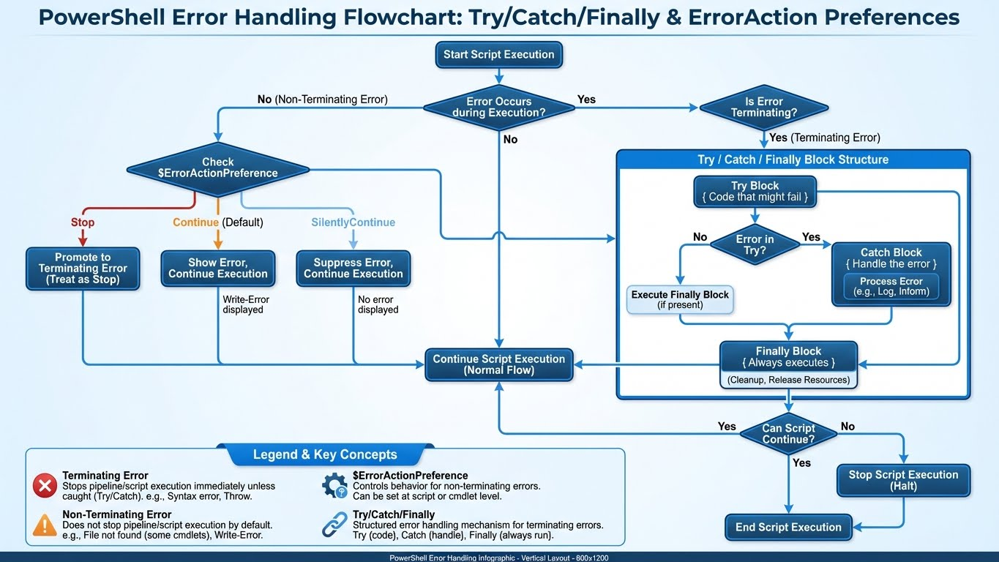

---
tags:
  - windows
  - powershell
  - training
  - workshop
---

# Workshop PowerShell : Les Bonnes Pratiques

Ce workshop compile les meilleures techniques issues de scripts professionnels.
*Source : Analyse des démos de formation (Thomas Boutry).*



## 1. La Gestion des Erreurs (`ErrorAction`)

En production, un script ne doit pas planter silencieusement ou afficher du rouge effrayant sans explication.

### Stop, Continue, SilentlyContinue

```powershell
# Arrête tout si le fichier n'existe pas (Critical)
Get-Item "C:\Config\Secret.conf" -ErrorAction Stop

# Continue même si ça échoue (Non-Critical, ex: cleanup de fichiers temp)
Remove-Item "C:\Temp\*.tmp" -ErrorAction SilentlyContinue

# Capture l'erreur dans une variable sans l'afficher
Get-Service "ServiceInconnu" -ErrorAction SilentlyContinue -ErrorVariable MonErreur

if ($MonErreur) {
    Write-Warning "Le service n'existe pas, mais on continue..."
}
```

### Try/Catch/Finally (Gestion Structurée)

La méthode professionnelle pour gérer les erreurs critiques.

```powershell
try {
    # Code critique qui peut échouer
    $Config = Get-Content "C:\Config\app.json" -ErrorAction Stop | ConvertFrom-Json

    # Connexion à une base de données
    $Connection = New-Object System.Data.SqlClient.SqlConnection
    $Connection.ConnectionString = $Config.ConnectionString
    $Connection.Open()

    Write-Host "Connexion réussie à la base de données" -ForegroundColor Green
}
catch [System.IO.FileNotFoundException] {
    Write-Error "Le fichier de configuration est introuvable !"
    exit 1
}
catch [System.Data.SqlClient.SqlException] {
    Write-Error "Erreur de connexion SQL : $($_.Exception.Message)"
    exit 2
}
catch {
    # Catch générique pour toutes les autres erreurs
    Write-Error "Erreur inattendue : $($_.Exception.Message)"
    Write-Host "Ligne : $($_.InvocationInfo.ScriptLineNumber)" -ForegroundColor Yellow
    exit 99
}
finally {
    # Toujours exécuté, même en cas d'erreur (cleanup)
    if ($Connection -and $Connection.State -eq 'Open') {
        $Connection.Close()
        Write-Verbose "Connexion fermée proprement"
    }
}
```

### $ErrorActionPreference Globale

```powershell
# En début de script, définir le comportement par défaut
$ErrorActionPreference = "Stop"  # Tout échoue = script s'arrête
# $ErrorActionPreference = "Continue"  # (Défaut) Affiche l'erreur et continue
# $ErrorActionPreference = "SilentlyContinue"  # Ignore les erreurs

# Ensuite, override localement si besoin
Get-Service "OptionalService" -ErrorAction SilentlyContinue
```

## 2. Le Pipeline et les Objets

La force de PowerShell est de manipuler des **Objets**, pas du texte.

### Filtrer avant de traiter (Performance)

*   **Mauvais** (Récupère tout, puis filtre) :
    ```powershell
    Get-Service | Where-Object { $_.Status -eq 'Stopped' }
    ```
*   **Bon** (Filtre à la source, si la Cmdlet le permet) :
    ```powershell
    Get-Service -Name "sql*"
    ```

### Créer ses propres objets (Custom Object)

Idéal pour l'export CSV ou JSON.

```powershell
$Rapport = @()

foreach ($Disk in Get-CimInstance Win32_LogicalDisk) {
    # On crée un objet propre avec juste ce qu'on veut
    $Info = [PSCustomObject]@{
        Lettre       = $Disk.DeviceID
        TailleGB     = [math]::Round($Disk.Size / 1GB, 2)
        EspaceLibre  = [math]::Round($Disk.FreeSpace / 1GB, 2)
        Pourcentage  = [math]::Round(($Disk.FreeSpace / $Disk.Size) * 100, 1)
    }
    $Rapport += $Info
}

# Export facile
$Rapport | Export-Csv "C:\Logs\DiskReport.csv" -NoTypeInformation
```

## 3. `WhatIf` et `Confirm`

Toujours implémenter ces switchs pour les actions destructrices.

```powershell
function Remove-VieuxLogs {
    [CmdletBinding(SupportsShouldProcess=$true)]
    param (
        [string]$Path
    )

    # La magie est ici : $PSCmdlet.ShouldProcess
    if ($PSCmdlet.ShouldProcess($Path, "Supprimer les fichiers de plus de 30 jours")) {
        Get-ChildItem $Path | Where-Object LastWriteTime -lt (Get-Date).AddDays(-30) | Remove-Item
    }
}

# Utilisation sans risque
Remove-VieuxLogs -Path "C:\Logs" -WhatIf
```

## 4. Fonctions Avancées (Advanced Functions)

Les fonctions professionnelles utilisent `[CmdletBinding()]` et la validation de paramètres.

### CmdletBinding et Parameter Validation

```powershell
function New-ReportUtilisateur {
    [CmdletBinding()]
    param (
        # Paramètre obligatoire
        [Parameter(Mandatory=$true,
                   ValueFromPipeline=$true,
                   HelpMessage="Nom de l'utilisateur à rechercher")]
        [ValidateNotNullOrEmpty()]
        [string]$Username,

        # Choix limité (enum-like)
        [Parameter()]
        [ValidateSet("JSON", "CSV", "XML")]
        [string]$Format = "JSON",

        # Validation de range
        [Parameter()]
        [ValidateRange(1, 365)]
        [int]$DaysBack = 30,

        # Validation de pattern (email)
        [Parameter()]
        [ValidatePattern("^[\w-\.]+@([\w-]+\.)+[\w-]{2,4}$")]
        [string]$Email,

        # Validation de chemin existant
        [Parameter()]
        [ValidateScript({ Test-Path $_ })]
        [string]$OutputPath = "C:\Reports"
    )

    begin {
        Write-Verbose "Initialisation du rapport (format: $Format)"
        $Results = @()
    }

    process {
        # Process est appelé pour chaque élément du pipeline
        Write-Verbose "Traitement de l'utilisateur: $Username"

        $UserInfo = [PSCustomObject]@{
            Username    = $Username
            Email       = $Email
            DateRapport = Get-Date -Format "yyyy-MM-dd HH:mm"
            Periode     = $DaysBack
        }

        $Results += $UserInfo
    }

    end {
        # Génération du fichier final
        $OutputFile = Join-Path $OutputPath "Report_$(Get-Date -Format 'yyyyMMdd').$($Format.ToLower())"

        switch ($Format) {
            "JSON" { $Results | ConvertTo-Json | Out-File $OutputFile }
            "CSV"  { $Results | Export-Csv $OutputFile -NoTypeInformation }
            "XML"  { $Results | Export-Clixml $OutputFile }
        }

        Write-Host "Rapport généré : $OutputFile" -ForegroundColor Green
    }
}

# Exemples d'utilisation
New-ReportUtilisateur -Username "jdupont" -Email "j.dupont@entreprise.fr" -Format CSV -Verbose

# Via pipeline
"alice", "bob", "charlie" | New-ReportUtilisateur -Format JSON -DaysBack 60
```

### Paramètres dynamiques (DynamicParam)

```powershell
function Get-ServiceDetails {
    [CmdletBinding()]
    param()

    DynamicParam {
        # Créer une liste dynamique basée sur les services réels
        $ServiceNames = (Get-Service).Name

        $AttributeCollection = New-Object System.Collections.ObjectModel.Collection[System.Attribute]
        $ParameterAttribute = New-Object System.Management.Automation.ParameterAttribute
        $ParameterAttribute.Mandatory = $true
        $AttributeCollection.Add($ParameterAttribute)

        $ValidateSetAttribute = New-Object System.Management.Automation.ValidateSetAttribute($ServiceNames)
        $AttributeCollection.Add($ValidateSetAttribute)

        $RuntimeParameter = New-Object System.Management.Automation.RuntimeDefinedParameter('ServiceName', [string], $AttributeCollection)

        $RuntimeParameterDictionary = New-Object System.Management.Automation.RuntimeDefinedParameterDictionary
        $RuntimeParameterDictionary.Add('ServiceName', $RuntimeParameter)

        return $RuntimeParameterDictionary
    }

    process {
        $ServiceName = $PSBoundParameters['ServiceName']
        Get-Service $ServiceName | Select-Object Name, Status, StartType, DisplayName
    }
}
```

## 5. Classes PowerShell (OOP)

Depuis PowerShell 5.0, on peut créer des classes complètes.

```powershell
# Définition d'une classe
class Serveur {
    # Propriétés
    [string]$Nom
    [string]$IP
    [ValidateSet("Dev", "Test", "Prod")]
    [string]$Environnement
    [bool]$IsOnline

    # Propriété calculée (en lecture seule)
    [string]hidden $LastCheck

    # Constructeur par défaut
    Serveur() {
        $this.LastCheck = Get-Date -Format "yyyy-MM-dd HH:mm:ss"
    }

    # Constructeur avec paramètres
    Serveur([string]$nom, [string]$ip, [string]$env) {
        $this.Nom = $nom
        $this.IP = $ip
        $this.Environnement = $env
        $this.LastCheck = Get-Date -Format "yyyy-MM-dd HH:mm:ss"
        $this.VerifierConnexion()
    }

    # Méthode
    [void]VerifierConnexion() {
        $this.IsOnline = Test-Connection -ComputerName $this.IP -Count 1 -Quiet
        $this.LastCheck = Get-Date -Format "yyyy-MM-dd HH:mm:ss"
    }

    # Méthode avec retour
    [string]GetStatus() {
        $status = if ($this.IsOnline) { "ONLINE" } else { "OFFLINE" }
        return "$($this.Nom) ($($this.IP)) - $status - Env: $($this.Environnement)"
    }

    # Méthode statique
    static [string]GetVersion() {
        return "ServerManager v1.0"
    }
}

# Héritage de classe
class ServeurWeb : Serveur {
    [string]$SiteWeb
    [int]$Port

    ServeurWeb([string]$nom, [string]$ip, [string]$env, [string]$site, [int]$port) : base($nom, $ip, $env) {
        $this.SiteWeb = $site
        $this.Port = $port
    }

    [bool]TestHTTP() {
        try {
            $Response = Invoke-WebRequest -Uri "http://$($this.IP):$($this.Port)" -TimeoutSec 5 -UseBasicParsing
            return $Response.StatusCode -eq 200
        }
        catch {
            return $false
        }
    }
}

# Utilisation
$serveur1 = [Serveur]::new("SRV-DB01", "192.168.1.10", "Prod")
$serveur1.GetStatus()

$webServer = [ServeurWeb]::new("SRV-WEB01", "192.168.1.20", "Prod", "intranet.local", 80)
if ($webServer.TestHTTP()) {
    Write-Host "Le serveur web répond correctement" -ForegroundColor Green
}

# Méthode statique
[Serveur]::GetVersion()
```

## 6. PowerShell Remoting (PSSession)

La gestion à distance est essentielle pour l'administration d'infrastructure.

### Configuration WinRM

```powershell
# Sur la machine cible (une seule fois)
Enable-PSRemoting -Force

# Vérifier la config
Get-WSManInstance -ResourceURI winrm/config/listener -Enumerate

# Ajouter des machines de confiance (si pas dans domaine)
Set-Item WSMan:\localhost\Client\TrustedHosts -Value "192.168.1.*" -Force
```

### Invoke-Command (One-shot)

```powershell
# Commande unique sur une machine distante
Invoke-Command -ComputerName "SRV-DB01" -ScriptBlock {
    Get-Service | Where-Object Status -eq "Running"
}

# Sur plusieurs machines en parallèle
$Serveurs = "SRV-WEB01", "SRV-WEB02", "SRV-APP01"
Invoke-Command -ComputerName $Serveurs -ScriptBlock {
    Get-Process | Sort-Object CPU -Descending | Select-Object -First 5
} | Select-Object PSComputerName, ProcessName, CPU

# Avec des credentials
$Cred = Get-Credential -UserName "DOMAIN\admin"
Invoke-Command -ComputerName "SRV-REMOTE" -Credential $Cred -ScriptBlock {
    param($ServiceName)
    Restart-Service $ServiceName -Force
} -ArgumentList "W3SVC"
```

### PSSession (Persistent)

```powershell
# Créer une session persistante (réutilisable)
$Session = New-PSSession -ComputerName "SRV-DB01" -Credential $Cred

# Exécuter plusieurs commandes dans la même session
Invoke-Command -Session $Session -ScriptBlock {
    $disk = Get-PSDrive C
    Write-Output "Espace libre: $([math]::Round($disk.Free / 1GB, 2)) GB"
}

Invoke-Command -Session $Session -ScriptBlock {
    Get-EventLog -LogName System -Newest 10 -EntryType Error
}

# Copier des fichiers vers/depuis la session
Copy-Item -Path "C:\Scripts\Deploy.ps1" -Destination "C:\Temp\" -ToSession $Session
Copy-Item -Path "C:\Logs\app.log" -Destination "C:\LocalLogs\" -FromSession $Session

# Entrer en mode interactif
Enter-PSSession -Session $Session
# ... commandes interactives ...
Exit-PSSession

# Toujours fermer les sessions
Remove-PSSession -Session $Session
```

### Fan-out pattern (Gestion de parc)

```powershell
# Gestion de 50+ serveurs en parallèle
$AllServers = Get-Content "C:\Config\servers.txt"

$Results = Invoke-Command -ComputerName $AllServers -ThrottleLimit 32 -ScriptBlock {
    [PSCustomObject]@{
        Server       = $env:COMPUTERNAME
        Uptime       = (Get-CimInstance Win32_OperatingSystem).LastBootUpTime
        MemoryFreeGB = [math]::Round((Get-CimInstance Win32_OperatingSystem).FreePhysicalMemory / 1MB, 2)
        DiskC_Free   = [math]::Round((Get-PSDrive C).Free / 1GB, 2)
    }
} -ErrorAction SilentlyContinue

$Results | Export-Csv "C:\Reports\Infrastructure_$(Get-Date -Format 'yyyyMMdd').csv" -NoTypeInformation
```

## 7. DSC (Desired State Configuration)

Déclarer l'état souhaité d'un système plutôt que scripter les étapes.

### Configuration DSC basique

```powershell
# Définition de la configuration
Configuration WebServerConfig {
    param (
        [string[]]$ComputerName = "localhost"
    )

    # Import des ressources DSC nécessaires
    Import-DscResource -ModuleName PSDesiredStateConfiguration

    Node $ComputerName {
        # Installer IIS
        WindowsFeature IIS {
            Ensure = "Present"
            Name   = "Web-Server"
        }

        WindowsFeature AspNet45 {
            Ensure    = "Present"
            Name      = "Web-Asp-Net45"
            DependsOn = "[WindowsFeature]IIS"
        }

        # Créer un répertoire
        File WebsiteContent {
            Ensure          = "Present"
            Type            = "Directory"
            DestinationPath = "C:\inetpub\mysite"
            DependsOn       = "[WindowsFeature]IIS"
        }

        # Copier des fichiers
        File IndexPage {
            Ensure          = "Present"
            Type            = "File"
            SourcePath      = "C:\Sources\index.html"
            DestinationPath = "C:\inetpub\mysite\index.html"
            DependsOn       = "[File]WebsiteContent"
        }

        # Configurer un service
        Service W3SVC {
            Name        = "W3SVC"
            State       = "Running"
            StartupType = "Automatic"
            DependsOn   = "[WindowsFeature]IIS"
        }

        # Registry key
        Registry DisableIEESC {
            Ensure    = "Present"
            Key       = "HKLM:\SOFTWARE\Microsoft\Active Setup\Installed Components\{A509B1A7-37EF-4b3f-8CFC-4F3A74704073}"
            ValueName = "IsInstalled"
            ValueData = "0"
            ValueType = "Dword"
        }
    }
}

# Générer le MOF (Managed Object Format)
WebServerConfig -ComputerName "SRV-WEB01", "SRV-WEB02" -OutputPath "C:\DSC\Configs"

# Appliquer la configuration
Start-DscConfiguration -Path "C:\DSC\Configs" -Wait -Verbose -Force

# Tester la conformité
Test-DscConfiguration -ComputerName "SRV-WEB01"

# Obtenir l'état actuel
Get-DscConfiguration -CimSession "SRV-WEB01"
```

### Configuration avancée avec credentials

```powershell
Configuration SecureAppServer {
    param (
        [Parameter(Mandatory)]
        [PSCredential]$DomainAdmin
    )

    Import-DscResource -ModuleName PSDesiredStateConfiguration

    Node "SRV-APP01" {
        User LocalAdmin {
            UserName             = "AppAdmin"
            Password             = $DomainAdmin
            Ensure               = "Present"
            PasswordNeverExpires = $true
            PasswordChangeRequired = $false
        }

        Group Administrators {
            GroupName        = "Administrators"
            Ensure           = "Present"
            MembersToInclude = "AppAdmin"
            DependsOn        = "[User]LocalAdmin"
        }
    }
}

$Cred = Get-Credential
SecureAppServer -DomainAdmin $Cred -OutputPath "C:\DSC\Secure"
```

## 8. Travailler avec les API REST

PowerShell est excellent pour consommer des API modernes.

### Invoke-RestMethod basique

```powershell
# GET simple (retourne des objets PowerShell directement)
$Users = Invoke-RestMethod -Uri "https://jsonplaceholder.typicode.com/users" -Method Get
$Users | Select-Object id, name, email | Format-Table

# POST avec body JSON
$NewPost = @{
    title  = "Mon article"
    body   = "Contenu de l'article..."
    userId = 1
} | ConvertTo-Json

$Response = Invoke-RestMethod -Uri "https://jsonplaceholder.typicode.com/posts" `
    -Method Post `
    -Body $NewPost `
    -ContentType "application/json"

Write-Host "Post créé avec l'ID: $($Response.id)"
```

### Authentification (Bearer Token)

```powershell
# Exemple avec GitHub API
$Token = "ghp_YourPersonalAccessToken"
$Headers = @{
    Authorization = "Bearer $Token"
    Accept        = "application/vnd.github.v3+json"
}

$Repos = Invoke-RestMethod -Uri "https://api.github.com/user/repos" `
    -Headers $Headers `
    -Method Get

$Repos | Select-Object name, private, updated_at | Format-Table
```

### Gestion d'erreurs et pagination

```powershell
function Get-GitHubRepos {
    param (
        [string]$Username,
        [string]$Token
    )

    $Headers = @{
        Authorization = "Bearer $Token"
        Accept        = "application/vnd.github.v3+json"
    }

    $Page = 1
    $PerPage = 100
    $AllRepos = @()

    do {
        try {
            $Uri = "https://api.github.com/users/$Username/repos?page=$Page&per_page=$PerPage"
            $Response = Invoke-RestMethod -Uri $Uri -Headers $Headers -Method Get

            if ($Response.Count -gt 0) {
                $AllRepos += $Response
                Write-Verbose "Page $Page : $($Response.Count) repos récupérés"
                $Page++
            }
        }
        catch {
            Write-Error "Erreur API : $($_.Exception.Message)"
            break
        }
    } while ($Response.Count -eq $PerPage)

    return $AllRepos
}

# Utilisation
$Repos = Get-GitHubRepos -Username "octocat" -Token $env:GITHUB_TOKEN -Verbose
Write-Host "Total: $($Repos.Count) repositories"
```

### Webhook et API avec authentification complexe

```powershell
# Exemple avec API Azure DevOps (Basic Auth)
$Organization = "myorg"
$Project = "myproject"
$PAT = "your-personal-access-token"

$EncodedPAT = [Convert]::ToBase64String([Text.Encoding]::ASCII.GetBytes(":$PAT"))
$Headers = @{
    Authorization = "Basic $EncodedPAT"
}

$Uri = "https://dev.azure.com/$Organization/$Project/_apis/build/builds?api-version=6.0"
$Builds = Invoke-RestMethod -Uri $Uri -Headers $Headers -Method Get

$Builds.value | Select-Object id, buildNumber, status, result | Format-Table
```

## 9. Développement de Modules

Créer des modules réutilisables pour standardiser vos scripts.

### Structure d'un module

```
MonModule/
├── MonModule.psd1      # Manifeste (metadata)
├── MonModule.psm1      # Script module principal
├── Public/             # Fonctions exportées
│   ├── Get-MyData.ps1
│   └── Set-MyConfig.ps1
├── Private/            # Fonctions internes
│   └── Invoke-Helper.ps1
└── en-US/              # Aide (optionnel)
    └── about_MonModule.help.txt
```

### Créer le manifeste (.psd1)

```powershell
# Générer le manifeste automatiquement
New-ModuleManifest -Path "C:\Modules\MonModule\MonModule.psd1" `
    -RootModule "MonModule.psm1" `
    -Author "Votre Nom" `
    -CompanyName "Votre Entreprise" `
    -Description "Module de gestion d'infrastructure" `
    -ModuleVersion "1.0.0" `
    -PowerShellVersion "5.1" `
    -FunctionsToExport @("Get-MyData", "Set-MyConfig") `
    -CmdletsToExport @() `
    -VariablesToExport @() `
    -AliasesToExport @() `
    -Tags @("Infrastructure", "Automation", "Windows")
```

### Le module principal (.psm1)

```powershell
# MonModule.psm1

# Charger toutes les fonctions publiques
$PublicFunctions = Get-ChildItem -Path "$PSScriptRoot\Public\*.ps1"
foreach ($Function in $PublicFunctions) {
    . $Function.FullName
}

# Charger les fonctions privées
$PrivateFunctions = Get-ChildItem -Path "$PSScriptRoot\Private\*.ps1"
foreach ($Function in $PrivateFunctions) {
    . $Function.FullName
}

# Exporter uniquement les fonctions publiques
Export-ModuleMember -Function $PublicFunctions.BaseName

# Variable de configuration du module
$Script:ModuleConfig = @{
    Version = "1.0.0"
    LogPath = "C:\Logs\MonModule"
}
```

### Publier sur PowerShell Gallery

```powershell
# 1. Obtenir une clé API depuis https://www.powershellgallery.com
$ApiKey = "votre-api-key"

# 2. Publier le module
Publish-Module -Path "C:\Modules\MonModule" `
    -NuGetApiKey $ApiKey `
    -Repository PSGallery `
    -Verbose

# 3. Les utilisateurs peuvent maintenant installer
Install-Module -Name MonModule -Scope CurrentUser

# Mise à jour du module
Update-Module -Name MonModule
```

## 10. Debugging et Débogage

### Set-PSBreakpoint (Points d'arrêt)

```powershell
# Point d'arrêt sur une ligne spécifique
Set-PSBreakpoint -Script "C:\Scripts\MonScript.ps1" -Line 42

# Point d'arrêt sur une variable (quand elle change)
Set-PSBreakpoint -Script "C:\Scripts\MonScript.ps1" -Variable "ImportantVar"

# Point d'arrêt sur une commande
Set-PSBreakpoint -Command "Invoke-RestMethod"

# Lister tous les breakpoints
Get-PSBreakpoint

# Supprimer un breakpoint
Remove-PSBreakpoint -Id 2

# Supprimer tous les breakpoints
Get-PSBreakpoint | Remove-PSBreakpoint
```

### Write-Debug et $DebugPreference

```powershell
function Test-DebuggingFunction {
    [CmdletBinding()]
    param (
        [string]$Name
    )

    Write-Debug "Début de la fonction avec Name=$Name"

    $Result = "Hello, $Name"

    Write-Debug "Résultat calculé: $Result"

    return $Result
}

# Par défaut, Write-Debug n'affiche rien
Test-DebuggingFunction -Name "World"

# Activer le mode debug
Test-DebuggingFunction -Name "World" -Debug

# Ou globalement
$DebugPreference = "Continue"
Test-DebuggingFunction -Name "World"
```

### Verbose et Progress

```powershell
function Copy-LargeDataset {
    [CmdletBinding()]
    param (
        [string[]]$Files,
        [string]$Destination
    )

    Write-Verbose "Début de la copie de $($Files.Count) fichiers vers $Destination"

    $i = 0
    foreach ($File in $Files) {
        $i++
        $Percent = [math]::Round(($i / $Files.Count) * 100)

        Write-Progress -Activity "Copie de fichiers" `
            -Status "$i sur $($Files.Count)" `
            -PercentComplete $Percent `
            -CurrentOperation "Copie de $File"

        Copy-Item -Path $File -Destination $Destination -Force
        Write-Verbose "Copié: $File"

        Start-Sleep -Milliseconds 100
    }

    Write-Progress -Activity "Copie de fichiers" -Completed
    Write-Verbose "Copie terminée avec succès"
}

# Utilisation avec verbose
Copy-LargeDataset -Files (Get-ChildItem "C:\Source\*.log") -Destination "C:\Backup\" -Verbose
```

## 11. Optimisation des Performances

### Pipeline vs ForEach-Object vs foreach()

```powershell
# LENT : ForEach-Object (streaming, un par un)
Measure-Command {
    1..10000 | ForEach-Object { $_ * 2 }
}

# RAPIDE : foreach() (charge tout en mémoire, puis traite)
Measure-Command {
    $Numbers = 1..10000
    foreach ($Num in $Numbers) { $Num * 2 }
}

# TRÈS RAPIDE : Opérations natives
Measure-Command {
    $Numbers = 1..10000
    $Numbers | ForEach-Object { $_ * 2 }  # Éviter ça
}

# OPTIMAL pour grands ensembles
$Data = 1..100000
Measure-Command {
    $Results = foreach ($Item in $Data) {
        [PSCustomObject]@{
            Original = $Item
            Double   = $Item * 2
        }
    }
}
```

### Filter Left (Filtrer tôt)

```powershell
# MAUVAIS : Récupère tout, puis filtre
Measure-Command {
    Get-ChildItem C:\Windows -Recurse -ErrorAction SilentlyContinue |
        Where-Object { $_.Extension -eq ".log" }
}

# BON : Filtre dès le départ
Measure-Command {
    Get-ChildItem C:\Windows -Recurse -Filter "*.log" -ErrorAction SilentlyContinue
}

# MAUVAIS : Traite tout, puis select
Get-Process |
    ForEach-Object { [PSCustomObject]@{ Name=$_.Name; CPU=$_.CPU } } |
    Select-Object -First 10

# BON : Limite d'abord
Get-Process |
    Select-Object -First 10 |
    ForEach-Object { [PSCustomObject]@{ Name=$_.Name; CPU=$_.CPU } }
```

### Utiliser [System.Collections.Generic.List]

```powershell
# LENT : += sur array (recrée le tableau à chaque fois)
Measure-Command {
    $Array = @()
    for ($i = 1; $i -le 10000; $i++) {
        $Array += $i
    }
}

# RAPIDE : List<T> (redimensionnable)
Measure-Command {
    $List = [System.Collections.Generic.List[int]]::new()
    for ($i = 1; $i -le 10000; $i++) {
        $List.Add($i)
    }
}
```

## 12. Bonnes Pratiques et Style Guide

### Conventions de nommage

```powershell
# Verbes approuvés (Get-Verb pour la liste complète)
Get-Data      # BON
Retrieve-Data # MAUVAIS (utiliser Get)

# PascalCase pour tout
Get-MyCustomData  # BON
get-mycustomdata  # MAUVAIS

# Noms de paramètres descriptifs
param([string]$Path)                    # BON
param([string]$p)                       # MAUVAIS

# Variables : PascalCase ou camelCase
$MyVariable = "valeur"   # BON
$my_variable = "valeur"  # MAUVAIS (snake_case non recommandé)
```

### Commentaires et documentation

```powershell
function Get-ServerInfo {
    <#
    .SYNOPSIS
        Récupère les informations système d'un serveur.

    .DESCRIPTION
        Cette fonction collecte les informations CPU, RAM, disque et OS
        d'un serveur local ou distant via WMI/CIM.

    .PARAMETER ComputerName
        Nom ou IP du serveur cible. Défaut: localhost

    .PARAMETER Credential
        Credentials pour connexion distante (optionnel)

    .EXAMPLE
        Get-ServerInfo -ComputerName "SRV-DB01"

        Récupère les infos du serveur SRV-DB01

    .EXAMPLE
        Get-ServerInfo -ComputerName "192.168.1.50" -Credential (Get-Credential)

        Récupère les infos avec authentification

    .OUTPUTS
        PSCustomObject avec propriétés Server, OS, CPU, MemoryGB, Disks

    .NOTES
        Author:  Votre Nom
        Version: 1.0
        Date:    2025-12-08
    #>
    [CmdletBinding()]
    param (
        [string]$ComputerName = $env:COMPUTERNAME,
        [PSCredential]$Credential
    )

    # Implémentation...
}
```

### Structure de script recommandée

```powershell
<#
.SYNOPSIS
    Description courte du script
#>

#Requires -Version 5.1
#Requires -RunAsAdministrator

[CmdletBinding()]
param (
    # Paramètres ici
)

# --- CONFIGURATION ---
$ErrorActionPreference = "Stop"
$VerbosePreference = "Continue"

# --- FONCTIONS ---
function Invoke-HelperFunction {
    # ...
}

# --- VARIABLES GLOBALES ---
$Script:LogPath = "C:\Logs\MonScript_$(Get-Date -Format 'yyyyMMdd').log"

# --- MAIN ---
try {
    Write-Verbose "Début du script..."

    # Logique principale ici

    Write-Verbose "Script terminé avec succès"
    exit 0
}
catch {
    Write-Error "Erreur fatale: $($_.Exception.Message)"
    exit 1
}
finally {
    # Cleanup si nécessaire
}
```

### Tests (Pester Framework)

```powershell
# Installer Pester
Install-Module -Name Pester -Force -SkipPublisherCheck

# Fichier de test : Get-MyData.Tests.ps1
Describe "Get-MyData Tests" {
    Context "Quand le fichier existe" {
        It "Retourne des données valides" {
            $Result = Get-MyData -Path "C:\Test\data.json"
            $Result | Should -Not -BeNullOrEmpty
            $Result.Count | Should -BeGreaterThan 0
        }
    }

    Context "Quand le fichier n'existe pas" {
        It "Lève une erreur" {
            { Get-MyData -Path "C:\Inexistant.json" -ErrorAction Stop } | Should -Throw
        }
    }
}

# Exécuter les tests
Invoke-Pester -Path "C:\Scripts\Tests\" -Output Detailed
```

## Ressources et Références

### Documentation officielle
- [PowerShell Documentation](https://docs.microsoft.com/powershell/)
- [PowerShell Gallery](https://www.powershellgallery.com/)
- [PowerShell GitHub](https://github.com/PowerShell/PowerShell)

### Outils essentiels
- **VSCode** avec extension PowerShell
- **PSScriptAnalyzer** : Linter pour PowerShell
- **Pester** : Framework de tests
- **Plaster** : Scaffolding de modules

### Commandes utiles pour apprendre

```powershell
# Aide contextuelle
Get-Help Get-Process -Full
Get-Help about_Functions_Advanced
Get-Help about_Classes

# Découvrir les commandes
Get-Command -Verb Get -Noun *Service*
Get-Command -Module ActiveDirectory

# Explorer les objets
Get-Process | Get-Member
Get-Service | Select-Object -First 1 | Format-List *

# Historique et alias
Get-History
Get-Alias
```

---

**Prochaines étapes** : Pratiquez ces concepts dans des projets réels, contribuez à des modules open-source, et rejoignez la communauté PowerShell !
