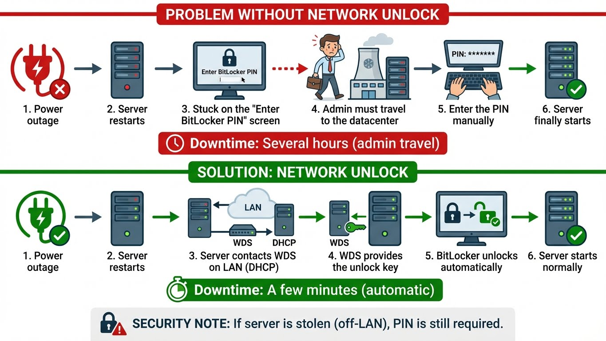

---
tags:
  - bitlocker
  - encryption
  - tpm
  - security
---

# BitLocker (Chiffrement Disque)

Chiffrement de disque intégral avec TPM et Network Unlock.

---

## Vérifier l'État

```powershell
# État de tous les volumes
Get-BitLockerVolume

# Output:
# VolumeType  MountPoint  VolumeStatus   EncryptionPercentage  KeyProtector
# ----------  ----------  ------------   --------------------  ------------
# OperatingSystem C:      FullyEncrypted 100                   {Tpm, RecoveryPassword}

# Détails d'un volume
Get-BitLockerVolume -MountPoint "C:" | Format-List *
```

---

## Activer BitLocker

```powershell
# Vérifier le TPM
Get-Tpm

# Activer sur le disque système (avec TPM)
Enable-BitLocker -MountPoint "C:" `
    -EncryptionMethod XtsAes256 `
    -TpmProtector `
    -RecoveryPasswordProtector

# Activer sur un disque de données
Enable-BitLocker -MountPoint "D:" `
    -EncryptionMethod XtsAes256 `
    -RecoveryPasswordProtector

# Avec mot de passe (sans TPM)
$password = Read-Host -AsSecureString "Enter BitLocker password"
Enable-BitLocker -MountPoint "D:" `
    -EncryptionMethod XtsAes256 `
    -PasswordProtector `
    -Password $password
```

---

## Sauvegarder la Clé de Récupération

```powershell
# Récupérer l'ID du protecteur
(Get-BitLockerVolume -MountPoint "C:").KeyProtector

# Sauvegarder dans Active Directory
Backup-BitLockerKeyProtector -MountPoint "C:" `
    -KeyProtectorId "{GUID-DU-PROTECTEUR}"

# Exporter vers un fichier
(Get-BitLockerVolume -MountPoint "C:").KeyProtector |
    Where-Object KeyProtectorType -eq "RecoveryPassword" |
    Select-Object KeyProtectorId, RecoveryPassword |
    Export-Csv "BitLocker_Recovery_Keys.csv" -NoTypeInformation
```

!!! danger "Clés de récupération"
    - **Toujours** sauvegarder les clés AVANT de chiffrer
    - Stocker dans AD ou coffre-fort sécurisé
    - Sans la clé = données perdues définitivement

---

## Gestion BitLocker

```powershell
# Suspendre temporairement (pour BIOS update)
Suspend-BitLocker -MountPoint "C:" -RebootCount 1

# Reprendre
Resume-BitLocker -MountPoint "C:"

# Désactiver et déchiffrer
Disable-BitLocker -MountPoint "C:"

# Verrouiller un volume
Lock-BitLocker -MountPoint "D:"

# Déverrouiller
Unlock-BitLocker -MountPoint "D:" -RecoveryPassword "123456-789012-..."
```

---

## Network Unlock

**Network Unlock = Déverrouiller BitLocker automatiquement si le serveur est sur le réseau d'entreprise**



### Configuration Network Unlock

**Prérequis :**
- Windows Server 2019/2022/2025 (Datacenter ou Standard)
- Serveur WDS (Windows Deployment Services) sur le réseau
- Certificat PKI pour WDS
- TPM 1.2+ sur les serveurs à protéger

**Étape 1 : Configurer le serveur WDS**

```powershell
# Sur le serveur WDS (rôle dédié ou DC)

# Installer WDS
Install-WindowsFeature -Name WDS -IncludeManagementTools

# Initialiser WDS (si pas déjà fait)
wdsutil /initialize-server /remInst:"C:\RemoteInstall"

# Créer un certificat pour Network Unlock (via CA interne)
# Ou générer un certificat auto-signé (lab uniquement)
$Cert = New-SelfSignedCertificate -DnsName "wds.corp.local" `
    -CertStoreLocation "Cert:\LocalMachine\My" `
    -KeyUsage KeyEncipherment, DataEncipherment `
    -Type SSLServerAuthentication

# Exporter le certificat (publique + privée)
$CertPassword = ConvertTo-SecureString -String "P@ssw0rd" -Force -AsPlainText
Export-PfxCertificate -Cert $Cert -FilePath "C:\WDS-NetworkUnlock.pfx" -Password $CertPassword
```

**Étape 2 : Configurer via GPO**

```text
GPO Path: Computer Configuration → Policies → Windows Settings
          → Security Settings → Public Key Policies → BitLocker Drive Encryption

Sous-menu : Operating System Drives

Paramètres :
├── Require additional authentication at startup  → Enabled
│   ├── Allow BitLocker without a compatible TPM  → Unchecked
│   ├── Configure TPM startup                      → Allow TPM
│   ├── Configure TPM startup PIN                  → Require startup PIN with TPM
│   └── Configure TPM startup key                  → Do not allow startup key with TPM
│
└── Network Unlock (nouvelle option)              → Enabled
    ├── Network Unlock Certificate                 → Importer le certificat WDS
    └── Allow Network Unlock on this domain        → Enabled
```

**Étape 3 : Déployer sur les serveurs**

```powershell
# Sur chaque serveur BitLocker

# Importer le certificat WDS (partie publique)
Import-Certificate -FilePath "\\wds\share\WDS-NetworkUnlock.cer" `
    -CertStoreLocation "Cert:\LocalMachine\Root"

# Activer Network Unlock sur le volume C:
Enable-BitLocker -MountPoint "C:" `
    -EncryptionMethod XtsAes256 `
    -TpmProtector `
    -RecoveryPasswordProtector `
    -SkipHardwareTest

# Ajouter le protecteur Network Unlock
Add-BitLockerKeyProtector -MountPoint "C:" `
    -NetworkUnlockProtector
```

**Étape 4 : Tester Network Unlock**

```powershell
# Vérifier que Network Unlock est configuré
Get-BitLockerVolume -MountPoint "C:" | Select-Object -ExpandProperty KeyProtector

# Output attendu :
# KeyProtectorType           KeyProtectorId
# ----------------           --------------
# Tpm                        {GUID-1}
# RecoveryPassword           {GUID-2}
# NetworkUnlock              {GUID-3}

# Redémarrer le serveur pour tester
Restart-Computer

# Au boot, si le serveur est sur le LAN :
# → Déverrouillage automatique (pas de PIN demandé)

# Au boot, si le serveur est hors LAN (volé, déplacé) :
# → PIN demandé
```

### Scénarios d'Usage

| Scénario | PIN Requis ? | Network Unlock ? |
|----------|-------------|------------------|
| Boot normal sur le LAN entreprise | Non | Oui (automatique) |
| Boot hors LAN (datacenter distant) | Oui | Non (WDS inaccessible) |
| Serveur volé (hors LAN) | Oui | Non (sécurité préservée) |
| Panne électrique + redémarrage auto | Non | Oui (serveur démarre seul) |

### Débogage

```powershell
# Activer les logs détaillés BitLocker
wevtutil sl Microsoft-Windows-BitLocker/BitLocker Management /e:true /l:5

# Lire les logs Network Unlock
Get-WinEvent -LogName "Microsoft-Windows-BitLocker/BitLocker Management" |
    Where-Object { $_.Message -like "*Network Unlock*" } |
    Select-Object TimeCreated, Id, Message

# Event IDs importants :
# 853 : Network Unlock réussi
# 854 : Network Unlock échoué (serveur WDS inaccessible)
# 855 : Network Unlock désactivé (hors LAN)
```

!!! tip "Astuce Production"
    Network Unlock est **idéal pour** :

    - **Datacenters** : Éviter les déplacements physiques pour entrer le PIN après une panne
    - **Serveurs critiques** : Redémarrage automatique sans intervention humaine
    - **Clusters** : Les nœuds peuvent redémarrer automatiquement après un failover

    **Sécurité maintenue :** Si le serveur est volé et déplacé hors du réseau, le PIN reste requis.

---

## Référence Rapide

```powershell
# === BITLOCKER ===
Get-BitLockerVolume                               # État
Enable-BitLocker -MountPoint "C:" -TpmProtector -RecoveryPasswordProtector
Backup-BitLockerKeyProtector -MountPoint "C:" -KeyProtectorId "{GUID}"
Suspend-BitLocker -MountPoint "C:" -RebootCount 1
Resume-BitLocker -MountPoint "C:"
```

---

## Prérequis

```text
PRÉREQUIS BITLOCKER
══════════════════════════════════════════════════════════

Matériel :
• TPM 1.2 ou 2.0 (recommandé)
• UEFI/BIOS compatible Secure Boot
• Partition système EFI ou réservée

Logiciel :
• Windows Pro, Enterprise ou Education
• Rôle BitLocker activé (serveur)

Sans TPM (non recommandé) :
• Nécessite GPO pour autoriser
• Mot de passe ou clé USB au boot
```

---

## Activer BitLocker (Disque Système)

```powershell
# Avec TPM uniquement (boot automatique)
Enable-BitLocker -MountPoint "C:" `
    -TpmProtector `
    -EncryptionMethod XtsAes256 `
    -UsedSpaceOnly

# Avec TPM + PIN (recommandé)
$pin = ConvertTo-SecureString "123456" -AsPlainText -Force
Enable-BitLocker -MountPoint "C:" `
    -TpmAndPinProtector `
    -Pin $pin `
    -EncryptionMethod XtsAes256

# Ajouter une clé de récupération
Add-BitLockerKeyProtector -MountPoint "C:" -RecoveryPasswordProtector

# Sauvegarder la clé dans AD
Backup-BitLockerKeyProtector -MountPoint "C:" -KeyProtectorId (
    (Get-BitLockerVolume -MountPoint "C:").KeyProtector |
    Where-Object { $_.KeyProtectorType -eq "RecoveryPassword" }
).KeyProtectorId

# Démarrer le chiffrement
Resume-BitLocker -MountPoint "C:"
```

---

## Activer BitLocker (Disque de Données)

```powershell
# Avec mot de passe
$pwd = ConvertTo-SecureString "P@ssw0rd123!" -AsPlainText -Force
Enable-BitLocker -MountPoint "D:" `
    -PasswordProtector `
    -Password $pwd `
    -EncryptionMethod XtsAes256

# Auto-unlock (déverrouillage automatique avec le disque système)
Enable-BitLockerAutoUnlock -MountPoint "D:"
```

---

## Gestion des Protecteurs

```powershell
# Lister les protecteurs
(Get-BitLockerVolume -MountPoint "C:").KeyProtector

# Types de protecteurs :
# - Tpm
# - TpmAndPin
# - TpmAndStartupKey
# - TpmAndPinAndStartupKey
# - RecoveryPassword
# - Password
# - ExternalKey (USB)

# Ajouter un protecteur de récupération
Add-BitLockerKeyProtector -MountPoint "C:" -RecoveryPasswordProtector

# Ajouter un protecteur USB
Add-BitLockerKeyProtector -MountPoint "C:" -StartupKeyProtector -StartupKeyPath "E:"

# Supprimer un protecteur
Remove-BitLockerKeyProtector -MountPoint "C:" -KeyProtectorId "{GUID}"

# Changer le PIN
$newPin = ConvertTo-SecureString "654321" -AsPlainText -Force
Add-BitLockerKeyProtector -MountPoint "C:" -TpmAndPinProtector -Pin $newPin
```

---

## Récupération depuis Active Directory

```powershell
# Depuis Active Directory (sur le DC)
Get-ADObject -Filter 'objectClass -eq "msFVE-RecoveryInformation"' `
    -SearchBase "CN=COMPUTERNAME,OU=Computers,DC=corp,DC=local" `
    -Properties msFVE-RecoveryPassword |
    Select-Object -ExpandProperty msFVE-RecoveryPassword
```

---

## BitLocker To Go (USB)

```powershell
# Chiffrer une clé USB
$pwd = ConvertTo-SecureString "USBPass123!" -AsPlainText -Force
Enable-BitLocker -MountPoint "E:" `
    -PasswordProtector `
    -Password $pwd `
    -EncryptionMethod XtsAes128

# Lecteurs amovibles peuvent utiliser AES-CBC pour compatibilité
Enable-BitLocker -MountPoint "E:" -EncryptionMethod Aes128
```

---

## Configuration GPO

```text
Computer Configuration > Administrative Templates >
Windows Components > BitLocker Drive Encryption

Paramètres importants :
─────────────────────────────────────────────────────────
Operating System Drives:
  • Require additional authentication at startup
    → Configure TPM + PIN

  • Choose how BitLocker-protected drives can be recovered
    → Save to AD DS
    → Do not enable BitLocker until recovery info stored in AD

Fixed Data Drives:
  • Configure use of passwords
  • Configure use of smart cards

Removable Data Drives:
  • Control use of BitLocker on removable drives
  • Deny write access to removable drives not protected by BitLocker
```

---

## Monitoring et Troubleshooting

```powershell
# État du chiffrement
Get-BitLockerVolume | Select-Object MountPoint, VolumeStatus, EncryptionPercentage, ProtectionStatus

# Event logs
Get-WinEvent -LogName "Microsoft-Windows-BitLocker/BitLocker Management" -MaxEvents 20

# Vérifier le status TPM
manage-bde -tpm -turnon

# Réparer un volume
manage-bde -repair C: -RecoveryPassword 123456-789012-...

# Forcer le chiffrement complet (pas seulement espace utilisé)
manage-bde -on C: -UsedSpaceOnly:$false
```

---

## Bonnes Pratiques

```yaml
Checklist BitLocker:
  Configuration:
    - [ ] TPM 2.0 + PIN pour système
    - [ ] XtsAes256 pour disques internes
    - [ ] Clé de récupération dans AD
    - [ ] Auto-unlock pour disques de données

  Sécurité:
    - [ ] PIN de 6+ caractères
    - [ ] Secure Boot activé
    - [ ] Politique de récupération documentée

  Opérations:
    - [ ] Test de récupération régulier
    - [ ] Monitoring du statut
    - [ ] Procédure de décommissionnement
```

---

!!! info "À lire aussi"
    - [PKI Bootstrap](pki-bootstrap.md) - Certificats pour VPN pre-join
    - [LAPS](laps.md) - Rotation des mots de passe Admin
    - [Credential Guard](../credential-guard.md) - Protection des credentials
    - [GPO](../ad-gpo.md) - Déploiement via GPO
