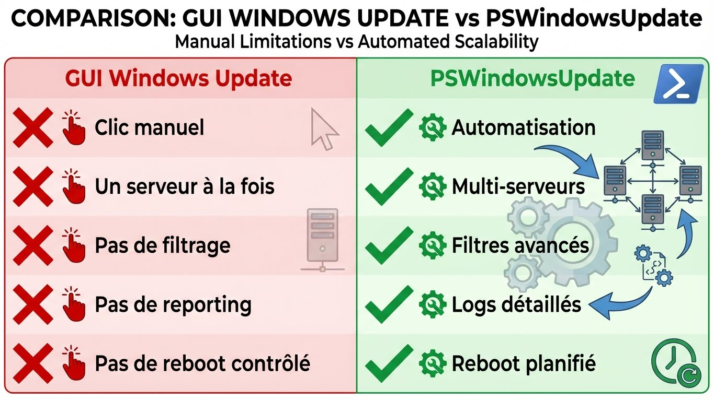
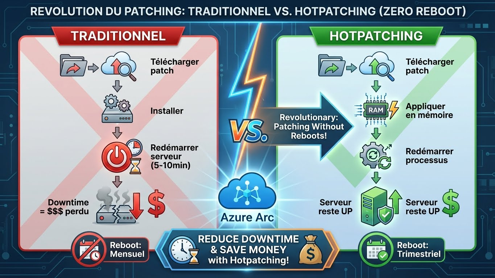
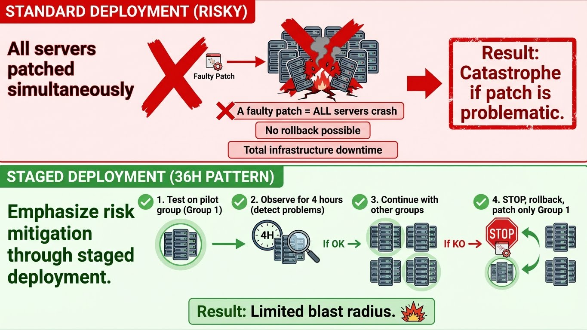
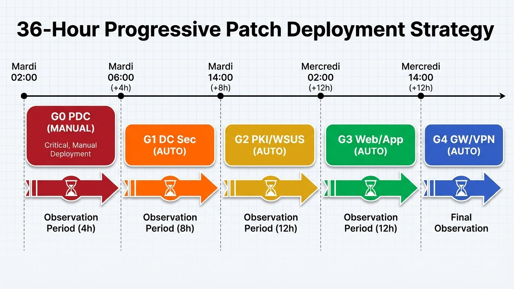

---
tags:
  - wsus
  - updates
  - hotpatching
  - pswindowsupdate
  - azure-arc
---

# Update Management: WSUS & Modern Patching

Gestion moderne des mises à jour Windows Server : PSWindowsUpdate, WSUS Legacy, et Hotpatching (2025).


---

## L'Outil Indispensable : PSWindowsUpdate

### Qu'est-ce que PSWindowsUpdate ?

**PSWindowsUpdate = Le module PowerShell communautaire que tout admin Windows utilise**



### Installation

```powershell
# Installer le module (depuis PowerShell Gallery)
Install-Module PSWindowsUpdate -Force

# Vérifier l'installation
Get-Module PSWindowsUpdate -ListAvailable

# Importer le module
Import-Module PSWindowsUpdate

# Lister les commandes disponibles
Get-Command -Module PSWindowsUpdate
```

**Commandes principales :**

| Commande | Description |
|----------|-------------|
| `Get-WindowsUpdate` | Lister les mises à jour disponibles |
| `Install-WindowsUpdate` | Installer les mises à jour |
| `Hide-WindowsUpdate` | Masquer une mise à jour |
| `Show-WindowsUpdate` | Afficher une mise à jour masquée |
| `Get-WUHistory` | Historique des installations |
| `Get-WURebootStatus` | Vérifier si un reboot est requis |

### Usage de Base

```powershell
# Lister les mises à jour disponibles
Get-WindowsUpdate

# Output:
# ComputerName Status KB        Size Title
# ------------ ------ --        ---- -----
# SRV01        ------ KB5034441 145M 2024-01 Cumulative Update for Windows Server 2022

# Installer toutes les mises à jour
Install-WindowsUpdate -AcceptAll -AutoReboot

# Installer sans redémarrer
Install-WindowsUpdate -AcceptAll -IgnoreReboot

# Installer uniquement les mises à jour critiques
Install-WindowsUpdate -MicrosoftUpdate -AcceptAll -Criteria "IsInstalled=0 and Type='Software'" -AutoReboot

# Installer uniquement les mises à jour de sécurité
Get-WindowsUpdate -Category 'Security Updates' | Install-WindowsUpdate -AcceptAll
```

### Filtrage Avancé

```powershell
# Exclure les mises à jour de pilotes
Install-WindowsUpdate -AcceptAll -NotCategory "Drivers" -AutoReboot

# Exclure un KB spécifique (problématique)
Install-WindowsUpdate -AcceptAll -NotKBArticleID "KB5034441" -AutoReboot

# Installer uniquement les définitions Windows Defender
Get-WindowsUpdate -Category "Definition Updates" | Install-WindowsUpdate -AcceptAll

# Télécharger sans installer (pré-staging)
Get-WindowsUpdate -Download -AcceptAll

# Installer les mises à jour déjà téléchargées
Install-WindowsUpdate -AcceptAll -AutoReboot
```

### Gestion Multi-Serveurs

```powershell
# Liste de serveurs
$Servers = @("SRV01", "SRV02", "SRV03")

# Vérifier les mises à jour sur tous les serveurs
$Servers | ForEach-Object {
    Get-WindowsUpdate -ComputerName $_
}

# Installer sur tous les serveurs
$Servers | ForEach-Object {
    Invoke-Command -ComputerName $_ -ScriptBlock {
        Import-Module PSWindowsUpdate
        Install-WindowsUpdate -AcceptAll -AutoReboot
    }
}

# Avec reporting
$Report = @()
foreach ($Server in $Servers) {
    $Updates = Get-WindowsUpdate -ComputerName $Server
    $Report += [PSCustomObject]@{
        Server        = $Server
        UpdatesCount  = $Updates.Count
        Updates       = $Updates.Title -join "; "
    }
}
$Report | Export-Csv "Updates_Report.csv" -NoTypeInformation
```

### Planification avec Tâches Planifiées

```powershell
# Créer une tâche planifiée pour installer les mises à jour tous les mardis à 3h
$Action = New-ScheduledTaskAction -Execute "PowerShell.exe" `
    -Argument '-NoProfile -Command "Import-Module PSWindowsUpdate; Install-WindowsUpdate -AcceptAll -AutoReboot"'

$Trigger = New-ScheduledTaskTrigger -Weekly -DaysOfWeek Tuesday -At 3AM

$Principal = New-ScheduledTaskPrincipal -UserId "SYSTEM" -LogonType ServiceAccount -RunLevel Highest

Register-ScheduledTask -TaskName "Windows Updates - Auto Install" `
    -Action $Action `
    -Trigger $Trigger `
    -Principal $Principal `
    -Description "Installation automatique des mises à jour Windows"
```

### Historique et Reporting

```powershell
# Historique des mises à jour
Get-WUHistory

# Dernières 10 mises à jour
Get-WUHistory | Select-Object -First 10 ComputerName, Date, Title, Result

# Mises à jour échouées
Get-WUHistory | Where-Object Result -eq "Failed"

# Vérifier si un reboot est requis
Get-WURebootStatus

# Export CSV pour audit
Get-WUHistory | Export-Csv "Update_History.csv" -NoTypeInformation
```

!!! tip "Astuce Production"
    Utilisez PSWindowsUpdate avec **Ansible** ou **Scheduled Tasks** pour automatiser les patchs sur votre parc :

    ```yaml
    # Playbook Ansible
    - name: Install Windows Updates
      win_updates:
        category_names:
          - SecurityUpdates
          - CriticalUpdates
        reboot: yes
        reboot_timeout: 3600
    ```

---

## WSUS : Gestion Legacy (2019/2022)

### Qu'est-ce que WSUS ?

**WSUS (Windows Server Update Services) = Serveur de mises à jour local**

```text
┌─────────────────────────────────────────────────────────────┐
│                      ARCHITECTURE WSUS                       │
├─────────────────────────────────────────────────────────────┤
│                                                              │
│  Microsoft Update  ──→  WSUS Server  ──→  Clients Windows   │
│  (Internet)              (Interne)         (Parc)           │
│                                                              │
│  Avantages :                                                │
│  ✓ Contrôle des mises à jour (approuver/refuser)            │
│  ✓ Bande passante économisée (téléchargement unique)        │
│  ✓ Reporting centralisé                                     │
│  ✓ Déploiement par groupes                                  │
│                                                              │
└─────────────────────────────────────────────────────────────┘
```

!!! warning "WSUS est officiellement Deprecated dans Server 2025"
    Microsoft recommande désormais **Azure Update Management** ou **Microsoft Endpoint Manager (SCCM)**.

    Cependant, WSUS fonctionne encore sur Server 2025 pour les environnements on-premises purs.

### Installation WSUS

```powershell
# Installer le rôle WSUS (avec base de données interne WID)
Install-WindowsFeature -Name UpdateServices -IncludeManagementTools

# Avec base de données SQL Server (pour gros parcs >500 clients)
Install-WindowsFeature -Name UpdateServices, UpdateServices-DB -IncludeManagementTools

# Post-installation : Configurer le répertoire de stockage
# (Prévoir 50-100 GB minimum)
$WSUSUtil = "C:\Program Files\Update Services\Tools\wsusutil.exe"
& $WSUSUtil postinstall CONTENT_DIR=D:\WSUS
```

### Configuration WSUS

```powershell
# Se connecter au serveur WSUS
$WSUSServer = Get-WsusServer

# Configurer la synchronisation avec Microsoft Update
Set-WsusServerSynchronization -SyncFromMU

# Sélectionner les produits (Windows Server, Defender, etc.)
Get-WsusProduct | Where-Object {
    $_.Product.Title -like "*Windows Server*" -or
    $_.Product.Title -like "*Defender*"
} | Set-WsusProduct

# Sélectionner les classifications (Critical, Security, etc.)
Get-WsusClassification | Where-Object {
    $_.Classification.Title -in @("Critical Updates", "Security Updates", "Update Rollups")
} | Set-WsusClassification

# Configurer la synchronisation automatique (tous les jours à 2h)
$Subscription = $WSUSServer.GetSubscription()
$Subscription.SynchronizeAutomatically = $true
$Subscription.SynchronizeAutomaticallyTimeOfDay = "02:00:00"
$Subscription.NumberOfSynchronizationsPerDay = 1
$Subscription.Save()

# Lancer la première synchronisation (long, 1-3h)
$Subscription.StartSynchronization()
```

### Gestion des Groupes et Déploiement

```powershell
# Créer des groupes de déploiement
$WSUSServer = Get-WsusServer

# Groupe "Production Servers"
$ProdGroup = $WSUSServer.CreateComputerTargetGroup("Production Servers")

# Groupe "Test Servers"
$TestGroup = $WSUSServer.CreateComputerTargetGroup("Test Servers")

# Approuver les mises à jour pour un groupe
# (via GUI recommandé, ou PowerShell)
Get-WsusUpdate -Approval Unapproved -Status FailedOrNeeded |
    Where-Object { $_.Title -like "*Security*" } |
    Approve-WsusUpdate -Action Install -TargetGroupName "Test Servers"

# Refuser une mise à jour problématique
Get-WsusUpdate | Where-Object { $_.KnowledgebaseArticles -contains "5034441" } |
    Deny-WsusUpdate
```

### Configuration Clients (GPO)

**Méthode recommandée : GPO**

```text
GPO Path: Computer Configuration → Policies → Administrative Templates
          → Windows Components → Windows Update

Paramètres à configurer :
├── Configure Automatic Updates               → Enabled (4 - Auto download and schedule install)
├── Specify intranet Microsoft update service → Enabled
│   └── http://wsus.corp.local:8530
├── Enable client-side targeting              → Enabled
│   └── Target group name: "Production Servers"
└── No auto-restart with logged on users      → Enabled
```

**Méthode PowerShell (sans GPO) :**

```powershell
# Configurer le client pour utiliser WSUS
Set-ItemProperty -Path "HKLM:\SOFTWARE\Policies\Microsoft\Windows\WindowsUpdate" `
    -Name "WUServer" -Value "http://wsus.corp.local:8530"
Set-ItemProperty -Path "HKLM:\SOFTWARE\Policies\Microsoft\Windows\WindowsUpdate" `
    -Name "WUStatusServer" -Value "http://wsus.corp.local:8530"

Set-ItemProperty -Path "HKLM:\SOFTWARE\Policies\Microsoft\Windows\WindowsUpdate\AU" `
    -Name "UseWUServer" -Value 1

# Forcer la détection immédiate
wuauclt /detectnow
```

### Reporting WSUS

```powershell
# Serveurs nécessitant des mises à jour
Get-WsusComputer -All | Where-Object {
    $_.UpdatesNeededCount -gt 0
} | Select-Object FullDomainName, UpdatesNeededCount, LastReportedStatusTime

# Mises à jour non approuvées
Get-WsusUpdate -Approval Unapproved | Select-Object Title, SecurityBulletins, UpdatesSupersedingThisUpdate

# Statistiques globales
$WSUSServer = Get-WsusServer
$WSUSServer.GetStatus()
```

### Maintenance WSUS

```powershell
# Nettoyage (supprimer updates obsolètes, logs, etc.)
# Exécuter mensuellement
Invoke-WsusServerCleanup -CleanupObsoleteUpdates `
    -CleanupUnneededContentFiles `
    -CompressUpdates `
    -DeclineExpiredUpdates `
    -DeclineSupersededUpdates

# Réindexation de la base de données (améliore les performances)
# Exécuter trimestriellement
$WSUSUtil = "C:\Program Files\Update Services\Tools\wsusutil.exe"
& $WSUSUtil reset
```

!!! danger "WSUS = Maintenance Importante"
    Un serveur WSUS mal maintenu peut :

    - Consommer **100+ GB** d'espace disque avec des mises à jour obsolètes
    - Ralentir drastiquement (base de données non optimisée)
    - Ne plus synchroniser correctement

    **Action requise : Nettoyage mensuel obligatoire**

---

## Le Futur : Hotpatching & Azure Arc

### Hotpatching : La Révolution du Patching

**Hotpatching = Patcher la RAM sans redémarrer le serveur**



### Prérequis Hotpatching

**Disponibilité :**

| Élément | Requis |
|---------|--------|
| **OS** | Windows Server 2025 Datacenter Edition (Hotpatch-enabled) |
| **Image** | Azure Marketplace Image "Hotpatch" ou ISO spécifique |
| **Azure Arc** | Serveur connecté à Azure Arc (même on-premises) |
| **Licence** | Azure Arc-enabled Servers (Pay-as-you-go ou abonnement) |

!!! warning "Limitation importante"
    Hotpatching n'est **PAS** disponible sur les installations Windows Server traditionnelles.

    Vous devez utiliser :
    - **Azure VMs** avec images Hotpatch
    - **Serveurs on-premises** connectés à Azure Arc avec images Hotpatch

### Configuration Hotpatching (Azure VM)

```powershell
# Créer une VM Azure avec Hotpatching activé
$VMParams = @{
    ResourceGroupName   = "RG-Production"
    Location            = "West Europe"
    Name                = "SRV-WEB01"
    Size                = "Standard_D4s_v3"
    Image               = "MicrosoftWindowsServer:WindowsServer:2025-datacenter-azure-edition-hotpatch:latest"
    PatchMode           = "AutomaticByPlatform"
    EnableHotpatching   = $true
}
New-AzVM @VMParams

# Vérifier le statut Hotpatching
Get-AzVM -ResourceGroupName "RG-Production" -Name "SRV-WEB01" |
    Select-Object -ExpandProperty OSProfile |
    Select-Object WindowsConfiguration
```

### Configuration Hotpatching (On-Premises avec Azure Arc)

```powershell
# 1. Installer Azure Arc Agent (sur le serveur on-prem)
# Télécharger depuis Azure Portal : Servers - Azure Arc → Add

# Exemple de script de connexion
$ArcParams = @{
    SubscriptionId       = "XXXXXXXX-XXXX-XXXX-XXXX-XXXXXXXXXXXX"
    ResourceGroup        = "RG-OnPrem-Servers"
    TenantId             = "YYYYYYYY-YYYY-YYYY-YYYY-YYYYYYYYYYYY"
    Location             = "westeurope"
    AuthenticationType   = "token"
}

# Télécharger et exécuter l'agent
$DownloadUrl = "https://aka.ms/AzureConnectedMachineAgent"
Invoke-WebRequest -Uri $DownloadUrl -OutFile "AzureConnectedMachineAgent.msi"
msiexec /i AzureConnectedMachineAgent.msi /quiet

# Connecter le serveur
azcmagent connect @ArcParams

# 2. Activer Update Management dans Azure Portal
# Azure Portal → Azure Arc → Servers → Votre serveur → Update Management → Enable

# 3. Configurer Hotpatching
# Azure Portal → Update Management → Settings → Enable Hotpatch
```

### Cycle de Hotpatching

**Fonctionnement :**

```text
┌─────────────────────────────────────────────────────────────┐
│                   CYCLE HOTPATCHING                          │
├─────────────────────────────────────────────────────────────┤
│                                                              │
│  Mois 1 : Hotpatch (pas de reboot)                          │
│  Mois 2 : Hotpatch (pas de reboot)                          │
│  Mois 3 : Baseline Update (reboot requis)                   │
│                                                              │
│  → 2 patchs sur 3 sans reboot = 66% de downtime évité       │
│                                                              │
│  Types de patchs compatibles Hotpatch :                     │
│  ✓ Security Updates (CVE critiques)                         │
│  ✓ Définitions Windows Defender                             │
│  ✗ Feature Updates                                          │
│  ✗ Kernel Updates (nécessitent baseline)                    │
│                                                              │
└─────────────────────────────────────────────────────────────┘
```

### Monitoring Hotpatching

```powershell
# Via Azure CLI (si serveur connecté à Arc)
az rest --method get --url \
  "https://management.azure.com/subscriptions/{subscriptionId}/resourceGroups/{resourceGroup}/providers/Microsoft.HybridCompute/machines/{machineName}/patchAssessmentResults?api-version=2021-05-20"

# Via Azure Portal
# Azure Arc → Servers → Votre serveur → Update Management → Update history
```

### Comparaison des Méthodes

| Méthode | Reboot Fréquence | Coût | Complexité | Cas d'usage |
|---------|------------------|------|------------|-------------|
| **PSWindowsUpdate** | Mensuel | Gratuit | Faible | Petits parcs, automatisation simple |
| **WSUS** | Mensuel | Gratuit (serveur requis) | Moyenne | Parcs >50 serveurs on-prem |
| **Hotpatching** | Trimestriel | Azure Arc licensing | Élevée | Applications critiques 24/7 |
| **SCCM/Intune** | Mensuel | Licence Microsoft 365 | Élevée | Entreprise, gestion unifiée clients+serveurs |

!!! tip "Recommandation par Taille de Parc"
    - **<20 serveurs** : PSWindowsUpdate + Scheduled Tasks
    - **20-200 serveurs** : WSUS (2019/2022) ou Azure Update Management (2025)
    - **>200 serveurs** : SCCM ou Azure Update Management avec Azure Arc
    - **Applications critiques** : Hotpatching (si budget disponible)

---

## Stratégie de Patch Management : Le Pattern "36 Heures"

### Concept : Déploiement Échelonné par Criticité

**Le Pattern "36 Heures" = Déploiement progressif des patchs sur 5 groupes avec délais calculés pour garantir la continuité de service.**



**Avantages :**
- ✅ **Limitation du risque** : Si un patch pose problème, seul le Groupe 0/1 est impacté
- ✅ **Observation progressive** : 4-12h entre chaque groupe pour détecter les anomalies
- ✅ **Rollback contrôlé** : Possibilité d'arrêter le déploiement avant d'impacter toute l'infra
- ✅ **Compliance SecNumCloud** : Délai maximal de 36h respecté pour les patchs critiques

### Les 5 Groupes de Déploiement

| Groupe | Timing | Serveurs | Auto Reboot | Criticité | Monitoring |
|--------|--------|----------|-------------|-----------|------------|
| **Groupe 0 (Pilote)** | H+0 (Mardi 02:00) | DC Primaires (PDC) | ❌ Non | 🔴 Critique | ✅ 24/7 |
| **Groupe 1 (Infrastructure Core)** | H+4 (Mardi 06:00) | DC Secondaires | ⚠️ Fenêtre | 🔴 Critique | ✅ 24/7 |
| **Groupe 2 (Services Infrastructure)** | H+12 (Mardi 14:00) | PKI, WSUS, DNS, DHCP | ✅ Oui | 🟠 Important | ✅ Business hours |
| **Groupe 3 (Applications)** | H+24 (Mercredi 02:00) | Serveurs Web, App, DB | ✅ Oui | 🟡 Standard | ⚠️ Alertes |
| **Groupe 4 (Périphérie)** | H+36 (Mercredi 14:00) | Gateways, Bastions, VPN | ✅ Oui | 🟢 Low | ⚠️ Alertes |

**Détails des Groupes :**

#### Groupe 0 : DC Primaires (PDC) - H+0

**Serveurs :**
- `srv-dc-pdc-01.corp.internal` (PDC Emulator FSMO)
- Tout Domain Controller avec rôle FSMO critique

**Politique :**
```powershell
# PAS de reboot automatique (contrôle manuel requis)
# Patch + Observation + Reboot manuel en heures creuses

# Configuration PSWindowsUpdate
$Group0Servers = @("srv-dc-pdc-01")
Invoke-Command -ComputerName $Group0Servers -ScriptBlock {
    Install-WindowsUpdate -AcceptAll -IgnoreReboot -Verbose
}

# Vérifier les patchs installés
Invoke-Command -ComputerName $Group0Servers -ScriptBlock {
    Get-WUHistory -MaxDate (Get-Date).AddDays(-1) |
        Select-Object Date, Title, Result
}

# Reboot MANUEL après validation (fenêtre maintenance)
# Restart-Computer -ComputerName "srv-dc-pdc-01" -Force
```

**Pourquoi aucun reboot auto ?**
- Le PDC est critique pour l'authentification Kerberos
- Un reboot raté = authentification impossible pour TOUT le domaine
- Nécessite présence admin pour validation

#### Groupe 1 : DC Secondaires - H+4

**Serveurs :**
- `srv-dc-02.corp.internal`
- `srv-dc-03.corp.internal`
- DC secondaires sans rôle FSMO critique

**Politique :**
```powershell
$Group1Servers = @("srv-dc-02", "srv-dc-03")

# Scheduled Task (Mardi 06:00)
$Trigger = New-ScheduledTaskTrigger -Weekly -DaysOfWeek Tuesday -At 06:00
$Action = New-ScheduledTaskAction -Execute "PowerShell.exe" -Argument @"
-NoProfile -ExecutionPolicy Bypass -Command "
    Install-Module PSWindowsUpdate -Force -ErrorAction SilentlyContinue;
    Import-Module PSWindowsUpdate;
    Install-WindowsUpdate -AcceptAll -AutoReboot -Verbose
"
"@

Register-ScheduledTask -TaskName "Patch-Group1-DCs" -Trigger $Trigger -Action $Action -User "SYSTEM" -Force
```

**Observation :**
- Observer les logs pendant 4h après reboot
- Vérifier la réplication AD : `repadmin /replsummary`
- Si OK → Continuer Groupe 2

#### Groupe 2 : Services Infrastructure - H+12

**Serveurs :**
- `srv-pki-01.corp.internal` (PKI/CA)
- `srv-wsus-01.corp.internal` (WSUS)
- `srv-dns-01.corp.internal` (DNS standalone)
- `srv-dhcp-01.corp.internal` (DHCP)

**Politique :**
```powershell
$Group2Servers = @("srv-pki-01", "srv-wsus-01", "srv-dns-01", "srv-dhcp-01")

# Scheduled Task (Mardi 14:00)
$Trigger = New-ScheduledTaskTrigger -Weekly -DaysOfWeek Tuesday -At 14:00
$Action = New-ScheduledTaskAction -Execute "PowerShell.exe" -Argument @"
-NoProfile -ExecutionPolicy Bypass -Command "
    Install-Module PSWindowsUpdate -Force -ErrorAction SilentlyContinue;
    Import-Module PSWindowsUpdate;
    Install-WindowsUpdate -AcceptAll -AutoReboot -Verbose
"
"@

Register-ScheduledTask -TaskName "Patch-Group2-Infrastructure" -Trigger $Trigger -Action $Action -User "SYSTEM" -Force
```

**Particularité PKI :**
```powershell
# Sur srv-pki-01 : Arrêter le service CA avant patch
Invoke-Command -ComputerName "srv-pki-01" -ScriptBlock {
    Stop-Service -Name "CertSvc" -Force
    Install-WindowsUpdate -AcceptAll -IgnoreReboot
    # Reboot manuel après validation
}
```

#### Groupe 3 : Serveurs Applications - H+24

**Serveurs :**
- `srv-web-01.corp.internal` (IIS)
- `srv-app-01.corp.internal` (Application servers)
- `srv-sql-01.corp.internal` (SQL Server)

**Politique :**
```powershell
$Group3Servers = @("srv-web-01", "srv-app-01", "srv-sql-01")

# Scheduled Task (Mercredi 02:00)
$Trigger = New-ScheduledTaskTrigger -Weekly -DaysOfWeek Wednesday -At 02:00
$Action = New-ScheduledTaskAction -Execute "PowerShell.exe" -Argument @"
-NoProfile -ExecutionPolicy Bypass -Command "
    Install-Module PSWindowsUpdate -Force -ErrorAction SilentlyContinue;
    Import-Module PSWindowsUpdate;
    Install-WindowsUpdate -AcceptAll -AutoReboot -NotCategory 'Drivers' -Verbose
"
"@

Register-ScheduledTask -TaskName "Patch-Group3-Applications" -Trigger $Trigger -Action $Action -User "SYSTEM" -Force
```

**Particularité SQL Server :**
```powershell
# Exclure les CU SQL Server du patch automatique (gestion manuelle)
Invoke-Command -ComputerName "srv-sql-01" -ScriptBlock {
    Install-WindowsUpdate -AcceptAll -AutoReboot `
        -NotTitle "SQL Server" `
        -NotCategory "Drivers"
}
```

#### Groupe 4 : Gateways & Bastions - H+36

**Serveurs :**
- `srv-gateway-01.corp.internal` (Gateway VPN)
- `srv-bastion-01.corp.internal` (Bastion RDP)
- `srv-proxy-01.corp.internal` (Proxy internet)

**Politique :**
```powershell
$Group4Servers = @("srv-gateway-01", "srv-bastion-01", "srv-proxy-01")

# Scheduled Task (Mercredi 14:00)
$Trigger = New-ScheduledTaskTrigger -Weekly -DaysOfWeek Wednesday -At 14:00
$Action = New-ScheduledTaskAction -Execute "PowerShell.exe" -Argument @"
-NoProfile -ExecutionPolicy Bypass -Command "
    Install-Module PSWindowsUpdate -Force -ErrorAction SilentlyContinue;
    Import-Module PSWindowsUpdate;
    Install-WindowsUpdate -AcceptAll -AutoReboot -Verbose
"
"@

Register-ScheduledTask -TaskName "Patch-Group4-Perimeter" -Trigger $Trigger -Action $Action -User "SYSTEM" -Force
```

**Pourquoi en dernier ?**
- Les gateways sont critiques pour l'accès distant
- Si problème détecté sur Groupe 0-3, on peut skip le Groupe 4
- Délai de 36h laisse le temps de tester tous les services

### Timeline Visuelle (36 Heures)



### Script d'Automatisation Complet

```powershell
# ============================================================
# Script de Configuration du Pattern 36 Heures
# Compatible : Windows Server 2019, 2022, 2025
# ============================================================

# Définir les groupes de serveurs
$PatchGroups = @{
    "Group0_PDC" = @{
        Servers = @("srv-dc-pdc-01")
        Day = "Tuesday"
        Hour = "02:00"
        AutoReboot = $false
    }
    "Group1_DCs" = @{
        Servers = @("srv-dc-02", "srv-dc-03")
        Day = "Tuesday"
        Hour = "06:00"
        AutoReboot = $true
    }
    "Group2_Infrastructure" = @{
        Servers = @("srv-pki-01", "srv-wsus-01", "srv-dns-01", "srv-dhcp-01")
        Day = "Tuesday"
        Hour = "14:00"
        AutoReboot = $true
    }
    "Group3_Applications" = @{
        Servers = @("srv-web-01", "srv-app-01", "srv-sql-01")
        Day = "Wednesday"
        Hour = "02:00"
        AutoReboot = $true
    }
    "Group4_Perimeter" = @{
        Servers = @("srv-gateway-01", "srv-bastion-01", "srv-proxy-01")
        Day = "Wednesday"
        Hour = "14:00"
        AutoReboot = $true
    }
}

# Créer les tâches planifiées pour chaque groupe
foreach ($GroupName in $PatchGroups.Keys) {
    $Group = $PatchGroups[$GroupName]

    Write-Host "[+] Configuration du groupe : $GroupName" -ForegroundColor Green
    Write-Host "    Serveurs : $($Group.Servers -join ', ')" -ForegroundColor Yellow
    Write-Host "    Planning : $($Group.Day) à $($Group.Hour)" -ForegroundColor Yellow

    # Paramètres de reboot
    if ($Group.AutoReboot) {
        $RebootParam = "-AutoReboot"
    } else {
        $RebootParam = "-IgnoreReboot"
    }

    # Créer le trigger
    $Trigger = New-ScheduledTaskTrigger -Weekly -DaysOfWeek $Group.Day -At $Group.Hour

    # Créer l'action
    $Action = New-ScheduledTaskAction -Execute "PowerShell.exe" -Argument @"
-NoProfile -ExecutionPolicy Bypass -Command "
    `$LogFile = 'C:\Logs\Patching\$GroupName-' + (Get-Date -Format 'yyyyMMdd-HHmmss') + '.log'
    New-Item -Path (Split-Path `$LogFile) -ItemType Directory -Force | Out-Null

    Start-Transcript -Path `$LogFile

    Write-Host '[+] Démarrage du patching pour $GroupName'

    # Installer PSWindowsUpdate si absent
    if (-not (Get-Module -ListAvailable -Name PSWindowsUpdate)) {
        Install-Module PSWindowsUpdate -Force -Scope AllUsers
    }

    Import-Module PSWindowsUpdate

    # Lister les mises à jour disponibles
    Write-Host '[*] Mises à jour disponibles :'
    Get-WindowsUpdate

    # Installer les mises à jour
    Install-WindowsUpdate -AcceptAll $RebootParam -NotCategory 'Drivers' -Verbose

    Write-Host '[+] Patching terminé pour $GroupName'

    Stop-Transcript
"
"@

    # Enregistrer la tâche
    Register-ScheduledTask -TaskName "Patch-$GroupName" `
        -Trigger $Trigger `
        -Action $Action `
        -User "SYSTEM" `
        -RunLevel Highest `
        -Force

    Write-Host "    [OK] Tâche planifiée créée : Patch-$GroupName" -ForegroundColor Green
}

Write-Host "`n[+] Configuration du Pattern 36 Heures terminée !" -ForegroundColor Green
Write-Host "[!] Vérifier les tâches planifiées : Get-ScheduledTask -TaskName 'Patch-*'" -ForegroundColor Cyan
```

### Monitoring & Alerting

**Créer un dashboard de suivi du patching :**

```powershell
# Script de monitoring post-patching (à exécuter après chaque groupe)
function Get-PatchingStatus {
    param(
        [string[]]$Servers
    )

    $Results = @()

    foreach ($Server in $Servers) {
        try {
            $LastBoot = Invoke-Command -ComputerName $Server -ScriptBlock {
                (Get-CimInstance Win32_OperatingSystem).LastBootUpTime
            }

            $PendingReboot = Invoke-Command -ComputerName $Server -ScriptBlock {
                Test-Path "HKLM:\SOFTWARE\Microsoft\Windows\CurrentVersion\Component Based Servicing\RebootPending"
            }

            $LastPatches = Invoke-Command -ComputerName $Server -ScriptBlock {
                Get-HotFix | Sort-Object InstalledOn -Descending | Select-Object -First 3
            }

            $Results += [PSCustomObject]@{
                Server = $Server
                LastBoot = $LastBoot
                PendingReboot = $PendingReboot
                LastPatches = ($LastPatches.HotFixID -join ', ')
                Status = if ($PendingReboot) { "⚠️ Reboot Pending" } else { "✅ OK" }
            }
        }
        catch {
            $Results += [PSCustomObject]@{
                Server = $Server
                LastBoot = "N/A"
                PendingReboot = "N/A"
                LastPatches = "N/A"
                Status = "❌ Unreachable"
            }
        }
    }

    return $Results
}

# Utilisation après chaque groupe
$Group1Status = Get-PatchingStatus -Servers @("srv-dc-02", "srv-dc-03")
$Group1Status | Format-Table -AutoSize

# Export pour reporting
$Group1Status | Export-Csv -Path "C:\Reports\Patching-Group1-$(Get-Date -Format 'yyyyMMdd').csv" -NoTypeInformation
```

### Rollback : Que Faire si un Patch Pose Problème ?

**Scénario : Un patch du Groupe 1 cause des problèmes (ex: DC ne redémarre pas).**

```powershell
# 1. STOP immédiat du déploiement
Get-ScheduledTask -TaskName "Patch-*" | Disable-ScheduledTask

# 2. Identifier le patch problématique
Invoke-Command -ComputerName "srv-dc-02" -ScriptBlock {
    Get-HotFix | Sort-Object InstalledOn -Descending | Select-Object -First 5
}

# 3. Désinstaller le patch (si identifié)
$ProblematicKB = "KB5034441"
wusa /uninstall /kb:$ProblematicKB /quiet /norestart

# 4. Masquer le patch pour éviter la réinstallation
Hide-WindowsUpdate -KBArticleID $ProblematicKB -Confirm:$false

# 5. Attendre le hotfix Microsoft avant de continuer
# Ne PAS déployer sur Groupe 2/3/4 tant que le problème n'est pas résolu
```

### Cas Particuliers : Patchs d'Urgence (Zero-Day)

**Scénario : Microsoft publie un patch critique pour une CVE exploitée en production.**

```powershell
# Déploiement d'urgence (SKIP le pattern 36h)
# Appliquer IMMÉDIATEMENT sur TOUS les serveurs

$AllServers = @(
    "srv-dc-pdc-01", "srv-dc-02", "srv-dc-03",
    "srv-pki-01", "srv-wsus-01", "srv-web-01",
    "srv-app-01", "srv-sql-01", "srv-gateway-01"
)

# Patch d'urgence (ex: PrintNightmare CVE-2021-34527)
$EmergencyKB = "KB5004945"

Invoke-Command -ComputerName $AllServers -ScriptBlock {
    param($KB)

    # Installer uniquement le KB d'urgence
    Get-WindowsUpdate -KBArticleID $KB | Install-WindowsUpdate -AcceptAll -AutoReboot

} -ArgumentList $EmergencyKB

# Monitoring post-déploiement
Get-PatchingStatus -Servers $AllServers | Format-Table -AutoSize
```

---

## Tableau Récapitulatif : Legacy vs Modern

| Aspect | Legacy (2019/2022) | Modern (2025) |
|--------|-------------------|---------------|
| **Outil natif** | Windows Update (GUI) | Windows Update (GUI) |
| **Module PowerShell** | PSWindowsUpdate (communauté) | PSWindowsUpdate (communauté) |
| **Serveur centralisé** | WSUS (Deprecated en 2025) | Azure Update Management |
| **Patching sans reboot** | Non | Hotpatching (avec Azure Arc) |
| **Reporting** | WSUS Reports / Scripts PS | Azure Monitor / Azure Arc |
| **GPO** | Oui (WSUS + Windows Update) | Oui (compatible) |
| **Coût** | Gratuit (on-prem) | Azure Arc licensing (pay-as-you-go) |

---

## Référence Rapide

```powershell
# === PSWINDOWSUPDATE ===
Install-Module PSWindowsUpdate -Force
Get-WindowsUpdate                              # Lister les mises à jour
Install-WindowsUpdate -AcceptAll -AutoReboot   # Installer tout + reboot
Get-WindowsUpdate -Category 'Security Updates' | Install-WindowsUpdate -AcceptAll
Get-WUHistory                                  # Historique

# === WSUS (Server) ===
Install-WindowsFeature UpdateServices -IncludeManagementTools
Get-WsusServer                                 # Se connecter
Get-WsusUpdate -Approval Unapproved            # Mises à jour non approuvées
Invoke-WsusServerCleanup -CleanupObsoleteUpdates  # Maintenance

# === WSUS (Client Config via Reg) ===
Set-ItemProperty -Path "HKLM:\SOFTWARE\Policies\Microsoft\Windows\WindowsUpdate" `
    -Name "WUServer" -Value "http://wsus.corp.local:8530"
wuauclt /detectnow                             # Forcer détection

# === AZURE ARC (Hotpatching) ===
# Installer agent
msiexec /i AzureConnectedMachineAgent.msi /quiet
azcmagent connect --subscription-id <ID> --resource-group <RG>
```
