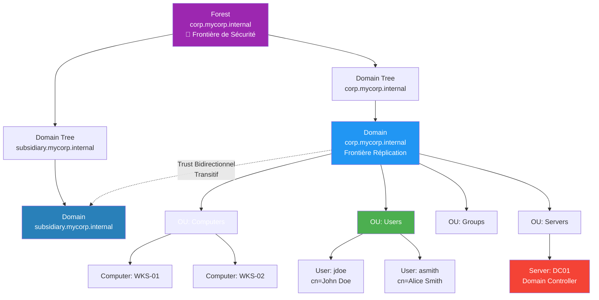
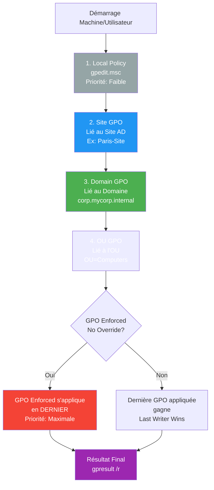
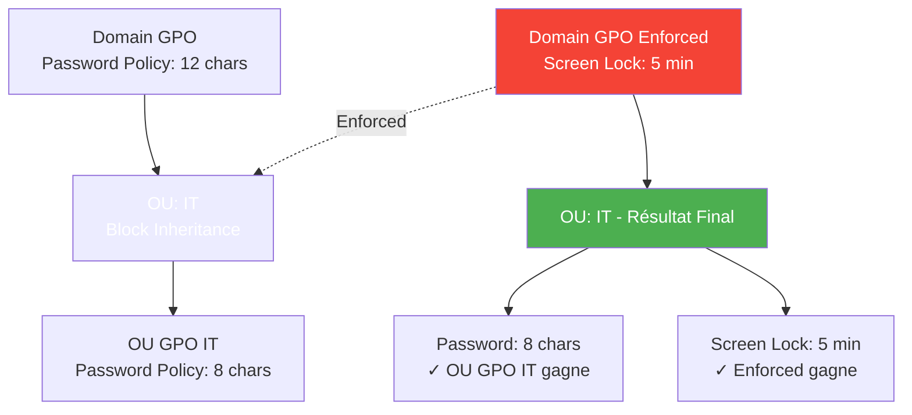
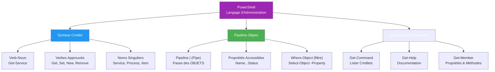
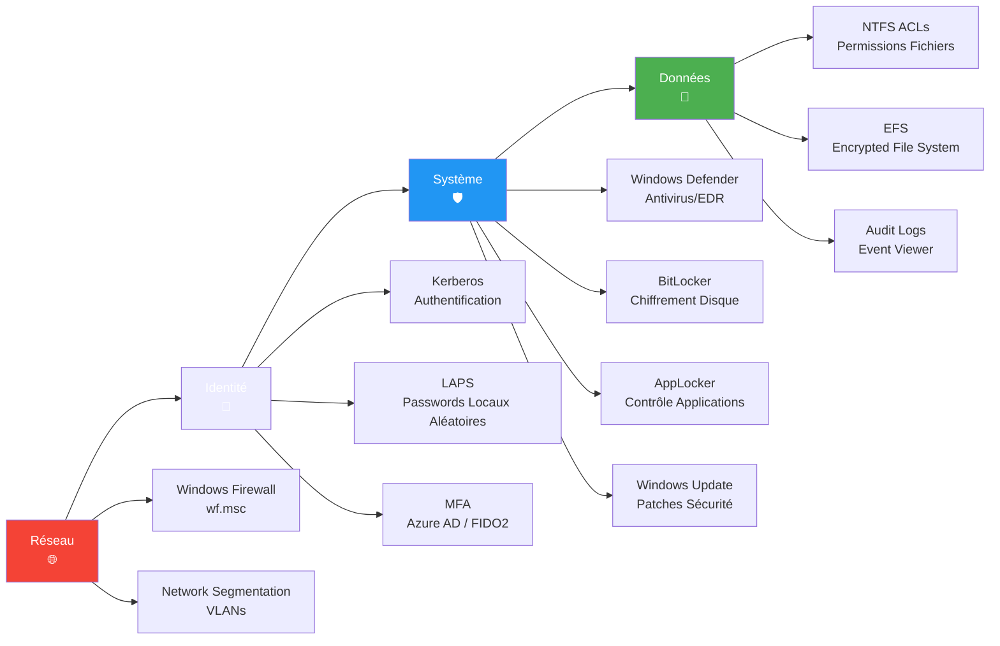
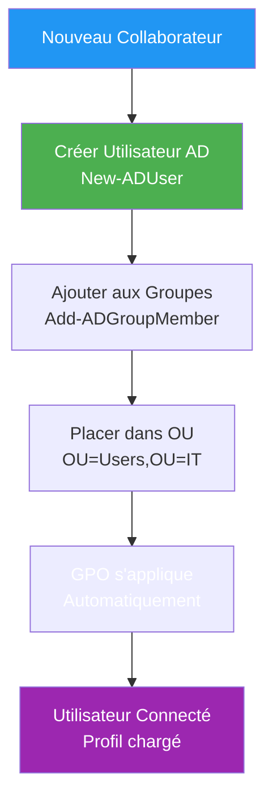
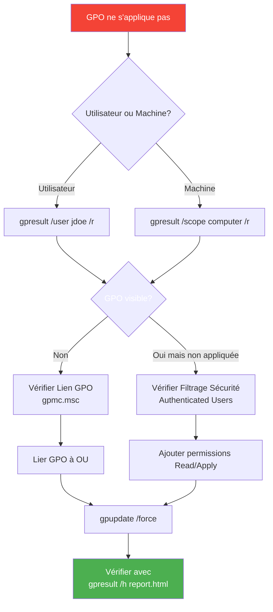

---
tags:
  - windows-server
  - active-directory
  - powershell
  - gpo
---

# Cartes Mentales Windows Server

Cartes mentales visuelles pour maîtriser les concepts clés de l'administration Windows Server.

---

!!! info "À Propos de cette Page"
    Cette page fournit des **cartes mentales structurées** utilisant des diagrammes Mermaid pour visualiser les concepts Windows Server essentiels : Active Directory, Group Policy, PowerShell, et Sécurité.

    **Avantage :** Contenu auto-suffisant (pas de dépendance externe), diagrammes interactifs, navigation rapide vers les guides détaillés.

---

## Section 1 : Active Directory Architecture

### Structure Logique - Forest, Domain, OU



**Composants de la Hiérarchie :**

| Niveau | Rôle | Caractéristiques |
|--------|------|------------------|
| **Forest** | Conteneur racine | Schéma unique, Catalogue Global, Frontière de sécurité |
| **Domain Tree** | Arbre de domaines | Namespace DNS contigu (corp.mycorp.internal) |
| **Domain** | Unité d'administration | Base de données AD indépendante, Réplication, Kerberos realm |
| **OU (Organizational Unit)** | Container logique | Application GPO, Délégation de permissions |
| **Objets** | Users, Computers, Groups | Entités gérées (attributs, ACL) |

**Types de Trusts :**


- **Bidirectionnel :** Les deux domaines s'authentifient mutuellement
- **Transitif :** Si A trust B et B trust C, alors A trust C
- **Forest Trust :** Entre deux forests séparées

!!! tip "Guide Complet Active Directory"
    → [Active Directory : CRUD Operations, Groups, Delegation](active-directory.md)

---

## Section 2 : Group Policy (GPO) Processing

### Ordre de Traitement LSDOU (Local, Site, Domain, OU)



**Règles de Précédence :**

1. **LSDOU** : Ordre d'application (Local → Site → Domain → OU)
2. **Last Applied Wins** : Si conflit, la dernière GPO appliquée écrase les précédentes
3. **Enforced (No Override)** : Force l'application, même si OU bloque l'héritage
4. **Block Inheritance** : Empêche les GPO parentes de s'appliquer (sauf Enforced)



**Commandes de Diagnostic :**

```powershell
# Afficher les GPO appliquées (machine + utilisateur)
gpresult /r

# Export HTML détaillé
gpresult /h C:\Temp\gpreport.html

# Forcer la mise à jour des GPO
gpupdate /force

# Lister toutes les GPO du domaine
Get-GPO -All | Select-Object DisplayName, GpoStatus

# Voir l'ordre de traitement pour un utilisateur
Get-GPResultantSetOfPolicy -ReportType Html -Path C:\Temp\rsop.html
```

!!! tip "Guide Hardening GPO"
    → [Windows Security : GPO Hardening, BitLocker, Defender](windows-security.md)

---

## Section 3 : PowerShell Fundamentals

### Cmdlet Structure & Pipeline



**Différence PowerShell vs Bash :**

| Aspect | PowerShell | Bash |
|--------|------------|------|
| **Pipeline** | Passe des **objets** .NET | Passe du **texte** (strings) |
| **Syntaxe** | `Verb-Noun` (Get-Process) | Commandes courtes (ps) |
| **Propriétés** | `.Name`, `.Status` (IntelliSense) | Parsing texte (awk, cut) |
| **Découverte** | `Get-Command`, `Get-Member` | `man`, `--help` |

**Exemple Puissance Pipeline :**

```powershell
# BASH (parsing texte fragile)
ps aux | grep sshd | awk '{print $2}' | xargs kill

# POWERSHELL (objets structurés)
Get-Process -Name sshd | Stop-Process -Force
```

### PowerShell Object Pipeline - Visualisation


**Commandes de Découverte :**

```powershell
# Trouver cmdlets liées à un verbe
Get-Command -Verb Get

# Trouver cmdlets liées à un nom
Get-Command -Noun Service

# Documentation complète
Get-Help Get-Service -Full

# Exemples d'utilisation
Get-Help Get-Service -Examples

# Voir les propriétés et méthodes d'un objet
Get-Service | Get-Member

# Filtrer par type de membre
Get-Service | Get-Member -MemberType Property
```

!!! tip "Guide PowerShell Complet"
    → [PowerShell Foundations : Objects, Pipeline, Remoting](powershell-foundations.md)

---

## Section 4 : Windows Security Layers

### Defense in Depth - Couches de Sécurité



**Détail des Couches :**

#### 1. Réseau (Périmètre)

```powershell
# Activer Windows Firewall (3 profils)
Set-NetFirewallProfile -Profile Domain,Public,Private -Enabled True

# Bloquer tout par défaut, autoriser explicitement
New-NetFirewallRule -DisplayName "Allow SSH" -Direction Inbound `
  -Protocol TCP -LocalPort 22 -Action Allow

# Lister règles actives
Get-NetFirewallRule | Where-Object {$_.Enabled -eq 'True'}
```

#### 2. Identité (Authentification/Autorisation)

- **Kerberos** : Authentification sans mot de passe en clair
- **LAPS** : Rotation automatique des mots de passe administrateur local
- **Privileged Access Workstations (PAW)** : Stations dédiées pour comptes à privilèges

```powershell
# Vérifier ticket Kerberos
klist

# Afficher mot de passe LAPS (nécessite permissions)
Get-AdmPwdPassword -ComputerName WKS-01
```

#### 3. Système (OS Hardening)

```powershell
# Statut Windows Defender
Get-MpComputerStatus

# Forcer scan complet
Start-MpScan -ScanType FullScan

# Vérifier chiffrement BitLocker
Get-BitLockerVolume

# Lister applications autorisées (AppLocker)
Get-AppLockerPolicy -Effective -Xml
```

#### 4. Données (Confidentialité)

```powershell
# Voir permissions NTFS
Get-Acl C:\SecretData | Format-List

# Audit des accès fichiers (nécessite GPO Audit)
Get-WinEvent -LogName Security | Where-Object {$_.Id -eq 4663}

# Chiffrer fichier avec EFS
cipher /e C:\SecretData\confidential.docx
```

### Matrice de Défense

| Menace | Couche 1 (Réseau) | Couche 2 (Identité) | Couche 3 (OS) | Couche 4 (Données) |
|--------|-------------------|---------------------|---------------|---------------------|
| **Scan Réseau** | ✅ Firewall bloque ports | - | - | - |
| **Brute-Force RDP** | ✅ Bloquer port 3389 | ✅ LAPS + Account Lockout | - | - |
| **Pass-the-Hash** | - | ✅ Kerberos + Credential Guard | ✅ Defender ATP détection | - |
| **Malware** | ✅ Segmentation réseau | - | ✅ Defender + AppLocker | - |
| **Vol Disque** | - | - | ✅ BitLocker | ✅ EFS |
| **Accès Non Autorisé** | - | ✅ MFA | - | ✅ NTFS ACLs + Audit |

!!! tip "Guide Sécurité Windows Complet"
    → [Windows Security : Defender, BitLocker, Event Viewer, PKI](windows-security.md)

---

## Workflows Administratifs Courants

### Workflow 1 : Création Utilisateur AD + GPO



```powershell
# Script complet provisioning utilisateur
$NewUser = @{
    Name              = "John Doe"
    GivenName         = "John"
    Surname           = "Doe"
    SamAccountName    = "jdoe"
    UserPrincipalName = "jdoe@corp.mycorp.internal"
    Path              = "OU=Users,OU=IT,DC=corp,DC=mycorp,DC=internal"
    AccountPassword   = (ConvertTo-SecureString "TempP@ss123!" -AsPlainText -Force)
    Enabled           = $true
}

New-ADUser @NewUser
Add-ADGroupMember -Identity "Domain Users" -Members "jdoe"
Add-ADGroupMember -Identity "IT-Staff" -Members "jdoe"
```

### Workflow 2 : Troubleshooting GPO Non Appliquée



---

## Référence Rapide

### Active Directory

```powershell
# === UTILISATEURS ===
Get-ADUser -Filter * -Properties *                    # Lister tous utilisateurs
Get-ADUser -Identity jdoe -Properties MemberOf        # Groupes d'un user
New-ADUser -Name "John Doe" -Path "OU=Users,DC=corp,DC=mycorp,DC=internal"
Set-ADUser -Identity jdoe -Enabled $false             # Désactiver compte
Remove-ADUser -Identity jdoe                          # Supprimer utilisateur

# === GROUPES ===
Get-ADGroup -Filter * | Select-Object Name, GroupScope
New-ADGroup -Name "IT-Admins" -GroupScope Global -Path "OU=Groups,DC=corp,DC=mycorp,DC=internal"
Add-ADGroupMember -Identity "IT-Admins" -Members jdoe
Get-ADGroupMember -Identity "IT-Admins"

# === ORDINATEURS ===
Get-ADComputer -Filter * -Properties OperatingSystem
Get-ADComputer -Identity WKS-01 -Properties *
```

### Group Policy

```powershell
# === GPO MANAGEMENT ===
Get-GPO -All                                          # Lister toutes GPO
New-GPO -Name "Hardening-Workstations"
New-GPLink -Name "Hardening-Workstations" -Target "OU=Computers,DC=corp,DC=mycorp,DC=internal"
Set-GPLink -Name "Hardening-Workstations" -Enforced Yes

# === DIAGNOSTIC ===
gpresult /r                                           # Résultat GPO appliquées
gpresult /h C:\Temp\gpreport.html                     # Export HTML
gpupdate /force                                       # Forcer mise à jour
Get-GPResultantSetOfPolicy -ReportType Html -Path C:\rsop.html
```

### PowerShell Essentials

```powershell
# === DÉCOUVERTE ===
Get-Command -Verb Get                                 # Lister cmdlets Get-*
Get-Command -Noun Service                             # Lister *-Service
Get-Help Get-Service -Full                            # Documentation complète
Get-Service | Get-Member                              # Propriétés objet

# === MANIPULATION SERVICES ===
Get-Service -Name wuauserv                            # Windows Update service
Start-Service -Name wuauserv
Stop-Service -Name wuauserv -Force
Restart-Service -Name wuauserv
Set-Service -Name wuauserv -StartupType Automatic

# === PROCESSUS ===
Get-Process | Sort-Object -Property CPU -Descending | Select-Object -First 10
Stop-Process -Name notepad -Force
```

### Sécurité Windows

```powershell
# === FIREWALL ===
Get-NetFirewallProfile                                # Statut 3 profils
Set-NetFirewallProfile -Profile Domain,Public,Private -Enabled True
New-NetFirewallRule -DisplayName "Allow HTTPS" -Direction Inbound -Protocol TCP -LocalPort 443 -Action Allow

# === DEFENDER ===
Get-MpComputerStatus                                  # Statut Defender
Update-MpSignature                                    # Mettre à jour signatures
Start-MpScan -ScanType QuickScan

# === BITLOCKER ===
Get-BitLockerVolume                                   # Statut chiffrement
Enable-BitLocker -MountPoint "C:" -EncryptionMethod XtsAes256 -UsedSpaceOnly
Backup-BitLockerKeyProtector -MountPoint "C:" -KeyProtectorId {GUID}

# === EVENT VIEWER ===
Get-WinEvent -LogName Security -MaxEvents 100         # 100 derniers events sécurité
Get-WinEvent -FilterHashtable @{LogName='Security'; ID=4624}  # Logons réussis
```

---

## Ressources Complémentaires

| Domaine | Guides ShellBook |
|---------|------------------|
| **PowerShell** | [PowerShell Foundations](powershell-foundations.md) • [Remoting](powershell-foundations.md#remote--web) |
| **Active Directory** | [Active Directory CRUD](active-directory.md) • [Group Management](active-directory.md#gestion-des-groupes) |
| **Sécurité** | [Windows Security](windows-security.md) • [PKI Bootstrap](windows-security.md#pki-bootstrap-certificat-offline) |
| **Administration** | [Server Administration](server-administration.md) • [Update Management](update-management.md) |
| **Automatisation** | [Ansible for Windows](ansible-windows.md) |

!!! success "Maîtrisez Windows Server avec ces Cartes Mentales !"
    Ces diagrammes couvrent les concepts fondamentaux pour l'administration quotidienne et le troubleshooting.
