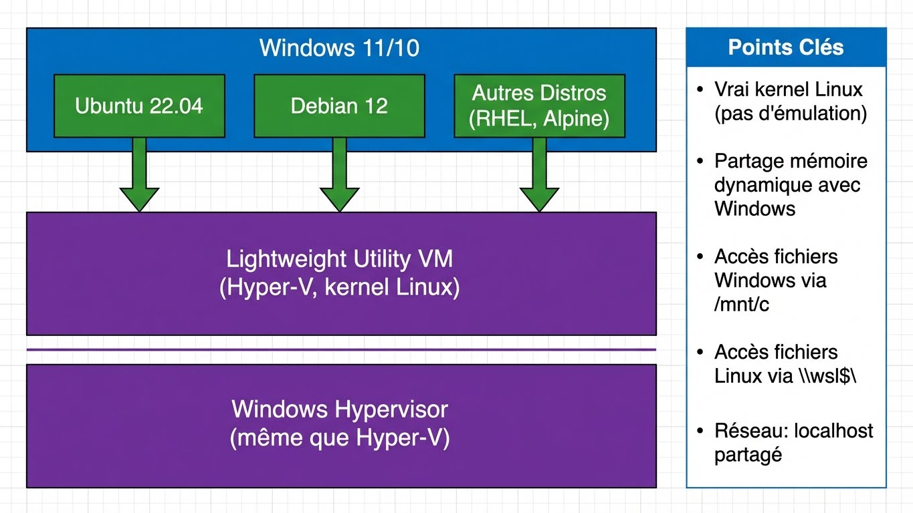

---
tags:
  - windows
  - wsl
  - linux
  - devops
  - containers
---

# WSL2 - Windows Subsystem for Linux

Guide complet de WSL2 : pourquoi l'utiliser, comment le configurer, et cas d'usage concrets pour les SysOps/DevOps.

## Pourquoi WSL2 ?

```
LE PROBLÈME QUE WSL2 RÉSOUT
══════════════════════════════════════════════════════════

Avant WSL2, les options pour un SysOps Windows :

1. VM Linux complète
   → Lourd, lent à démarrer, consomme RAM
   → Réseau/partage de fichiers compliqué

2. Dual boot
   → Redémarrage obligatoire
   → Pas de travail simultané

3. Git Bash / Cygwin
   → Émulation imparfaite
   → Incompatibilités fréquentes
   → Pas de vrais outils Linux

4. SSH vers serveur distant
   → Latence réseau
   → Dépendance à la connectivité

WSL2 = Un vrai kernel Linux intégré à Windows
        Démarrage en 1-2 secondes
        Accès natif aux fichiers Windows
        Docker natif, kubectl, ansible, terraform...
```

### Cas d'Usage Concrets

```yaml
Pour un SysOps/DevOps chez Worldline:

Scripting & Automation:
  - Écrire des scripts Bash qui tournent aussi sur les serveurs Linux
  - Tester des playbooks Ansible avant déploiement
  - Utiliser les vrais outils GNU (grep, sed, awk, jq)

Conteneurs:
  - Docker Desktop utilise WSL2 comme backend (plus performant)
  - Podman natif dans WSL2
  - Tester des Dockerfiles identiques à la CI/CD

Kubernetes:
  - kubectl, helm, kustomize natifs
  - Minikube/kind dans WSL2
  - Même expérience que sur un poste Linux

Development:
  - Git avec config Linux (line endings, hooks bash)
  - Python/Node/Go avec environnement Linux
  - VSCode Remote - WSL (éditer dans Windows, exécuter dans Linux)

Accès Réseau:
  - SSH natif (pas PuTTY)
  - Tunnel SSH, port forwarding
  - Outils réseau Linux (nmap, tcpdump, curl...)
```

---

## Architecture WSL2



### WSL1 vs WSL2

| Aspect | WSL1 | WSL2 |
|--------|------|------|
| Kernel | Traduction syscalls | Vrai kernel Linux |
| Performance FS Linux | Lente | Excellente |
| Performance FS Windows | Excellente | Moyenne |
| Compatibilité | ~90% | ~99% |
| Docker | Non | Oui (natif) |
| Mémoire | Partagée | VM (dynamique) |
| Réseau | Même IP que Windows | IP séparée |

---

## Installation

### Prérequis

```powershell
# Windows 10 version 2004+ ou Windows 11
# Virtualisation activée dans le BIOS (VT-x/AMD-V)

# Vérifier la version Windows
winver
# Doit être >= 10.0.19041

# Vérifier Hyper-V disponible
systeminfo | findstr /i "Hyper-V"
```

### Installation Rapide (Recommandé)

```powershell
# Méthode moderne (Windows 10 2004+)
# Installe WSL2 + Ubuntu par défaut
wsl --install

# Redémarrer Windows
Restart-Computer

# Au redémarrage, Ubuntu demande username/password
```

### Installation Manuelle

```powershell
# 1. Activer WSL
dism.exe /online /enable-feature /featurename:Microsoft-Windows-Subsystem-Linux /all /norestart

# 2. Activer Virtual Machine Platform
dism.exe /online /enable-feature /featurename:VirtualMachinePlatform /all /norestart

# 3. Redémarrer
Restart-Computer

# 4. Télécharger et installer le kernel WSL2
# https://aka.ms/wsl2kernel

# 5. Définir WSL2 par défaut
wsl --set-default-version 2

# 6. Installer une distribution
wsl --install -d Ubuntu-22.04
```

### Distributions Disponibles

```powershell
# Lister les distributions disponibles
wsl --list --online

# Distributions courantes :
# Ubuntu, Ubuntu-22.04, Ubuntu-20.04
# Debian
# kali-linux
# openSUSE-Leap-15.5
# SLES-15-SP5
# OracleLinux_9_1

# Installer une distribution spécifique
wsl --install -d Debian

# Pour RHEL/CentOS (non officiel mais possible via import)
```

---

## Configuration

### Commandes WSL Essentielles

```powershell
# Lister les distributions installées
wsl --list --verbose
# ou
wsl -l -v

# Démarrer la distribution par défaut
wsl

# Démarrer une distribution spécifique
wsl -d Ubuntu-22.04

# Exécuter une commande sans entrer dans le shell
wsl ls -la /home

# Définir la distribution par défaut
wsl --set-default Ubuntu-22.04

# Convertir WSL1 en WSL2
wsl --set-version Ubuntu-22.04 2

# Arrêter une distribution
wsl --terminate Ubuntu-22.04

# Arrêter toutes les distributions
wsl --shutdown

# Exporter une distribution (backup)
wsl --export Ubuntu-22.04 D:\Backups\ubuntu-backup.tar

# Importer une distribution
wsl --import MyUbuntu D:\WSL\MyUbuntu D:\Backups\ubuntu-backup.tar

# Supprimer une distribution
wsl --unregister Ubuntu-22.04
```

### Fichier .wslconfig (Global)

```ini
# %USERPROFILE%\.wslconfig
# Configuration globale pour toutes les distributions WSL2

[wsl2]
# Limiter la mémoire (par défaut: 50% de la RAM)
memory=8GB

# Limiter les processeurs
processors=4

# Taille du swap
swap=4GB

# Fichier swap personnalisé
# swapFile=D:\\WSL\\swap.vhdx

# Désactiver la récupération de mémoire (peut améliorer perf)
# pageReporting=false

# Activer localhost forwarding (défaut: true)
localhostForwarding=true

# Nested virtualization (pour Docker-in-Docker, etc.)
nestedVirtualization=true

# Mode réseau (défaut: NAT, peut être mirrored en Win11 22H2+)
# networkingMode=mirrored

# Activer DNS tunneling
# dnsTunneling=true

[experimental]
# Windows 11 22H2+ : Mode miroir réseau (même IP que Windows)
# networkingMode=mirrored
# autoProxy=true
```

### Fichier wsl.conf (Par Distribution)

```ini
# /etc/wsl.conf (dans la distribution Linux)

[automount]
# Monter les disques Windows automatiquement
enabled = true
# Point de montage
root = /mnt/
# Options de montage
options = "metadata,umask=22,fmask=11"
# Monter /etc/fstab
mountFsTab = true

[network]
# Générer /etc/hosts
generateHosts = true
# Générer /etc/resolv.conf
generateResolvConf = true
# Hostname personnalisé
hostname = wsl-dev

[interop]
# Permettre d'exécuter des .exe Windows depuis Linux
enabled = true
# Ajouter les paths Windows au PATH Linux
appendWindowsPath = true

[user]
# Utilisateur par défaut
default = julien

[boot]
# Commande à exécuter au démarrage (WSL 0.67+)
# systemd = true  # Activer systemd (WSL 0.67+)
command = service docker start
```

### Activer Systemd

```bash
# Dans /etc/wsl.conf, ajouter:
[boot]
systemd=true

# Redémarrer WSL
wsl --shutdown
wsl

# Vérifier
systemctl list-units --type=service
```

---

## Intégration Windows-Linux

### Accès aux Fichiers

```bash
# Depuis WSL : accéder aux fichiers Windows
ls /mnt/c/Users/julien/Documents
cd /mnt/d/Projects

# Créer un lien symbolique pour faciliter l'accès
ln -s /mnt/c/Users/julien/Documents ~/windows-docs
ln -s /mnt/d/Projects ~/projects

# Depuis Windows : accéder aux fichiers WSL
# Dans l'explorateur : \\wsl$\Ubuntu-22.04\home\julien
# Ou dans PowerShell :
cd \\wsl$\Ubuntu-22.04\home\julien
```

```powershell
# Depuis PowerShell : accéder aux fichiers WSL
explorer.exe \\wsl$\Ubuntu-22.04\home\julien

# Ouvrir le dossier courant WSL dans l'explorateur
# (exécuter depuis WSL)
wsl
explorer.exe .
```

### Interopérabilité des Commandes (Windows ↔ Linux)

WSL 2 excelle à faire communiquer les deux systèmes de manière transparente.

```bash
# Depuis WSL : exécuter des programmes Windows
# La plupart des .exe sont directement dans le PATH de Linux
notepad.exe /mnt/c/Users/julien/file.txt
code .  # Ouvre VSCode
explorer.exe .  # Ouvre l'explorateur
powershell.exe -Command "Write-Host 'Hello from Windows PowerShell!'"

# Passer des données entre Windows et Linux
# Copier le contenu d'un fichier Linux vers le presse-papier Windows
cat /etc/passwd | clip.exe

# Coller le contenu du presse-papier Windows dans un fichier Linux
cat > ~/fichier_colle.txt << EOF
$(powershell.exe Get-Clipboard)
EOF

# Utiliser le pipe avec les commandes Windows
powershell.exe Get-Process | grep bash

# Ouvrir une URL dans le navigateur Windows par défaut
wslview https://github.com  # Nécessite wslu (sudo apt install wslu)
# ou (plus simple)
explorer.exe "https://github.com"
```

```powershell
# Depuis PowerShell : exécuter des commandes Linux
wsl ls -la
wsl grep -r "error" /var/log
wsl cat /etc/os-release

# Pipeline mixte
Get-Process | wsl grep -i chrome
wsl cat /var/log/syslog | Select-String "error"
```

### Gestion des Distributions (Export, Import, Customisation)

WSL 2 permet une grande flexibilité dans la gestion de vos environnements Linux.

#### Exporter une Distribution (Sauvegarde ou Migration)

```powershell
# Arrêter la distribution avant d'exporter
wsl --terminate Ubuntu-22.04

# Exporter vers un fichier .tar
wsl --export Ubuntu-22.04 D:\WSL_Backups\ubuntu-backup.tar

# Vous pouvez ensuite sauvegarder ce fichier .tar
```

#### Importer une Distribution

```powershell
# Importer depuis un fichier .tar
# Syntaxe: wsl --import <Nom_Distro> <Chemin_Installation> <Fichier_Tar>
wsl --import MonUbuntuCustom D:\WSL_Distros\MonUbuntu D:\WSL_Backups\ubuntu-backup.tar

# Définir la version de WSL (1 ou 2)
wsl --set-version MonUbuntuCustom 2

# Exécuter la distribution
wsl -d MonUbuntuCustom
```

#### Créer une Distribution Personnalisée depuis Docker

C'est une méthode puissante pour créer un environnement WSL sur mesure.

1.  **Préparer une image Docker :**
    ```bash
    # Créez un Dockerfile (ex: Debian avec quelques outils pré-installés)
    FROM debian:stable-slim
    RUN apt-get update && apt-get install -y git curl vim procps
    CMD ["/bin/bash"]
    ```
2.  **Construire l'image Docker :**
    ```bash
    docker build -t custom-wsl-debian .
    ```
3.  **Exporter l'image Docker comme un .tar :**
    ```bash
    docker export $(docker create custom-wsl-debian) > custom-wsl-debian.tar
    ```
4.  **Importer dans WSL :**
    ```powershell
    wsl --import CustomDebian D:\WSL_Distros\CustomDebian custom-wsl-debian.tar
    wsl --set-version CustomDebian 2
    ```

---

## Docker avec WSL2

```bash
# Installer l'extension "Remote - WSL" dans VSCode

# Depuis WSL, ouvrir un projet dans VSCode
cd ~/projects/myapp
code .

# VSCode s'ouvre avec le contexte WSL
# - Terminal intégré = bash WSL
# - Extensions s'exécutent dans WSL
# - Git, linters, etc. utilisent les outils Linux
```

---

## Docker avec WSL2

### Docker Desktop (Méthode Simple)

```
Docker Desktop utilise WSL2 comme backend par défaut.

Installation:
1. Installer Docker Desktop for Windows
2. Settings > General > Use WSL 2 based engine ✓
3. Settings > Resources > WSL Integration > Activer pour vos distros

Avantages:
- Interface graphique
- Kubernetes intégré (optionnel)
- Pas besoin de configurer Docker dans WSL
```

### Docker Natif dans WSL2 (Sans Docker Desktop)

```bash
# Installer Docker directement dans Ubuntu WSL2
# (Alternative gratuite à Docker Desktop pour usage pro)

# Supprimer anciennes versions
sudo apt remove docker docker-engine docker.io containerd runc

# Installer les dépendances
sudo apt update
sudo apt install ca-certificates curl gnupg lsb-release

# Ajouter le repo Docker
sudo mkdir -p /etc/apt/keyrings
curl -fsSL https://download.docker.com/linux/ubuntu/gpg | sudo gpg --dearmor -o /etc/apt/keyrings/docker.gpg
echo "deb [arch=$(dpkg --print-architecture) signed-by=/etc/apt/keyrings/docker.gpg] https://download.docker.com/linux/ubuntu $(lsb_release -cs) stable" | sudo tee /etc/apt/sources.list.d/docker.list > /dev/null

# Installer Docker
sudo apt update
sudo apt install docker-ce docker-ce-cli containerd.io docker-compose-plugin

# Ajouter l'utilisateur au groupe docker
sudo usermod -aG docker $USER

# Démarrer Docker (sans systemd)
sudo service docker start

# Ou avec systemd activé
sudo systemctl enable docker
sudo systemctl start docker

# Vérifier
docker run hello-world
```

### Podman dans WSL2

```bash
# Alternative à Docker, rootless par défaut
sudo apt update
sudo apt install podman

# Configurer les registres
sudo nano /etc/containers/registries.conf
# Ajouter:
# [registries.search]
# registries = ['docker.io', 'quay.io']

# Utiliser Podman
podman run -it alpine sh
podman build -t myimage .
podman-compose up -d
```

---

## Outils DevOps dans WSL2

### Installation Stack Complète

```bash
# Mise à jour système
sudo apt update && sudo apt upgrade -y

# Outils de base
sudo apt install -y \
    git \
    curl \
    wget \
    vim \
    jq \
    tree \
    htop \
    tmux \
    unzip \
    zip

# Python + pip
sudo apt install -y python3 python3-pip python3-venv
pip3 install --user ansible ansible-lint yamllint

# Terraform
wget -O- https://apt.releases.hashicorp.com/gpg | sudo gpg --dearmor -o /usr/share/keyrings/hashicorp-archive-keyring.gpg
echo "deb [signed-by=/usr/share/keyrings/hashicorp-archive-keyring.gpg] https://apt.releases.hashicorp.com $(lsb_release -cs) main" | sudo tee /etc/apt/sources.list.d/hashicorp.list
sudo apt update && sudo apt install terraform

# kubectl
curl -LO "https://dl.k8s.io/release/$(curl -L -s https://dl.k8s.io/release/stable.txt)/bin/linux/amd64/kubectl"
sudo install -o root -g root -m 0755 kubectl /usr/local/bin/kubectl

# Helm
curl https://raw.githubusercontent.com/helm/helm/main/scripts/get-helm-3 | bash

# k9s (TUI pour Kubernetes)
curl -sS https://webinstall.dev/k9s | bash

# AWS CLI
curl "https://awscli.amazonaws.com/awscli-exe-linux-x86_64.zip" -o "awscliv2.zip"
unzip awscliv2.zip
sudo ./aws/install

# Azure CLI
curl -sL https://aka.ms/InstallAzureCLIDeb | sudo bash

# GCloud CLI
echo "deb [signed-by=/usr/share/keyrings/cloud.google.gpg] https://packages.cloud.google.com/apt cloud-sdk main" | sudo tee /etc/apt/sources.list.d/google-cloud-sdk.list
curl https://packages.cloud.google.com/apt/doc/apt-key.gpg | sudo gpg --dearmor -o /usr/share/keyrings/cloud.google.gpg
sudo apt update && sudo apt install google-cloud-cli
```

### Configuration Git

```bash
# Configuration globale
git config --global user.name "Julien Bombled"
git config --global user.email "julien.bombled@worldline.com"
git config --global core.autocrlf input  # Important pour WSL!
git config --global init.defaultBranch main

# SSH Key
ssh-keygen -t ed25519 -C "julien.bombled@worldline.com"
eval "$(ssh-agent -s)"
ssh-add ~/.ssh/id_ed25519

# Copier la clé publique (vers Windows clipboard)
cat ~/.ssh/id_ed25519.pub | clip.exe
# Puis ajouter dans GitHub/GitLab
```

### Configuration SSH

```bash
# ~/.ssh/config
Host *
    AddKeysToAgent yes
    IdentityFile ~/.ssh/id_ed25519

Host bastion
    HostName bastion.worldline.com
    User julien
    IdentityFile ~/.ssh/id_worldline

Host prod-*
    ProxyJump bastion
    User deploy

Host prod-web1
    HostName 10.10.1.50

Host prod-web2
    HostName 10.10.1.51
```

---

## Cas d'Usage Pratiques

### Workflow Ansible

```bash
# Structure projet
mkdir -p ~/ansible-project/{inventory,roles,playbooks}
cd ~/ansible-project

# Inventory
cat > inventory/hosts.yml << 'EOF'
all:
  children:
    webservers:
      hosts:
        web1.corp.local:
        web2.corp.local:
    databases:
      hosts:
        db1.corp.local:
EOF

# Playbook
cat > playbooks/update.yml << 'EOF'
---
- name: Update servers
  hosts: all
  become: yes
  tasks:
    - name: Update apt cache
      apt:
        update_cache: yes
        cache_valid_time: 3600

    - name: Upgrade packages
      apt:
        upgrade: dist
EOF

# Exécuter (depuis WSL)
ansible-playbook -i inventory/hosts.yml playbooks/update.yml --check
```

### Workflow Terraform

```bash
# Projet Terraform
mkdir -p ~/terraform-project
cd ~/terraform-project

# main.tf
cat > main.tf << 'EOF'
terraform {
  required_providers {
    azurerm = {
      source  = "hashicorp/azurerm"
      version = "~> 3.0"
    }
  }
}

provider "azurerm" {
  features {}
}

resource "azurerm_resource_group" "example" {
  name     = "example-resources"
  location = "West Europe"
}
EOF

# Initialiser et planifier
terraform init
terraform plan
terraform apply
```

### Accéder à un Cluster Kubernetes

```bash
# Copier kubeconfig depuis Windows
mkdir -p ~/.kube
cp /mnt/c/Users/julien/.kube/config ~/.kube/config

# Ou utiliser la variable d'environnement
export KUBECONFIG=/mnt/c/Users/julien/.kube/config

# Vérifier
kubectl cluster-info
kubectl get nodes

# Utiliser k9s pour une interface TUI
k9s
```

### Script Hybride Windows/Linux

```bash
#!/bin/bash
# script-hybride.sh - Exemple de script utilisant les deux mondes

# Variables
WINDOWS_USER=$(cmd.exe /c "echo %USERNAME%" 2>/dev/null | tr -d '\r')
LINUX_USER=$(whoami)
BACKUP_DIR="/mnt/d/Backups"

echo "Windows User: $WINDOWS_USER"
echo "Linux User: $LINUX_USER"

# Lire un fichier de config Windows
if [ -f "/mnt/c/Users/$WINDOWS_USER/AppData/Local/myapp/config.json" ]; then
    CONFIG=$(cat "/mnt/c/Users/$WINDOWS_USER/AppData/Local/myapp/config.json" | jq -r '.server')
    echo "Server from Windows config: $CONFIG"
fi

# Créer un backup
tar -czf "$BACKUP_DIR/home-$(date +%Y%m%d).tar.gz" -C /home "$LINUX_USER"

# Notifier via Windows
powershell.exe -Command "New-BurntToastNotification -Text 'Backup Complete', 'Home directory backed up successfully'"
```

---

## Troubleshooting

### Problèmes Courants

```powershell
# "WSL 2 requires an update to its kernel component"
# → Télécharger: https://aka.ms/wsl2kernel

# "The virtual machine could not be started"
# → Vérifier que Hyper-V est activé
# → Vérifier virtualisation dans le BIOS

# Performances lentes sur /mnt/c
# → Stocker les fichiers dans le FS Linux (~/)
# → Utiliser /mnt/c uniquement pour l'échange

# DNS ne fonctionne pas
wsl --shutdown
# Puis dans /etc/wsl.conf:
[network]
generateResolvConf = false

# Créer /etc/resolv.conf manuellement
sudo rm /etc/resolv.conf
echo "nameserver 8.8.8.8" | sudo tee /etc/resolv.conf
sudo chattr +i /etc/resolv.conf  # Empêcher l'écrasement
```

### Optimisation Mémoire

```powershell
# WSL2 peut consommer beaucoup de RAM
# Le processus Vmmem dans le gestionnaire de tâches

# Solution 1: Limiter dans .wslconfig
# %USERPROFILE%\.wslconfig
[wsl2]
memory=4GB

# Solution 2: Libérer le cache périodiquement (dans WSL)
sudo sh -c "echo 3 > /proc/sys/vm/drop_caches"

# Solution 3: Arrêter WSL quand non utilisé
wsl --shutdown
```

### Reset Complet

```powershell
# Supprimer une distribution et recommencer
wsl --unregister Ubuntu-22.04
wsl --install -d Ubuntu-22.04

# Reset complet de WSL
wsl --unregister Ubuntu-22.04
wsl --uninstall
# Redémarrer
wsl --install
```

---

## Bonnes Pratiques

```yaml
Checklist WSL2:
  Configuration:
    - [ ] .wslconfig avec limites mémoire
    - [ ] wsl.conf avec options personnalisées
    - [ ] Systemd activé si nécessaire
    - [ ] Git configuré avec autocrlf=input

  Performance:
    - [ ] Stocker les projets dans ~/  (pas /mnt/c)
    - [ ] Utiliser /mnt/c uniquement pour l'échange
    - [ ] Limiter la RAM si nécessaire

  Sécurité:
    - [ ] SSH keys stockées dans WSL
    - [ ] Permissions correctes sur ~/.ssh (700)
    - [ ] Ne pas stocker de secrets dans /mnt/c

  Workflow:
    - [ ] VSCode avec extension Remote-WSL
    - [ ] Terminal Windows avec profil WSL
    - [ ] Alias pour les commandes fréquentes
```

### Alias Utiles

```bash
# ~/.bashrc ou ~/.zshrc

# Navigation rapide
alias projects="cd ~/projects"
alias windown="cd /mnt/c/Users/$USER/Downloads"

# Docker
alias d="docker"
alias dc="docker compose"
alias dps="docker ps --format 'table {{.Names}}\t{{.Status}}\t{{.Ports}}'"

# Kubernetes
alias k="kubectl"
alias kgp="kubectl get pods"
alias kgs="kubectl get services"
alias kgd="kubectl get deployments"

# Git
alias gs="git status"
alias gp="git pull"
alias gc="git commit -m"

# Ouvrir dans Windows
alias open="explorer.exe"
alias clip="clip.exe"

# IP WSL (utile pour accès services)
alias myip="hostname -I | awk '{print \$1}'"
```

---

**Voir aussi :**

- [PowerShell Foundations](powershell-foundations.md) - PowerShell de base
- [Docker Advanced](../devops/docker-advanced.md) - Docker avancé
- [SSH Keys](../linux/ssh-keys.md) - Gestion des clés SSH
